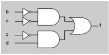
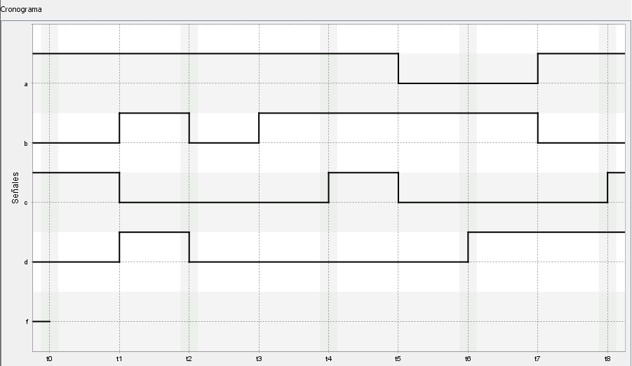
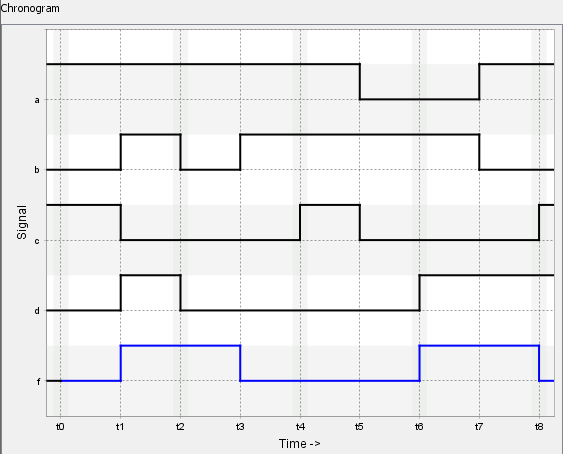

# VerilChart - Circuitos combinacionales (materiales)

## Índice

- [m3ex22](#m3ex22)

 

## m3ex22

<blockquote>

Completad el siguiente cronograma, suponiendo que la señal `f` corresponde a la función de la imagen de abajo y que las entradas toman los valores dibujados. Considerad que los retardos introducidos por las puertas son 0.

 

</blockquote>

	
Capturas del ejercicio resuelto

	

		
	

