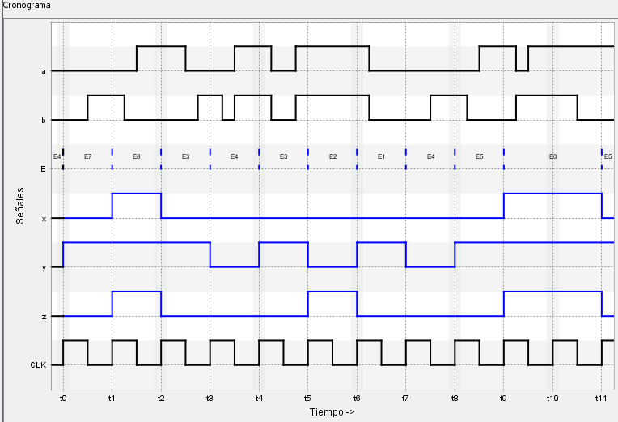
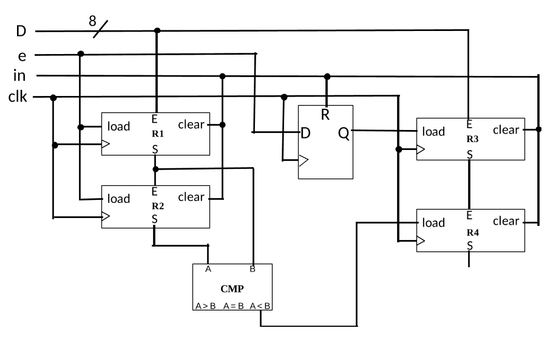
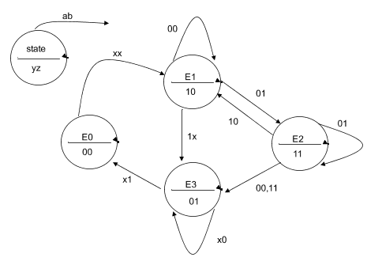
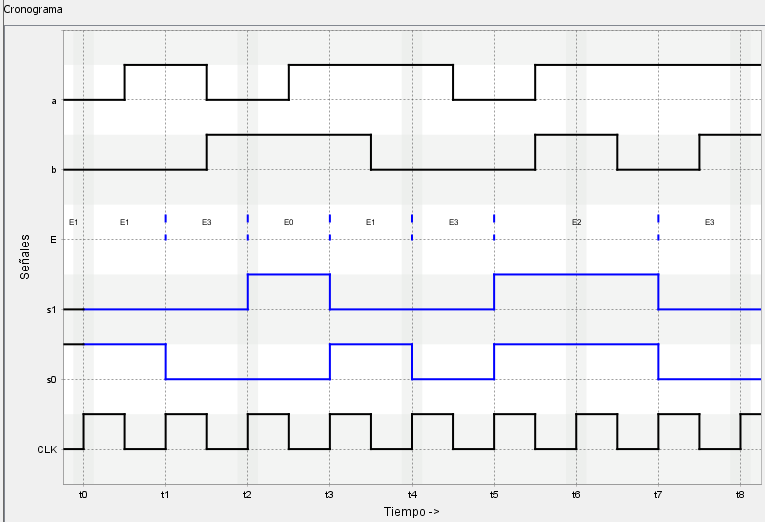

# VerilChart - Circuitos secuenciales (histórico)

>[!NOTE]
>- Todos los ejercicios tienen una puntuación de 3 estrellas (⭐).
>- **Puntuación total**: 24 ejercicios $\times$ 3⭐ = 72⭐

## Índice

- [20111\_EX2\_3B](#20111_ex2_3b)
- [20111\_EX3\_3B](#20111_ex3_3b)
- [20112\_EX3\_3B](#20112_ex3_3b)
- [20121\_EX2\_3B](#20121_ex2_3b)
- [20121\_EX3\_3B](#20121_ex3_3b)
- [20122\_PAC3\_1B](#20122_pac3_1b)
- [20122\_EX1\_3A](#20122_ex1_3a)
- [20122\_EX2\_3B](#20122_ex2_3b)
- [20122\_EX3\_3B](#20122_ex3_3b)
- [20132\_PAC3\_2B](#20132_pac3_2b)
- [20132\_PAC3\_4](#20132_pac3_4)
- [20141\_PAC3\_1](#20141_pac3_1)
- [20141\_PAC3\_3](#20141_pac3_3)
- [20141\_PAC3\_5](#20141_pac3_5)
- [20142\_PAC3\_1](#20142_pac3_1)
- [20142\_PAC3\_2](#20142_pac3_2)
- [20142\_PAC3\_4](#20142_pac3_4)
- [20151\_PAC3\_1B](#20151_pac3_1b)
- [20151\_PAC3\_4A](#20151_pac3_4a)
- [20161\_PAC3\_2](#20161_pac3_2)
- [20162\_PAC3\_1](#20162_pac3_1)
- [20162\_PAC3\_2](#20162_pac3_2)
- [20161\_PAC3\_3A](#20161_pac3_3a)
- [20171\_PAC3\_3A](#20171_pac3_3a)

 

## 20111_EX2_3B

<blockquote>

Completad el cronograma que corresponde al circuito de la figura.

</blockquote>

	
Ejercicio resuelto

	

		
	

## 20111_EX3_3B

<blockquote>

Completad el cronograma que corresponde al circuito de la figura.

</blockquote>

	
Ejercicio resuelto

	

		
	

## 20112_EX3_3B

<blockquote>

Sea el siguiente grafo de estados:

Completad el siguiente cronograma:

</blockquote>

	
Ejercicio resuelto

	

		
	

## 20121_EX2_3B

<blockquote>

Sea el siguiente grafo de estados:

Completad el siguiente cronograma:

</blockquote>

	
Ejercicio resuelto

	

		
	

## 20121_EX3_3B

<blockquote>

Completad el cronograma que corresponde al circuito de la figura.

</blockquote>

	
Ejercicio resuelto

	

		
	

## 20122_PAC3_1B

<blockquote>

Sea el siguiente grafo de estados:

Completad el siguiente cronograma:

</blockquote>

	
Ejercicio resuelto

	

		
	

## 20122_EX1_3A

<blockquote>

Sea el siguiente grafo de estados:

Completad el siguiente cronograma:

</blockquote>

	
Ejercicio resuelto

	

		
	

## 20122_EX2_3B

<blockquote>

Completad el cronograma que corresponde al circuito de la figura.

</blockquote>

	
Ejercicio resuelto

	

		
	

## 20122_EX3_3B

<blockquote>

Completad el cronograma que corresponde al circuito de la figura.

</blockquote>

	
Ejercicio resuelto

	

		
	

## 20132_PAC3_2B

<blockquote>

Sea el siguiente grafo de estados:

Completad el siguiente cronograma:

</blockquote>

	
Ejercicio resuelto

	

		
	

## 20132_PAC3_4

<blockquote>

Completad el cronograma que corresponde al circuito de la figura.

</blockquote>

	
Ejercicio resuelto

	

		
	

## 20141_PAC3_1

<blockquote>

Completad el cronograma que corresponde al circuito de la figura.

</blockquote>

	
Ejercicio resuelto

	

		
	

## 20141_PAC3_3

<blockquote>

Sea el siguiente grafo de estados:

Completad el siguiente cronograma:

</blockquote>

	
Ejercicio resuelto

	

		
	

## 20141_PAC3_5

<blockquote>

Completad el cronograma que corresponde al circuito de la figura.

</blockquote>

	
Ejercicio resuelto

	

		
	

## 20142_PAC3_1

<blockquote>

Completad el cronograma que corresponde al circuito de la figura.

</blockquote>

	
Ejercicio resuelto

	

		
	

## 20142_PAC3_2

<blockquote>

Sea el siguiente grafo de estados:

Completad el siguiente cronograma:

</blockquote>

	
Ejercicio resuelto

	

		
	

## 20142_PAC3_4

<blockquote>

Completad el cronograma que corresponde al circuito de la figura.

</blockquote>

	
Ejercicio resuelto

	

		
	

## 20151_PAC3_1B

<blockquote>

Completad el cronograma que corresponde al circuito de la figura.

</blockquote>

	
Ejercicio resuelto

	

		
	

## 20151_PAC3_4A

<blockquote>

Sea el siguiente grafo de estados:

Completad el siguiente cronograma:

</blockquote>

	
Ejercicio resuelto

	

		
	

## 20161_PAC3_2

<blockquote>

Completad el cronograma que corresponde al circuito de la figura.

</blockquote>

	
Ejercicio resuelto

	

		
	

## 20162_PAC3_1

<blockquote>

Sea el siguiente grafo de estados:

Completad el siguiente cronograma:

</blockquote>

	
Ejercicio resuelto

	

		
	

## 20162_PAC3_2

<blockquote>

Completad el cronograma que corresponde al circuito de la figura.

</blockquote>

	
Ejercicio resuelto

	

		
	

## 20161_PAC3_3A

<blockquote>

Dado el siguiente grafo de estados:

Completad la siguiente tabla de verdad:

	<table>
		<tr>
			<th>$E$</th>
			<th>$a$</th>
			<th>$b$</th>
			<th>$En$</th>
			<th>$y$</th>
			<th>$z$</th>
		</tr>
		<tr>
			<td>E0</td>
			<td>0</td>
			<td>0</td>
			<td>E0</td>
			<td>0</td>
			<td>0</td>
		</tr>
		<tr>
			<td>E0</td>
			<td>0</td>
			<td>1</td>
			<td>E0</td>
			<td>0</td>
			<td>0</td>
		</tr>
		<tr>
			<td>E0</td>
			<td>1</td>
			<td>0</td>
			<td>E0</td>
			<td>0</td>
			<td>0</td>
		</tr>
		<tr>
			<td>E0</td>
			<td>1</td>
			<td>1</td>
			<td>E0</td>
			<td>0</td>
			<td>0</td>
		</tr>
		<tr>
			<td>E1</td>
			<td>0</td>
			<td>0</td>
			<td>E0</td>
			<td>0</td>
			<td>0</td>
		</tr>
		<tr>
			<td>E1</td>
			<td>0</td>
			<td>1</td>
			<td>E0</td>
			<td>0</td>
			<td>0</td>
		</tr>
		<tr>
			<td>E1</td>
			<td>1</td>
			<td>0</td>
			<td>E0</td>
			<td>0</td>
			<td>0</td>
		</tr>
		<tr>
			<td>E1</td>
			<td>1</td>
			<td>1</td>
			<td>E0</td>
			<td>0</td>
			<td>0</td>
		</tr>
		<tr>
			<td>E2</td>
			<td>0</td>
			<td>0</td>
			<td>E0</td>
			<td>0</td>
			<td>0</td>
		</tr>
		<tr>
			<td>E2</td>
			<td>0</td>
			<td>1</td>
			<td>E0</td>
			<td>0</td>
			<td>0</td>
		</tr>
		<tr>
			<td>E2</td>
			<td>1</td>
			<td>0</td>
			<td>E0</td>
			<td>0</td>
			<td>0</td>
		</tr>
		<tr>
			<td>E2</td>
			<td>1</td>
			<td>1</td>
			<td>E0</td>
			<td>0</td>
			<td>0</td>
		</tr>
		<tr>
			<td>E3</td>
			<td>0</td>
			<td>0</td>
			<td>E0</td>
			<td>0</td>
			<td>0</td>
		</tr>
		<tr>
			<td>E3</td>
			<td>0</td>
			<td>1</td>
			<td>E0</td>
			<td>0</td>
			<td>0</td>
		</tr>
		<tr>
			<td>E3</td>
			<td>1</td>
			<td>0</td>
			<td>E0</td>
			<td>0</td>
			<td>0</td>
		</tr>
		<tr>
			<td>E3</td>
			<td>1</td>
			<td>1</td>
			<td>E0</td>
			<td>0</td>
			<td>0</td>
		</tr>
	</table>

</blockquote>

	
Ejercicio resuelto

	

		<table>
			<tr>
				<th>$E$</th>
				<th>$a$</th>
				<th>$b$</th>
				<th>$En$</th>
				<th>$y$</th>
				<th>$z$</th>
			</tr>
			<tr>
				<td>E0</td>
				<td>0</td>
				<td>0</td>
				<td>E1</td>
				<td>0</td>
				<td>0</td>
			</tr>
			<tr>
				<td>E0</td>
				<td>0</td>
				<td>1</td>
				<td>E1</td>
				<td>0</td>
				<td>0</td>
			</tr>
			<tr>
				<td>E0</td>
				<td>1</td>
				<td>0</td>
				<td>E3</td>
				<td>0</td>
				<td>0</td>
			</tr>
			<tr>
				<td>E0</td>
				<td>1</td>
				<td>1</td>
				<td>E3</td>
				<td>0</td>
				<td>0</td>
			</tr>
			<tr>
				<td>E1</td>
				<td>0</td>
				<td>0</td>
				<td>E1</td>
				<td>1</td>
				<td>0</td>
			</tr>
			<tr>
				<td>E1</td>
				<td>0</td>
				<td>1</td>
				<td>E0</td>
				<td>1</td>
				<td>0</td>
			</tr>
			<tr>
				<td>E1</td>
				<td>1</td>
				<td>0</td>
				<td>E2</td>
				<td>1</td>
				<td>0</td>
			</tr>
			<tr>
				<td>E1</td>
				<td>1</td>
				<td>1</td>
				<td>E2</td>
				<td>1</td>
				<td>0</td>
			</tr>
			<tr>
				<td>E2</td>
				<td>0</td>
				<td>0</td>
				<td>E3</td>
				<td>1</td>
				<td>1</td>
			</tr>
			<tr>
				<td>E2</td>
				<td>0</td>
				<td>1</td>
				<td>E2</td>
				<td>1</td>
				<td>1</td>
			</tr>
			<tr>
				<td>E2</td>
				<td>1</td>
				<td>0</td>
				<td>E2</td>
				<td>1</td>
				<td>1</td>
			</tr>
			<tr>
				<td>E2</td>
				<td>1</td>
				<td>1</td>
				<td>E0</td>
				<td>1</td>
				<td>1</td>
			</tr>
			<tr>
				<td>E3</td>
				<td>0</td>
				<td>0</td>
				<td>E3</td>
				<td>0</td>
				<td>1</td>
			</tr>
			<tr>
				<td>E3</td>
				<td>0</td>
				<td>1</td>
				<td>E0</td>
				<td>0</td>
				<td>1</td>
			</tr>
			<tr>
				<td>E3</td>
				<td>1</td>
				<td>0</td>
				<td>E3</td>
				<td>0</td>
				<td>1</td>
			</tr>
			<tr>
				<td>E3</td>
				<td>1</td>
				<td>1</td>
				<td>E0</td>
				<td>0</td>
				<td>1</td>
			</tr>
		</table>
	

## 20171_PAC3_3A

<blockquote>

Dado el siguiente grafo de estados:

Completad la siguiente tabla de verdad:

	<table>
		<tr>
			<th>$E$</th>
			<th>$e$</th>
			<th>$En$</th>
			<th>$x$</th>
			<th>$y$</th>
			<th>$z$</th>
		</tr>
		<tr>
			<td>E0</td>
			<td>0</td>
			<td>E0</td>
			<td>0</td>
			<td>0</td>
			<td>0</td>
		</tr>
		<tr>
			<td>E0</td>
			<td>1</td>
			<td>E0</td>
			<td>0</td>
			<td>0</td>
			<td>0</td>
		</tr>
		<tr>
			<td>E1</td>
			<td>0</td>
			<td>E0</td>
			<td>0</td>
			<td>0</td>
			<td>0</td>
		</tr>
		<tr>
			<td>E1</td>
			<td>1</td>
			<td>E0</td>
			<td>0</td>
			<td>0</td>
			<td>0</td>
		</tr>
		<tr>
			<td>E2</td>
			<td>0</td>
			<td>E0</td>
			<td>0</td>
			<td>0</td>
			<td>0</td>
		</tr>
		<tr>
			<td>E2</td>
			<td>1</td>
			<td>E0</td>
			<td>0</td>
			<td>0</td>
			<td>0</td>
		</tr>
		<tr>
			<td>E3</td>
			<td>0</td>
			<td>E0</td>
			<td>0</td>
			<td>0</td>
			<td>0</td>
		</tr>
		<tr>
			<td>E3</td>
			<td>1</td>
			<td>E0</td>
			<td>0</td>
			<td>0</td>
			<td>0</td>
		</tr>
		<tr>
			<td>E4</td>
			<td>0</td>
			<td>E0</td>
			<td>0</td>
			<td>0</td>
			<td>0</td>
		</tr>
		<tr>
			<td>E4</td>
			<td>1</td>
			<td>E0</td>
			<td>0</td>
			<td>0</td>
			<td>0</td>
		</tr>
		<tr>
			<td>E5</td>
			<td>0</td>
			<td>E0</td>
			<td>0</td>
			<td>0</td>
			<td>0</td>
		</tr>
		<tr>
			<td>E5</td>
			<td>1</td>
			<td>E0</td>
			<td>0</td>
			<td>0</td>
			<td>0</td>
		</tr>
		<tr>
			<td>E6</td>
			<td>0</td>
			<td>E0</td>
			<td>0</td>
			<td>0</td>
			<td>0</td>
		</tr>
		<tr>
			<td>E6</td>
			<td>1</td>
			<td>E0</td>
			<td>0</td>
			<td>0</td>
			<td>0</td>
		</tr>
	</table>

</blockquote>

	
Ejercicio resuelto

	

		<table>
			<tr>
				<th>$E$</th>
				<th>$e$</th>
				<th>$En$</th>
				<th>$x$</th>
				<th>$y$</th>
				<th>$z$</th>
			</tr>
			<tr>
				<td>E0</td>
				<td>0</td>
				<td>E6</td>
				<td>1</td>
				<td>1</td>
				<td>1</td>
			</tr>
			<tr>
				<td>E0</td>
				<td>1</td>
				<td>E1</td>
				<td>1</td>
				<td>1</td>
				<td>1</td>
			</tr>
			<tr>
				<td>E1</td>
				<td>0</td>
				<td>E0</td>
				<td>1</td>
				<td>1</td>
				<td>0</td>
			</tr>
			<tr>
				<td>E1</td>
				<td>1</td>
				<td>E2</td>
				<td>1</td>
				<td>1</td>
				<td>0</td>
			</tr>
			<tr>
				<td>E2</td>
				<td>0</td>
				<td>E1</td>
				<td>1</td>
				<td>0</td>
				<td>1</td>
			</tr>
			<tr>
				<td>E2</td>
				<td>1</td>
				<td>E3</td>
				<td>1</td>
				<td>0</td>
				<td>1</td>
			</tr>
			<tr>
				<td>E3</td>
				<td>0</td>
				<td>E2</td>
				<td>1</td>
				<td>0</td>
				<td>0</td>
			</tr>
			<tr>
				<td>E3</td>
				<td>1</td>
				<td>E4</td>
				<td>1</td>
				<td>0</td>
				<td>0</td>
			</tr>
			<tr>
				<td>E4</td>
				<td>0</td>
				<td>E3</td>
				<td>0</td>
				<td>1</td>
				<td>1</td>
			</tr>
			<tr>
				<td>E4</td>
				<td>1</td>
				<td>E5</td>
				<td>0</td>
				<td>1</td>
				<td>1</td>
			</tr>
			<tr>
				<td>E5</td>
				<td>0</td>
				<td>E4</td>
				<td>0</td>
				<td>1</td>
				<td>0</td>
			</tr>
			<tr>
				<td>E5</td>
				<td>1</td>
				<td>E6</td>
				<td>0</td>
				<td>1</td>
				<td>0</td>
			</tr>
			<tr>
				<td>E6</td>
				<td>0</td>
				<td>E5</td>
				<td>0</td>
				<td>0</td>
				<td>1</td>
			</tr>
			<tr>
				<td>E6</td>
				<td>1</td>
				<td>E0</td>
				<td>0</td>
				<td>0</td>
				<td>1</td>
			</tr>
		</table>
	

