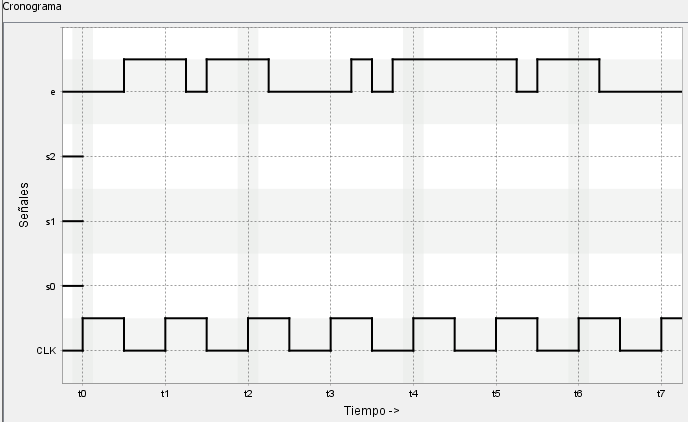

# VerilChart - Circuitos secuenciales (materiales)

## Índice

- [m4ex4](#m4ex4)
- [m4ex5](#m4ex5)
- [m4ex6](#m4ex6)
- [m4ex9](#m4ex9)
- [m4exa1](#m4exa1)
- [m4exa2](#m4exa2)
- [m4exa5](#m4exa5)
- [m4exa6](#m4exa6)
- [m4exa7](#m4exa7)
- [m4ex32](#m4ex32)

 

## m4ex4

<blockquote>

Completad el cronograma que corresponde al circuito de la figura.

</blockquote>

	
Ejercicio resuelto

	

		
	

## m4ex5

<blockquote>

Completad el cronograma que corresponde al circuito de la figura.

</blockquote>

	
Ejercicio resuelto

	

		
	

## m4ex6

<blockquote>

Completad el cronograma que corresponde al circuito de la figura.

</blockquote>

	
Ejercicio resuelto

	

		
	

## m4ex9

<blockquote>

Completad el cronograma que corresponde al circuito de la figura.

</blockquote>

	
Ejercicio resuelto

	

		
	

## m4exa1

<blockquote>

Completad el cronograma que corresponde al circuito de la figura.

</blockquote>

	
Ejercicio resuelto

	

		
	

## m4exa2

<blockquote>

Completad el cronograma que corresponde al circuito de la figura.

</blockquote>

	
Ejercicio resuelto

	

		
	

## m4exa5

<blockquote>

Completad el cronograma que corresponde al circuito de la figura.

</blockquote>

	
Ejercicio resuelto

	

		
	

## m4exa6

<blockquote>

Completad el cronograma que corresponde al circuito de la figura.

</blockquote>

	
Ejercicio resuelto

	

		
	

## m4exa7

<blockquote>

A continuación, se muestran las tablas de salidas y las de transiciones de un circuito secuencial:

<table>
	<tr>
		<th colspan="2">TABLA DE SALIDAS</th>
	</tr>
	<tr>
		<th>ESTADO</th>
		<th>$xy$</th>
	</tr>
	<tr>
		<td>A</td>
		<td>0 0</td>
	</tr>
	<tr>
		<td>B</td>
		<td>0 1</td>
	</tr>
	<tr>
		<td>C</td>
		<td>1 0</td>
	</tr>
</table>

<table>
	<tr>
		<th colspan="4">TABLA DE TRANSICIONES</th>
	</tr>
	<tr>
		<th>ESTADO</th>
		<th>$a$</th>
		<th>$b$</th>
		<th>ESTADO $^+$</th>
	</tr>
	<tr>
		<td>A</td>
		<td>0</td>
		<td>0</td>
		<td>B</td>
	</tr>
	<tr>
		<td>A</td>
		<td>0</td>
		<td>1</td>
		<td>A</td>
	</tr>
	<tr>
		<td>A</td>
		<td>1</td>
		<td>0</td>
		<td>B</td>
	</tr>
	<tr>
		<td>A</td>
		<td>1</td>
		<td>1</td>
		<td>A</td>
	</tr>
	<tr>
		<td>B</td>
		<td>0</td>
		<td>0</td>
		<td>x</td>
	</tr>
	<tr>
		<td>B</td>
		<td>0</td>
		<td>1</td>
		<td>x</td>
	</tr>
	<tr>
		<td>B</td>
		<td>1</td>
		<td>0</td>
		<td>C</td>
	</tr>
	<tr>
		<td>B</td>
		<td>1</td>
		<td>1</td>
		<td>C</td>
	</tr>
	<tr>
		<td>C</td>
		<td>0</td>
		<td>0</td>
		<td>C</td>
	</tr>
	<tr>
		<td>C</td>
		<td>0</td>
		<td>1</td>
		<td>B</td>
	</tr>
	<tr>
		<td>C</td>
		<td>1</td>
		<td>0</td>
		<td>A</td>
	</tr>
	<tr>
		<td>C</td>
		<td>1</td>
		<td>1</td>
		<td>A</td>
	</tr>
</table>

Completad el siguiente cronograma:

</blockquote>

	
Ejercicio resuelto

	

		
	

## m4ex32

<blockquote>

Completad el cronograma que corresponde al circuito de la figura.

</blockquote>

	
Ejercicio resuelto

	

		
	

