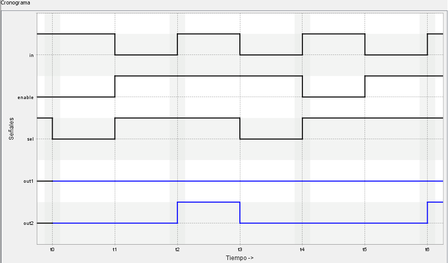
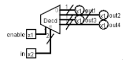
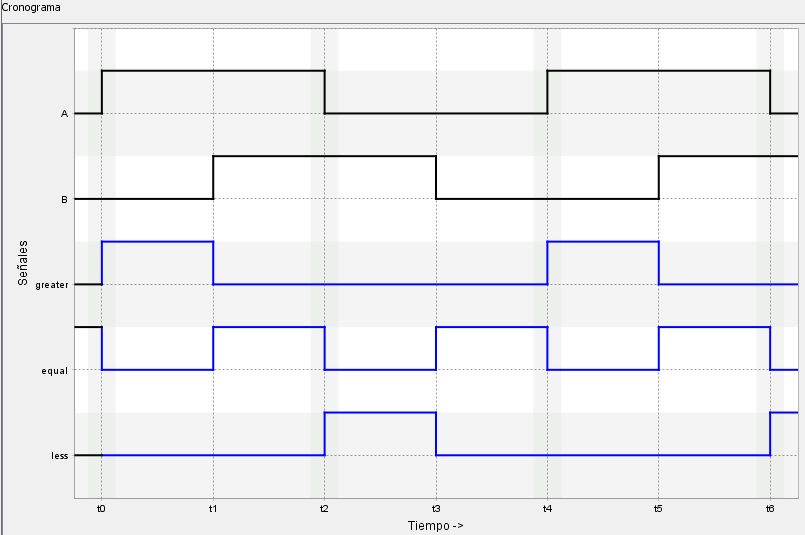
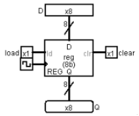
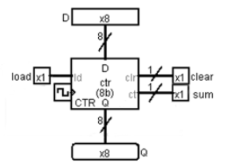

# VerilChart - Laboratorio

>[!NOTE]
>- Todos los ejercicios tienen una puntuación de 3 estrellas (⭐).
>- **Puntuación total**: 11 ejercicios $\times$ 3⭐ = 33⭐

## Índice

- [VMUX2](#vmux2)
- [VDEMUX2](#vdemux2)
- [VCOD4](#vcod4)
- [VDECOD4](#vdecod4)
- [VSUM1](#vsum1)
- [VSHIFT5](#vshift5)
- [VSUBST2](#vsubst2)
- [VCMP1](#vcmp1)
- [VBIEST](#vbiest)
- [VREG8B](#vreg8b)
- [VCOUNTER8B](#vcounter8b)

 

## VMUX2

<blockquote>

Completad el cronograma que corresponde al circuito de la figura.

</blockquote>

	
Ejercicio resuelto

	

		
	

## VDEMUX2

<blockquote>

Completad el cronograma que corresponde al circuito de la figura.

</blockquote>

	
Ejercicio resuelto

	

		
	

## VCOD4

<blockquote>

Completad el cronograma que corresponde al circuito de la figura.

</blockquote>

	
Ejercicio resuelto

	

		
	

## VDECOD4

<blockquote>

Completad el cronograma que corresponde al circuito de la figura.

</blockquote>

	
Ejercicio resuelto

	

		
	

## VSUM1

<blockquote>

Completad el cronograma que corresponde al circuito de la figura.

</blockquote>

	
Ejercicio resuelto

	

		
	

## VSHIFT5

<blockquote>

Completad el cronograma que corresponde al circuito de la figura.

</blockquote>

	
Ejercicio resuelto

	

		
	

## VSUBST2

<blockquote>

Completad el cronograma que corresponde al circuito de la figura.

</blockquote>

	
Ejercicio resuelto

	

		
	

## VCMP1

<blockquote>

Completad el cronograma que corresponde al circuito de la figura.

</blockquote>

	
Ejercicio resuelto

	

		
	

## VBIEST

<blockquote>

Completad el cronograma que corresponde al circuito de la figura.

</blockquote>

	
Ejercicio resuelto

	

		
	

## VREG8B

<blockquote>

Completad el cronograma que corresponde al circuito de la figura.

</blockquote>

	
Ejercicio resuelto

	

		
	

## VCOUNTER8B

<blockquote>

Completad el cronograma que corresponde al circuito de la figura correspondiente a un contador (este contador no es el de Logisim) donde el valor de la entrada `D` se carga cuando $\text{load} = 1$ y el valor del contador se pone a 0 cuando $\text{clear} = 1$. Si $\text{load} = 0$, el contador se pone en modo incremento cuando $\text{sum} = 1$ o en modo decremento del valor interno cuando $\text{sum} = 0$ en cada flanco ascendente de reloj.

</blockquote>

	
Ejercicio resuelto

	

		
	

