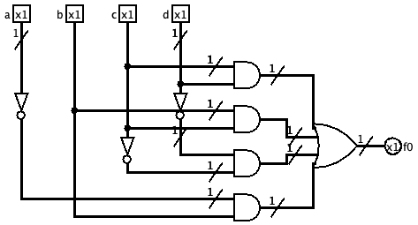

# VerilCirc - Circuitos combinacionales (histórico)

>[!NOTE]
>- Todos los ejercicios tienen una puntuación de 3 estrellas (⭐).
>- **Puntuación total**: 18 ejercicios $\times$ 3⭐ = 54⭐

## Índice

- [20111\_EX1\_2B](#20111_ex1_2b)
- [20111\_EX2\_2B](#20111_ex2_2b)
- [20122\_PAC2\_1D](#20122_pac2_1d)
- [20122\_PAC2\_1E](#20122_pac2_1e)
- [20122\_EX3\_2B](#20122_ex3_2b)
- [20131\_PAC2\_2B\_C](#20131_pac2_2b_c)
- [20131\_PAC2\_3B](#20131_pac2_3b)
- [20132\_PAC2\_2D](#20132_pac2_2d)
- [20132\_PAC2\_4](#20132_pac2_4)
- [20141\_PAC2\_1B](#20141_pac2_1b)
- [20141\_PAC2\_4C](#20141_pac2_4c)
- [20142\_PAC2\_1C](#20142_pac2_1c)
- [20142\_PAC2\_4A](#20142_pac2_4a)
- [20152\_PAC2\_2B](#20152_pac2_2b)
- [20161\_PAC2\_1B](#20161_pac2_1b)
- [20161\_PAC2\_4](#20161_pac2_4)
- [20162\_PAC2\_1B](#20162_pac2_1b)
- [20162\_PAC2\_1C](#20162_pac2_1c)

 

## 20111_EX1_2B

>Construid un circuito combinacional que reciba, como entrada, un número `N` de 5 bits en formato de complemento a 2 y que dé, como salida, el mismo número de 5 bits en formato de signo y magnitud `y`, además, una salida que indique si ha habido desbordamiento en el cambio de formato. En este caso, la salida `M` tiene que ser $0_{\text{(SM2}}$

	
Ejercicio resuelto

	
	

## 20111_EX2_2B

>Diseñad un sumador de números en representación BCD. La representación en BCD representa cada dígito decimal con 4 bits. Por ejemplo, el decimal 9 en BCD es 1001, pero para representar el valor 10 en BCD, necesitamos 2 dígitos BCD, 0001 0000, el primer grupo de 4 bits para representar el dígito 1 y el segundo grupo para representar el dígito 0. El sumador BCD recibe dos números de un dígito, `A` y `B`, y da como resultado un número BCD de un dígito de suma, `S`, y un bit de acarreo, `c`, que vale 1 cuando la suma obtenga un número BCD no representable con un dígito. Tened en cuenta que, cuando la suma en binario de los números BCD supera el valor 9, el resultado correcto en BCD se obtiene sumando 6 al resultado obtenido. Por ejemplo, si se suma 5 (0101 en BCD) con 8 (1000 en BCD), el resultado tiene que ser 3 (0011 en BCD) con acarreo 1 pero, al sumar los números binarios de 4 bits correspondientes, el resultado da un número no BCD, que es 13, o 1101, y sin acarreo. Para corregirlo, se le suma 6, o 0110, y da un número en BCD, que es 3 (0011 en BCD), y acarreo 1.

	
Ejercicio resuelto

	
	

## 20122_PAC2_1D

<blockquote>

Se quiere diseñar un circuito (`NEG`) que calcule el opuesto de un número entero. El número en la entrada (`E`) se representa en Ca2 y en 4 bits. El número en la salida (`S`) se tiene que representar en signo y magnitud y en `n` bits ($s_{n - 1}, s_{n - 1}, \cdots, s_1, s_0$).

 

Deducid el número de bits de la salida `S`.

Realizad un circuito que calcule `s1` utilizando sólo un MUX de 4 entradas de control.
</blockquote>

	
Ejercicio resuelto

	
	

## 20122_PAC2_1E

<blockquote>

Se quiere diseñar un circuito (`NEG`) que calcule el opuesto de un número entero. El número en la entrada (`E`) se representa en Ca2 y en 4 bits. El número en la salida (`S`) se tiene que representar en signo y magnitud y en `n` bits ($s_{n - 1}, s_{n - 2}, \cdots, s_1, s_0$).

 

Deducid el número de bits de la salida `S`.

Realizad un circuito que calcule $s_1$ utilizando un MUX de 3 entradas de control y las puertas que consideréis necesarias.
</blockquote>

	
Ejercicio resuelto

	
	

## 20122_EX3_2B

<blockquote>

Considerad el circuito siguiente `FUNC` que tiene dos entradas `X` e `Y` correspondientes a dos números naturales, siendo `X` de 4 bits e `Y` de 4 bits. El circuito calcula la función $2 \cdot \text{MAX}(X,Y) + Y / 2$ a la salida `Z`, que tiene 4 bits y representa también un número natural. El circuito tiene otra salida, denominada `O`, que se pone a 1 cuando el resultado de la función no se puede representar, es decir, hay desbordamiento; y a 0, en caso contrario.

 

Se pide que diseñéis el circuito `FUNC` usando bloques y puertas combinacionales, especificando claramente el ancho de los buses utilizados.
</blockquote>

	
Ejercicio resuelto

	
	

## 20131_PAC2_2B_C

<blockquote>

Sintetizad la manera mínima a dos niveles la función $g$ mediante el método de Karnaugh, e implementad el resultado con puertas lógicas.

<table>
	<tr>
		<th colspan="4">ENTRADA</th>
		<th colspan="2">SALIDA</th>
	</tr>
	<tr>
		<th>$x$</th>
		<th>$y$</th>
		<th>$z$</th>
		<th>$w$</th>
		<th>$f$</th>
		<th>$g$</th>
	</tr>
	<tr>
		<td>0</td>
		<td>0</td>
		<td>0</td>
		<td>0</td>
		<td>1</td>
		<td>1</td>
	</tr>
	<tr>
		<td>0</td>
		<td>0</td>
		<td>0</td>
		<td>1</td>
		<td>0</td>
		<td>0</td>
	</tr>
	<tr>
		<td>0</td>
		<td>0</td>
		<td>1</td>
		<td>0</td>
		<td>1</td>
		<td>1</td>
	</tr>
	<tr>
		<td>0</td>
		<td>0</td>
		<td>1</td>
		<td>1</td>
		<td>1</td>
		<td>1</td>
	</tr>
	<tr>
		<td>0</td>
		<td>1</td>
		<td>1</td>
		<td>0</td>
		<td>0</td>
		<td>X</td>
	</tr>
	<tr>
		<td>0</td>
		<td>1</td>
		<td>1</td>
		<td>1</td>
		<td>0</td>
		<td>0</td>
	</tr>
	<tr>
		<td>1</td>
		<td>0</td>
		<td>0</td>
		<td>0</td>
		<td>0</td>
		<td>1</td>
	</tr>
	<tr>
		<td>1</td>
		<td>0</td>
		<td>0</td>
		<td>1</td>
		<td>0</td>
		<td>0</td>
	</tr>
	<tr>
		<td>1</td>
		<td>0</td>
		<td>1</td>
		<td>0</td>
		<td>0</td>
		<td>1</td>
	</tr>
	<tr>
		<td>1</td>
		<td>0</td>
		<td>1</td>
		<td>1</td>
		<td>1</td>
		<td>0</td>
	</tr>
	<tr>
		<td>1</td>
		<td>1</td>
		<td>0</td>
		<td>0</td>
		<td>1</td>
		<td>X</td>
	</tr>
	<tr>
		<td>1</td>
		<td>1</td>
		<td>0</td>
		<td>1</td>
		<td>1</td>
		<td>X</td>
	</tr>
	<tr>
		<td>1</td>
		<td>1</td>
		<td>1</td>
		<td>0</td>
		<td>0</td>
		<td>X</td>
	</tr>
	<tr>
		<td>1</td>
		<td>1</td>
		<td>1</td>
		<td>1</td>
		<td>0</td>
		<td>X</td>
	</tr>
</table>
</blockquote>

	
Ejercicio resuelto

	
	

## 20131_PAC2_3B

<blockquote>

Implementad la función `f` utilizando un descodificador 4-16 y una puerta OR.

<table>
	<tr>
		<th colspan="4">ENTRADA</th>
		<th colspan="2">SALIDA</th>
	</tr>
	<tr>
		<th>$x$</th>
		<th>$y$</th>
		<th>$z$</th>
		<th>$w$</th>
		<th>$f$</th>
		<th>$g$</th>
	</tr>
	<tr>
		<td>0</td>
		<td>0</td>
		<td>0</td>
		<td>0</td>
		<td>1</td>
		<td>1</td>
	</tr>
	<tr>
		<td>0</td>
		<td>0</td>
		<td>0</td>
		<td>1</td>
		<td>1</td>
		<td>0</td>
	</tr>
	<tr>
		<td>0</td>
		<td>0</td>
		<td>1</td>
		<td>0</td>
		<td>1</td>
		<td>0</td>
	</tr>
	<tr>
		<td>0</td>
		<td>0</td>
		<td>1</td>
		<td>1</td>
		<td>1</td>
		<td>0</td>
	</tr>
	<tr>
		<td>0</td>
		<td>1</td>
		<td>0</td>
		<td>0</td>
		<td>0</td>
		<td>1</td>
	</tr>
	<tr>
		<td>0</td>
		<td>1</td>
		<td>0</td>
		<td>1</td>
		<td>1</td>
		<td>1</td>
	</tr>
	<tr>
		<td>0</td>
		<td>1</td>
		<td>1</td>
		<td>0</td>
		<td>0</td>
		<td>0</td>
	</tr>
	<tr>
		<td>0</td>
		<td>1</td>
		<td>1</td>
		<td>1</td>
		<td>1</td>
		<td>1</td>
	</tr>
	<tr>
		<td>1</td>
		<td>0</td>
		<td>0</td>
		<td>0</td>
		<td>0</td>
		<td>1</td>
	</tr>
	<tr>
		<td>1</td>
		<td>0</td>
		<td>0</td>
		<td>1</td>
		<td>0</td>
		<td>1</td>
	</tr>
	<tr>
		<td>1</td>
		<td>0</td>
		<td>1</td>
		<td>0</td>
		<td>1</td>
		<td>1</td>
	</tr>
	<tr>
		<td>1</td>
		<td>0</td>
		<td>1</td>
		<td>1</td>
		<td>1</td>
		<td>1</td>
	</tr>
	<tr>
		<td>1</td>
		<td>1</td>
		<td>0</td>
		<td>0</td>
		<td>0</td>
		<td>1</td>
	</tr>
	<tr>
		<td>1</td>
		<td>1</td>
		<td>0</td>
		<td>1</td>
		<td>0</td>
		<td>0</td>
	</tr>
	<tr>
		<td>1</td>
		<td>1</td>
		<td>1</td>
		<td>0</td>
		<td>0</td>
		<td>1</td>
	</tr>
	<tr>
		<td>1</td>
		<td>1</td>
		<td>1</td>
		<td>1</td>
		<td>1</td>
		<td>0</td>
	</tr>
</table>
</blockquote>

	
Ejercicio resuelto

	
	

## 20132_PAC2_2D

<blockquote>

Implementad la función `g` utilizando un multiplexor de 3 variables de control.

<table>
	<tr>
		<th colspan="4">ENTRADA</th>
		<th colspan="2">SALIDA</th>
	</tr>
	<tr>
		<th>$x$</th>
		<th>$y$</th>
		<th>$z$</th>
		<th>$w$</th>
		<th>$f$</th>
		<th>$g$</th>
	</tr>
	<tr>
		<td>0</td>
		<td>0</td>
		<td>0</td>
		<td>0</td>
		<td>1</td>
		<td>X</td>
	</tr>
	<tr>
		<td>0</td>
		<td>0</td>
		<td>0</td>
		<td>1</td>
		<td>0</td>
		<td>1</td>
	</tr>
	<tr>
		<td>0</td>
		<td>0</td>
		<td>1</td>
		<td>0</td>
		<td>1</td>
		<td>X</td>
	</tr>
	<tr>
		<td>0</td>
		<td>0</td>
		<td>1</td>
		<td>1</td>
		<td>0</td>
		<td>0</td>
	</tr>
	<tr>
		<td>0</td>
		<td>1</td>
		<td>0</td>
		<td>0</td>
		<td>1</td>
		<td>1</td>
	</tr>
	<tr>
		<td>0</td>
		<td>1</td>
		<td>0</td>
		<td>1</td>
		<td>1</td>
		<td>1</td>
	</tr>
	<tr>
		<td>0</td>
		<td>1</td>
		<td>1</td>
		<td>0</td>
		<td>0</td>
		<td>X</td>
	</tr>
	<tr>
		<td>0</td>
		<td>1</td>
		<td>1</td>
		<td>1</td>
		<td>0</td>
		<td>1</td>
	</tr>
	<tr>
		<td>1</td>
		<td>0</td>
		<td>0</td>
		<td>0</td>
		<td>1</td>
		<td>0</td>
	</tr>
	<tr>
		<td>1</td>
		<td>0</td>
		<td>0</td>
		<td>1</td>
		<td>0</td>
		<td>X</td>
	</tr>
	<tr>
		<td>1</td>
		<td>0</td>
		<td>1</td>
		<td>0</td>
		<td>1</td>
		<td>1</td>
	</tr>
	<tr>
		<td>1</td>
		<td>0</td>
		<td>1</td>
		<td>1</td>
		<td>0</td>
		<td>1</td>
	</tr>
	<tr>
		<td>1</td>
		<td>1</td>
		<td>0</td>
		<td>0</td>
		<td>1</td>
		<td>X</td>
	</tr>
	<tr>
		<td>1</td>
		<td>1</td>
		<td>0</td>
		<td>1</td>
		<td>0</td>
		<td>0</td>
	</tr>
	<tr>
		<td>1</td>
		<td>1</td>
		<td>1</td>
		<td>0</td>
		<td>1</td>
		<td>X</td>
	</tr>
	<tr>
		<td>1</td>
		<td>1</td>
		<td>1</td>
		<td>1</td>
		<td>0</td>
		<td>0</td>
	</tr>
</table>
</blockquote>

	
Ejercicio resuelto

	
	

## 20132_PAC2_4

<blockquote>

Se quiere diseñar un circuito lógico combinacional NORM que normalice una mantisa. El circuito responde al siguiente diagrama:

 

`ME` es la mantisa de entrada, que tiene 8 bits, donde la coma se sitúa a la derecha del bit de más peso; y `MS` es la mantisa de salida, que tiene 5 bits, y que se representa con bit implícito y donde el criterio de aproximación que se usa es el truncamiento. Por ejemplo:

- Si $ME = 00101010_{(2}$ tenemos que la mantisa de entrada es $0,0101010_{(2} = 0,101010_{(2} \cdot 2^0$. Para normalizar la mantisa se tiene que desplazar la coma hasta que esté a la derecha del primer bit significativo. Por lo tanto, $0,0101010_{(2} \cdot 2^0 = 1,01010_{(2} \cdot 2^{-2}$. Así, tenemos que $MS = 01010_{(2}$.
- Si $ME = 10111111_{(2}$ tenemos que la mantisa de entrada es $1,0111111_{(2}$ y ya está normalizada. Para representar `MS` se usa el truncamiento, y obtenemos que $MS = 01111_{(2}$.

En este ejercicio suponemos que la entrada $00000000$ no se produce nunca, puesto que una mantisa con valor 0 no se puede normalizar.

Diseñad el circuito NORM utilizando las puertas y los bloques combinacionales (excepto una memoria ROM) que creáis necesarios. Hay que indicar claramente la dimensión de todos los buses del circuito y explicar textualmente el razonamiento que habéis seguido para hacer el diseño.
</blockquote>

	
Ejercicio resuelto

	
	

## 20141_PAC2_1B

<blockquote>

Dada la siguiente tabla de verdad:

<table>
	<tr>
		<th colspan="4">ENTRADA</th>
		<th colspan="3">SALIDA</th>
	</tr>
	<tr>
		<th>$a$</th>
		<th>$b$</th>
		<th>$c$</th>
		<th>$d$</th>
		<th>$f1$</th>
		<th>$f2$</th>
		<th>$f3$</th>
	</tr>
	<tr>
		<td>0</td>
		<td>0</td>
		<td>0</td>
		<td>0</td>
		<td>0</td>
		<td>1</td>
		<td>1</td>
	</tr>
	<tr>
		<td>0</td>
		<td>0</td>
		<td>0</td>
		<td>1</td>
		<td>0</td>
		<td>1</td>
		<td>X</td>
	</tr>
	<tr>
		<td>0</td>
		<td>0</td>
		<td>1</td>
		<td>0</td>
		<td>0</td>
		<td>0</td>
		<td>X</td>
	</tr>
	<tr>
		<td>0</td>
		<td>0</td>
		<td>1</td>
		<td>1</td>
		<td>0</td>
		<td>1</td>
		<td>0</td>
	</tr>
	<tr>
		<td>0</td>
		<td>1</td>
		<td>0</td>
		<td>0</td>
		<td>0</td>
		<td>0</td>
		<td>0</td>
	</tr>
	<tr>
		<td>0</td>
		<td>1</td>
		<td>0</td>
		<td>1</td>
		<td>0</td>
		<td>0</td>
		<td>0</td>
	</tr>
	<tr>
		<td>0</td>
		<td>1</td>
		<td>1</td>
		<td>0</td>
		<td>0</td>
		<td>0</td>
		<td>1</td>
	</tr>
	<tr>
		<td>0</td>
		<td>1</td>
		<td>1</td>
		<td>1</td>
		<td>1</td>
		<td>0</td>
		<td>X</td>
	</tr>
	<tr>
		<td>1</td>
		<td>0</td>
		<td>0</td>
		<td>0</td>
		<td>0</td>
		<td>1</td>
		<td>X</td>
	</tr>
	<tr>
		<td>1</td>
		<td>0</td>
		<td>0</td>
		<td>1</td>
		<td>0</td>
		<td>1</td>
		<td>X</td>
	</tr>
	<tr>
		<td>1</td>
		<td>0</td>
		<td>1</td>
		<td>0</td>
		<td>0</td>
		<td>1</td>
		<td>0</td>
	</tr>
	<tr>
		<td>1</td>
		<td>0</td>
		<td>1</td>
		<td>1</td>
		<td>1</td>
		<td>0</td>
		<td>0</td>
	</tr>
	<tr>
		<td>1</td>
		<td>1</td>
		<td>0</td>
		<td>0</td>
		<td>0</td>
		<td>0</td>
		<td>0</td>
	</tr>
	<tr>
		<td>1</td>
		<td>1</td>
		<td>0</td>
		<td>1</td>
		<td>1</td>
		<td>0</td>
		<td>X</td>
	</tr>
	<tr>
		<td>1</td>
		<td>1</td>
		<td>1</td>
		<td>0</td>
		<td>1</td>
		<td>0</td>
		<td>X</td>
	</tr>
	<tr>
		<td>1</td>
		<td>1</td>
		<td>1</td>
		<td>1</td>
		<td>1</td>
		<td>0</td>
		<td>X</td>
	</tr>
</table>

Sintetizad de forma mínima a dos niveles la función `f2` mediante el método de Karnaugh, e implementad el resultado con puertas lógicas.
</blockquote>

	
Ejercicio resuelto

	
	

## 20141_PAC2_4C

>Implementad un circuito que calcula el producto de un número `N` de 7 bits por la entrada `Y` de 2 bits. Denominaremos `NY` a la salida de este circuito. Indicad la anchura de todos los buses necesaria para que nunca se produzca desbordamiento.
>
>**NOTA**: En este apartado NO se puede usar ninguna memoria ROM, pero será útil usar un multiplexor de buses.

	
Ejercicio resuelto

	
	

## 20142_PAC2_1C

<blockquote>

Dada la siguiente tabla de verdad:

<table>
	<tr>
		<th colspan="4">ENTRADA</th>
		<th colspan="1">SALIDA</th>
	</tr>
	<tr>
		<th>$a$</th>
		<th>$b$</th>
		<th>$c$</th>
		<th>$d$</th>
		<th>$f0$</th>
	</tr>
	<tr>
		<td>0</td>
		<td>0</td>
		<td>0</td>
		<td>0</td>
		<td>1</td>
	</tr>
	<tr>
		<td>0</td>
		<td>0</td>
		<td>0</td>
		<td>1</td>
		<td>0</td>
	</tr>
	<tr>
		<td>0</td>
		<td>0</td>
		<td>1</td>
		<td>0</td>
		<td>0</td>
	</tr>
	<tr>
		<td>0</td>
		<td>0</td>
		<td>1</td>
		<td>1</td>
		<td>1</td>
	</tr>
	<tr>
		<td>0</td>
		<td>1</td>
		<td>0</td>
		<td>0</td>
		<td>1</td>
	</tr>
	<tr>
		<td>0</td>
		<td>1</td>
		<td>0</td>
		<td>1</td>
		<td>1</td>
	</tr>
	<tr>
		<td>0</td>
		<td>1</td>
		<td>1</td>
		<td>0</td>
		<td>1</td>
	</tr>
	<tr>
		<td>0</td>
		<td>1</td>
		<td>1</td>
		<td>1</td>
		<td>1</td>
	</tr>
	<tr>
		<td>1</td>
		<td>0</td>
		<td>0</td>
		<td>0</td>
		<td>1</td>
	</tr>
	<tr>
		<td>1</td>
		<td>0</td>
		<td>0</td>
		<td>1</td>
		<td>0</td>
	</tr>
	<tr>
		<td>1</td>
		<td>0</td>
		<td>1</td>
		<td>0</td>
		<td>0</td>
	</tr>
	<tr>
		<td>1</td>
		<td>0</td>
		<td>1</td>
		<td>1</td>
		<td>1</td>
	</tr>
	<tr>
		<td>1</td>
		<td>1</td>
		<td>0</td>
		<td>0</td>
		<td>1</td>
	</tr>
	<tr>
		<td>1</td>
		<td>1</td>
		<td>0</td>
		<td>1</td>
		<td>0</td>
	</tr>
	<tr>
		<td>1</td>
		<td>1</td>
		<td>1</td>
		<td>0</td>
		<td>1</td>
	</tr>
	<tr>
		<td>1</td>
		<td>1</td>
		<td>1</td>
		<td>1</td>
		<td>1</td>
	</tr>
</table>

Sintetizad de forma mínima a dos niveles la función `f0` mediante el método de Karnaugh e implementad la expresión obtenida con puertas lógicas.
</blockquote>

	
Ejercicio resuelto

	
	

## 20142_PAC2_4A

<blockquote>

Se quiero diseñar un circuito lógico combinacional que sume o reste una unidad al número de entrada `X`, que es un dígito BCD, y dé el resultado en módulo 7 en formato binario y sin signo. El circuito sumará una unidad si `y` es 0 y la restará si `y` es 1.

 

</blockquote>

	
Ejercicio resuelto

	
	

## 20152_PAC2_2B

<blockquote>

Dada la siguiente tabla de verdad:

<table>
	<tr>
		<th colspan="4">ENTRADA</th>
		<th colspan="1">SALIDA</th>
	</tr>
	<tr>
		<th>$a$</th>
		<th>$b$</th>
		<th>$c$</th>
		<th>$d$</th>
		<th>$f$</th>
	</tr>
	<tr>
		<td>0</td>
		<td>0</td>
		<td>0</td>
		<td>0</td>
		<td>1</td>
	</tr>
	<tr>
		<td>0</td>
		<td>0</td>
		<td>0</td>
		<td>1</td>
		<td>0</td>
	</tr>
	<tr>
		<td>0</td>
		<td>0</td>
		<td>1</td>
		<td>0</td>
		<td>1</td>
	</tr>
	<tr>
		<td>0</td>
		<td>0</td>
		<td>1</td>
		<td>1</td>
		<td>0</td>
	</tr>
	<tr>
		<td>0</td>
		<td>1</td>
		<td>0</td>
		<td>0</td>
		<td>0</td>
	</tr>
	<tr>
		<td>0</td>
		<td>1</td>
		<td>0</td>
		<td>1</td>
		<td>0</td>
	</tr>
	<tr>
		<td>0</td>
		<td>1</td>
		<td>1</td>
		<td>0</td>
		<td>0</td>
	</tr>
	<tr>
		<td>0</td>
		<td>1</td>
		<td>1</td>
		<td>1</td>
		<td>1</td>
	</tr>
	<tr>
		<td>1</td>
		<td>0</td>
		<td>0</td>
		<td>0</td>
		<td>1</td>
	</tr>
	<tr>
		<td>1</td>
		<td>0</td>
		<td>0</td>
		<td>1</td>
		<td>0</td>
	</tr>
	<tr>
		<td>1</td>
		<td>0</td>
		<td>1</td>
		<td>0</td>
		<td>X</td>
	</tr>
	<tr>
		<td>1</td>
		<td>0</td>
		<td>1</td>
		<td>1</td>
		<td>X</td>
	</tr>
	<tr>
		<td>1</td>
		<td>1</td>
		<td>0</td>
		<td>0</td>
		<td>1</td>
	</tr>
	<tr>
		<td>1</td>
		<td>1</td>
		<td>0</td>
		<td>1</td>
		<td>0</td>
	</tr>
	<tr>
		<td>1</td>
		<td>1</td>
		<td>1</td>
		<td>0</td>
		<td>0</td>
	</tr>
	<tr>
		<td>1</td>
		<td>1</td>
		<td>1</td>
		<td>1</td>
		<td>0</td>
	</tr>
</table>

Sintetizad la función `f` con un decodificador de 4 entradas y las puertas lógicas que consideréis necesarias.
</blockquote>

	
Ejercicio resuelto

	
	

## 20161_PAC2_1B

<blockquote>

Dada la siguiente tabla de verdad:

<table>
	<tr>
		<th colspan="4">ENTRADA</th>
		<th colspan="2">SALIDA</th>
	</tr>
	<tr>
		<th>$a$</th>
		<th>$b$</th>
		<th>$c$</th>
		<th>$d$</th>
		<th>$f1$</th>
		<th>$f2$</th>
	</tr>
	<tr>
		<td>0</td>
		<td>0</td>
		<td>0</td>
		<td>0</td>
		<td>0</td>
		<td>0</td>
	</tr>
	<tr>
		<td>0</td>
		<td>0</td>
		<td>0</td>
		<td>1</td>
		<td>1</td>
		<td>0</td>
	</tr>
	<tr>
		<td>0</td>
		<td>0</td>
		<td>1</td>
		<td>0</td>
		<td>1</td>
		<td>0</td>
	</tr>
	<tr>
		<td>0</td>
		<td>0</td>
		<td>1</td>
		<td>1</td>
		<td>1</td>
		<td>0</td>
	</tr>
	<tr>
		<td>0</td>
		<td>1</td>
		<td>0</td>
		<td>0</td>
		<td>0</td>
		<td>1</td>
	</tr>
	<tr>
		<td>0</td>
		<td>1</td>
		<td>0</td>
		<td>1</td>
		<td>0</td>
		<td>1</td>
	</tr>
	<tr>
		<td>0</td>
		<td>1</td>
		<td>1</td>
		<td>0</td>
		<td>0</td>
		<td>0</td>
	</tr>
	<tr>
		<td>0</td>
		<td>1</td>
		<td>1</td>
		<td>1</td>
		<td>0</td>
		<td>1</td>
	</tr>
	<tr>
		<td>1</td>
		<td>0</td>
		<td>0</td>
		<td>0</td>
		<td>0</td>
		<td>0</td>
	</tr>
	<tr>
		<td>1</td>
		<td>0</td>
		<td>0</td>
		<td>1</td>
		<td>0</td>
		<td>0</td>
	</tr>
	<tr>
		<td>1</td>
		<td>0</td>
		<td>1</td>
		<td>0</td>
		<td>0</td>
		<td>0</td>
	</tr>
	<tr>
		<td>1</td>
		<td>0</td>
		<td>1</td>
		<td>1</td>
		<td>1</td>
		<td>0</td>
	</tr>
	<tr>
		<td>1</td>
		<td>1</td>
		<td>0</td>
		<td>0</td>
		<td>0</td>
		<td>1</td>
	</tr>
	<tr>
		<td>1</td>
		<td>1</td>
		<td>0</td>
		<td>1</td>
		<td>0</td>
		<td>1</td>
	</tr>
	<tr>
		<td>1</td>
		<td>1</td>
		<td>1</td>
		<td>0</td>
		<td>0</td>
		<td>1</td>
	</tr>
	<tr>
		<td>1</td>
		<td>1</td>
		<td>1</td>
		<td>1</td>
		<td>1</td>
		<td>X</td>
	</tr>
</table>

Sintetizad de forma mínima a dos niveles la función `f2` mediante el método de Karnaugh e implementad la expresión obtenida con puertas lógicas.
</blockquote>

	
Ejercicio resuelto

	
	

## 20161_PAC2_4

>Diseñad **a nivel de bloques** un circuito con una entrada `E` de 3 bits, que dé como salida `S` el número de bits de la entrada que valen 1, codificado en base 2.
>
>A _nivel de bloques_ quiere decir que no se admite construir el circuito partiendo de una tabla de verdad y haciendo la implementación con dos niveles de puertas, sino que se tiene que construir usando bloques combinacionales, y las puertas lógicas que hagan falta. El único bloque combinacional que no está permitido en este ejercicio es la memoria ROM.

	
Ejercicio resuelto

	
	

## 20162_PAC2_1B

<blockquote>

Dada la siguiente tabla de verdad:

<table>
	<tr>
		<th colspan="4">ENTRADA</th>
		<th colspan="2">SALIDA</th>
	</tr>
	<tr>
		<th>$a$</th>
		<th>$b$</th>
		<th>$c$</th>
		<th>$d$</th>
		<th>$f1$</th>
		<th>$f2$</th>
	</tr>
	<tr>
		<td>0</td>
		<td>0</td>
		<td>0</td>
		<td>0</td>
		<td>0</td>
		<td>1</td>
	</tr>
	<tr>
		<td>0</td>
		<td>0</td>
		<td>0</td>
		<td>1</td>
		<td>0</td>
		<td>X</td>
	</tr>
	<tr>
		<td>0</td>
		<td>0</td>
		<td>1</td>
		<td>0</td>
		<td>0</td>
		<td>X</td>
	</tr>
	<tr>
		<td>0</td>
		<td>0</td>
		<td>1</td>
		<td>1</td>
		<td>0</td>
		<td>1</td>
	</tr>
	<tr>
		<td>0</td>
		<td>1</td>
		<td>0</td>
		<td>0</td>
		<td>0</td>
		<td>0</td>
	</tr>
	<tr>
		<td>0</td>
		<td>1</td>
		<td>0</td>
		<td>1</td>
		<td>1</td>
		<td>X</td>
	</tr>
	<tr>
		<td>0</td>
		<td>1</td>
		<td>1</td>
		<td>0</td>
		<td>1</td>
		<td>0</td>
	</tr>
	<tr>
		<td>0</td>
		<td>1</td>
		<td>1</td>
		<td>1</td>
		<td>1</td>
		<td>1</td>
	</tr>
	<tr>
		<td>1</td>
		<td>0</td>
		<td>0</td>
		<td>0</td>
		<td>0</td>
		<td>0</td>
	</tr>
	<tr>
		<td>1</td>
		<td>0</td>
		<td>0</td>
		<td>1</td>
		<td>0</td>
		<td>1</td>
	</tr>
	<tr>
		<td>1</td>
		<td>0</td>
		<td>1</td>
		<td>0</td>
		<td>0</td>
		<td>0</td>
	</tr>
	<tr>
		<td>1</td>
		<td>0</td>
		<td>1</td>
		<td>1</td>
		<td>0</td>
		<td>0</td>
	</tr>
	<tr>
		<td>1</td>
		<td>1</td>
		<td>0</td>
		<td>0</td>
		<td>1</td>
		<td>0</td>
	</tr>
	<tr>
		<td>1</td>
		<td>1</td>
		<td>0</td>
		<td>1</td>
		<td>1</td>
		<td>0</td>
	</tr>
	<tr>
		<td>1</td>
		<td>1</td>
		<td>1</td>
		<td>0</td>
		<td>0</td>
		<td>0</td>
	</tr>
	<tr>
		<td>1</td>
		<td>1</td>
		<td>1</td>
		<td>1</td>
		<td>1</td>
		<td>0</td>
	</tr>
</table>

Sintetizad de forma mínima a dos niveles la función `f2` mediante el método de Karnaugh e implementad la expresión obtenida con puertas lógicas.
</blockquote>

	
Ejercicio resuelto

	
	

## 20162_PAC2_1C

<blockquote>

Diseñad **a nivel de bloques** un circuito que implemente `f1`:

<table>
	<tr>
		<th colspan="4">ENTRADA</th>
		<th colspan="2">SALIDA</th>
	</tr>
	<tr>
		<th>$a$</th>
		<th>$b$</th>
		<th>$c$</th>
		<th>$d$</th>
		<th>$f1$</th>
		<th>$f2$</th>
	</tr>
	<tr>
		<td>0</td>
		<td>0</td>
		<td>0</td>
		<td>0</td>
		<td>0</td>
		<td>1</td>
	</tr>
	<tr>
		<td>0</td>
		<td>0</td>
		<td>0</td>
		<td>1</td>
		<td>0</td>
		<td>X</td>
	</tr>
	<tr>
		<td>0</td>
		<td>0</td>
		<td>1</td>
		<td>0</td>
		<td>0</td>
		<td>X</td>
	</tr>
	<tr>
		<td>0</td>
		<td>0</td>
		<td>1</td>
		<td>1</td>
		<td>0</td>
		<td>1</td>
	</tr>
	<tr>
		<td>0</td>
		<td>1</td>
		<td>0</td>
		<td>0</td>
		<td>0</td>
		<td>0</td>
	</tr>
	<tr>
		<td>0</td>
		<td>1</td>
		<td>0</td>
		<td>1</td>
		<td>1</td>
		<td>X</td>
	</tr>
	<tr>
		<td>0</td>
		<td>1</td>
		<td>1</td>
		<td>0</td>
		<td>1</td>
		<td>0</td>
	</tr>
	<tr>
		<td>0</td>
		<td>1</td>
		<td>1</td>
		<td>1</td>
		<td>1</td>
		<td>1</td>
	</tr>
	<tr>
		<td>1</td>
		<td>0</td>
		<td>0</td>
		<td>0</td>
		<td>0</td>
		<td>0</td>
	</tr>
	<tr>
		<td>1</td>
		<td>0</td>
		<td>0</td>
		<td>1</td>
		<td>0</td>
		<td>1</td>
	</tr>
	<tr>
		<td>1</td>
		<td>0</td>
		<td>1</td>
		<td>0</td>
		<td>0</td>
		<td>0</td>
	</tr>
	<tr>
		<td>1</td>
		<td>0</td>
		<td>1</td>
		<td>1</td>
		<td>0</td>
		<td>0</td>
	</tr>
	<tr>
		<td>1</td>
		<td>1</td>
		<td>0</td>
		<td>0</td>
		<td>1</td>
		<td>0</td>
	</tr>
	<tr>
		<td>1</td>
		<td>1</td>
		<td>0</td>
		<td>1</td>
		<td>1</td>
		<td>0</td>
	</tr>
	<tr>
		<td>1</td>
		<td>1</td>
		<td>1</td>
		<td>0</td>
		<td>0</td>
		<td>0</td>
	</tr>
	<tr>
		<td>1</td>
		<td>1</td>
		<td>1</td>
		<td>1</td>
		<td>1</td>
		<td>0</td>
	</tr>
</table>

A _nivel de bloques_ quiere decir que no se admite construir el circuito partiendo de una tabla de verdad y haciendo la implementación con dos niveles de puertas, sino que se tiene que construir usando bloques combinacionales, y las puertas lógicas que hagan falta. El único bloque combinacional que no está permitido en este ejercicio es la memoria ROM.
</blockquote>

	
Ejercicio resuelto

	
	

