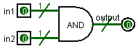
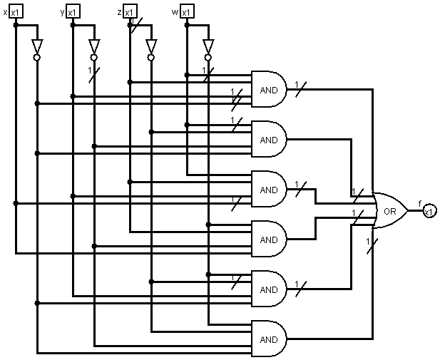
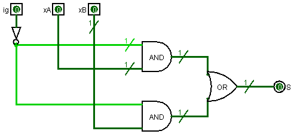
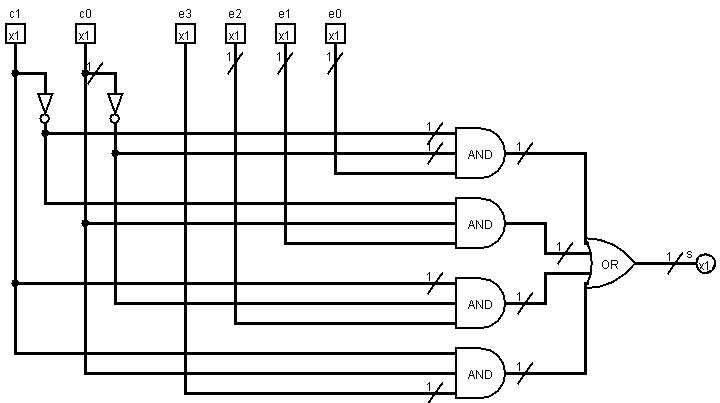
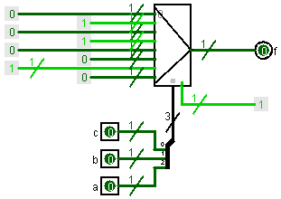
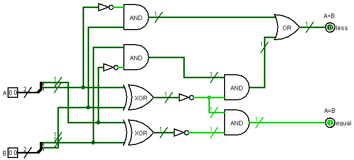
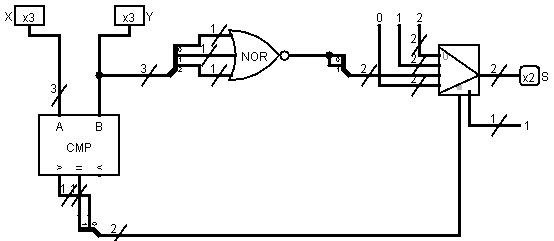
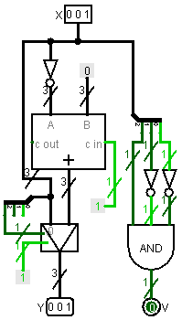

# VerilCirc - Circuitos combinacionales (materiales)

## Índice

- [and2](#and2)
- [m3ex21](#m3ex21)
- [m3ex23a](#m3ex23a)
- [m3ex23b](#m3ex23b)
- [m3ex24c](#m3ex24c)
- [m3ex25](#m3ex25)
- [m3ex26](#m3ex26)
- [m3ex27](#m3ex27)
- [m3ex29](#m3ex29)
- [m3ex30](#m3ex30)
- [m3ex31](#m3ex31)
- [m3ex32](#m3ex32)
- [m3ex35](#m3ex35)
- [m3ex36](#m3ex36)
- [m3ex37](#m3ex37)
- [m3ex38](#m3ex38)
- [m3ex40](#m3ex40)
- [m3ex42](#m3ex42)
- [m3ex44](#m3ex44)
- [m3ex45](#m3ex45)
- [m3ex46](#m3ex46)
- [m3ex47](#m3ex47)
- [m3ex48](#m3ex48)
- [m3ex50b](#m3ex50b)
- [m3ex50c](#m3ex50c)
- [m3ex51](#m3ex51)
- [m3ex52](#m3ex52)
- [m3ex53](#m3ex53)
- [m3ex54](#m3ex54)
- [m3ex55](#m3ex55)
- [m3ex57](#m3ex57)
- [m3ex59](#m3ex59)
- [m3ex60a](#m3ex60a)
- [m3ex60b](#m3ex60b)

 

## and2

>Construid un circuito con una puerta AND de dos entradas. Las señales de entrado son `in1`, `in2` y la señal de salida es output.

	
Ejercicio resuelto

	
	

## m3ex21

>Sintetizad la función $f(a,b,c,d) = d \cdot (a' + a \cdot b) \cdot (b' \oplus c)$

	
Ejercicio resuelto

	
	

## m3ex23a

>Haced la síntesis a dos niveles de la siguiente función:
>
>$$f(x,y,z,w) = x' y' z' w' + x'yz'w' + xy'zw' + xyzw + x'y'z'w + x'yzw$$

	
Ejercicio resuelto

	
	

## m3ex23b

>Haced la síntesis a dos niveles de la siguiente función:
>
>$$f(x,y,z) = xz' + y'z + x'y$$

	
Ejercicio resuelto

	
	

## m3ex24c

>Se quiere diseñar un circuito combinacional que permite multiplicar dos números naturales de dos bits.
>
>Implementad el circuito a dos niveles.

	
Ejercicio resuelto

	
	

## m3ex25

<blockquote>

Sintetizad la siguiente función a dos niveles:

<table>
	<tr>
		<th colspan="3">ENTRADA</th>
		<th colspan="1">SALIDA</th>
	</tr>
	<tr>
		<th>$x_2$</th>
		<th>$x_1$</th>
		<th>$x_0$</th>
		<th>$f$</th>
	</tr>
	<tr>
		<td>0</td>
		<td>0</td>
		<td>0</td>
		<td>0</td>
	</tr>
	<tr>
		<td>0</td>
		<td>0</td>
		<td>1</td>
		<td>0</td>
	</tr>
	<tr>
		<td>0</td>
		<td>1</td>
		<td>0</td>
		<td>0</td>
	</tr>
	<tr>
		<td>0</td>
		<td>1</td>
		<td>1</td>
		<td>1</td>
	</tr>
	<tr>
		<td>1</td>
		<td>0</td>
		<td>0</td>
		<td>0</td>
	</tr>
	<tr>
		<td>1</td>
		<td>0</td>
		<td>1</td>
		<td>0</td>
	</tr>
	<tr>
		<td>1</td>
		<td>1</td>
		<td>0</td>
		<td>0</td>
	</tr>
	<tr>
		<td>1</td>
		<td>1</td>
		<td>1</td>
		<td>1</td>
	</tr>
</table>
</blockquote>

	
Ejercicio resuelto

	
	

## m3ex26

>Se dispone de dos cajas electrónicas, A y B. Cada una de estas tiene una señal asociada, `xA` y `xB` respectivamente, que vale 1 cuando la caja está abierta y 0 cuando está cerrada. Se tiene también un interruptor general que tiene una señal asociada `ig`, que vale 1 si el interruptor está cerrado y 0 si no lo está.
>
>Se quiere construir un sistema de alarma antirrobos, que generará una señal de salida `S`. Esta señal tiene que valer 1 cuando alguna caja fuerte está abierta y el interruptor esté cerrado.
>
>Minimizad la función mediante Karnaugh.

	
Ejercicio resuelto

	
	

## m3ex27

>Sea la función:
>
>$$f(x,y,z,w) = x'y'z'w' + x'yz'w' + xy'zw' + xyzw + x'y'z'w + x'yzw$$
>
>Minimizad la función $F$ mediante Karnaugh.

	
Ejercicio resuelto

	
	

## m3ex29

>Obtened la expresión algebraica de la salida de un multiplexor 4-1.
>
>Haced su implementación interna mediante puertas lógicas.

	
Ejercicio resuelto

	
	

## m3ex30

>Implementad la función $f(a,b,c) = abc' + a'c$ con un multiplexor 8-1.

	
Ejercicio resuelto

	
	

## m3ex31

>Implementad un circuito combinacional que permita multiplicar dos números enteros de dos bits representados en complemento a 2 utilizando sólo un multiplexor.

	
Ejercicio resuelto

	
	

## m3ex32

>Diseñad un multiplexor de 16-1 utilizando dos multiplexores 8-1 y las puertas lógicas que hagan falta.

	
Ejercicio resuelto

	
	

## m3ex35

>Deducid la implementación interna (mediante puertas lógicas) de un codificador 4-2.

	
Ejercicio resuelto

	
	

## m3ex36

>Deducid la implementación interna (mediante puertas lógicas) de un descodificador 2-4.

	
Ejercicio resuelto

	
	

## m3ex37

>Implementad la función $f(a,b,c) = abc' + a'c$ con un descodificador 3-8.

	
Ejercicio resuelto

	
	

## m3ex38

>Diseñad un circuito que genere la representación en signo y magnitud de números en el rango $[-7,7]$. El circuito debe tener estas entradas y salidas:
>
>- Ocho entradas de un bit `e7`, `e6`, ... `e0`, de las cuales, como mucho, una estará activa en cada momento. Si la que está a 1 es `ei`, la magnitud del número que hay que representar es `i`.
>- Otra entrada de un bit `sg`, que indica el signo del número que hay que representar (0 positivo, 1 negativo).
>- Cuatro salidas de un bit, `s3`... `s0`, que contendrán la representación en signo y magnitud del número que se quiere representar. El número 0 se representará siempre con el bit de signo a 0.
>- Otra salida de un bit, `null`, que valdrá 1 sólo cuándo no se indique ninguna magnitud para ser representada. En este caso, las salidas `s3`... `s0` también valdrán 0.

	
Ejercicio resuelto

	
	

## m3ex40

>Construid un circuito que implemente la función $Y = (X + 3) \mod 4$, siendo `X` e `Y` números naturales representados en binario con 2 bits. El circuito sólo puede contener dos bloques y ninguna puerta.

	
Ejercicio resuelto

	
	

## m3ex42

>Diseñad un descodificador 3-8 utilizando dos descodificadores 2-4 y las puertas lógicas que hagan falta.

	
Ejercicio resuelto

	
	

## m3ex44

>Implementad un circuito que pueda actuar como un desplazador de un bit a la izquierda de señales de cuatro bits usando un multiplexor 2-1 de buses de cuatro bits. Una señal de control de un bit, `d`, determina si el número de entrada se debe desplazar o no.

	
Ejercicio resuelto

	
	

## m3ex45

>Diseñad un circuito con una entrada `X` por la que llegan números naturales representados en binario con 8 bits y una salida `Z` de 8 bits, de manera que $Z = X'$ si `X` es múltiplo de 4, y $Z = x_3 x_2 00$ si no lo es.

	
Ejercicio resuelto

	
	

## m3ex46

<blockquote>

Sea el circuito lógico combinacional siguiente, en el que la entrada `X` y la salida `Y` codifican números naturales en binario y 3 bits y el bloque `M0` tiene este comportamiento:

$$s = x2x1x0 + x2x1x0' + x2x1'x0' + x2x1'x0 + x2'x1x0$$

Implementad el bloque `M0` con el mínimo número de bloques combinacionales y, si fuera necesario, puertas lógicas.
</blockquote>

	
Ejercicio resuelto

	
	

## m3ex47

>Se quiere diseñar un circuito combinacional que permita multiplicar dos números naturales de dos bits (`A` y `B`).
>
>Diseñad el circuito para conseguir la salida `C` utilizando una memoria ROM.

	
Ejercicio resuelto

	
	

## m3ex48

>Se quiere diseñar un sistema de riego de una planta con control de la temperatura y de la humedad de la tierra. El sistema tiene tres señales de entrada (variables) y dos de salida (funciones).
>
>Entradas:
>
>- Un sensor de temperatura (`t`): se pone a 1 si la temperatura de la tierra supera un límite prefijado `T0`.
>- Dos sensores de humedad de la tierra (`h0` y `h1`): se ponen en 1 cuando la humedad de la tierra supera los límites `H0` y `H1`, respectivamente. El límite `H0` es inferior al límite `H1` (`H0 < H1`).
>
>Salidas:
>
>- Regar (`R`): cuando se pone en 1 se activa el riego de la planta.
>- Calentar (`E`): cuando se pone en 1 se activa el calentamiento de la tierra.
>
>Las especificaciones del sistema son las siguientes:
>
>- La planta se riega siempre que la tierra está seca, es decir, siempre que n supera el límite `H0`.
>- También se riega cuando la temperatura supera el límite `T0` y la humedad de la tierra es inferior a `H1`.
>- La tierra de la planta se calienta cuando la temperatura es inferior a `T0` y la humedad es superior a `H0`.
>
>Implementa la función usando una memoria ROM.

	
Ejercicio resuelto

	
	

## m3ex50b

<blockquote>

El circuito combinacional de la figura cuenta el número de unos que tiene una palabra de entrada dde cuatro bits.

 

El bloque ORDENAR ordena la palabra ENTRADA y coloca todos los unos a la derecha y todos los ceros a la izquierda. Por ejemplo:

- Si ENTRADA = 0101, entonces ORDEN = 0011.
- Si ENTRADA = 0000, entonces ORDEN = 0000.

El bloque CONTAR genera en la salida CUANTOS la codificación binaria de la cantidad de unos de la palabra ORDEN. Por ejemplo:

- Si ORDEN = 0011, entonces CUANTOS = 010 (2).
- Si ORDEN = 0000, entonces CUANTOS = 000 (0)

Diseñad el bloque CONTAR utilizando sólo bloques combinacionales (exceptuando memoria ROM), del tamaño que haga falta.
</blockquote>

	
Ejercicio resuelto

	
	

## m3ex50c

<blockquote>
El circuito combinacional de la figura cuenta el número de unos que tiene una palabra de entrada de cuatro bits.

 

El bloque ORDENAR ordena la palabra ENTRADA y coloca todos los unos a la derecha y todos los ceros a la izquierda. Por ejemplo:

- Si ENTRADA = 0101, entonces ORDEN = 0011.
- Si ENTRADA = 0000, entonces ORDEN = 0000.

El bloque CONTAR genera en la salida CUANTOS la codificación binaria de la cantidad de unos de la palabra ORDEN. Por ejemplo:

- Si ORDEN = 0011, entonces CUANTOS = 010 (2).
- Si ORDEN = 0000, entonces CUANTOS = 000 (0)

Diseñad el circuito combinacional completo `A` con una memoria ROM e indicad su tamaño y contenido.
</blockquote>

	
Ejercicio resuelto

	
	

## m3ex51

>Deducid las expresiones algebraicas de las funciones de salida $A = B$ y $A < B$ de un comparador de números de 2 bits y haced su implementación mediante puertas lógicas.

	
Ejercicio resuelto

	
	

## m3ex52

>Diseñad un circuito que obtenga en su salida el máximo de dos números naturales, `X` e `Y`, de 4 bits.

	
Ejercicio resuelto

	
	

## m3ex53

>Utilizando cualesquiera de los bloques y puertas que se han visto, diseñad un circuito con dos entradas `X` e `Y` que codifican números naturales en binario y 3 bits y una salida `S` de 2 bits, que funcione de la manera siguiente:
>
>- Si $X > Y$, `S` debe valor 01.
>- Si $X < Y$, `S` debe valor 10.
>- Si $X = Y$ y son diferentes de 0, `S` debe valer 00.
>- Si $X = Y$ y son iguales a 0, `S` debe valer 11.

	
Ejercicio resuelto

	
	

## m3ex54

<blockquote>

Se dispone de dos hornos, cada uno de los cuales viene equipado con un termómetro digital para medir la temperatura interior. Los termómetros generan una señal de 8 bits que codifica la temperatura en binario (los hornos siempre están entre 0°C y 255°C).

Utilizando cualesquiera de los bloques y puertas que se han visto, diseñad un circuito lógica combinacional que, recibiendo por las entradas `A` y `B` la temperatura de los dos hornos, informe mediante la salida `R`, de 2 bits, en qué rango de temperaturas se encuentra el horno que está más caliente de los dos; si los dos están a la misma temperatura, indicad en qué rango se encuentra esta. La correspondencia entre rasgos de temperaturas y valor de la señal `R` es como sigue:

<table>
	<tr>
		<th>Temperatura del horno que está más caliente (o igual)</th>
		<th>R</th>
	</tr>
	<tr>
		<td>[11000000, 11111111]</td>
		<td>11</td>
	</tr>
	<tr>
		<td>[10000000, 10111111]</td>
		<td>10</td>
	</tr>
	<tr>
		<td>[01000000, 01111111]</td>
		<td>01</td>
	</tr>
	<tr>
		<td>[00000000, 00111111]</td>
		<td>00</td>
	</tr>
</table>
</blockquote>

	
Ejercicio resuelto

	
	

## m3ex55

>Suponed que `X` es un número natural codificado con 3 bits e implementad la función $Z = (3 \cdot X) \mod 8$ usando sólo un sumador de cuatro bits y un desplazador.

	
Ejercicio resuelto

	
	

## m3ex57

>Usando bloques combinacionales, diseñad un circuito que dado un número entero `X` codificado en complemento a 2 y 3 bits obtenga su valor absoluto, también es complemento a 2 y 3 bits.
>
>El circuito debe indicar si se produce desbordamiento en el cálculo poniendo la salida `V` (de un bit) a 1.

	
Ejercicio resuelto

	
	

## m3ex59

<blockquote>

`A`, `B`, `C` y `D` son señales de 8 bits que codifican números naturales. Se quiere diseñar un circuito que implemente la función `Y`, que se describe así:

$$
\begin{cases}
Y = 2 \times C      & \text{si } C = D \\
Y = (A + B + C) / 4 & \text{si } C \neq D
\end{cases}
$$

Los buses de entrada y salida de cada bloque deben tener el menor ancho posible para conseguir que en ningún momento se produzcan desbordamientos.
</blockquote>

	
Ejercicio resuelto

	
	

## m3ex60a

<blockquote>

Diseñad una UAL que, a partir de dos entradas de control `c1` y `c0`, realice las siguientes operaciones sobre dos números `A` y `B` de cuatro bits:

- $[c1 \, c0] = [0 \, 0] : R = A + B$
- $[c1 \, c0] = [0 \, 1] : R = A - B$
- $[c1 \, c0] = [1 \, 0] : R = A$
- $[c1 \, c0] = [1 \, 1] : R = -A$
</blockquote>

	
Ejercicio resuelto

	
	

## m3ex60b

<blockquote>

Diseñad una UAL que, a partir de dos entradas de control `c1` y `c0`, realice las siguientes operaciones sobre dos números `A` y `B` de cuatro bits:

- $[c1 \, c0] = [0 \, 0] : R = A + B$
- $[c1 \, c0] = [0 \, 1] : R = A - B$
- $[c1 \, c0] = [1 \, 0] : R = A$
- $[c1 \, c0] = [1 \, 1] : R = -A$

Añadid a la UAL diseñada en el apartado anterior los circuitos necesarios para calcular los siguientes bits de condición:

- `Vb`: desbordamiento si se interpreta que los números de entrada están codificados en binario.
- `V`: desbordamiento si se interpreta que los números de entrada están codificados en complemento a 2.
- `N`: $N = 1$ si el resultado de la operación interpretado en complemento a 2 es negativo, y 0 en el caso contrario.
- `Z`: $Z = 1$ si el valor de la salida es 0, y $Z = 0$ en el caso contrario.
</blockquote>

	
Ejercicio resuelto

	
	

