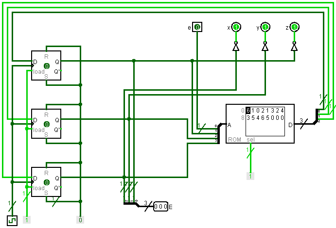
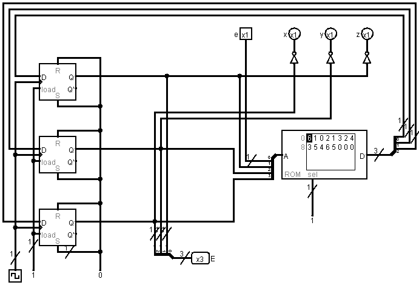

# VerilCirc - Circuitos secuenciales (histórico)

## Índice

- [20161\_PAC3\_3B](#20161_pac3_3b)
- [20171\_PAC3\_3B](#20171_pac3_3b)

 

## 20161_PAC3_3B

<blockquote>

Dado el siguiente grafo de estados:

 

Diseñad el circuito teniendo en cuenta la codificación de estados siguiente:

<table>
	<tr colspan="2">
		<th>TABLA DE ESTADOS</th>
	</tr>
	<tr>
		<th>Estado</th>
		<th>$q_1 q_0$</th>
	</tr>
	<tr>
		<td>$E0$</td>
		<td>00</td>
	</tr>
	<tr>
		<td>$E1$</td>
		<td>01</td>
	</tr>
	<tr>
		<td>$E2$</td>
		<td>10</td>
	</tr>
	<tr>
		<td>$E3$</td>
		<td>11</td>
	</tr>
</table>

Para hacer el circuito deberéis utilizar los siguientes bloques:

- 1 memoria ROM de 16*2 bits.
- 1 registro de 2 bits.
</blockquote>

	
Capturas del ejercicio resuelto

	
	

## 20171_PAC3_3B

<blockquote>

Dado el siguiente grafo de estados:

 

Se desea implementar el grafo de estados usando una memoria ROM del tamaño necesario y biestables `D`. Dibujad el circuito correspondiente.
</blockquote>

	
Capturas del ejercicio resuelto

	
	

