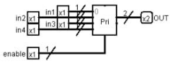
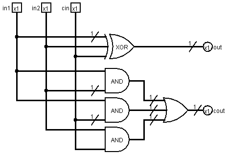
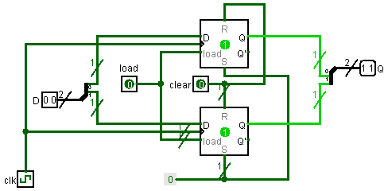
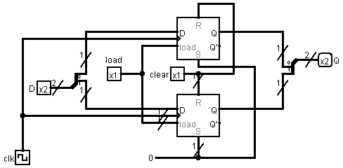

# VerilCirc - Laboratorio

## Índice

- [MUX2](#mux2)
- [DEMUX2](#demux2)
- [COD4IN](#cod4in)
- [DECOD2](#decod2)
- [SUM1](#sum1)
- [SHIFT2L](#shift2l)
- [SUBST2](#subst2)
- [CMPBIT](#cmpbit)
- [REG2B](#reg2b)

 

## MUX2

<blockquote>

Diseñad con puertas lógicas un multiplexor 2-1 (2 entradas/1 salida) con entradas de un bit `in1`, `in2` y una única salida `out` de 1 bit controlado por una señal de selección `sel`. Además, el codificador va controlado por una señal de activación `enable` que cuando es cero, la señal de salida `out` vale 0.

 

</blockquote>

	
Ejercicio resuelto

	

		
		
	

## DEMUX2

<blockquote>

Diseñad con puertas lógicas un demultiplexor 1-2 (1 entrada/2 salidas) con una entrada de un bit `in` y dos salidas `out1` y `out2` también de 1 bit controlado por una señal de selección `sel`. Además, el descodificador va controlado por una señal de activación `enable` que cuando es cero, las señales de salida valen 0.

 

</blockquote>

	
Ejercicio resuelto

	

		
		
	

## COD4IN

<blockquote>

Diseñad con puertas lógicas un codificador 4-2 (4 entradas/2 salidas) con entradas de un bit `in1`, `in2`, `in3`, `in4` y una única señal `OUT` de 2 bits. Además, el codificador va controlado por una señal de activación `enable` que cuando es cero, la señal `OUT` vale 00.

 

</blockquote>

	
Ejercicio resuelto

	

		
		
	

## DECOD2

<blockquote>

Diseñad con puertas lógicas un decodificador 1-2 (1 entrada/2 salidas) con una entrada de un bit `in` y dos salidas `out1` y `out2` también de 1 bit. Además, el descodificador va controlado por una señal de activación `enable` que cuando es cero, las señales de salida valen 0.

 

</blockquote>

	
Ejercicio resuelto

	

		
		
	

## SUM1

<blockquote>

Diseñad con puertas lógicas un sumador en complemento a 2 de 1 bit con las entradas `in1` y `in2` una salida `out`. El sumador también tiene conectados el pin de entrada de acarreo `cin` y el de salida `cout` a las señales `cin` y `cout` de un bit respectivamente.

 

</blockquote>

	
Ejercicio resuelto

	

		
		
	

## SHIFT2L

<blockquote>

Diseñad con puertas lógicas un desplazador de 2 bits a la izquierda con una entrada de 4 bits `IN` y una salida `OUT` de 4 bits.

</blockquote>

	
Ejercicio resuelto

	

		
		
	

## SUBST2

<blockquote>

Diseñad con un bloque de suma y puertas lógicas un restador en complemento a 2 de 2 bits con las entradas `A` y `B` y una salida `OUT`.

 

</blockquote>

	
Ejercicio resuelto

	

		
		
	

## CMPBIT

<blockquote>

Diseñad con puertas lógicas un comparador de un bit con entradas `A` y `B`. El nombre de las señales de salida son `greater`, `equal` y `less` para $A > B$, $A == B$ y $A < B$ respectivamente.

 

</blockquote>

	
Ejercicio resuelto

	

		
		
	

## REG2B

<blockquote>

Diseñad con dos biestables un registro de 2 bits con las entradas `D` de 2 bits, `load` y `clear` de 1 bit y la salida `Q` de 2 bits. La entrada `D` proporciona los valores de entrada al registro mientras que `Q` visualiza el resultado de salida del registro. Las señales `load` y `clear` controlan las entradas `ld` y `clr` del registro, respectivamente.

 

</blockquote>

	
Ejercicio resuelto

	

		
		
	

