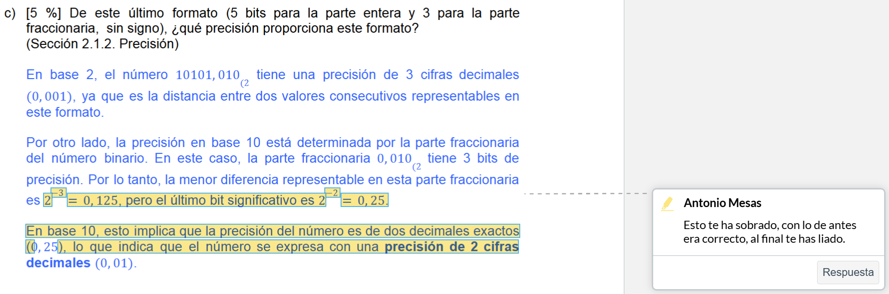
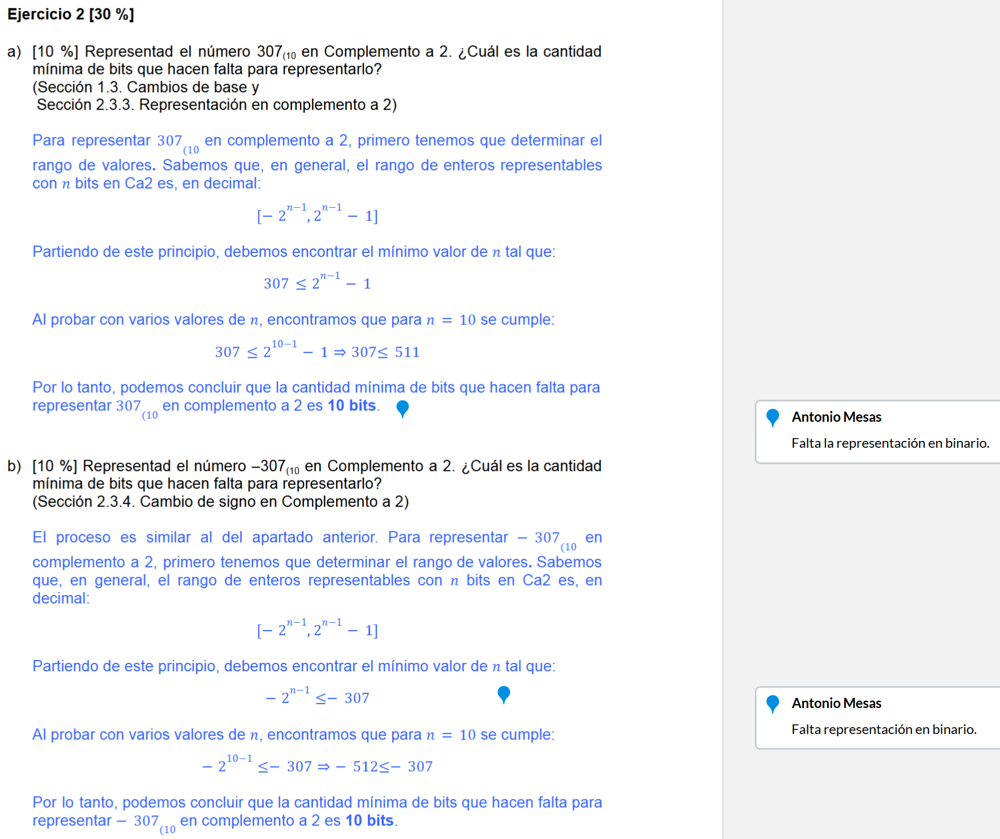
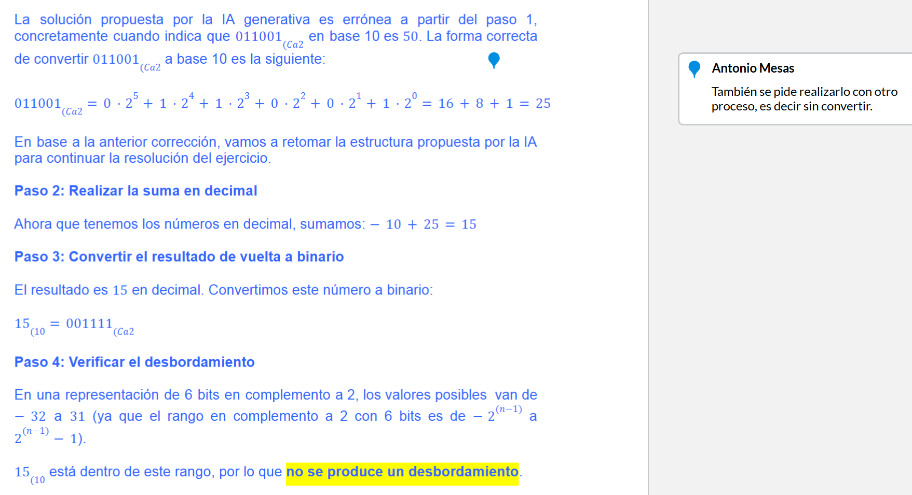
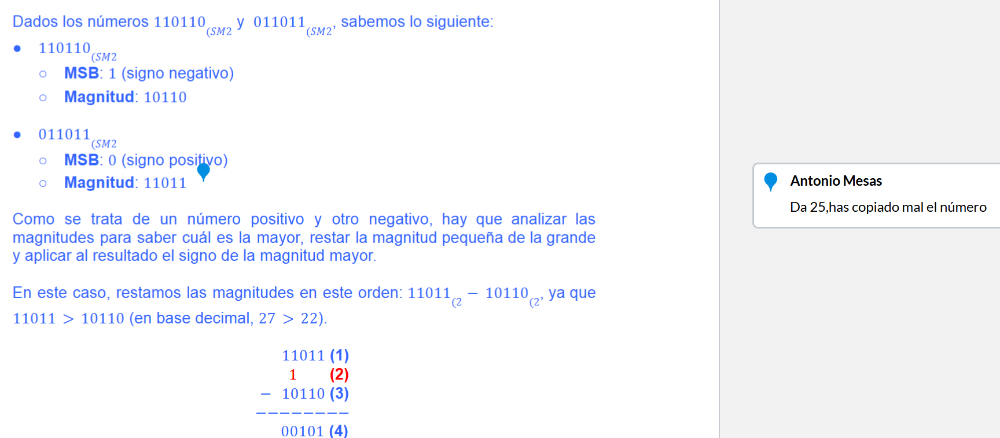
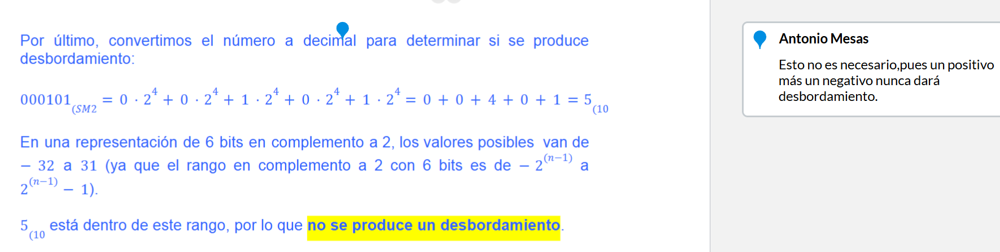
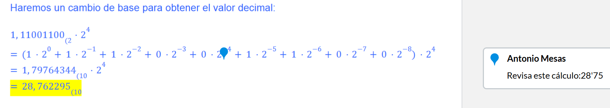
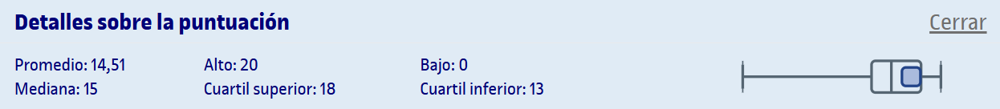

# PEC1 - ¿Estás preparado para adentrarte en el mundo de los computadores digitales?

El enunciado de la PEC está en el archivo [`enunciado.pdf`](enunciado.pdf), así como la entrega en el archivo [`entrega.pdf`](entrega.pdf) y las plantillas para realizarlo ([`plantilla.docx`](plantilla.docx) para Microsoft Word y [`plantilla.odt`](plantilla.odt) para OpenOffice).

## Recursos docentes

>[!NOTE]
>Los resúmenes de cada recurso para esta PEC se encuentran en la carpeta [`recursos`](recursos/).
>- No se incluyen los archivos `pdf` en el repositorio para evitar posibles problemas de copyright.

- [Introducción a los fundamentos de los computadores](http://cvapp.uoc.edu/autors/MostraPDFMaterialAction.do?id=163597&hash=a3d202a21bbd987bcfdbd5d776fa43055248db91bf102dc2236fe32f68d046dc) ([resumen](pec1/recursos/introduccion_a_los_fundamentos_de_los_computadores_resumen.md))
- [Representación de la información](http://cvapp.uoc.edu/autors/MostraPDFMaterialAction.do?id=215618&hash=b0ce9d7416c3a91666d084bf823e8406a4abdcc0e2787d3d1024d81137e6796f) ([resumen](pec1/recursos/representacion_de_la_informacion_resumen.md))

---

## Resultado

### Calificación

8,50 de 10,00 (grado B)

### Comentarios de retroalimentación sobre la entrega original 

>Ejercicio 1c

 

>Ejercicio 2ab

 

>Ejercicio 3a

 

>Ejercicio 3b (parte 1)

 

>Ejercicio 3b (parte 2)

 

>Ejercicio 4a

### Detalles sobre la puntuación

