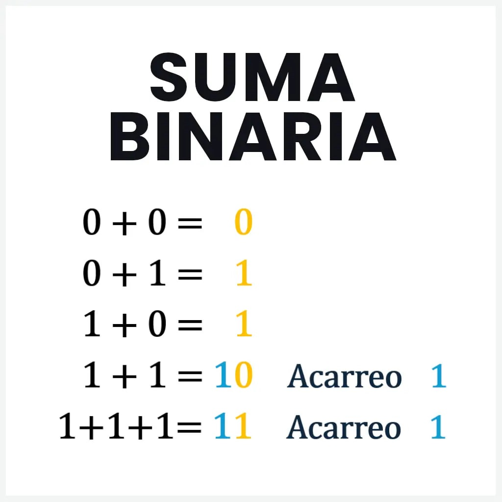
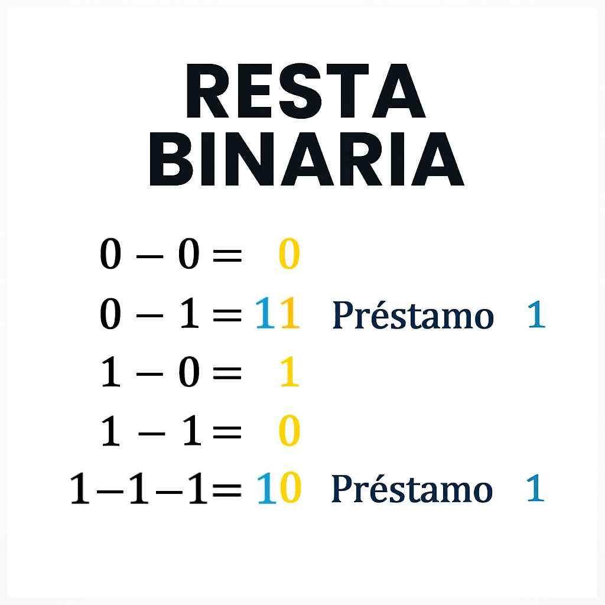
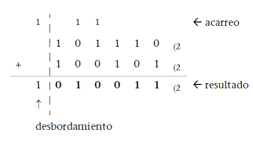
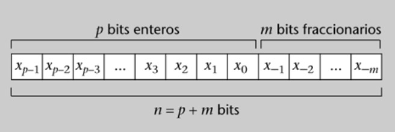
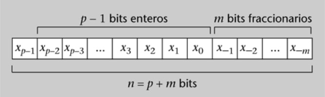
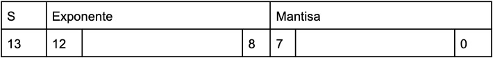

# RESUMEN Representación de la información

## Índice

>[!NOTE]
>El subapartado **2.4. Números fraccionarios** está fusionado con subapartados del apartado [2.3.], el cual en el libro recibe el nombre de **2.3. Números enteros**. Esto se debe a que el propio libro utiliza el apartado **2.4.** a modo de cajón de sastre, ya que no hay una organización clara de su contenido. Por ejemplo, en el apartado [2.3.1. Representación en signo y magnitud en base 2](#231-representación-en-signo-y-magnitud-en-base-2), se incluye también la parte fraccionaria para aglutinarlo todo en el mismo subapartado.
>Los apartados sin numeración no aparecen en el libro; son de elaboración propia.
>Los siguientes subapartados no se incluyen, ya que no aparecen ni en el examen ni son necesarios para realizar las PEC:
>- **1.5. Números con signo**
>- **1.8. Multiplicación y división por potencias de la base de numeración**
>- **3.3.1. Representación en exceso a $M$**
>- **3.3.3. Representación BCD**

- [1. Los números y los sistemas de representación](#1-los-números-y-los-sistemas-de-representación)
	- [1.1. Sistemas de representación](#11-sistemas-de-representación)
	- [1.2. Sistemas de numeración posicionales](#12-sistemas-de-numeración-posicionales)
	- [1.3. Cambios de base](#13-cambios-de-base)
		- [1.3.1. Método basado en el Teorema Fundamental de la Numeración (TFN)](#131-método-basado-en-el-teorema-fundamental-de-la-numeración-tfn)
		- [1.3.2. Método basado en el teorema de la división entera](#132-método-basado-en-el-teorema-de-la-división-entera)
		- [1.3.3. Cambio de base entre $b$ y $b^n$](#133-cambio-de-base-entre-b-y-bn)
			- [Cambio de base $b$ a base $b^n$](#cambio-de-base-b-a-base-bn)
			- [Cambio de base $b^n$ a base $b$](#cambio-de-base-bn-a-base-b)
	- [1.4. Empaquetamiento de la información](#14-empaquetamiento-de-la-información)
		- [Empaquetamiento de una cadena de bits](#empaquetamiento-de-una-cadena-de-bits)
		- [Desempaquetamiento de una cadena de bits](#desempaquetamiento-de-una-cadena-de-bits)
	- [1.6. Suma en los sistemas posicionales](#16-suma-en-los-sistemas-posicionales)
	- [1.7. Resta en los sistemas posicionales](#17-resta-en-los-sistemas-posicionales)
- [2. Representación de los números en un computador](#2-representación-de-los-números-en-un-computador)
	- [2.1. Condicionantes físicos](#21-condicionantes-físicos)
		- [2.1.1. Rango de presentación](#211-rango-de-presentación)
			- [Rango para números fraccionarios en signo y magnitud en coma fija](#rango-para-números-fraccionarios-en-signo-y-magnitud-en-coma-fija)
			- [Rango para números fraccionarios sin signo (positivos) en coma fija](#rango-para-números-fraccionarios-sin-signo-positivos-en-coma-fija)
		- [2.1.2. Precisión](#212-precisión)
		- [2.1.3. Error de representación](#213-error-de-representación)
		- [2.1.4. Aproximaciones: truncamiento y redondeo](#214-aproximaciones-truncamiento-y-redondeo)
			- [Truncamiento](#truncamiento)
			- [Redondeo](#redondeo)
		- [2.1.5. Desbordamiento](#215-desbordamiento)
			- [Comprobación de desbordamiento en la suma de dos números](#comprobación-de-desbordamiento-en-la-suma-de-dos-números)
	- [2.2. Números naturales (y fraccionarios)](#22-números-naturales-y-fraccionarios)
	- [2.3. Números enteros](#23-números-enteros)
		- [2.3.1. Representación en signo y magnitud en base 2](#231-representación-en-signo-y-magnitud-en-base-2)
			- [Signo y magnitud en coma fija](#signo-y-magnitud-en-coma-fija)
			- [Magnitud decimal de un número codificado en coma fija y signo y magnitud](#magnitud-decimal-de-un-número-codificado-en-coma-fija-y-signo-y-magnitud)
			- [Codificación de un valor decimal en coma fija y signo y magnitud](#codificación-de-un-valor-decimal-en-coma-fija-y-signo-y-magnitud)
		- [2.3.2. Suma y resta en signo y magnitud](#232-suma-y-resta-en-signo-y-magnitud)
			- [Resta en signo y magnitud](#resta-en-signo-y-magnitud)
		- [2.3.3. Representación en complemento a 2](#233-representación-en-complemento-a-2)
			- [Representación de números positivos en complemento a 2](#representación-de-números-positivos-en-complemento-a-2)
			- [Representación de números negativos en complemento a 2](#representación-de-números-negativos-en-complemento-a-2)
		- [2.3.4. Cambio de signo en complemento a 2](#234-cambio-de-signo-en-complemento-a-2)
			- [Cantidad mínima de bits necesarios para representar un número en Ca2](#cantidad-mínima-de-bits-necesarios-para-representar-un-número-en-ca2)
		- [2.3.5. Magnitud de los números en complemento a 2](#235-magnitud-de-los-números-en-complemento-a-2)
			- [Magnitud decimal de un número negativo en Ca2](#magnitud-decimal-de-un-número-negativo-en-ca2)
		- [2.3.6. Suma en complemento a 2](#236-suma-en-complemento-a-2)
		- [2.3.7. Resta en complemento a 2](#237-resta-en-complemento-a-2)
		- [2.3.8. Multiplicación (y división) por $2^k$ de números en complemento a 2](#238-multiplicación-y-división-por-2k-de-números-en-complemento-a-2)
- [3. Otros tipos de representaciones](#3-otros-tipos-de-representaciones)
	- [3.3. Otras representaciones numéricas](#33-otras-representaciones-numéricas)
		- [3.3.2. Representación en coma flotante](#332-representación-en-coma-flotante)
			- [Conversión de número binario en coma flotante a decimal](#conversión-de-número-binario-en-coma-flotante-a-decimal)
			- [Conversión de número decimal a número en coma flotante](#conversión-de-número-decimal-a-número-en-coma-flotante)
			- [Comprobar error de representación de un número en base $n$ a coma flotante](#comprobar-error-de-representación-de-un-número-en-base-n-a-coma-flotante)

<br>

## 1. Los números y los sistemas de representación

### 1.1. Sistemas de representación

Un **valor numérico** es un concepto abstracto que determina una cantidad.

Un **sistema de numeración** es una metodología que permite representar un conjunto de valores numéricos.

Un **sistema de numeración con base** describe los valores numéricos en función de una potencia de una raíz o del número raíz elegido como base (base 2, 8, 10, 16...). La raíz (o base) del sistema de numeración indica el número de dígitos diferentes disponibles. Por ejemplo, en base 2, hay dos dígitos disponibles: 0 y 1.

### 1.2. Sistemas de numeración posicionales

Sistema en el que el valor de un número depende tanto de los **dígitos** que se usan como de la **posición** de cada uno de ellos dentro del número.

Por ejemplo, la secuencia de dígitos 235 es válida en todas las bases más grandes que 5, porque el 5 no es un dígito valido en bases inferiores a 6. No obstante, en bases diferentes representa números diferentes, por lo que $235_{(6)} \neq 235_{(10)} \neq 235_{(16)}$.

**Ejemplo en distintas bases**:

**Decimal (base 10)**:
- **Número**: 276
- **Cálculo**: $2 \cdot 10^2 + 7 \cdot 10^1 + 6 \cdot 10^0 = 200 + 70 + 6 = 276$

**Binario (base 2)**:
- **Número**: 1011
- **Cálculo**: $1 \cdot 2^3 + 0 \cdot 2^2 + 1 \cdot 2^1 + 1 \cdot 2^0 = 8 + 0 + 2 + 1 = 11$

**Hexadecimal (base 16)**:
- **Número**: 1A
- **Cálculo**: $1 \cdot 16^1 + 10 \cdot 16^0 = 16 + 10 = 26$

<br>

El **Teorema Fundamental del Cálculo (TFN)** establece que todo número natural puede representarse de forma única en un sistema de numeración posicional de base $b$, donde $b > 2$, como una suma de potencias de $b$ multiplicadas por coeficientes enteros entre 0 y $b - 1$.

En forma matemática, un número $X$ representado por la secuencia de dígitos $x_{n-1} x_{n-2} \dots x_1 x_0, x_{-1} \dots x_m$ se puede expresar en función de la base de numeración de la forma:

$$X = \sum_{i=-m}^{n-1} x_i \cdot b^i = x_{n-1} \cdot b^{n-1} + x_{n-2} \cdot b^{n-2} + \dots + x_{-m} \cdot b^{-m}$$

Donde:
- $b$ es la base del sistema de numeración (por ejemplo, 10 en decimal o 2 en binario).
- $x_n$ son los dígitos del número, únicos para cada posición.
- $i$ es el mayor exponente tal que $b^ \le X$

De este teorema se desprende que, además de la secuencia de dígitos, en un sistema posicional de raíz fija hay que conocer la base de numeración para determinar el valor numérico representado.

La tabla siguiente muestra la correspondencia entre las representaciones de algunos valores:

<div align="center">
	<table>
		<tr>
			<th>BASE 2</th>
			<th>BASE 4</th>
			<th>BASE 8</th>
			<th>BASE 10</th>
			<th>BASE 16</th>
		</tr>
		<tr>
			<td>0</td>
			<td>0</td>
			<td>0</td>
			<td>0</td>
			<td>0</td>
		</tr>
		<tr>
			<td>1</td>
			<td>1</td>
			<td>1</td>
			<td>1</td>
			<td>1</td>
		</tr>
		<tr>
			<td>10</td>
			<td>2</td>
			<td>2</td>
			<td>2</td>
			<td>2</td>
		</tr>
		<tr>
			<td>11</td>
			<td>3</td>
			<td>3</td>
			<td>3</td>
			<td>3</td>
		</tr>
		<tr>
			<td>100</td>
			<td>10</td>
			<td>4</td>
			<td>4</td>
			<td>4</td>
		</tr>
		<tr>
			<td>101</td>
			<td>11</td>
			<td>5</td>
			<td>5</td>
			<td>5</td>
		</tr>
		<tr>
			<td>110</td>
			<td>12</td>
			<td>6</td>
			<td>6</td>
			<td>6</td>
		</tr>
		<tr>
			<td>111</td>
			<td>13</td>
			<td>7</td>
			<td>7</td>
			<td>7</td>
		</tr>
		<tr>
			<td>1000</td>
			<td>20</td>
			<td>10</td>
			<td>8</td>
			<td>8</td>
		</tr>
		<tr>
			<td>1001</td>
			<td>21</td>
			<td>11</td>
			<td>9</td>
			<td>9</td>
		</tr>
		<tr>
			<td>1010</td>
			<td>22</td>
			<td>12</td>
			<td>10</td>
			<td>A</td>
		</tr>
		<tr>
			<td>1011</td>
			<td>23</td>
			<td>13</td>
			<td>11</td>
			<td>B</td>
		</tr>
		<tr>
			<td>1100</td>
			<td>30</td>
			<td>14</td>
			<td>12</td>
			<td>C</td>
		</tr>
		<tr>
			<td>1101</td>
			<td>31</td>
			<td>15</td>
			<td>13</td>
			<td>D</td>
		</tr>
		<tr>
			<td>1110</td>
			<td>32</td>
			<td>16</td>
			<td>14</td>
			<td>E</td>
		</tr>
		<tr>
			<td>1111</td>
			<td>33</td>
			<td>17</td>
			<td>15</td>
			<td>F</td>
		</tr>
		<tr>
			<td>10000</td>
			<td>100</td>
			<td>20</td>
			<td>16</td>
			<td>10</td>
		</tr>
		<tr>
			<td>10001</td>
			<td>101</td>
			<td>21</td>
			<td>17</td>
			<td>11</td>
		</tr>
		<tr>
			<td>10010</td>
			<td>102</td>
			<td>22</td>
			<td>18</td>
			<td>12</td>
		</tr>
	</table>
</div>

### 1.3. Cambios de base

#### 1.3.1. Método basado en el Teorema Fundamental de la Numeración (TFN)

Para pasar a base 10 el número $101100,01_{(2)}$:

1. **Expresamos el número en función de la base (base 2)**

	$$101100,01_{(2)} = 1 \cdot 2^5 + 0 \cdot 2^4 + 1 \cdot 2^3 + 1 \cdot 1 \cdot 2^2 + 0 \cdot 2^1 + 0 \cdot 2^0 + 0 \cdot 2^{-1} + 1 \cdot 2^{-2}$$

2. **Hacemos las operaciones en base 10**

	$$1 \cdot 2^5 + 0 \cdot 2^4 + 1 \cdot 2^3 + 1 \cdot 1 \cdot 2^2 + 0 \cdot 2^1 + 0 \cdot 2^0 + 0 \cdot 2^{-1} + 1 \cdot 2^{-2} = $$
	$$1 \cdot 32 + 0 \cdot 16 + \cdot 1 \cdot 8 + \cdot 1 \cdot 4 + 0 \cdot 2 + 0 \cdot 1 + 0 \cdot 0,5 + 1 \cdot 0,25 = 44,25_{(10)}$$

El número $101100,01_{(2)}$ en base 10 es $44,25_{(10)}$.

#### 1.3.2. Método basado en el teorema de la división entera

Cambiar a base 2 el $307,25_{(10)}$:

1. **Parte entera**

	| DIVISIÓN   | COCIENTE | RESTO |
	|------------|----------|-------|
	| $307 ÷ 2$  | 153      | **1** |
	| $153 ÷ 2$  | 76       | **1** |
	| $76 ÷ 2$   | 38       | **0** |
	| $38 ÷ 2$   | 19       | **0** |
	| $19 ÷ 2$   | 9        | **1** |
	| $9 ÷ 2$    | 4        | **1** |
	| $4 ÷ 2$    | 2        | **0** |
	| $2 ÷ 2$    | 1        | **0** |
	| $1 ÷ 2$    | 0        | **1** |

	Leemos los restos de **abajo hacia arriba** para obtener $307_{(10)}$ en base 2: 

	$$100110011_{(2)}$$

2. **Parte fraccionaria**

	Sucesivamente, multiplicamos por la nueva base (base 2):

	- $0,25 \cdot 2 = 0,5 = 0,5 \to \text{parte entera: } 0$
	- $0,5 \cdot 2 = 1,0 \to \text{parte entera: } 1$

	Leemos la parte entera de las multiplicaciones de **arriba hacia abajo** para obtener $0,25_{(10)}$ en base 2:

	$$0,25_{(10)} = 0,01_{(2)}$$

El número $307,25_{(10)}$ en base 2 es el $100110011,01_{(2)}$.

#### 1.3.3. Cambio de base entre $b$ y $b^n$

Consiste en descomponer el número en **potencias de la nueva base*.

##### Cambio de base $b$ a base $b^n$

Es directo porque un dígito en base $b^n$ se corresponde con $n$ dígitos en base $b$.

Pongamos el número $307_{(10)}$ de ejemplo y tratemos de convertirlo a hexadecimal:

1. **Pasar el número decimal a base 2**

	Usamos el [método de la división entera](#132-método-basado-en-el-teorema-de-la-división-entera) por 2:
	
	| División | Cociente | Resto |
	|----------|----------|-------|
	| 307 ÷ 2  | 153      | **1** |
	| 153 ÷ 2  | 76       | **1** |
	| 76 ÷ 2   | 38       | **0** |
	| 38 ÷ 2   | 19       | **0** |
	| 19 ÷ 2   | 9        | **1** |
	| 9 ÷ 2    | 4        | **1** |
	| 4 ÷ 2    | 2        | **0** |
	| 2 ÷ 2    | 1        | **0** |
	| 1 ÷ 2    | 0        | **1** |

	El $307_{(10)}$ en base 2 es el $100110011_{(2)}$.

2. **Aplicar el método de cambio de base $b$ a base $b^n$**

	En este caso, el cambio de base $b (2)$ a base $b^n (2^4)$. Así, tenemos que agrupar los dígitos binarios de 4 en 4 y de derecha a izquierda para después transformar cada grupo de 4 bits en un dígito hexadecimal. En consecuencia:

	$$307_{(10)} = 0001 \quad 0011 \quad 0011_{(2)} = 133_{(16)}$$

##### Cambio de base $b^n$ a base $b$

Es análogo al cambio de base $b$ a base $b^n$ pero en sentido inverso: cada dígito en base $b^n$ se transforma en $n$ dígitos en base $b$.

Para cambiar a base 2 el número $7632,13_{(8)}$, tendremos en cuenta que $8 = 2^3$. Por consiguiente, cada dígito en base 8 dará lugar a tres dígitos binarios:

$$7632,13_{(8)} = 111 \quad 110 \quad 001 \quad 010 \quad , \quad 001 \quad 011 \quad (2)$$

### 1.4. Empaquetamiento de la información

Dado que los computadores procesan información codificada en 0s y 1, esto conlleva representaciones con un gran número de dígitos difíciles de manipular. Por lo tanto, para compactar dichas cadenas, se convierten en cadenas de bits en dígitos hexadecimales, lo cual recibe el nombre de **empaquetamiento hexadecimal**. El proceso inverso se denomina **desempaquetamiento**.

<br>

#### Empaquetamiento de una cadena de bits

Para empaquetar la cadena de bits 110100100011:

1. **Dividir la cadena de derecha a izquierda en grupos de 4 bits**

	$$1101 \quad 0010 \quad 0011$$

2. **Codificar cada grupo de 4 bits como un dígito hexadecimal**

	$$1101 \quad 0010 \quad 0011$$  
	$$D \quad \quad \quad 2 \quad \quad \quad 3$$

<br>

#### Desempaquetamiento de una cadena de bits

Para desempaquetar la cadena D23h, convertimos los dígitos hexadecimales a base 2 usando 4 bits para cada uno:

$$D \quad \quad \quad 2 \quad \quad \quad 3$$
$$1101 \quad 0010 \quad 0011$$

### 1.6. Suma en los sistemas posicionales



### 1.7. Resta en los sistemas posicionales



## 2. Representación de los números en un computador

### 2.1. Condicionantes físicos

Son limitaciones impuestas por el hardware que afectan a cómo y cuántos números pueden ser representados y manipulados. 

He aquí una lista de condicionantes junto a sus efectos en la representación:

<table>
	<tr>
		<th>CONDICIONANTE</th>
		<th>EFECTO EN LA REPRESENTACIÓN</th>
	</tr>
	<tr>
		<td>Número de bits disponibles</td>
		<td>Limita el rango y precisión de los valores</td>
	</tr>
	<tr>
		<td>Sistema binario</td>
		<td>Dificulta representar algunos decimales exactamente</td>
	</tr>
	<tr>
		<td>Precisión finita</td>
		<td>Genera errores de redondeo en operaciones complejas</td>
	</tr>
	<tr>
		<td>Rango limitado</td>
		<td>Riesgo de overflow o underflow</td>
	</tr>
	<tr>
		<td>Recursos físicos</td>
		<td>Afecta al rendimiento y al consumo de memoria</td>
	</tr>
</table>

#### 2.1.1. Rango de presentación

Conjunto de valores numéricos posibles que se pueden almacenar o procesar con un tipo de dato específico, dependiendo de:
- El **número de bits** asignados.
- El **tipo de representación**: entero (con/sin signo) o coma flotante.
- El **formato de codificación** (por ejemplo, complemento a 2 para enteros con signo).

Con $n$ dígitos en base $b$, disponemos de $b^n$ combinaciones de dígitos. Por ejemplo, con 5 bits podremos representar $2^5 = 32$ números. La codificación que se use determinará cuáles son estos números.

<br>

##### Rango para números fraccionarios en signo y magnitud en coma fija

$$[-2^{n-m-1} + 2^{-m}, +2^{n-m-1} - 2^{-m}]$$
Donde:
- $n$: Número de bits.
- $m$: Número de cifras fraccionarias.

<br>

##### Rango para números fraccionarios sin signo (positivos) en coma fija

$$[0,+2^[n-m] - 2^{-m}]$$

Donde:
- $n$: Número de bits.
- $m$: Número de cifras fraccionarias.

<br>

#### 2.1.2. Precisión

La precisión de un formato de representación numérica es la distancia entre dos números representables consecutivos.

La precisión de una representación de $n$ bits, donde $m$ son fraccionarios, es:

$$2^{-m}$$

Por ejemplo, dado el formato de 5 bits para la parte entera y 3 para la parte fraccionaria, sin signo, la precisión está determinada por el bit de menor peso; es decir, el bit más a la derecha en la parte fraccionaria:

$$00000,001_{(2)} = 2^{-3} = 0,125_{(10)}$$

#### 2.1.3. Error de representación

El **error de representación** $\varepsilon$ es la distancia entre el número $X$ que queremos representar y el número representable $\hat{X}$ con el que aproximamos. Es decir, $\varepsilon = \left| X - \hat{X} \right|$.

#### 2.1.4. Aproximaciones: truncamiento y redondeo

##### Truncamiento

El **truncamiento** consiste en despreciar los dígitos fraccionarios que no caben en el formato. No comporta ningún tipo de cálculo.

El **error máximo** de representación depende de la cantidad de cifras que usamos. Si truncamos a $n$ cifras decimales, el error máximo es $\varepsilon_{\text{máx}} < 10^{-n}$. Este valor es siempre **menor que la precisión** del formato.

<br>

##### Redondeo

El **redondeo** consiste en escoger el número representable más cercano al número que queremos representar. El proceso comporta cálculos.

El **error máximo** máximo de representación es igual a la mitad de la precisión del formato de representación. Si redondeamos a $n$ cifras decimales, el error máximo es $\varepsilon_{\text{máx}} = \frac{1}{2} \cdot 10^{-3} = 0.0005$

#### 2.1.5. Desbordamiento

Aparece cuando el resultado de una operación supera el rango de representación.



<br>

##### Comprobación de desbordamiento en la suma de dos números

Dados los números binarios naturales `110110` y `011001` de 6 bits:

1. **Realizar la suma**

	```
	 11       (acarreo)
	  110110
	+ 011001
	--------
	 1001111
	```

2. **Analizar si hay desbordamiento**

	Hay desbordamiento, ya que hay acarreo en el bit de más peso y el resultado excede 6 bits.

### 2.2. Números naturales (y fraccionarios)

Números sin parte fraccionaria y sin signo (incluido el 0). 

Características de su representación:

- Se representan en binario.
- Su precisión es 1 (no hay bits fraccionarios).
- El rango depende del número de bits disponibles en el formato $[0, 2^n - 1]$.

El rango de representación de un número natural está limitado por el número de bits utilizados para almacenarlo. Sin embargo, se puede **extender** cuando el formato de origen de $n$ bits es mayor que el formato de destino de $m$ bits ($m > n$), añadiendo a la izquierda de la codificación los ceros necesarios hasta completar los $m$ bits del nuevo formato.

Por ejemplo, $10_{(10)}$ en un formato de 5 bits es $01010_{(2)}$. Su extensión a un formato de 8 bits se codifica como $00001010_{(2)}$.

<br>

**Representación binaria de coma fija**



### 2.3. Números enteros

#### 2.3.1. Representación en signo y magnitud en base 2

Se usa la notación $X_{(SM2)}$ para identificar un número codificado en signo y magnitud en base 2.

Vamos a tomar el número $-307_{(10)}$ para realizar el procedimiento de representación. Se siguen estos paso:

1. **Representar el número decimal en binario**

	| División | Cociente | Resto |
	|----------|----------|-------|
	| 307 ÷ 2  | 153      | **1** |
	| 153 ÷ 2  | 76       | **1** |
	| 76 ÷ 2   | 38       | **0** |
	| 38 ÷ 2   | 19       | **0** |
	| 19 ÷ 2   | 9        | **1** |
	| 9 ÷ 2    | 4        | **1** |
	| 4 ÷ 2    | 2        | **0** |
	| 2 ÷ 2    | 1        | **0** |
	| 1 ÷ 2    | 0        | **1** |

	Leyendo los restos de abajo hacia arriba:

	$$307_{(10)} = 100110011_{(2)}$$

2. **Agregar el bit del signo**

	En signo y magnitud, el bit más significativo (MSB) indica el signo:

	- $0$ para positivos.
	- $1$ para negativos.

	Para representar $-307$, simplemente agregamos un $1$ como bit de signo:

	$$-307_{(10)} = 1100110011_{(SM2)}$$

<br>

##### Signo y magnitud en coma fija



$x_{p-1}$ es el bit de signo y el resto de los bits codifican la magnitud.

<br>

##### Magnitud decimal de un número codificado en coma fija y signo y magnitud

Para encontrar la magnitud decimal que representa la codificación `10010010` que está en un formato de 8 bits, 4 de los cuales son fraccionarios y en signo y magnitud:

1. **Separar el bit de signo (MSB) de la magnitud**
	`10010010 → 0010010`
2. **Aplicar el TFN a la magnitud para hallar el valor decimal**
	$0 \cdot 2^2 + 0 \cdot 2^1 + 1 \cdot 2^0 + 0 \cdot 2^{-1} + 0 \cdot 2^{-2} + 1 \cdot 2^{-3} + 0 \cdot 2^{-4} = 1 + 0,125 = 1,125_{(10)}$

<br>

##### Codificación de un valor decimal en coma fija y signo y magnitud

Para codificar el número $-14,67_{(10)}$ en un formato de coma fija de 8 bits donde 3 son fraccionarios  y signo y magnitud:

1. **Codificar en base 2 la parte entera ($14,75_{(10)}$) en 4 bits (de los 8 bits, 3 son fraccionarios y 1 codifica el signo) con el método del teorema de la división entera**
	<table>
		<tr>
			<th>DIVISIÓN</th>
			<th>COCIENTE</th>
			<th>RESTO</th>
		</tr>
		<tr>
			<td>$14 \div 2$</td>
			<td>$7$</td>
			<td>$0$</td>
		</tr>
		<tr>
			<td>$7 \div 2$</td>
			<td>$3$</td>
			<td>$1$</td>
		</tr>
		<tr>
			<td>$3 \div 2$</td>
			<td>$1$</td>
			<td>$1$</td>
		</tr>
		<tr>
			<td>$2 \div 2$</td>
			<td>$1$</td>
			<td>$0$</td>
		</tr>
	</table>

	$14_{(10)} = 1110_{(2)}$

2. **Codificar en binario la parte fraccionaria en 3 bits**
	Sucesivamente, multiplicamos por la nueva base (base 2):
	- $0,75 \cdot 2 = 0,5 = 1,5 \to \text{parte entera: } 1$
	- $0,5 \cdot 2 = 1,0 \to \text{parte entera: } 1$

	Leemos la parte entera de las multiplicaciones de **arriba hacia abajo** para obtener $0,75_{(10)}$ en base 2:

	$$0,75_{(10)} = 0,110_{(2)}$$

3. **Unir la parte entera y fraccionario en el formato de 7 bits, 3 de los cuales son fraccionarios**
	$14,75_{(10)} = 1110,110_{(2)}$

4. **Añadir el bit de signo a la magnitud**
	El bit de signo es 1, ya que el número es negativo. Por lo tanto, la representación de $-14,75_{(10)}$ en el formato dado es:

	$$-14,75_{(10)} = 11110,110_{(SM2)}$$

>[!IMPORTANT]
>La coma no se almacena, sino que una vez se especifica el formato, se conoce su posición. Un computador almacenaría el código `11110110`.

Si la parte fraccionaria excede el número de bits fraccionarios disponibles en el formato, se aplica:
- **Truncamiento**: Desprecia los bits que no caben. Por ejemplo, el $1000,1111001_{(2)}$ se aproximará por el $1000,111_{(2)}$. Con el bit de signo, la codificación final es $01000111_{(\text{SM})}$.

	El error de representación es:

	$|1000,1111001_{(2)} - 1000,111_{(2)}| = 0,0001001_{(2)} = 0,0703125_{(10)}$
- **Por redondeo**: Sumar la mitad de la precisión para asegurarnos de que los valores menores a la mitad redondeen hacia abajo, y los mayores que la mitad redondeen hacia arriba:
	$1000,1111001_{(2)} + 0,0001_{(2)} = 1001,0000001_{(2)}$

	Truncamos a 3 bits fraccionarios, de forma que el $1000,1111001_{(2)}$ se aproxime al $1001,000_{(2)}$. 
	
	Añadimos el bit de signo, por lo que la codificación final es $01001000_{\text{SM}}$.

	El error de representación es menor que el del truncamiento:

	$|1000,1111001_{(2)} - 1001,000_{(2)}| = 0,0000111_{(2)} = 0,0546875_{(10)}$

#### 2.3.2. Suma y resta en signo y magnitud

**Suma en signo y magnitud**

Reglas básicas:
1. **Mismo signo**: se suman las magnitudes y se conserva el signo.
2. **Distinto signo**: se resta la menor magnitud de la mayor. El signo del resultado es el del número con mayor magnitud.

**Ejemplo**: `+5 + (+3)`
- +5 = `0101`
- +3 = `001`
- Resultado: +8 $\to$ `1000`

**Ejemplo**: `+5 + (-3)`
- +5 = `0101`
- -3 = `1001`
- Como son de signo distinto, restamos las magnitudes: `5 - 3 = 2`. El signo del resultado es el del número con mayor magnitud (+5), por lo que es **positivo**.
- Resultado: +2 $\to$ `0010`

**Ejemplo**: `-5 + (+3)`
- -5 = `1101`
- +3 = `0001`
- Como son de signo distinto, restamos las magnitudes: `5 - 3 = 2`. El signo del resultado es el del número con mayor magnitud (-5), por lo que es **negativo**.
- Resultado: -2 $\to$ `1010`

<br>

##### Resta en signo y magnitud

La **resta A - B** se convierte en **A + (-B)**. Solo cambia el signo del segundo número y luego se aplican las reglas básicas de la suma.

**Ejemplo**: `+5 - (+3)`
- Cambiamos a: `+5 + ((+)(-)3)` = `+5 + (-3)` (ya resuelto arriba) = `+2 → 0010`

**Ejemplo**: `-5 - (-3)`
- Cambiamos a: `-5 + ((-)(-)3)` = `-5 + (+3)` (ya resuelto arriba) = `-2 → 1010`

#### 2.3.3. Representación en complemento a 2

Abreviado habitualmente por **Ca2** o **C2**, es un sistema de representación de números enteros con signo en sistemas binarios. Es preferido ante el sistema de signo y magnitud, ya que permite representar tanto números positivos como negativos en un sistema sin necesidad de un bit de signo separado.

<br>

##### Representación de números positivos en complemento a 2

Los números positivos en complemento a 2 se representan **igual que en binario puro**.

Por ejemplo, en un sistema de **8 bits**:

- $5_{(10)} = 00000101_{(2)}$
- $18_{(10)} = 00010010_{(2)}$

El bit más significativo (MSB, **Most Significant Bit**) es el primer **0**, lo que indica que el número es positivo.

<br>

##### Representación de números negativos en complemento a 2

Los números negativos en complemento a 2 se obtiene aplicando el método del complemento a 2, que consiste en:

1. **Escribir el valor absoluto en binario**.
2. **Invertir todos los bits** (complemento a 1).
3. **Sumar 1** al resultado para corregir el problema del complemento a 1.

**Ejemplo**: Representación de $-5_{(10)}$ en **8 bits**:

1. $5_{(10)} = 00000101_{(2)}$
2. Invertimos los bits: $11111010_{(2)}$ (complemento a 1).
3. Sumamos 1: $11111010_{(2)} + 1_{(2)} = 11111011_{(Ca2)}$

Por lo tanto, $-5_{(10)} = 11111011_{(Ca2)}$.

<br>

Para determinar la cantidad mínima de bits necesaria para representar un número, tenemos que seguir estos pasos. Vamos a tomar $307_{(10)}$ como ejemplo:

1. **Determinar el rango de valores en complemento a 2**

	Sabemos que, en general, el rango de enteros representables con $n$ bits en Ca2 es, en decimal:

	$$[-2^{n-1}, 2^{n-1}-1]$$

	Debemos encontrar el mínimo $n$ tal que:

	$$307 \le 2^{n-1} - 1$$

2. **Encontrar el mínimo $n$ para representar el número decimal**

	Al probar con varios valores de $n$ para cumplir lo estipulado en el paso anterior, encontramos que para $n = 10$ se cumple:

	$$307 \le 2^{10 - 1} - 1 \rightarrow 307 \le 511$$
	
Por lo tanto, podemos concluir que la cantidad mínima de bits que hacen falta para representar $307_{(10)}$ en complemento a 2 es **10**.

#### 2.3.4. Cambio de signo en complemento a 2

Esta técnica se utiliza para representar y operar con números negativos en sistemas binarios.

Pasos a seguir partiendo del número decimal `+5`, cuya representación en complemento a 2 con 8 bits es `00000101`:

1. **Invertir todos los bits del número** (convertirlo en complemento a 1)
	- `00000101 → 11111010`

2. **Sumar 1 al resultado del paso anterior**
	- `11111010 + 1 = 11111011`

`11111011` es `-5` en complemento a 2 con 8 bits.

<br>

##### Cantidad mínima de bits necesarios para representar un número en Ca2

Por ejemplo, si partimos del número $307_{(10)}$:

1. **Convertir el número a binario**

	Utilizamos el método de la división entera por 2:

	<table>
		<tr>
			<th>DIVISIÓN</th>
			<th>COCIENTE</th>
			<th>RESTO</th>
		</tr>
		<tr>
			<td>$307 \div 2$</td>
			<td>$153$</td>
			<td>$1$</td>
		</tr>
		<tr>
			<td>$153 \div 2$</td>
			<td>$76$</td>
			<td>$1$</td>
		</tr>
		<tr>
			<td>$76 \div 2$</td>
			<td>$38$</td>
			<td>$0$</td>
		</tr>
		<tr>
			<td>$38 \div 2$</td>
			<td>$19$</td>
			<td>$0$</td>
		</tr>
		<tr>
			<td>$19 \div 2$</td>
			<td>$9$</td>
			<td>$1$</td>
		</tr>
		<tr>
			<td>$9 \div 2$</td>
			<td>$4$</td>
			<td>$1$</td>
		</tr>
		<tr>
			<td>$4 \div 2$</td>
			<td>$2$</td>
			<td>$0$</td>
		</tr>
		<tr>
			<td>$2 \div 2$</td>
			<td>$1$</td>
			<td>$0$</td>
		</tr>
		<tr>
			<td>$1 \div 2$</td>
			<td>$0$</td>
			<td>$1$</td>
		</tr>
	</table>

	$307_{(10)} = 100110011_{(2)}$

2. **Interpretar el resultado**

	$307_{(10)}$ en binario es $100110011_{(2)}$. Como el $307_{(10)}$ es positivo, la representación en Ca2 es $0100110011_{(Ca2)}$.

	El número mínimo de bits necesario para representarlo es **10 bits**.

3. **Comprobar el número de bits**

	Si tenemos en cuenta que el rango de representación en Ca2 con $n$ bits es desde $-2^{n-1}$ hasta $2^{n-1} - 1$:

	$$[-2^{n-1},-2^{n-1},-1] = [-2^{10-1},2^{10-1}-1] = [-512,511]$$

	Con 9 bits no sería suficiente, ya que $[-2^{9-1},2^{9-1}-1] = [-256,255]$ y $307_{(10)}$ no se encuentra dentro de este rango.

#### 2.3.5. Magnitud de los números en complemento a 2

**Magnitud decimal de un número positivo en Ca2**

Se puede conocer aplicando el TFN, al igual que en signo y magnitud:

$$0101_{(2)} = 0 \cdot 2^3 + 1 \cdot 2^2 + 0 \cdot 2^1 + 1 \cdot 2^0 = +5_{(10)}$$

<br>

##### Magnitud decimal de un número negativo en Ca2

Hay dos métodos, pero el único que se explica es el más directo. El otro método consiste en aplicar un cambio de signo a la representación en Ca2 del valor negativo y encontrar la magnitud positiva.

1. **Aplicar el TFN considerando que el bit de mayor peso es negativo**

	$10001010_{(Ca2)} = -1 \cdot 2^7 + 0 \cdot 2^6 + 0 \cdot 2^5 + 0 \cdot 2^4 + 1 \cdot 2^3 + 0 \cdot 2^2 + 1 \cdot 2^1 + 0 \cdot 2^0 =$  
	$= -128 + 10 = -118_{(10)}$

#### 2.3.6. Suma en complemento a 2

Sigue las mismas reglas que la suma binaria convencional, pero con consideraciones especiales para el desbordamiento (_overflow_).

Hay **desbordamiento** en la suma de dos números positivos codificados en Ca2 cuando el resultado es negativo.

Pasos a seguir a partir de la suma de los números $-10_{(10)}$ y $25_{(10)}$:

1. **Convertir los números a binario en complemento a 2 con la misma cantidad de bits.**
	- $-10_{(10)} = 110110_{(Ca2)}$ 
	- $25_{(10)} = 011001_{(Ca2)}$

2. **Sumar los números bit a bit, incluyendo el MSB (el bit de signo).**
	```
	 11      (acarreo)
	  110110
	+ 011001
	--------
	  001111
	```

	$001111_{(Ca2)} = 15$

3. **Ignorar el acarreo final si la suma tiene más bits que la representación original.**

	El resultado de la suma es $001111_{(Ca2)}$, pero como estamos trabajando con **6 bits**, debemos desechar el bit de acarreo adicional (el bit más a la izquierda).

4. **Verificar desbordamiento (_overflow_)**

	Debemos determinar el rango de números en 6 bits en complemento a 2. Los números representables, en este caso, tienen un rango de $[-32, 31]$

	En este caso, **no hay desbordamiento, ya que $15_{(10)}$ se encuentra dentro del rango de los números representables en 6 bits.

#### 2.3.7. Resta en complemento a 2

Se realiza transformando la operación de resta en una suma. Se utiliza el complemento a 2 del sustraendo (el número que se va a restar).

Pasos a seguir a partir de la resta de los números $7_{(10)}$ y resta $3_{(10)}$ (usando 4 bits):

1. **Representar los números en binario (4 bits)**
	- `7 = 0111`
	- `3 = 0011`

2. **Obtener el complemento a 2 de `3` (para restarlo)**
	- `0011` $\to$ invertimos bits: `1100`
	- Sumamos 1: `1100 + 1 = 1101` $\to$ esto es `-3` en complemento a 2.

3. **Realizar la suma** (`7 + (-3)`)
	```
	 1111     (acarreo)
	  0111
	+ 1101
	--------
	 10100
	```
	
	Este resultado es de 5 bits, pero trabajamos solo con 4 bits, así que descartamos el acarreo (el bit más a la izquierda). Por lo tanto, el resultado es `0100 → 4`.

#### 2.3.8. Multiplicación (y división) por $2^k$ de números en complemento a 2

**Multiplicación**

El resultado de multiplicar por $2^k$ un número en Ca2 se consigue añadiendo $k$ ceros a la derecha, lo cual se traduce en desplazar a la izquierda $k$ bits.

**Ejemplos**:

$+5_{(10)} \cdot 2_{(10)}^1 = 10_{(10)}$ (usando 8 bits)
- `+5` en complemento a 2 (8 bits): `00000101`
- Desplazar 1 bit a la izquierda (añadir 1 bit a la derecha): `00000101 << 1 = 00001010`

$-3_{(10)} \cdot 2_{(10)}^2 = -12_{(10)}$ (usando 8 bits)
- `-3` en complemento a 2 (8 bits): 
  - `3` = `00000011`
  - Invertir: `11111100`
  - Sumar 1: `11111101 → -3`
- Desplazar 2 bits a la izquierda (añadir 2 bits a la derecha): `11111101 << 2 = 11110100`

Se produce **desbordamiento** al multiplicar un número en Ca2 por $2^k$ cuando cambia el bit de signo o si se pierde uno o más bits significativos.

Por ejemplo, si hacemos $100_{(10)} \cdot 2_{(10)}^3 = 800$:
- `100` en binario: `01100100`
- Desplazamos 3 bits a la izquierda (añadimos 3 bits a la derecha): `00100000` $\to$ El resultado ya no es correcto.

Por lo tanto, tenemos que asegurarnos de que el número resultante cabe en el número de bits disponible.

<br>

**División**

El resultado de dividir por $2^k$ un número en Ca2 se consigue añadiendo $k$ ceros a la izquierda, lo cual se traduce en desplazar a la derecha $k$ bits.

**Ejemplos**:

$+8_{(10)} \div 2_{(10)}^1 = 8_{(10)}$ (usando 8 bits)
- `+8` en complemento a 2 (8 bits): `00001000`
- Desplazar 1 bit a la derecha (añadir 1 bit a la izquierda): `00001000 >> 1 = 00000100`

Se produce **desbordamiento** al dividir un número en Ca2 por $2^k$ cuando cambia el bit de signo o si se pierde uno o más bits significativos.

Por ejemplo, si hacemos $-3_{(10)} \div 2_{(10)}^2 = -12_{(10)}$ (usando 8 bits)
- `-3` en complemento a 2 (8 bits): 
  - `3` = `00000011`
  - Invertir: `11111100`
  - Sumar 1: `11111101 → -3`
- Desplazar 2 bits a la derecha (añadir 2 bits a la izquierda): `11111101 >> 2 = 00111111` $\to$ El resultado ya no es correcto.

Al igual que con la multiplicación, tenemos que asegurarnos de que el número resultante cabe en el número de bits disponible.

## 3. Otros tipos de representaciones

### 3.3. Otras representaciones numéricas

#### 3.3.2. Representación en coma flotante

Es una forma de almacenar números reales con parte decimal en computadores que permite representar una amplia gama de valores (muy grandes o muy pequeños) usando un formato normalizado.

Se basa en la notación científica y toman esta forma:

$$\pm \text{R} \cdot b^{e}$$

Donde:

- $\pm$: 0 = positivo, 1 = negativo.
- Mantisa ($R$): Parte decimal del número en coma flotante.
- $b$: Base de la numeración. Por ejemplo, si es en binario, es 2.
- $e$: Número entero que indica el número de posiciones a la derecha (exponente positivo) o a la izquierda (exponente negativo) que tenemos que desplazar la coma fraccionaria de la mantisa para obtener el valor numérico representado.

<br>

##### Conversión de número binario en coma flotante a decimal

Dada la secuencia de bits `01010011001100` y el siguiente formato de coma flotante:



Donde:

- El bit de signo $S$ vale 0 para los números positivos, y 1 para los negativos.
- Método de aproximación por truncamiento.
- El exponente se codifica en exceso a 16.
- La mantisa está normalizada de la forma $1,M$ y con bit implícito.

Pasos para realizar la conversión:

1. **Identificar el bit del signo**
	El primer bit de la cadena de bits indica el signo $\to$ `0 = positivo`.

2. **Identificar la mantisa**
	Ocupa las 8 posiciones menos significativas de la cadena de bits $\to$ `11001100`. El formato indica que hay un bit implícito y que la mantisa está normalizada de la forma $1,M$, por lo que el número representado por la mantisa es `1,11001100`.

3. **Identificar el exponente**
	Está representado por 5 bits  y está codificado con exceso a 16. Esto implica que el valor del exponente se conseguirá a partir del resto entre el número codificado con exceso y este exceso. En este supuesto, el exponente es $10100 = 1 \cdot 2^4 + 0 \cdot 2^3 + 1 \cdot 2^2 + 0 \cdot 2^1 + 0 \cdot 2^0 = 20_{(10)}$.

	Como hay una codificación con exceso a 16, el exponente será igual a $20_{(10)} - 16_{(10)} = 4_{(10)}$.

4. **Unir el signo, el exponente y la mantisa para obtener el número representado**
	$1,11001100_{(2)} \cdot 2^4$

5. **Realizar cambio de base para obtener el valor decimal**
	$1,11001100_{(2)} \cdot 2^4 = (1 \cdot 2^0 + 1 \cdot 2^{-1} + 1 \cdot 2^{-2} + 0 \cdot 2^{-3}+ 0 \cdot 2^{-4}+ 1 \cdot 2^{-5} + 1 \cdot 2^{-6} + 0 \cdot 2^{-7} + 0 \cdot 2^{-8}) \cdot 2^4$  
	$= 1,7976344_{(10)} \cdot 2^4$  
	$= 28,762295_{(10)}$

<br>

##### Conversión de número decimal a número en coma flotante

Vamos a partir del formato detallado más arriba y del número $42,625_{(10)}$:

1. **Convertir la parte entera del número en base 10 a base 2**

	<table>
		<tr>
			<th>DIVISIÓN</th>
			<th>COCIENTE</th>
			<th>RESTO</th>
		</tr>
		<tr>
			<td>$42 \div 2$</td>
			<td>$21$</td>
			<td>$0$</td>
		</tr>
		<tr>
			<td>$21 \div 2$</td>
			<td>$10$</td>
			<td>$1$</td>
		</tr>
		<tr>
			<td>$10 \div 2$</td>
			<td>$5$</td>
			<td>$0$</td>
		</tr>
		<tr>
			<td>$5 \div 2$</td>
			<td>$2$</td>
			<td>$1$</td>
		</tr>
		<tr>
			<td>$2 \div 2$</td>
			<td>$1$</td>
			<td>$0$</td>
		</tr>
		<tr>
			<td>$1 \div 2$</td>
			<td>$0$</td>
			<td>$1$</td>
		</tr>
	</table>

	$42_{(10)}$ en base 2 es $101010_{(2)}$.

2. **Convertir la parte decimal del número en base 10 a base 2**
	- $0,625 \cdot 2 = 1,25$ (parte entera $\to$ 1)
	- $0,25 \cdot 2 = 0,5$ (parte entera $\to$ 0)
	- $0,5 \cdot 2 = 1,0$ (parte entera $\to$ 1)

	Leemos la parte entera de arriba hacia abajo para obtener la parte decimal en base 2, la cual es $101_{(2)}$

3. **Unir la parte entera con la parte decimal**
	$42,625_{(10)}$ en base 2 es $101010,101_{(2)}$.

4. **Normalizar el número en base 2 en la forma $1,M \cdot 2^e$**
	$101010,101_{(2)} = 1,01010101_{(2)} \cdot 2^5$

	Donde:
	- $e = 5$, ya que tenemos que mover la coma decimal 5 lugares a la izquierda hasta que la parte entera sea 1.
	- $M = 01010101$ representa la mantisa sin bit implícito.

5. **Codificar el exponente en exceso**
	En este caso, el exceso es a 16, por lo que hacemos lo siguiente:

	$e_{\text{codificado}} e_{\text{real}} + 16_{(10)} = 5_{(10)} + 16_{(10)} = 21_{(10)}$  
	$21_{(10)} = 10101_{(2)}$

6. **Determinar el bit del signo**
	Como $42,625_{(10)}$ es positivo, el bit de signo es 0.

7. **Unir el signo, el exponente y la mantisa para obtener el número en base 2**
	- **Bit de signo (bit 13)**: `0`
	- **Exponente (bits 12 a 8)**: `10101`
	- **Mantisa (bits 7 a 0)**: `01010101` (truncada a 8 bits).

	Como resultado, obtenemos que el número $42,625_{(10)}$ en coma flotante con el formato determinado anteriormente es $01010101010101_{(2)}$.

<br>

##### Comprobar error de representación de un número en base $n$ a coma flotante

Para comprobarlo, vamos a partir del anterior proceso (número en base 10 a coma flotante):

1. **Convertir mantisa a número en base $n$**
	En este caso, la pasamos a decimal:

	$1,01010101_{(2)} = 1 \cdot 2^0 + 0 \cdot 2^{-1} + 1 \cdot 2^{-2} + 0 \cdot 2^{-3} + 1 \cdot 2^{-4}+ 0 \cdot 2^{-5} + 1 \cdot 2^{-6} + 0 \cdot 2^{-7} + 1 \cdot 2^{-8}$  
	$1 + 0 + 0,25 + 0 + 0,0625 + 0 + 0.015625 + 0 + 0,00390625$  
	$= 1,33203125_{(10)}$

2. **Multiplicar la mantisa por la base con el exponente**
	$1,33203125 \cdot 2^5 = 42,625_{(10)}$

3. **Comparar resultados**
	El número original era $42,625_{(10)}$ y el número representado también es $42,625_{(10)}$. Por lo tanto, no se ha producido ningún error en la representación del número.