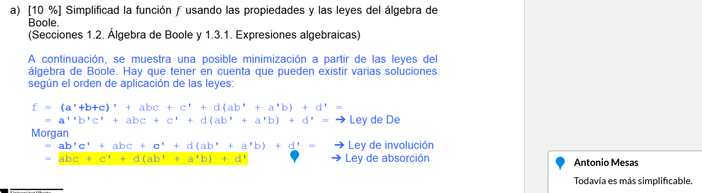
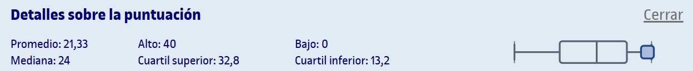

# PEC2 - Diseñando circuitos combinacionales

El enunciado de la PEC está en el archivo [`enunciado.pdf`](enunciado.pdf), así como la entrega en el archivo [`entrega.pdf`](entrega.pdf) y las plantillas para realizarlo ([`plantilla.docx`](plantilla.docx) para Microsoft Word y [`plantilla.odt`](plantilla.odt) para OpenOffice).

## Recursos de aprendizaje

>[!NOTE]
>- No se incluyen los archivos `pdf` en el repositorio para evitar posibles problemas de copyright.

- [**Los circuitos lógicos combinacionales**](http://cvapp.uoc.edu/autors/MostraPDFMaterialAction.do?id=215620&hash=dcd88579656e2413ea29712f929c6a1bb3fea6655c0dc503f4246beef6e558a2) ([resumen](recursos/README.md))

---

## Resultado

### Calificación

- **Calificación original**: 38,80 / 40,00
- **Calificación sobre 10**: 9,70 / 10,00
- **Letra (escala internacional)**: A

### Comentarios de retroalimentación sobre la entrega original 

>Ejercicio 1a

### Detalles sobre la puntuación

