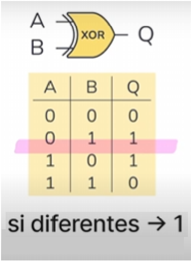
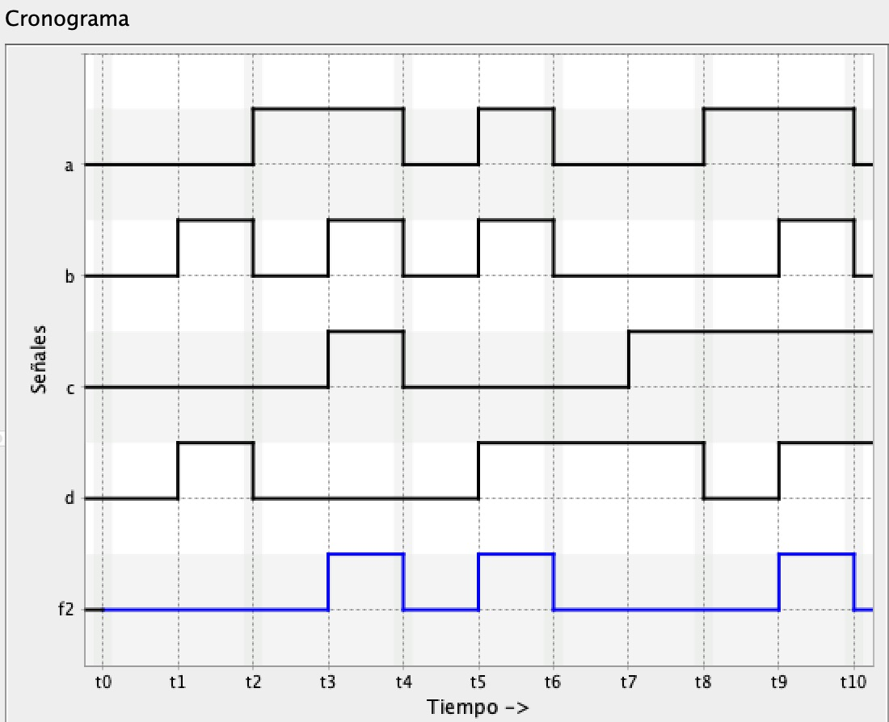
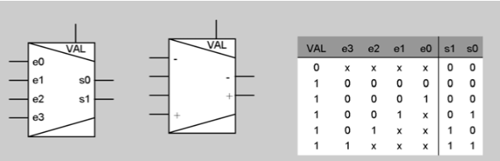

# RESUMEN Los circuitos lógicos combinacionales

## Índice

>[!NOTE]
>Los siguientes apartados han sufrido algún cambio respecto a su versión del libro:
>- El apartado **1.3.3. Correspondencia entre expresiones algebraicas y tablas de verdad** ha sido renombrado a **Obtención de tabla de verdad a partir de una expresión algebraica** con tal de desambiguar su contenido.
>- **1.4. Otras funciones comunes**: Se ha integrado en el apartado [1.1. Circuitos, señales y funciones lógicas](#1-fundamentos-de-la-electrónica-digital)
>- Se ha eliminado el apartado **3.8. Unidad aritmética y lógica (UAL)**, ya que no es relevante para la entrega de la PEC.

- [1. Fundamentos de la electrónica digital](#1-fundamentos-de-la-electrónica-digital)
	- [1.1. Circuitos, señales y funciones lógicas](#11-circuitos-señales-y-funciones-lógicas)
	- [1.2. Álgebra de Boole](#12-álgebra-de-boole)
	- [1.3. Representación de funciones lógicas](#13-representación-de-funciones-lógicas)
		- [1.3.1. Expresiones algebraicas](#131-expresiones-algebraicas)
		- [1.3.2. Tablas de verdad](#132-tablas-de-verdad)
		- [1.3.3. Obtención de tabla de verdad a partir de una expresión algebraica](#133-obtención-de-tabla-de-verdad-a-partir-de-una-expresión-algebraica)
		- [1.3.4. Expresiones en suma de mintérminos](#134-expresiones-en-suma-de-mintérminos)
	- [1.5. Funciones especificadas de manera incompleta](#15-funciones-especificadas-de-manera-incompleta)
- [2. Implementación de circuitos lógicos combinacionales](#2-implementación-de-circuitos-lógicos-combinacionales)
	- [2.1. Puertas lógicas. Síntesis y análisis](#21-puertas-lógicas-síntesis-y-análisis)
	- [2.2. Diseño de circuitos a dos niveles](#22-diseño-de-circuitos-a-dos-niveles)
		- [2.2.1. Retardos. Cronogramas. Niveles de puertas](#221-retardos-cronogramas-niveles-de-puertas)
		- [2.2.2. Síntesis a dos niveles](#222-síntesis-a-dos-niveles)
	- [2.3. Minimización de funciones](#23-minimización-de-funciones)
		- [2.3.1. Simplificación de expresiones](#231-simplificación-de-expresiones)
		- [2.3.2. Síntesis mínima a dos niveles. Método de Karnaugh](#232-síntesis-mínima-a-dos-niveles-método-de-karnaugh)
		- [2.3.3. Minimización de funciones especificadas incompletamente](#233-minimización-de-funciones-especificadas-incompletamente)
- [3. Bloques combinacionales](#3-bloques-combinacionales)
	- [3.1. Multiplexor. Multiplexor de buses. Demultiplexor](#31-multiplexor-multiplexor-de-buses-demultiplexor)
	- [3.2. Codificadores y descodificadores](#32-codificadores-y-descodificadores)
	- [3.3. Desplazadores lógicos y aritméticos](#33-desplazadores-lógicos-y-aritméticos)
	- [3.4. Bloques AND, OR y NOT](#34-bloques-and-or-y-not)
	- [3.5. Memoria ROM](#35-memoria-rom)
	- [3.6. Comparador](#36-comparador)
	- [3.7. Sumador](#37-sumador)

 

## 1. Fundamentos de la electrónica digital

### 1.1. Circuitos, señales y funciones lógicas

**Circuito**: Sistema formado por señales de entrada (cada una asociada a un cable) y dispositivos electrónicos que manipulan estas señales y generan señales de salida, las cuales pueden considerarse **funciones** de las de la entrada. Esto implica que los dispositivos electrónicos procesan las señales mediante un cálculo computacional.

**Características de un circuito combinacional**:
- Es **determinista**: para una entrada determinada, la salida siempre es la misma.
- La salida solo depende de la entrada actual.
- No tiene memoria (no depende de estados anteriores).
- **Ejemplo**: Calculadora.

**Especificación funcional**:
- Determina la salida que se obtiene para cada una de las entradas, con sus respectivos nombres.
- Un circuito tiene $2^n$ posibles valores de salida, donde $n$ es el número de entradas.
- Los valores de entrada y salida son binarios.

**Limitaciones**:
- No existen bucles (ninguna salida de un circuito puede retroalimentarse).

Hay una correspondencia entre los elementos de un circuito lógico y la lógica intuitiva, **compuesta de cinco componentes**:
- Valor _falso_ (0).
- Valor _verdadero_ (1).
- Conjunción `AND`, representada con el operador de multiplicación $(\cdot)$.
- Disyunción inclusiva `OR`, representada con el operador de suma $(+)$.
- Disyunción exclusiva `XOR` (uno u otro, pero no ambos), representada con el operador de suma exclusiva $(\oplus)$.
- Partícula de negación `NOT`, representada con un apóstrofe $(')$.

Tablas de verdad que representan la funcionalidad de cada una junto a sus puertas lógicas:

>[!NOTE]
>Se han marcado los valores más relevantes de las tablas de verdad de cada puerta lógica.

	
	
	
	

 

Para cada puerta lógica (excepto `NOR`) existe su versión **negada** (o **complementaria**). Cada una se representa con el mismo símbolo que su versión no-negada pero añadiendo un círculo justo al principio de la salida.

	
	
	

### 1.2. Álgebra de Boole

Los **axiomas** que describen el comportamiento de las operaciones booleanas son los siguientes:

- **Propiedad conmutativa**

	$$x + y = y + x$$  
	$$x \cdot y = y \cdot x$$

- **Propiedad asociativa**

	$$x + (y + z) = (x + y) + z$$  
	$$x \cdot (y \cdot z) = (x \cdot y) \cdot z$$

- **Propiedad distributiva**

	$$x \cdot (y + z) = x \cdot y + x \cdot z$$  
	$$x + (y \cdot z) = (x + y) \cdot (x + z)$$

- **Elementos neutros**

	$$x + 0 = x$$  
	$$x \cdot 1 = x$$

- **Complementación**

	El negado de la suma es el producto de negados. En lógica proposicional, esto sería lo mismo que $L \vee \neg L$, lo cual es verdadero (1):

	$$x + x' = 1$$

	El negado del producto es la suma de negados. En lógica proposicional, esto sería lo mismo que $L \wedge \neg L$, lo cual es falso (0):

	$$x \cdot x' = 0$$

- **Ley de idempotencia**

	$$x + x = x$$  
	$$x \cdot x = x$$

- **Ley de absorción**

	$$x + x \cdot y = x$$  
	$$x \cdot (x + y) = x$$

- **Ley de involución**

	$$(x')' = x$$

- **Leyes de De Morgan**

	$$(x + y)' = x' \cdot y'$$  
	$$(x + y)' = x' + y'$$

### 1.3. Representación de funciones lógicas

#### 1.3.1. Expresiones algebraicas

Se puede pasar de una tabla de verdad a una expresión algebraica, y viceversa.

Por ejemplo, si tomamos:

$$f = wx + xy' + yz + xz' + xy$$

Donde:
- El producto representa `AND`, por lo que, por ejemplo, $x$ y $y'$ (el negado de $y$) se conectan entre sí con una puerta `AND`.
- La suma de todos los productos implica que se conecten a una puerta lógica `OR`.

Esta es la representación de la expresión algebraica en un circuito combinacional:

#### 1.3.2. Tablas de verdad

Una **tabla de verdad** expresa una función lógica indicando el valor que toma dicha función para cada posible combinación de valores de las variables de entrada.

Las dimensiones de una tabla de verdad se determinan a partir de esta fórmula:

$$\text{número de interpretaciones} = 2^{\text{número de átomos}}$$

>[!NOTE]
>Tomamos el 2 porque solo existen dos valores posibles (**0** o **1**).

Para determinar la frecuencia de alternancia de los valores de verdad de cada variable, podemos aplicar la siguiente fórmula:

$$\text{frecuencia de alternancia} = 2^{\text{número de átomos - número de columna del átomo}}$$

Ejemplo de tabla de verdad:

<table>
	<tr>
		<th colspan="2">ENTRADAS</th>
		<th>SALIDAS</th>
	</tr>
	<tr>
		<td>$a$</td>
		<td>$b$</td>
		<td>$f$</td>
	</tr>
	<tr>
		<td>$0$</td>
		<td>$0$</td>
		<td>$0$</td>
	</tr>
	<tr>
		<td>$0$</td>
		<td>$1$</td>
		<td>$1$</td>
	</tr>
	<tr>
		<td>$1$</td>
		<td>$0$</td>
		<td>$0$</td>
	</tr>
	<tr>
		<td>$1$</td>
		<td>$1$</td>
		<td>$1$</td>
	</tr>
</table>

Las variables que están en la columna más a la izquierda son las de **más peso**. Asimismo, las que están más a la derecha son las de menos peso.

#### 1.3.3. Obtención de tabla de verdad a partir de una expresión algebraica

Partimos de la siguiente función:

$$f(a,b,c) = a + a'b'c + ac'$$

1. **Identificamos las variables**
	Tenemos 3 variables: $a,b,c$  
	Entonces, hay $2^3 = 8$ combinaciones posibles.

2. **Desglosar términos**
	- $a$ es un término simple.
	- $a'b'c$ significa: NO a AND NO b AND c
	- $ac'$ significa: a AND NO c

3. **Construir la tabla paso a paso**
	<table>
		<tr>
			<th>$a$</th>
			<th>$b$</th>
			<th>$c$</th>
			<th>$a'b'c$</th>
			<th>$ac'$</th>
			<th>$a + a'b'c + ac'$</th>
		</tr>
		<tr>
			<th>0</th>
			<th>0</th>
			<th>0</th>
			<th>0</th>
			<th>0</th>
			<th>0</th>
		</tr>
		<tr>
			<th>0</th>
			<th>0</th>
			<th>1</th>
			<th>1</th>
			<th>0</th>
			<th>1</th>
		</tr>
		<tr>
			<th>0</th>
			<th>1</th>
			<th>0</th>
			<th>0</th>
			<th>0</th>
			<th>0</th>
		</tr>
		<tr>
			<th>0</th>
			<th>1</th>
			<th>1</th>
			<th>0</th>
			<th>0</th>
			<th>0</th>
		</tr>
		<tr>
			<th>1</th>
			<th>0</th>
			<th>0</th>
			<th>0</th>
			<th>1</th>
			<th>1</th>
		</tr>
		<tr>
			<th>1</th>
			<th>0</th>
			<th>1</th>
			<th>0</th>
			<th>0</th>
			<th>1</th>
		</tr>
		<tr>
			<th>1</th>
			<th>1</th>
			<th>0</th>
			<th>0</th>
			<th>1</th>
			<th>1</th>
		</tr>
		<tr>
			<th>1</th>
			<th>1</th>
			<th>1</th>
			<th>0</th>
			<th>0</th>
			<th>1</th>
		</tr>
	</table>

#### 1.3.4. Expresiones en suma de mintérminos

Un mintérmino es una expresión booleana que representa exactamente una combinación de valores de entrada que hace que una función sea igual a 1.

Por ejemplo, dada la función de 2 variables $f(x,y)$, encontramos que todos los mintérminos posibles son:

<table>
	<tr>
		<th>$x$</th>
		<th>$y$</th>
		<th>MINTÉRMINO</th>
		<th>NOTACIÓN</th>
	</tr>
	<tr>
		<th>0</th>
		<th>0</th>
		<th>$x'y'$</th>
		<th>$m_0$</th>
	</tr>
	<tr>
		<th>0</th>
		<th>1</th>
		<th>$x'y$</th>
		<th>$m_1$</th>
	</tr>
	<tr>
		<th>1</th>
		<th>0</th>
		<th>$xy'$</th>
		<th>$m_2$</th>
	</tr>
	<tr>
		<th>1</th>
		<th>1</th>
		<th>$xy$</th>
		<th>$m_3$</th>
	</tr>
</table>

Así pues, podemos representar, por ejemplo, la función $f(x,y) = x'y' + xy$ como $f(x,y) = m_1 + m_3$, lo cual se denomina **suma de mintérminos**.

### 1.5. Funciones especificadas de manera incompleta

Son aquellas funciones que presenta combinaciones _don't care_; es decir, combinaciones que nunca se producirán. Se representan con una $x$ en la tabla de verdad.

Ejemplo:

<table>
	<tr>
		<th colspan="3">ENTRADAS</th>
		<th>SALIDAS</th>
	</tr>
	<tr>
		<th>$x_2$</th>
		<th>$x_1$</th>
		<th>$x_0$</th>
		<th>$f_0$</th>
	</tr>
	<tr>
		<th>0</th>
		<th>0</th>
		<th>0</th>
		<th>0</th>
	</tr>
	<tr>
		<th>0</th>
		<th>0</th>
		<th>1</th>
		<th>x</th>
	</tr>
	<tr>
		<th>0</th>
		<th>1</th>
		<th>0</th>
		<th>x</th>
	</tr>
	<tr>
		<th>0</th>
		<th>1</th>
		<th>1</th>
		<th>x</th>
	</tr>
	<tr>
		<th>1</th>
		<th>0</th>
		<th>0</th>
		<th>1</th>
	</tr>
	<tr>
		<th>1</th>
		<th>0</th>
		<th>1</th>
		<th>x</th>
	</tr>
	<tr>
		<th>1</th>
		<th>1</th>
		<th>0</th>
		<th>0</th>
	</tr>
	<tr>
		<th>1</th>
		<th>1</th>
		<th>1</th>
		<th>1</th>
	</tr>
</table>

## 2. Implementación de circuitos lógicos combinacionales

### 2.1. Puertas lógicas. Síntesis y análisis

Explicado en el apartado [1.1. Circuitos, señales y funciones lógicas](#11-circuitos-señales-y-funciones-lógicas).

### 2.2. Diseño de circuitos a dos niveles

#### 2.2.1. Retardos. Cronogramas. Niveles de puertas

Para realizar un cronograma, nos fijamos en su tabla de verdad. Por ejemplo, si tenemos la siguiente tabla:

<table>
	<tr>
		<th colspan="4">ENTRADA</th>
		<th>SALIDA</th>
	</tr>
	<tr>
		<th>$a$</th>
		<th>$b$</th>
		<th>$c$</th>
		<th>$d$</th>
		<th>$f_2$</th>
	</tr>
	<tr>
		<td>0</td>
		<td>0</td>
		<td>0</td>
		<td>0</td>
		<td>0</td>
	</tr>
	<tr>
		<td>0</td>
		<td>0</td>
		<td>0</td>
		<td>1</td>
		<td>0</td>
	</tr>
	<tr>
		<td>0</td>
		<td>0</td>
		<td>1</td>
		<td>0</td>
		<td>0</td>
	</tr>
	<tr>
		<td>0</td>
		<td>0</td>
		<td>1</td>
		<td>1</td>
		<td>0</td>
	</tr>
	<tr>
		<td>0</td>
		<td>1</td>
		<td>0</td>
		<td>0</td>
		<td>0</td>
	</tr>
	<tr>
		<td>0</td>
		<td>1</td>
		<td>0</td>
		<td>1</td>
		<td>0</td>
	</tr>
	<tr>
		<td>0</td>
		<td>1</td>
		<td>1</td>
		<td>0</td>
		<td>1</td>
	</tr>
	<tr>
		<td>0</td>
		<td>1</td>
		<td>1</td>
		<td>1</td>
		<td>1</td>
	</tr>
	<tr>
		<td>1</td>
		<td>0</td>
		<td>0</td>
		<td>0</td>
		<td>0</td>
	</tr>
	<tr>
		<td>1</td>
		<td>0</td>
		<td>0</td>
		<td>1</td>
		<td>1</td>
	</tr>
	<tr>
		<td>1</td>
		<td>0</td>
		<td>1</td>
		<td>0</td>
		<td>0</td>
	</tr>
	<tr>
		<td>1</td>
		<td>0</td>
		<td>1</td>
		<td>1</td>
		<td>1</td>
	</tr>
	<tr>
		<td>1</td>
		<td>1</td>
		<td>0</td>
		<td>0</td>
		<td>0</td>
	</tr>
	<tr>
		<td>1</td>
		<td>1</td>
		<td>0</td>
		<td>1</td>
		<td>1</td>
	</tr>
	<tr>
		<td>1</td>
		<td>1</td>
		<td>1</td>
		<td>0</td>
		<td>1</td>
	</tr>
	<tr>
		<td>1</td>
		<td>1</td>
		<td>1</td>
		<td>1</td>
		<td>1</td>
	</tr>
</table>

Y tenemos el siguiente cronograma:

Vamos buscando en el cronograma las diferentes combinaciones `abcd` y miramos cuál es la salida `f` en cada caso. Por ejemplo, en el primer intervalo, vemos que `abcd = 0011` y, para esta combinación, la salida `f` vale 0. Por lo tanto, añadimos al cronograma el valor 0. Y así, sucesivamente, obtenemos el cronograma siguiente:

#### 2.2.2. Síntesis a dos niveles

Los circuitos que se obtienen a partir de las sumas de mintérminos se denominan **circuitos a dos niveles**. El proceso por el que se obtienen se denomina **síntesis a dos niveles**.

El proceso se especifica en el apartado [2.3.2. Síntesis mínima a dos niveles. Método de Karnaugh](#232-síntesis-mínima-a-dos-niveles-método-de-karnaugh).

### 2.3. Minimización de funciones

#### 2.3.1. Simplificación de expresiones

Visto en el siguiente apartado.

#### 2.3.2. Síntesis mínima a dos niveles. Método de Karnaugh

El método de Karnaugh se usa para la simplificación de cualquier expresión algebraica o tabla de verdad con el fin de diseñar circuitos lógicos más simples y eficientes.

Para aplicarlo, seguimos los siguientes paso:

1. **Construcción del mapa de Karnaugh**

	El mapa de Karnaugh es una tabla de 2, 3, 4, o más variables que organiza las combinaciones de entradas posibles en un formato de tabla bidimensional. Cada celda de la tabla representa una combinación específica de valores de las variables y el valor de la función booleana correspondiente.

	Para simplificar las expresiones booleanas, el número de variables determina el tamaño del mapa de Karnaugh:

	- **2 variables**: Mapa de 2x2 (4 celdas)
	- **3 variables**: Mapa de 2x4 (8 celdas)
	- **4 variables**: Mapa de 4x4 (16 celdas)
	- **5 o más variables**: Mapas más grandes, pero la idea es la misma.

	>Se tiene que invertir la penúltima fila y columna de la tabla respecto a la tabla de verdad. Es decir, en vez de ser 00, 01, 10, 11, el orden en el mapa de Karnaugh será 00, 01, 11, 10.

2. **Asignación de valores en el mapa**

	Cada celda del mapa corresponde a una combinación de valores para las variables. Los valores de la función booleana (que corresponden a 0 o 1) se colocan en las celdas correspondientes.

3. **Agrupación de 1s**

	El objetivo principal de un mapa de Karnaugh es agrupar los 1s de manera que se forme una expresión booleana más simplificada. Las agrupaciones deben seguir las siguientes reglas:
	- Se deben agrupar todos los 1.
	- Las agrupaciones deben ser potencias de 2 (1, 2, 4, 8, 16...).
	- Las agrupaciones pueden ser horizontales o verticales (no diagonales).
	- Las agrupaciones pueden envolver los bordes del mapa, es decir, las celdas de la parte superior pueden agruparse con las de la parte inferior, o las de la izquierda con las de la derecha, ya que las combinaciones de variables se repiten de forma cíclica.
	- El NÚMERO de cajas debe ser MÍNIMO.
	- El TAMAÑO de las cajas debe ser MÁXIMO (mínimo número de cajas lo más grandes posible).
	- Un mismo elemento puede estar en varias cajas.

4. **Simplificación de la expresión**

	Una vez agrupados los 1s, hallamos la fórmula algebraica para poder realizar el circuito. Para ello, tenemos que fijarnos en aquellos valores comunes de las entradas para cada celda que forma el grupo. Por ejemplo, si nos fijamos en la caja naranja del ejemplo de abajo, vemos que ambas celdas comparten el valor de $a = 0$, $b = 0$ y $c = 1$. Para los valores no compartidos, como $d$, decimos que su valor **no es significativo*, por lo que lo ignoramos. De esta forma, representamos el grupo en álgebra de Bool como $a'b'c$.

	>Para aquellos valores 0 compartidos en los los grupos, negamos su entrada en la expresión algebraica. Por ejemplo $a = 0 \to a'$. Para los valores 1, los representamos sin negar ($c = 1 \to c$). 

 

**Ejemplo**

Para entender su aplicación, partimos de la siguiente tabla de verdad para la salida $f$:

<table>
	<tr>
		<th colspan="4">ENTRADA</th>
		<th>SALIDA</th>
	</tr>
	<tr>
		<th>$a$</th>
		<th>$b$</th>
		<th>$c$</th>
		<th>$d$</th>
		<th>$f$</th>
	</tr>
	<tr>
		<td>0</td>
		<td>0</td>
		<td>0</td>
		<td>0</td>
		<td>0</td>
	</tr>
	<tr>
		<td>0</td>
		<td>0</td>
		<td>0</td>
		<td>1</td>
		<td>0</td>
	</tr>
	<tr>
		<td>0</td>
		<td>0</td>
		<td>1</td>
		<td>0</td>
		<td>1</td>
	</tr>
	<tr>
		<td>0</td>
		<td>0</td>
		<td>1</td>
		<td>1</td>
		<td>1</td>
	</tr>
	<tr>
		<td>0</td>
		<td>1</td>
		<td>0</td>
		<td>0</td>
		<td>1</td>
	</tr>
	<tr>
		<td>0</td>
		<td>1</td>
		<td>0</td>
		<td>1</td>
		<td>1</td>
	</tr>
	<tr>
		<td>0</td>
		<td>1</td>
		<td>1</td>
		<td>0</td>
		<td>0</td>
	</tr>
	<tr>
		<td>0</td>
		<td>1</td>
		<td>1</td>
		<td>1</td>
		<td>0</td>
	</tr>
	<tr>
		<td>1</td>
		<td>0</td>
		<td>0</td>
		<td>0</td>
		<td>0</td>
	</tr>
	<tr>
		<td>1</td>
		<td>0</td>
		<td>0</td>
		<td>1</td>
		<td>0</td>
	</tr>
	<tr>
		<td>1</td>
		<td>0</td>
		<td>1</td>
		<td>0</td>
		<td>1</td>
	</tr>
	<tr>
		<td>1</td>
		<td>0</td>
		<td>1</td>
		<td>1</td>
		<td>0</td>
	</tr>
	<tr>
		<td>1</td>
		<td>1</td>
		<td>0</td>
		<td>0</td>
		<td>1</td>
	</tr>
	<tr>
		<td>1</td>
		<td>1</td>
		<td>0</td>
		<td>1</td>
		<td>1</td>
	</tr>
	<tr>
		<td>1</td>
		<td>1</td>
		<td>1</td>
		<td>0</td>
		<td>1</td>
	</tr>
	<tr>
		<td>1</td>
		<td>1</td>
		<td>1</td>
		<td>1</td>
		<td>1</td>
	</tr>
</table>

Su mapa de Karnaugh correspondiente es:

- **Expresión grupo naranja**: $[a=0,b=0,c=1] \to a'b'c$
- **Expresión grupo gris**: $[a=1,b=1] \to ab$
- **Expresión grupo rosa**: $[b=1,c=0] \to bc'$
- **Expresión grupo amarillo**: $[b=0,c=1,d=0] \to b'cd'$

Expresión de la suma de productos minimizada:

$$f = a'b'c + ab + bc' + b'cd'$$

Circuito mínimo a dos niveles de la expresión:

#### 2.3.3. Minimización de funciones especificadas incompletamente

Si seguimos los pasos vistos en el [anterior apartado](#232-síntesis-mínima-a-dos-niveles-método-de-karnaugh), nos faltaría añadir unos más:

5. **Uso de los valores _don't care_ (X)**

	Pueden considerarse tanto 0s como 1s. SOLO se toman como 1s para agrupar 1s que no pertenezcan a **NINGÚN** grupo. Recordemos que, cuanto más grande es un grupo, más se reducirá su expresión algebraica.

>[!NOTE]
>En caso de que haya SÓLO dos Xs contiguas, trataremos su valor como 0.

**Ejemplo**

<table>
	<tr>
		<th colspan="4">ENTRADA</th>
		<th>SALIDA</th>
	</tr>
	<tr>
		<th>$a$</th>
		<th>$b$</th>
		<th>$c$</th>
		<th>$d$</th>
		<th>$g$</th>
	</tr>
	<tr>
		<td>0</td>
		<td>0</td>
		<td>0</td>
		<td>0</td>
		<td>0</td>
	</tr>
	<tr>
		<td>0</td>
		<td>0</td>
		<td>0</td>
		<td>1</td>
		<td>0</td>
	</tr>
	<tr>
		<td>0</td>
		<td>0</td>
		<td>1</td>
		<td>0</td>
		<td>X</td>
	</tr>
	<tr>
		<td>0</td>
		<td>0</td>
		<td>1</td>
		<td>1</td>
		<td>X</td>
	</tr>
	<tr>
		<td>0</td>
		<td>1</td>
		<td>0</td>
		<td>0</td>
		<td>X</td>
	</tr>
	<tr>
		<td>0</td>
		<td>1</td>
		<td>0</td>
		<td>1</td>
		<td>X</td>
	</tr>
	<tr>
		<td>0</td>
		<td>1</td>
		<td>1</td>
		<td>0</td>
		<td>X</td>
	</tr>
	<tr>
		<td>0</td>
		<td>1</td>
		<td>1</td>
		<td>1</td>
		<td>X</td>
	</tr>
	<tr>
		<td>1</td>
		<td>0</td>
		<td>0</td>
		<td>0</td>
		<td>1</td>
	</tr>
	<tr>
		<td>1</td>
		<td>0</td>
		<td>0</td>
		<td>1</td>
		<td>1</td>
	</tr>
	<tr>
		<td>1</td>
		<td>0</td>
		<td>1</td>
		<td>0</td>
		<td>X</td>
	</tr>
	<tr>
		<td>1</td>
		<td>0</td>
		<td>1</td>
		<td>1</td>
		<td>X</td>
	</tr>
	<tr>
		<td>1</td>
		<td>1</td>
		<td>0</td>
		<td>0</td>
		<td>0</td>
	</tr>
	<tr>
		<td>1</td>
		<td>1</td>
		<td>0</td>
		<td>1</td>
		<td>0</td>
	</tr>
	<tr>
		<td>1</td>
		<td>1</td>
		<td>1</td>
		<td>0</td>
		<td>1</td>
	</tr>
	<tr>
		<td>1</td>
		<td>1</td>
		<td>1</td>
		<td>1</td>
		<td>1</td>
	</tr>
</table>

$$g = a'b + ab' + c$$

Circuito mínimo a dos niveles de la expresión:

## 3. Bloques combinacionales

### 3.1. Multiplexor. Multiplexor de buses. Demultiplexor

**Multiplexor (MUX)**: Selector de varias señales de entrada para una única salida.

Se compone de:

- **Entradas**
	1. **Entradas de datos $(E)$**
		- **Cantidad de entradas**: $2^n$ entradas $(e_0, e_1, \cdots, e_{2^n - 1})$.
		- **Tamaño de cada entrada**: $m$ bits.
	2. **Entradas de control (o selección) $(C)$**
		- **Cantidad de entradas**: $n$ bits $(c_0, c_1, \cdots, c_{n-1})$.
		- **Tamaño de cada entrada**: 1 bit.
		- **Función**: Decide qué entrada de datos sale por la salida.
	3. **Enable $(VAL)$**
		- **Cantidad de entradas**: 1.
		- **Tamaño**: 1 bit.
		- **Función**: Controla si el MUX está activo (1) o no (0).

- **Salidas**
	1. **Salida ($s$)**
		- **Cantidad de salidas**: 1.
		- **Tamaño**: $m$ bits
		- **Función**: Contiene el valor de la entrada de datos seleccionada por las entradas de control.

**Funcionamiento**:

 

**Demultiplexor (DEMUX)**: Lo mismo que un multiplexor, pero a la inversa. Determina por qué señal de salida saldrá una única entrada en función de las entradas de control.

Se compone de:

- **Entradas**
	1. **Entradas de datos $(E)$**
		- **Cantidad de entradas**: 1.
		- **Tamaño**: $m$ bits.
	2. **Entradas de control (o selección) $(C)$**
		- **Cantidad de entradas**: $n$ bits $(c_0, c_1, \cdots, c_{n-1})$.
		- **Tamaño de cada entrada**: 1 bit.
		- **Función**: Decide qué entrada de datos sale por la salida.
	3. **Enable $(VAL)$**
		- **Cantidad de entradas**: 1.
		- **Tamaño**: 1 bit.
		- **Función**: Controla si el MUX está activo (1) o no (0).

- **Salidas**
	1. **Salida ($S$)**
		- **Cantidad de salidas**: $2^n$ entradas $(s_0, s_1, \cdots, s_{2^n - 1})$.
		- **Tamaño de cada salida**: $m$ bits.
		- **Función**: Contiene el valor de la entrada de datos seleccionada por las entradas de control.

**Funcionamiento**:

### 3.2. Codificadores y descodificadores

**Codificador (COD)**: Genera la codificación binaria a partir de un número decimal de entrada.

Se compone de:

- **Entradas**
	1. **Entradas de datos $(E)$**
		- **Cantidad de entradas**: $2^n$ entradas $(e_0, e_1, \cdots, e_{2^n - 1})$.
		- **Tamaño de cada entrada**: 1 bit.
	2. **Enable $(VAL)$**
		- **Cantidad de entradas**: 1.
		- **Tamaño**: 1 bit.
		- **Función**: Controla si el COD está activo (1) o no (0).

- **Salidas**
	1. **Salida ($S$)**
		- **Cantidad de salidas**: $n$ salidas $(s_0, s_1, \cdots, s_{n - 1})$.
		- **Tamaño de cada salida**: 1 bit.
		- **Función**: Representa la codificación binaria del número decimal de entrada.

**Funcionamiento**:

 

**Descodificador (DECOD)**: Genera la codificación decimal a partir de un número binario de entrada.

>[!IMPORTANT]
>En VerilCirc, los descodificadores solo tienen una entrada, por lo que voy a basar los datos de las entradas en su representación en dicho programa.

Se compone de:

- **Entradas**
	1. **Entradas de datos $(E)$**
		- **Cantidad de entradas**: $1$ entrada.
		- **Tamaño de cada entrada**: $m$ bits.
	2. **Enable $(VAL)$**
		- **Cantidad de entradas**: 1.
		- **Tamaño**: 1 bit.
		- **Función**: Controla si el DECOD está activo (1) o no (0).

- **Salidas**
	1. **Salida ($S$)**
		- **Cantidad de salidas**: $2^n$ salidas $(s_0, s_1, \cdots, s_{2^n - 1})$.
		- **Tamaño de cada salida**: $2^n$ bits.
		- **Función**: Representa la codificación decimal del número binario de entrada.

**Funcionamiento**:

>Descodificador

### 3.3. Desplazadores lógicos y aritméticos

>[!IMPORTANT]
>Los desplazadores de VerilCirc son **lógicos**.

**Desplazador**: Bloque combinacional que desplaza bits $n$ posiciones hacia la izquierda o hacia la derecha.

Se compone de:

- **Entradas**
	1. **Dirección de memoria $(m)$**
		- **Tamaño**: $n$ bits.
		- **Función**: Selecciona una de las $2^n$ posiciones de memoria.

- **Salidas**
	1. **Dato leído ($n$)**
		- **Tamaño**: $m$ bits.
		- **Función**: Contenido almacenado en la posición indicada por la dirección de memoria $m$.

El contenido de la ROM está predefinido y se comporta como una tabla fija de verdad en la que se mapea cada dirección de entrada (denotado como $@$ en la figura 26b) a un dato de salida (almacenado en $M[@]$).

**Ejemplo de ROM de 4x8**:
- **Dirección de entrada**: 2 bits $\to 2^2 = 4$ posiciones de memoria.
- **Datos almacenados**: 8 bits por posición.
- **Contenido de la memoria**:
	<table>
		<tr>
			<th>DIRECCIÓN $(@)$</th>
			<th>SALIDA $(M[@])$</th>
		</tr>
		<tr>
			<td>00</td>
			<td>11010101</td>
		</tr>
		<tr>
			<td>01</td>
			<td>01101100</td>
		</tr>
		<tr>
			<td>10</td>
			<td>11110000</td>
		</tr>
		<tr>
			<td>11</td>
			<td>00001111</td>
		</tr>
	</table>

**Funcionamiento**:

### 3.4. Bloques AND, OR y NOT

Explicados en el apartado [1.1. Circuitos, señales y funciones lógicas](#11-circuitos-señales-y-funciones-lógicas).

### 3.5. Memoria ROM

**Memoria ROM**: Bloque combinacional que permite guardar el valor de $2^m$ palabras de $n$ bits en una posición determinada. A diferencia de una RAM, su contenido es de **solo lectura** (Read-Only Memory).

Se compone de:

- **Entradas**
	1. **Entrada A**
		- **Tamaño**: $n$ bits.
		- **Función**: Primer operando binario.
	2. **Entrada B**
		- **Tamaño**: $n$ bits.
		- **Función**: Segundo operando binario.

- **Salidas**
	1. **$A > B$**
		- **Tamaño**: 1 bits.
		- **Función**: 1 si es cierto, 0 si es falso.
	2. **$A = B$**
		- **Tamaño**: 1 bits.
		- **Función**: 1 si es cierto, 0 si es falso.
	3. **$A < B$**
		- **Tamaño**: 1 bits.
		- **Función**: 1 si es cierto, 0 si es falso.

**Funcionamiento**:

### 3.6. Comparador

**Comparador**: Compara dos números codificados en binario e indica qué relación existe entre estos: si son iguales, si uno es mayor o menor que el otro.

Se compone de:

- **Entradas**
	1. **Entrada A**
		- **Tamaño**: $n$ bits.
		- **Función**: Primer operando binario.
	2. **Entrada B**
		- **Tamaño**: $n$ bits.
		- **Función**: Segundo operando binario.

- **Salidas**
	1. **$A > B$**
		- **Tamaño**: 1 bits.
		- **Función**: 1 si es cierto, 0 si es falso.
	2. **$A = B$**
		- **Tamaño**: 1 bits.
		- **Función**: 1 si es cierto, 0 si es falso.
	3. **$A < B$**
		- **Tamaño**: 1 bits.
		- **Función**: 1 si es cierto, 0 si es falso.

**Funcionamiento**:

### 3.7. Sumador

**Sumador**: Suma dos números binarios y genera una salida con la suma y el acarreo (carry).

Se compone de:

- **Entradas**
	1. **Entrada A**
		- **Tamaño**: $n$ bits.
		- **Función**: Primer operando binario.
	2. **Entrada B**
		- **Tamaño**: $n$ bits.
		- **Función**: Segundo operando binario.
	3. **Carry-in (acarreo de entrada) $(C_{\text{in}})$**
		- **Tamaño**: 1 bits.
		- **Función**: Se usa para sumas encadenadas.

- **Salidas**
	1. **Suma $(S)$**
		- **Tamaño**: $n$ bits.
		- **Función**: Resultado de la suma, sin incluir el acarreo final.
	2. **Carry-out (acarreo de salida) $(C_{\text{out}})$**
		- **Tamaño**: 1 bits.
		- **Función**: Indica si hubo desbordamiento hacia un bit adicional.
	3. **$A < B$**
		- **Tamaño**: 1 bits.
		- **Función**: 1 si es cierto, 0 si es falso.

**Funcionamiento**:

