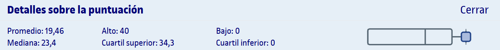

# PEC3 - De los sistemas combinacionales a los sistemas secuenciales: diseñando circuitos con memoria

El enunciado de la PEC está en el archivo [`enunciado.pdf`](enunciado.pdf), así como la entrega en el archivo [`entrega_evaluada.pdf`](entrega_evaluada.pdf) y las plantillas para realizarlo ([`plantilla.docx`](plantilla.docx) para Microsoft Word y [`plantilla.odt`](plantilla.odt) para OpenOffice).

## Recursos de aprendizaje

>[!NOTE]
>- No se incluyen los archivos `pdf` en el repositorio para evitar posibles problemas de copyright.

- [**Los circuitos lógicos secuenciales**](http://cvapp.uoc.edu/autors/MostraPDFMaterialAction.do?id=215619&hash=d25026dd14b3ee362d765576d3893c40b200af038100e77bc444144a21df7985) ([resumen](recursos/README.md))

---

## Resultado

### Calificación

<table>
	<thead>
		<tr>
			<th>EVALUABLE</th>
			<th>C. ORIGINAL</th>
			<th>C. SOBRE 10</th>
		</tr>
	</thead>
	<tbody>
		<tr>
			<td>Entrega PDF</td>
			<td>40,00 / 40,00</td>
			<td>10,00 / 10,00 (A)</td>
		</tr>
	</tbody>
</table>

### Detalles sobre la puntuación

