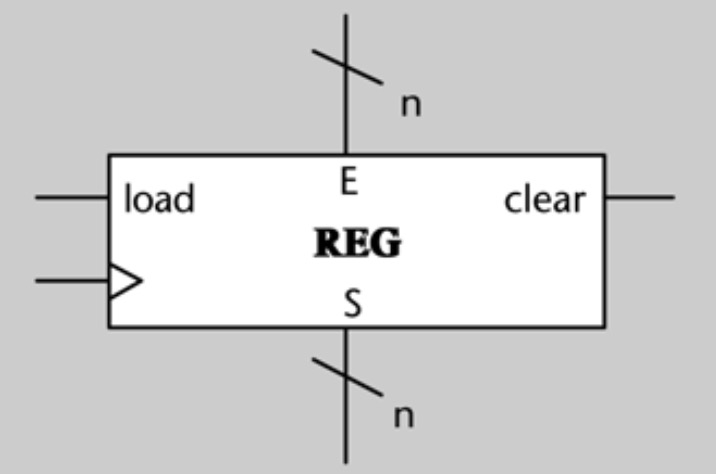

# RESUMEN Los circuitos lógicos secuenciales

## Índice

>[!NOTE]
>El siguiente subapartado no está presente en este resumen, ya que no se incluye en la PEC ni en el examen:
>
>- **3.3. Memoria RAM**
>
>Por otro lado, los siguientes subapartados no están presentes en este resumen, ya que se incluyen en los apuntes del apartado [4.2. Representación gráfica: grafos de estado](#42-representación-gráfica-grafos-de-estado):
>
>- **4.2.1. Mecánica de diseño**
>- **4.2.2. Notación**

- [Antes de empezar](#antes-de-empezar)
- [1. Caracterización de los circuitos lógicos secuenciales](#1-caracterización-de-los-circuitos-lógicos-secuenciales)
	- [1.1. Necesidad de memoria en los circuitos lógicos](#11-necesidad-de-memoria-en-los-circuitos-lógicos)
	- [1.2. Reloj. Sincronización](#12-reloj-sincronización)
- [2. El biestable D](#2-el-biestable-d)
	- [2.1. Dispositivo elemental de memoria. El biestable D](#21-dispositivo-elemental-de-memoria-el-biestable-d)
	- [2.2. Señal de carga](#22-señal-de-carga)
	- [2.3. Entradas asíncronas](#23-entradas-asíncronas)
- [3. Bloques secuenciales](#3-bloques-secuenciales)
	- [3.1. Registro](#31-registro)
	- [3.2. Banco de registros](#32-banco-de-registros)
	- [3.3. Memoria RAM](#33-memoria-ram)
- [4. El modelo de Moore](#4-el-modelo-de-moore)
	- [4.1. Estado. Transiciones](#41-estado-transiciones)
	- [4.2. Representación gráfica: grafos de estado](#42-representación-gráfica-grafos-de-estado)
		- [4.2.3. Circuitos sin entradas](#423-circuitos-sin-entradas)
	- [4.3. Sincronización](#43-sincronización)
	- [4.4. Implementación](#44-implementación)

 

## Antes de empezar

>![NOTE]
>El símbolo $^{+}$ a la derecha del nombre de una señal se refiere al valor que tomará esta señal cuando se produzca el próximo flanco ascendente de reloj.

## 1. Caracterización de los circuitos lógicos secuenciales

- Tienen **memoria**, lo que implica que son capaces de almacenar un **estado**.
- La salida depende de la **entrada actual** y de su **estado**.
- Las entradas anteriores determinan el estado actual.
- Para una misma entrada, no siempre tendrá la misma salida, ya que también depende del estado.
- **Ejemplo**: circuito que cuenta los clientes que están dentro de una tienda.

### 1.1. Necesidad de memoria en los circuitos lógicos

La denominación "secuencial" deriva de la capacidad del circuito de recordar la secuencia de valores que toman las señales.

### 1.2. Reloj. Sincronización

El reloj define los instantes precisos en los que los **flip-flops** o **registros** deben tomar el valor de sus entradas y actualizar su salida. Como un metrónomo, establece el ritmo del sistema: todo lo que cambia dentro del circuito ocurre en **sincronía** con las señales del reloj, evitando así comportamientos indeseados o asíncronos.

Como analogía simple para entender su función, podemos pensar en una coreografía en la que cada bailarín (componentes del circuito) se mueve solo cuando suena un golpe de tambor (reloj). Sin ese tambor marcando el paso, el baile se convierte en un caos.

>Cronograma de un reloj

Los instantes en que la señal de reloj pasa de 0 a 1 se llaman **flancos ascendentes**. El intervalo que hay entre un flanco ascendente y el siguiente se llama **ciclo** o **ciclo de reloj**. Por lo tanto, la duración de un ciclo es de un periodo de $T$ segundos.

La **frecuencia** de reloj es el número de ciclos de reloj que ocurren durante un segundo. Se mide en hercios, aunque lo más habitual es usar el múltiplo gigaherzios (mil millones de ciclos por segundo), que se abrevia (GHz).

Aunque en este módulo la señal de reloj sincroniza a los circuitos por **flanco ascendente**, también existe la sincronización por nivel 0, por nivel 1 y por flanco descendente. Esto implica que los componentes secuenciales del circuito serán sensibles a los valores de la señal en los instantes de los **flancos ascendentes**.

## 2. El biestable D

### 2.1. Dispositivo elemental de memoria. El biestable D

>Biestable sin carga

**Características**

- Los **biestables** son dispositivos de memoria que guardan **un bit** de información. 
- Tienen **una entrada**: $D$ (valor que se quiere guardar en el biestable).
- Tienen **dos salidas**: $Q$ (valor que guarda el biestable) y $Q'$ (negación del valor guardado).
- El término _biestable_ proviene de que puede estar "en dos estados": $Q = 0$ o $Q = 1$.

**Funcionamiento**

La salida $Q$ toma el valor que haya en la entrada $D$ en cada flanco ascendente de reloj. Durante el resto del ciclo, el valor de $Q$ no cambia.

<table>
	<tr>
		<th>$D$</th>
		<th>$clk$</th>
		<th>$Q^+$</th>
	</tr>
	<tr>
		<td>0</td>
		<td>Flanco ascendente</td>
		<td>0</td>
	</tr>
	<tr>
		<td>0</td>
		<td>Flanco descendente</td>
		<td>Retiene el estado anterior, independiente al valor de $D$</td>
	</tr>
	<tr>
		<td>1</td>
		<td>Flanco ascendente</td>
		<td>1</td>
	</tr>
	<tr>
		<td>1</td>
		<td>Flanco descendente</td>
		<td>Retiene el estado anterior, independiente al valor de $D$</td>
	</tr>
</table>

>Cronograma del comportamiento de un biestable D durante dos ciclos: el que va del instante $t_0$ al instante $t_2$ y el que va de $t_2$ a $t_3$.

Como podemos apreciar en el cronograma, la salida del biestable, $Q$, **solo cambia en los flancos ascendentes** (por la izquierda), $t_2$ y $t_3$, independientemente del valor de $D$ durante el resto del ciclo de reloj.

### 2.2. Señal de carga

>Biestable con carga

La señal de carga ($\text{load}$) sirve para que el biestable sea "insensible" a las variaciones de $D$ a nuestro antojo.

>Cronograma del comportamiento de un biestable D con señal de carga durante tres ciclos.

Podemos ver que en el instante $t_0$ el valor de $Q$ no varía, aunque $D = 1$, porque la señal $\text{load}$ está en 0. Cuando $\text{load} = 1$, entonces el biestable funciona tal y como se ha mencionado en el [apartado anterior](#21-dispositivo-elemental-de-memoria-el-biestable-d).

### 2.3. Entradas asíncronas

>Biestable con entradas asíncronas

Las **entradas asíncronas** de un biestable permiten modificar su valor de forma instantánea, independientemente del valor de la señal de reloj y de las entradas $D$ y $\text{load}$.

Descripción de las entradas:
- $R$ (_reset_): cuando su valor es $1$, $Q^+$ es $0$.
- $S$ (_set_): cuando su valor es $1$, $Q^+$ es $1$.

>Cronograma del comportamiento de de un biestable D con entradas asíncronas y señal de carga.

El valor de $Q$ se pone a 1 en el instante $t_0$, aunque este no coincida con un flanco ascendente, y se mantiene a 1 mientras $S = 1$, de forma independiente al valor de $D$. De igual forma, se pone a $0$ en el instante $t_1$. En cambio, mientras ambas entradas asíncronas están a 0, el biestable modifica su valor solo en los momentos de un flanco ascendente, de acuerdo con el valor de $D$.

>[!NOTE]
>Cuando no dibujamos en un circuito las señales $\text{load}$, $R$ y $S$ de un biestable, asumiremos por defecto que valen 1, 0 y 0, respectivamente.

## 3. Bloques secuenciales

### 3.1. Registro

>Registro

Un **registro** es un bloque secuencial formado por $n$ biestables D, que permite guardar el valor de una palabra de $n$ bits.

Se compone de: 

- **Entradas**

	1. **$E$ (Entrada de datos)**
		- **Función**: Es el dato binario que se desea almacenar en el registro.
		- Este dato solo será cargado si $\text{load} = 1$.
	2. **$\text{load}$ (Carga)**
		- **Tipo**: Control (1 bit)
		- **Función**: Permite que el dato de entrada sea almacenado en el registro.
		- Si $\text{load} = 0$, en el próximo flanco activo del reloj, el registro conserva su contenido anterior (no cambia).
		- Si $\text{load} = 1$, en el próximo flanco activo del reloj, el registro captura el valor de entrada ($E$) y lo almacena ($S$).
	3. **$\text{clear}$ (Borrado)**
		- **Tipo**: Control (1 bit)
		- **Función**: Pone a 0 el contenido del registro en el momento en el que $\text{clear} = 1$, independientemente del reloj, ya que es una señal **asíncrona**.
		- Tiene prioridad sobre $\text{load}$; si ambos están activos, el contenido del registro se borra primero.
	4. **Reloj**

- **Salidas**

	1. **$S$ (Salida de datos)**
		- **Función**: Muestra el valor actualmente almacenado en el registro.
		- Refleja lo que se cargó por $\text{load}$, o lo que quedó tras un $\text{clear}$.

Las entradas $\text{clear}$ y $\text{load}$ se pueden entender mejor a partir de esta tabla:

<table>
	<tr>
		<th>$\text{clear}$</th>
		<th>$\text{load}$</th>
		<th>$\text{clk}$</th>
		<th>$S^+$</th>
	</tr>
	<tr>
		<td>1</td>
		<td>x</td>
		<td>x</td>
		<td>0</td>
	</tr>
	<tr>
		<td>0</td>
		<td>0</td>
		<td>x</td>
		<td>$S$</td>
	</tr>
	<tr>
		<td>0</td>
		<td>1</td>
		<td>flanco ascendente</td>
		<td>$E$</td>
	</tr>
</table>

Cuando modificamos el valor de un registro haciendo que se cargue con el valor que hay en la entrada $E$, decimos que hacemos una **escritura** en el registro.

Cuando analizamos el contenido de un registro a partir de la salida $S$, decimos que hacemos una **lectura**.

### 3.2. Banco de registros

>Banco de registros

Un **banco de registros** es una agrupación de registros que tienen el mismo número de bits. El número de registros de un banco **siempre es una potencia de 2**.

Se compone de:

- **Entradas**

	1. **$SL$ (Selector de Lectura)**
		- **Tamaño**: $m$ bits
		- **Función**: Selecciona qué registro quieres leer.
		- Como hay $2^m$ registros, este campo sirve para escoger uno de ellos y obtener su valor por la salida $\text{Dout}$.
	2. **$SE$ (Selector de Escritura)**
		- **Tamaño**: $m$ bits
		- **Función**: Seleccionar qué registro se va a modificar.
		- Se usa junto con la señal de permiso de escritura, $E$, y el dato de entrada a escribir, $\text{Din}$.
	3. **$E$ (Enable o Habilitación de Escritura)**
		- **Tamaño**: 1 bit
		- **Función**: Controla si se debe escribir el valor $\text{Din}$ en el registro seleccionado por $SE$.
		- Si $E = 0$, no se realiza la escritura.
		- Si $E = 1$, se realiza la escritura.
	4. **$\text{Din}$ (Data Input o Dato de Entrada)**
		- **Tamaño**: $n$ bits
		- **Función**: Contiene el dato que se va a guardar en el registro indicado por $SE$ si la escritura está habilitada $E = 1$.
	5. **Reloj**

- **Salidas**

	1. **$\text{Dout}$ (Data Output o Dato de salida)**
		- **Tamaño**: $n$ bits
		- **Función**: Entrega el contenido del registro seleccionado por $SL$.
		- No depende de la escritura, solo del selector de lectura.

**Funcionamiento**

- El **lector** accede al contenido de un registro usando la dirección dada por $SL$, y ese contenido se entrega por $\text{Dout}$.
- El **escritor** guarda un dato $\text{Din}$ en el registro seleccionado por $SE$, pero solo si la señal $E$ está activada.

## 4. El modelo de Moore

El modelo de Moore es una forma de expresar o modelizar el funcionamiento de un circuito lógico secuencial.

También existe otro modelo llamado _modelo de Mealy_, el cual no se ve en esta asignatura.

### 4.1. Estado. Transiciones

**Conceptos clave**:
1. **Estado**: Cada situación diferente en la que se puede encontrar un circuito.
2. **Tabla de salida**: Se expresa mediante el valor que toman las señales de salida en cada estado.

	Ejemplo:

	<table>
		<tr>
			<th colspan="3">TABLA DE SALIDAS</th>
		</tr>
		<tr>
			<th>ESTADO</th>
			<th>$s_1$</th>
			<th>$s_2$</th>
		</tr>
		<tr>
			<td>A</td>
			<td>1</td>
			<td>1</td>
		</tr>
		<tr>
			<td>B</td>
			<td>0</td>
			<td>1</td>
		</tr>
		<tr>
			<td>C</td>
			<td>1</td>
			<td>0</td>
		</tr>
		<tr>
			<td>D</td>
			<td>0</td>
			<td>1</td>
		</tr>
		<tr>
			<td>E</td>
			<td>1</td>
			<td>1</td>
		</tr>
	</table>

3. **Transición**: Paso del estado actual a un estado futuro.
4. **Tabla de transiciones**: Alberga todas las transiciones que se pueden dar en un circuito secuencial.

	Ejemplo:

	<table>
		<tr>
			<th colspan="3">TABLA DE TRANSICIONES</th>
		</tr>
		<tr>
			<th>ESTADO</th>
			<th>ENTRADA ($x$)</th>
			<th>ESTADO $^+$</th>
		</tr>
		<tr>
			<td>A</td>
			<td>0</td>
			<td>B</td>
		</tr>
		<tr>
			<td>A</td>
			<td>1</td>
			<td>C</td>
		</tr>
		<tr>
			<td>B</td>
			<td>0</td>
			<td>C</td>
		</tr>
		<tr>
			<td>B</td>
			<td>1</td>
			<td>C</td>
		</tr>
		<tr>
			<td>C</td>
			<td>0</td>
			<td>D</td>
		</tr>
		<tr>
			<td>C</td>
			<td>1</td>
			<td>D</td>
		</tr>
		<tr>
			<td>D</td>
			<td>0</td>
			<td>E</td>
		</tr>
		<tr>
			<td>D</td>
			<td>1</td>
			<td>C</td>
		</tr>
		<tr>
			<td>E</td>
			<td>0</td>
			<td>A</td>
		</tr>
		<tr>
			<td>E</td>
			<td>1</td>
			<td>C</td>
		</tr>
	</table>

5. **Estado inicial**: Estado que refleja la situación "no es necesario recordar ninguno de los valores que ha llegado por la entrada".

### 4.2. Representación gráfica: grafos de estado

>[!NOTE]
>Para este apartado, recomiendo ver [este vídeo](https://www.youtube.com/watch?v=NB5rjK1dQ9c) del canal [Electrónica FP](https://www.youtube.com/c/Electr%C3%B3nicaFP) como apoyo.

Los grafos de estado son la representación gráfica del funcionamiento de un circuito secuencial. Describe cómo cambia el circuito de un estado a otro dependiendo de las entradas y cómo produce las salidas.

**Elementos de un grafo**

1. **Estados**:
	- Representados como **círculos**.
	- Cada círculo tiene un nombre o código del estado (ej: S0, S1, A, B...).
2. **Transiciones**:
	- Representadas como **flechas** que conectan estados.
	- Cada transición está etiquetada con la **entrada** que provoca el cambio de estado.
3. **Estado inicial**:
	- Indicado con una **flecha sin origen** que apunta al estado donde comienza el sistema.

Para el modelo de Moore, la **salida solo depende del estado** y se colocan **dentro del estado**, no en las transiciones.

**Ejemplo**

>Se quiere diseñar el grafo de estados de un circuito lógico secuencial llamado SLS. El circuito tiene una entrada de un bit, denominada $a$, y una salida de un bit, denominada $s$.
>
>El circuito SLS va leyendo el valor de la entrada en cada ciclo. Denominamos $a_i$ al valor en la entrada en el ciclo $i$. El circuito tiene que detectar en cada ciclo si el valor formado por los tres dígitos leídos en los últimos tres ciclos, $a_i$ $a_{i-1}$ $a_{i-2}$, es un número múltiplo de tres. Cuando se detecta que el valor es múltiplo de tres en el siguiente ciclo, se pone el valor 1 en la salida $s$ durante un ciclo. En cualquier otro caso, la salida $s$ vale 0. 
>
>Tened en cuenta que el número cero es múltiplo de cualquier número y, por lo tanto, es múltiplo de tres. Inicialmente podéis considerar que el circuito se encuentra en el estado 000 (como si las últimas tres entradas fueran cero) y, por lo tanto, la salida es 1.

>Grafo de estados del circuito SLS

#### 4.2.3. Circuitos sin entradas

Un circuito secuencial puede no tener ninguna señal. En este caso, siempre se producirán las mismas transiciones entre estados y, por tanto, la secuencia de valores en las salidas será siempre la misma.

### 4.3. Sincronización

Las transiciones entre estados tienen lugar en cada flanco ascendente de reloj, ya que lo estados se implementan físicamente mediante biestables, tal y como se ve en el apartado [4.4. Implementación](#44-implementación).

**Ejemplo de transiciones entre estados**

Sea el grafo de estados que se muestra en esta figura:

La siguiente figura muestra cómo evoluciona el circuito con el tiempo a partir de una secuencia de valores determinada en la entrada $a$. En el ciclo 0, la señal Inicio genera un pulso a 1 y hace que el circuito se ponga en el estado $B$. En el instante $t_1$ (por la izquierda), la señal de entrada $a$ vale 0, lo que provoca que el circuito pase al estado $C$ en ese instante. Durante el ciclo 2, el circuito se encuentra en el estado $A$. Dado que el instante $t_2$ la entrada vale 1, en este momento se produce una transición hacia el mismo estado $A$. El resto del cronograma se calcula de forma análoga.

### 4.4. Implementación

A partir de este grafo de estados:

Desarrollaremos una serie de pasos para implementar físicamente un circuito secuencial a partir de un grafo de estados.

1. **Construir las tablas de transiciones y de salidas**

	<table>
		<tr>
			<th colspan="3">TABLA DE TRANSICIONES</th>
		</tr>
		<tr>
			<th>ESTADO</th>
			<th>ENTRADA ($x$)</th>
			<th>ESTADO $^+$</th>
		</tr>
		<tr>
			<td>A</td>
			<td>0</td>
			<td>B</td>
		</tr>
		<tr>
			<td>A</td>
			<td>1</td>
			<td>C</td>
		</tr>
		<tr>
			<td>B</td>
			<td>0</td>
			<td>C</td>
		</tr>
		<tr>
			<td>B</td>
			<td>1</td>
			<td>C</td>
		</tr>
		<tr>
			<td>C</td>
			<td>0</td>
			<td>D</td>
		</tr>
		<tr>
			<td>C</td>
			<td>1</td>
			<td>D</td>
		</tr>
		<tr>
			<td>D</td>
			<td>0</td>
			<td>E</td>
		</tr>
		<tr>
			<td>D</td>
			<td>1</td>
			<td>C</td>
		</tr>
		<tr>
			<td>E</td>
			<td>0</td>
			<td>A</td>
		</tr>
		<tr>
			<td>E</td>
			<td>1</td>
			<td>C</td>
		</tr>
	</table>

	<table>
		<tr>
			<th colspan="3">TABLA DE SALIDAS</th>
		</tr>
		<tr>
			<th>ESTADO</th>
			<th>$s_1$</th>
			<th>$s_2$</th>
		</tr>
		<tr>
			<td>A</td>
			<td>1</td>
			<td>1</td>
		</tr>
		<tr>
			<td>B</td>
			<td>0</td>
			<td>1</td>
		</tr>
		<tr>
			<td>C</td>
			<td>1</td>
			<td>0</td>
		</tr>
		<tr>
			<td>D</td>
			<td>0</td>
			<td>1</td>
		</tr>
		<tr>
			<td>E</td>
			<td>1</td>
			<td>1</td>
		</tr>
	</table>

2. **Convertir la tabla de transiciones y la tabla de salidas en tablas de verdad**

	Si hay $n$ estados, serán necesarios $\lceil \log_{2} n \rceil$ variables para codificarlos. Esta es una posible codificación de estados:

	<table>
		<tr>
			<th>ESTADO</th>
			<th>$q_2$</th>
			<th>$q_1$</th>
			<th>$q_0$</th>
		</tr>
		<tr>
			<td>A</td>
			<td>0</td>
			<td>0</td>
			<td>0</td>
		</tr>
		<tr>
			<td>B</td>
			<td>0</td>
			<td>0</td>
			<td>1</td>
		</tr>
		<tr>
			<td>C</td>
			<td>0</td>
			<td>1</td>
			<td>0</td>
		</tr>
		<tr>
			<td>D</td>
			<td>0</td>
			<td>1</td>
			<td>1</td>
		</tr>
		<tr>
			<td>E</td>
			<td>1</td>
			<td>0</td>
			<td>0</td>
		</tr>
	</table>

	Una vez codificados los estados, las transiciones y salidas del circuito, construimos las siguientes tablas de verdad:

	<table>
		<tr>
			<th colspan="7">TABLA DE TRANSICIONES</th>
		</tr>
		<tr>
			<th colspan="4">ESTADO</th>
			<th colspan="3">ESTADO $^+$</th>
		</tr>
		<tr>
			<th>$q_2$</th>
			<th>$q_1$</th>
			<th>$q_0$</th>
			<th>ENTRADA ($x$)</th>
			<th>$q_2^+$</th>
			<th>$q_1^+$</th>
			<th>$q_0^+$</th>
		</tr>
		<tr>
			<td>0</td>
			<td>0</td>
			<td>0</td>
			<td>0</td>
			<td>0</td>
			<td>0</td>
			<td>1</td>
		</tr>
		<tr>
			<td>0</td>
			<td>0</td>
			<td>0</td>
			<td>1</td>
			<td>0</td>
			<td>1</td>
			<td>0</td>
		</tr>
		<tr>
			<td>0</td>
			<td>0</td>
			<td>1</td>
			<td>0</td>
			<td>0</td>
			<td>1</td>
			<td>0</td>
		</tr>
		<tr>
			<td>0</td>
			<td>0</td>
			<td>1</td>
			<td>1</td>
			<td>0</td>
			<td>1</td>
			<td>0</td>
		</tr>
		<tr>
			<td>0</td>
			<td>1</td>
			<td>0</td>
			<td>0</td>
			<td>0</td>
			<td>1</td>
			<td>1</td>
		</tr>
		<tr>
			<td>0</td>
			<td>1</td>
			<td>0</td>
			<td>1</td>
			<td>0</td>
			<td>1</td>
			<td>1</td>
		</tr>
		<tr>
			<td>0</td>
			<td>1</td>
			<td>1</td>
			<td>0</td>
			<td>1</td>
			<td>0</td>
			<td>0</td>
		</tr>
		<tr>
			<td>0</td>
			<td>1</td>
			<td>1</td>
			<td>1</td>
			<td>0</td>
			<td>1</td>
			<td>0</td>
		</tr>
		<tr>
			<td>1</td>
			<td>0</td>
			<td>0</td>
			<td>0</td>
			<td>0</td>
			<td>0</td>
			<td>0</td>
		</tr>
		<tr>
			<td>1</td>
			<td>0</td>
			<td>0</td>
			<td>1</td>
			<td>0</td>
			<td>1</td>
			<td>0</td>
		</tr>
		<tr>
			<td>1</td>
			<td>0</td>
			<td>1</td>
			<td>0</td>
			<td>x</td>
			<td>x</td>
			<td>x</td>
		</tr>
		<tr>
			<td>1</td>
			<td>0</td>
			<td>1</td>
			<td>1</td>
			<td>x</td>
			<td>x</td>
			<td>x</td>
		</tr>
		<tr>
			<td>1</td>
			<td>1</td>
			<td>0</td>
			<td>0</td>
			<td>x</td>
			<td>x</td>
			<td>x</td>
		</tr>
		<tr>
			<td>1</td>
			<td>1</td>
			<td>0</td>
			<td>1</td>
			<td>x</td>
			<td>x</td>
			<td>x</td>
		</tr>
		<tr>
			<td>1</td>
			<td>1</td>
			<td>1</td>
			<td>0</td>
			<td>x</td>
			<td>x</td>
			<td>x</td>
		</tr>
		<tr>
			<td>1</td>
			<td>1</td>
			<td>1</td>
			<td>1</td>
			<td>x</td>
			<td>x</td>
			<td>x</td>
		</tr>
	</table>

	<table>
		<tr>
			<th colspan="5">TABLA DE SALIDAS</th>
		</tr>
		<tr>
			<td colspan="3">ESTADO</td>
			<td colspan="2">SALIDAS</td>
		</tr>
		<tr>
			<th>$q_2$</th>
			<th>$q_1$</th>
			<th>$q_0$</th>
			<th>$s_1$</th>
			<th>$s_0$</th>
		</tr>
		<tr>
			<td>0</td>
			<td>0</td>
			<td>0</td>
			<td>1</td>
			<td>1</td>
		</tr>
		<tr>
			<td>0</td>
			<td>0</td>
			<td>1</td>
			<td>0</td>
			<td>1</td>
		</tr>
		<tr>
			<td>0</td>
			<td>1</td>
			<td>0</td>
			<td>1</td>
			<td>0</td>
		</tr>
		<tr>
			<td>0</td>
			<td>1</td>
			<td>1</td>
			<td>0</td>
			<td>1</td>
		</tr>
		<tr>
			<td>1</td>
			<td>0</td>
			<td>0</td>
			<td>1</td>
			<td>1</td>
		</tr>
		<tr>
			<td>1</td>
			<td>0</td>
			<td>1</td>
			<td>x</td>
			<td>x</td>
		</tr>
		<tr>
			<td>1</td>
			<td>1</td>
			<td>0</td>
			<td>x</td>
			<td>x</td>
		</tr>
		<tr>
			<td>1</td>
			<td>1</td>
			<td>1</td>
			<td>x</td>
			<td>0</td>
		</tr>
	</table>

3. **Realizar tabla de excitaciones para los biestables**

	Las variables que codifican los estados $q_i$ se guardan en **biestables**. Cada variable representa un biestable. En este caso, como tenemos 3 variables ($q_2 q_1 q_0$), necesitaremos 3 biestables; cuando estos valgan, por ejemplo, $[q_2 \, q_1 \, q_0] = [0 \, 1 \, 0]$, sabremos que el circuito se encuentra en el estado C.

	Las columnas $q_2^+$, $q_1^+$ y $q_0^+$ indican los valores de entrada ($D$) que deben tomar los biestables en el siguiente flanco de reloj. La siguiente **tabla de excitaciones** muestra estos valores:

	>Las columnas $d_i$ de la tabla de excitaciones coinciden con las columnas $q_i^+$ de la tabla de transiciones.

	<table>
		<tr>
			<th>$q_2$</th>
			<th>$q_1$</th>
			<th>$q_0$</th>
			<th>$x$</th>
			<th>$d_2$</th>
			<th>$d_1$</th>
			<th>$d_0$</th>
		</tr>
		<tr>
			<td>0</td>
			<td>0</td>
			<td>0</td>
			<td>0</td>
			<td>0</td>
			<td>0</td>
			<td>1</td>
		</tr>
		<tr>
			<td>0</td>
			<td>0</td>
			<td>0</td>
			<td>1</td>
			<td>0</td>
			<td>1</td>
			<td>0</td>
		</tr>
		<tr>
			<td>0</td>
			<td>0</td>
			<td>1</td>
			<td>0</td>
			<td>0</td>
			<td>1</td>
			<td>0</td>
		</tr>
		<tr>
			<td>0</td>
			<td>0</td>
			<td>1</td>
			<td>1</td>
			<td>0</td>
			<td>1</td>
			<td>0</td>
		</tr>
		<tr>
			<td>0</td>
			<td>1</td>
			<td>0</td>
			<td>0</td>
			<td>0</td>
			<td>1</td>
			<td>1</td>
		</tr>
		<tr>
			<td>0</td>
			<td>1</td>
			<td>0</td>
			<td>1</td>
			<td>0</td>
			<td>1</td>
			<td>1</td>
		</tr>
		<tr>
			<td>0</td>
			<td>1</td>
			<td>1</td>
			<td>0</td>
			<td>1</td>
			<td>0</td>
			<td>0</td>
		</tr>
		<tr>
			<td>0</td>
			<td>1</td>
			<td>1</td>
			<td>1</td>
			<td>0</td>
			<td>1</td>
			<td>0</td>
		</tr>
		<tr>
			<td>1</td>
			<td>0</td>
			<td>0</td>
			<td>0</td>
			<td>0</td>
			<td>0</td>
			<td>0</td>
		</tr>
		<tr>
			<td>1</td>
			<td>0</td>
			<td>0</td>
			<td>1</td>
			<td>0</td>
			<td>1</td>
			<td>0</td>
		</tr>
		<tr>
			<td>1</td>
			<td>0</td>
			<td>1</td>
			<td>0</td>
			<td>x</td>
			<td>x</td>
			<td>x</td>
		</tr>
		<tr>
			<td>1</td>
			<td>0</td>
			<td>1</td>
			<td>1</td>
			<td>x</td>
			<td>x</td>
			<td>x</td>
		</tr>
		<tr>
			<td>1</td>
			<td>1</td>
			<td>0</td>
			<td>0</td>
			<td>x</td>
			<td>x</td>
			<td>x</td>
		</tr>
		<tr>
			<td>1</td>
			<td>1</td>
			<td>0</td>
			<td>1</td>
			<td>x</td>
			<td>x</td>
			<td>x</td>
		</tr>
		<tr>
			<td>1</td>
			<td>1</td>
			<td>1</td>
			<td>0</td>
			<td>x</td>
			<td>x</td>
			<td>x</td>
		</tr>
		<tr>
			<td>1</td>
			<td>1</td>
			<td>1</td>
			<td>1</td>
			<td>x</td>
			<td>x</td>
			<td>x</td>
		</tr>
	</table>

	Hecho esto, procedemos a escribir una sola tabla de verdad que aglutine las funciones de excitación y las de salida:

	<table>
		<tr>
			<th>$q_2$</th>
			<th>$q_1$</th>
			<th>$q_0$</th>
			<th>$x$</th>
			<th>$d_2$</th>
			<th>$d_1$</th>
			<th>$d_0$</th>
			<th>$s_1$</th>
			<th>$s_0$</th>
		</tr>
		<tr>
			<td>0</td>
			<td>0</td>
			<td>0</td>
			<td>0</td>
			<td>0</td>
			<td>0</td>
			<td>1</td>
			<td>1</td>
			<td>1</td>
		</tr>
		<tr>
			<td>0</td>
			<td>0</td>
			<td>0</td>
			<td>1</td>
			<td>0</td>
			<td>1</td>
			<td>0</td>
			<td>1</td>
			<td>1</td>
		</tr>
		<tr>
			<td>0</td>
			<td>0</td>
			<td>1</td>
			<td>0</td>
			<td>0</td>
			<td>1</td>
			<td>0</td>
			<td>0</td>
			<td>1</td>
		</tr>
		<tr>
			<td>0</td>
			<td>0</td>
			<td>1</td>
			<td>1</td>
			<td>0</td>
			<td>1</td>
			<td>0</td>
			<td>0</td>
			<td>1</td>
		</tr>
		<tr>
			<td>0</td>
			<td>1</td>
			<td>0</td>
			<td>0</td>
			<td>0</td>
			<td>1</td>
			<td>1</td>
			<td>1</td>
			<td>0</td>
		</tr>
		<tr>
			<td>0</td>
			<td>1</td>
			<td>0</td>
			<td>1</td>
			<td>0</td>
			<td>1</td>
			<td>1</td>
			<td>1</td>
			<td>0</td>
		</tr>
		<tr>
			<td>0</td>
			<td>1</td>
			<td>1</td>
			<td>0</td>
			<td>1</td>
			<td>0</td>
			<td>0</td>
			<td>0</td>
			<td>1</td>
		</tr>
		<tr>
			<td>0</td>
			<td>1</td>
			<td>1</td>
			<td>1</td>
			<td>0</td>
			<td>1</td>
			<td>0</td>
			<td>0</td>
			<td>1</td>
		</tr>
		<tr>
			<td>1</td>
			<td>0</td>
			<td>0</td>
			<td>0</td>
			<td>0</td>
			<td>0</td>
			<td>0</td>
			<td>1</td>
			<td>1</td>
		</tr>
		<tr>
			<td>1</td>
			<td>0</td>
			<td>0</td>
			<td>1</td>
			<td>0</td>
			<td>1</td>
			<td>0</td>
			<td>1</td>
			<td>1</td>
		</tr>
		<tr>
			<td>1</td>
			<td>0</td>
			<td>1</td>
			<td>0</td>
			<td>x</td>
			<td>x</td>
			<td>x</td>
			<td>x</td>
			<td>x</td>
		</tr>
		<tr>
			<td>1</td>
			<td>0</td>
			<td>1</td>
			<td>1</td>
			<td>x</td>
			<td>x</td>
			<td>x</td>
			<td>x</td>
			<td>x</td>
		</tr>
		<tr>
			<td>1</td>
			<td>1</td>
			<td>0</td>
			<td>0</td>
			<td>x</td>
			<td>x</td>
			<td>x</td>
			<td>x</td>
			<td>x</td>
		</tr>
		<tr>
			<td>1</td>
			<td>1</td>
			<td>0</td>
			<td>1</td>
			<td>x</td>
			<td>x</td>
			<td>x</td>
			<td>x</td>
			<td>x</td>
		</tr>
		<tr>
			<td>1</td>
			<td>1</td>
			<td>1</td>
			<td>0</td>
			<td>x</td>
			<td>x</td>
			<td>x</td>
			<td>x</td>
			<td>x</td>
		</tr>
		<tr>
			<td>1</td>
			<td>1</td>
			<td>1</td>
			<td>1</td>
			<td>x</td>
			<td>x</td>
			<td>x</td>
			<td>x</td>
			<td>x</td>
		</tr>
	</table>

4. **Implementar memoria ROM**

	A partir de esta última tabla, podemos implementar una memoria ROM, tal como se muestra en este circuito:

	

	Para saber cuántos bits de direcciones tendrá la memoria ROM, aplicamos:

	$$\text{número de bits del estado} + \text{número de bits de la entrada}= \text{número de bits de dirección}$$

	Para saber cuántos bits de datos tendrá la memoria ROM, aplicamos:

	$$\text{número de bits del estado} + \text{número de bits de la salida}= \text{número de bits de datos}$$

	Para saber el número de palabras de la ROM, aplicamos:

	$$\text{número de palabras} = 2^{\text{número de bits de dirección}}$$

	El contenido de la memoria ROM, que corresponde con la tabla anterior, es el siguiente:

	<table>
		<tr>
			<th>DIRECCIÓN</th>
			<th>$d_2$</th>
			<th>$d_1$</th>
			<th>$d_0$</th>
			<th>$s_1$</th>
			<th>$s_0$</th>
		</tr>
		<tr>
			<td>0</td>
			<td>0</td>
			<td>0</td>
			<td>1</td>
			<td>1</td>
			<td>1</td>
		</tr>
		<tr>
			<td>1</td>
			<td>0</td>
			<td>1</td>
			<td>0</td>
			<td>1</td>
			<td>1</td>
		</tr>
		<tr>
			<td>2</td>
			<td>0</td>
			<td>1</td>
			<td>0</td>
			<td>1</td>
			<td>1</td>
		</tr>
		<tr>
			<td>3</td>
			<td>0</td>
			<td>1</td>
			<td>0</td>
			<td>0</td>
			<td>1</td>
		</tr>
		<tr>
			<td>4</td>
			<td>0</td>
			<td>1</td>
			<td>1</td>
			<td>1</td>
			<td>0</td>
		</tr>
		<tr>
			<td>5</td>
			<td>0</td>
			<td>1</td>
			<td>1</td>
			<td>1</td>
			<td>0</td>
		</tr>
		<tr>
			<td>6</td>
			<td>1</td>
			<td>0</td>
			<td>0</td>
			<td>0</td>
			<td>1</td>
		</tr>
		<tr>
			<td>7</td>
			<td>0</td>
			<td>1</td>
			<td>0</td>
			<td>0</td>
			<td>1</td>
		</tr>
		<tr>
			<td>8</td>
			<td>0</td>
			<td>0</td>
			<td>0</td>
			<td>1</td>
			<td>1</td>
		</tr>
		<tr>
			<td>9</td>
			<td>0</td>
			<td>1</td>
			<td>0</td>
			<td>1</td>
			<td>1</td>
		</tr>
		<tr>
			<td>10</td>
			<td>x</td>
			<td>x</td>
			<td>x</td>
			<td>x</td>
			<td>x</td>
		</tr>
		<tr>
			<td>11</td>
			<td>x</td>
			<td>x</td>
			<td>x</td>
			<td>x</td>
			<td>x</td>
		</tr>
		<tr>
			<td>12</td>
			<td>x</td>
			<td>x</td>
			<td>x</td>
			<td>x</td>
			<td>x</td>
		</tr>
		<tr>
			<td>13</td>
			<td>x</td>
			<td>x</td>
			<td>x</td>
			<td>x</td>
			<td>x</td>
		</tr>
		<tr>
			<td>14</td>
			<td>x</td>
			<td>x</td>
			<td>x</td>
			<td>x</td>
			<td>x</td>
		</tr>
		<tr>
			<td>15</td>
			<td>x</td>
			<td>x</td>
			<td>x</td>
			<td>x</td>
			<td>x</td>
		</tr>
	</table>
