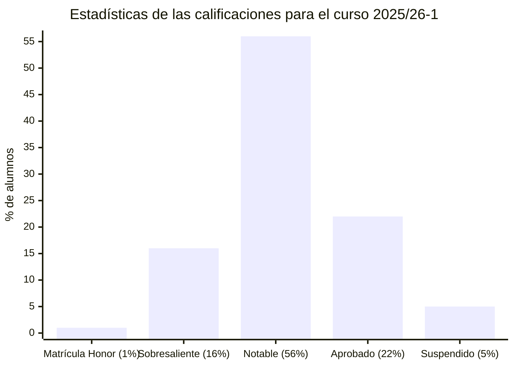
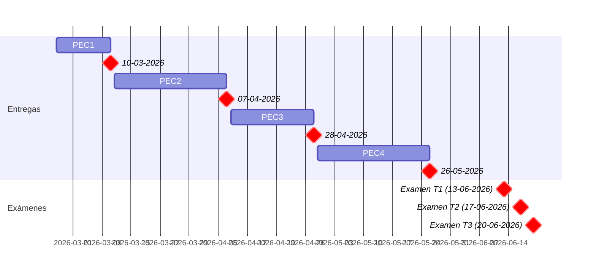

# Fundamentos físicos de la informática (25/26-2)

- [Información sobre la asignatura](#información-sobre-la-asignatura)
- [Archivo de exámenes](#archivo-de-exámenes)
- [Calendario de entregas](#calendario-de-entregas)
- [Resumen de calificaciones](#resumen-de-calificaciones)
- [Recursos de aprendizaje](#recursos-de-aprendizaje)
	- [PEC1](#pec1)
	- [PEC2](#pec2)
	- [PEC3](#pec3)
	- [PEC4](#pec4)

## Información sobre la asignatura

- **Código**: 75.611
- **Curso**: 2025/26 (2º semestre)
- **Tipo**: Básica
- **Método de evaluación**: Examen (65%) + Evaluación continua (35%)
- **Créditos**: 6
- [**Plan docente**](https://apps.uoc.edu/PlaDocent/PlaDocent?Semestre=20251&SignatureCode=75.611&Context=3&Locale=es)

>

>	
Leyenda de calificaciones

>
>	- **Matrícula de Honor (M)**: 9 a 10
>	- **Sobresaliente (EX)**: 9 a 10
>	- **Notable (NO)**: 7 a 8,99
>	- **Aprobado ( )**: 5 a 6,99
>	- **Suspendido (SU)**: 0 a 4,99
>

## Archivo de exámenes

- [Compilación de 76 exámenes desde 2010](examenes)

## Calendario de entregas

## Resumen de calificaciones

<table>
	<tr>
		<th>BLOQUE</th>
		<th>ACTIVIDAD</th>
		<th>CALIFICACIÓN</th>
		<th>CALIFICACIÓN PONDERADA</th>
	</tr>
	<tr>
		<td rowspan="4">
			<strong>Evaluación continua (EC)</strong> (35%)
		</td>
		<td>
			<a href="pec1">
				PEC1 - Óptica y fotónica
			</a>
			(25%)
		</td>
		<td>24,30 / 25,00 (A)</td>
		<td rowspan="4">
			

				<strong>Calificación total PEC</strong>:
				 
				97,60 / 100,00
			

			 
			

				<strong>Calificación ponderada EC</strong>:
				 
				3,42 / 3,50
			
	
		</td>
	</tr>
	<tr>
		<td>
			<a href="pec2">
				PEC2 - Circuitos eléctricos y RLC
			</a>
			(25%)
		</td>
		<td>24,30 / 25,00 (A)</td>
	</tr>
	<tr>
		<td>
			<a href="pec3">
				PEC3 - Electrostática
			</a>
			(25%)
		</td>
		<td>24,00 / 25,00 (A)</td>
	</tr>
	<tr>
		<td>
			<a href="pec4">
				PEC4 - Magnetostática y materiales semiconductores
			</a>
			(25%)
		</td>
		<td>25,00 / 25,00 (A)</td>
	</tr>
	<tr>
		<td>
			<a href="examenes/2025-2026/junio/espanol/20252_75611_130626">
				<strong>Examen</strong>
			</a> (65%)
		</td>
		<td colspan="1"></td>
		<td>9,20 / 10,00</td>
		<td>6,24 / 6,50</td>
	</tr>
	<tr>
		<td colspan="3"></td>	
		<td></td>
	</tr>
	<tr>
		<td colspan="3">
			<strong>CALIFICACIÓN FINAL</strong>
		</td>
		<td>9,40 / 10,00 (A)</td>
	</tr>
</table>

## Recursos de aprendizaje

>[!NOTE]
>- No se incluyen los archivos `pdf` en el repositorio para evitar posibles problemas de copyright.

### _Cheat sheet_ de la asignatura

- [Versión extendida en Markdown](recursos/README.md)
- [Versión extendida en PDF](recursos/formulario_extendido.pdf)
- [Versión reducida proporcionada por el profesorado](recursos/formulario.pdf)

### PEC1

- [**Óptica y fotónica: la ciencia de la luz**](https://aprenentatge.recursos.uoc.edu/continguts/pdf/PID_00288403.pdf) ([resumen](pec1/recursos/README.md))

### PEC2

- [**Vídeos de apoyo de la UOC sobre este recurso**](pec2/recursos/videos)
- [**Circuitos eléctricos: conceptos fundamentales**](https://aprenentatge.recursos.uoc.edu/continguts/pdf/PID_00288414.pdf) ([resumen](pec2/recursos/circuitos_electronicos.md))
- [**Circuitos RLC: análisis en corriente continua**](https://aprenentatge.recursos.uoc.edu/continguts/pdf/PID_00288412.pdf) ([resumen](pec2/recursos/circuitos_rlc.md))

### PEC3

- [**Vídeos de apoyo de la UOC sobre esta PEC**](pec3/recursos/videos)
- [**Electrostática: la base de la electricidad**](https://aprenentatge.recursos.uoc.edu/continguts/pdf/PID_00290383.pdf) ([resumen](pec3/recursos/README.md))

### PEC4

- [**Magnetostática e inducción electromagnética**](https://aprenentatge.recursos.uoc.edu/continguts/pdf/PID_00290385.pdf) ([resumen](pec4/recursos/magnetostatica_e_induccion_electromagnetica.md))
	- [**Vídeos de apoyo de la UOC sobre este recurso**](pec4/recursos/videos)
- [**Materiales y dispositivos semiconductores: la base de la física informática**](https://aprenentatge.recursos.uoc.edu/continguts/pdf/PID_00290381.pdf) ([resumen](pec4/recursos/materiales_y_dispositivos_semiconductores.md))
