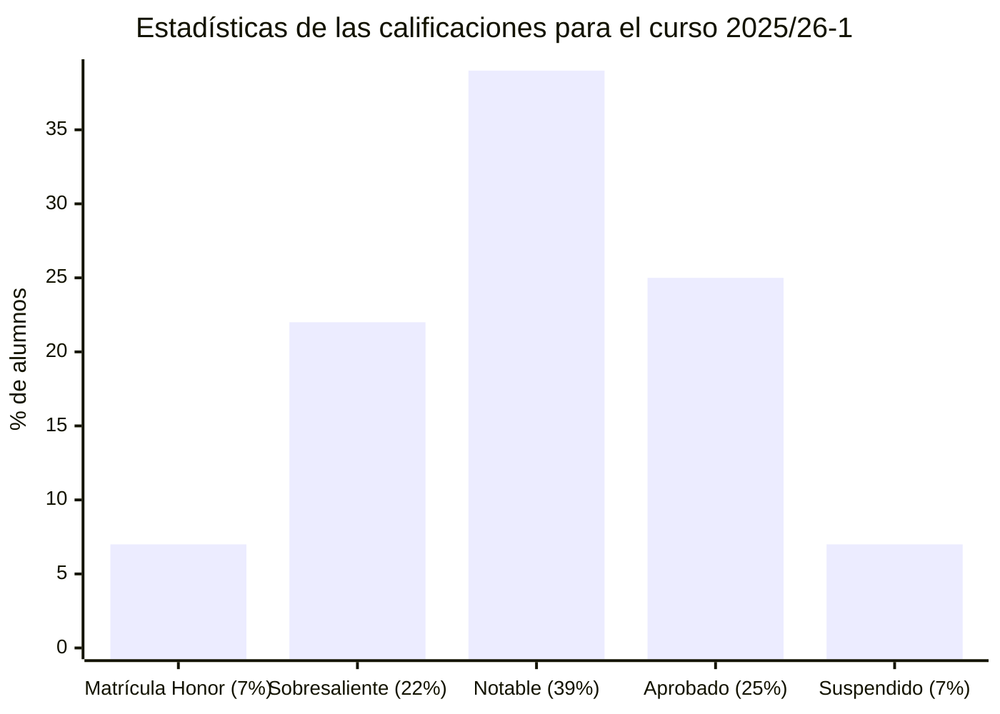
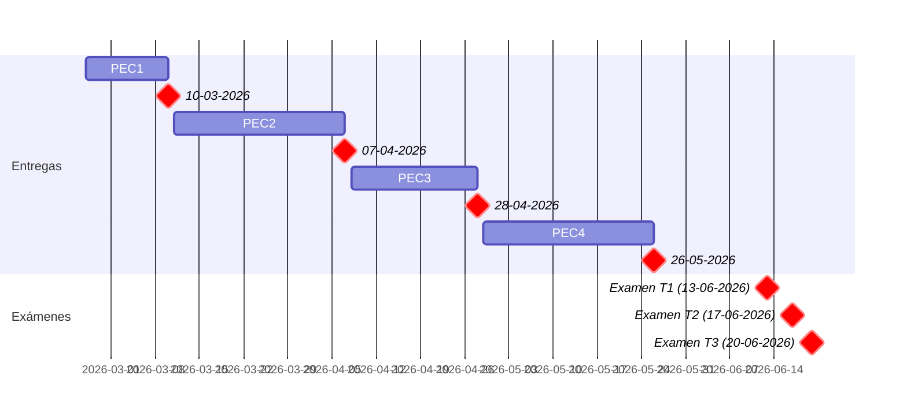

# Fundamentos físicos de la informática (25/26-2)

- [Información sobre la asignatura](#información-sobre-la-asignatura)
- [Archivo de exámenes](#archivo-de-exámenes)
- [Calendario de entregas](#calendario-de-entregas)
- [Resumen de calificaciones](#resumen-de-calificaciones)
- [Recursos de aprendizaje](#recursos-de-aprendizaje)
	- [PEC1](#pec1)
	- [PEC2](#pec2)
	- [PEC3](#pec3)
	- [PEC4](#pec4)

## Información sobre la asignatura

- **Código**: 75.611
- **Curso**: 2025/26 (2º semestre)
- **Tipo**: Básica
- **Método de evaluación**: Examen (65%) + Evaluación continua (35%)
- **Créditos**: 6
- [**Plan docente**](https://apps.uoc.edu/PlaDocent/PlaDocent?Semestre=20251&SignatureCode=75.611&Context=3&Locale=es)

>

>	
Leyenda de calificaciones

>
>	- **Matrícula de Honor (M)**: 9 a 10
>	- **Sobresaliente (EX)**: 9 a 10
>	- **Notable (NO)**: 7 a 8,99
>	- **Aprobado ( )**: 5 a 6,99
>	- **Suspendido (SU)**: 0 a 4,99
>

## Calendario de entregas

esto está bien

## Resumen de calificaciones

<table>
	<tr>
		<th>BLOQUE</th>
		<th>ACTIVIDAD</th>
		<th>CALIFICACIÓN</th>
		<th>CALIFICACIÓN PONDERADA</th>
	</tr>
	<tr>
		<td rowspan="4">
			<strong>Evaluación continua (EC)</strong> (35%)
		</td>
		<td>
			<a href="pec1">
				PEC1 - ¿Qué es la memoria en una holocubierta? Descubrir que la luz tiene memoria
			</a>
			(25%)
		</td>
		<td>24,30 / 25,00 (A)</td>
		<td rowspan="4">
			

				<strong>Calificación total PEC</strong>:
				 
				- / 100,00
			

			 
			

				<strong>Calificación ponderada EC</strong>:
				 
				- / 3,50
			
	
		</td>
	</tr>
	<tr>
		<td>
			<a href="pec2">
				PEC2 - Transformar un circuito complejo en una fuente y una resistencia, para saber cuándo podremos volver a poner en marcha el ordenador
			</a>
			(25%)
		</td>
		<td>- / 25,00 ( )</td>
	</tr>
	<tr>
		<td>
			<a href="pec3">
				PEC3 - Descubrir el origen de la electricidad
			</a>
			(25%)
		</td>
		<td>- / 25,00 ( )</td>
	</tr>
	<tr>
		<td>
			<a href="pec4">
				PEC4 - Descubrir cómo crear electricidad y de dónde viene la magia de la electrónica
			</a>
			(25%)
		</td>
		<td>- / 25,00 ( )</td>
	</tr>
	<tr>
		<td>
			<a href="examen">
				<strong>Examen</strong>
			</a> (65%)
		</td>
		<td colspan="1"></td>
		<td>- / 10,00</td>
		<td>- / 6,50</td>
	</tr>
	<tr>
		<td colspan="3"></td>	
		<td></td>
	</tr>
	<tr>
		<td colspan="3">
			<strong>CALIFICACIÓN FINAL</strong>
		</td>
		<td>- / 10,00 ( )</td>
	</tr>
</table>

## Recursos de aprendizaje

>[!NOTE]
>- No se incluyen los archivos `pdf` en el repositorio para evitar posibles problemas de copyright.

### PEC1

- [**Óptica y fotónica: la ciencia de la luz**](https://aprenentatge.recursos.uoc.edu/continguts/pdf/PID_00288403.pdf) ([resumen](pec1/recursos/README.md))

### PEC2

- [**Circuitos eléctricos: conceptos fundamentales**](https://aprenentatge.recursos.uoc.edu/continguts/pdf/PID_00288414.pdf) ([resumen](pec2/recursos/circuitos_electronicos.md))
	- [**Vídeos de apoyo de la UOC sobre este recursos**](https://campus.uoc.edu/webapps/aulaca/classroom/Proxy.action;jsessionid=DF58830D45F91EC2C196AF8E593559D4.linyola.uoc.es-aulaca?s=7b61dba0a9ffac5d605cb3d229f24026638319181a66d6513bde6b3e7d34837408cdb6df4456d3a6d2558ebfc6f99227c764b5ed1783c22b01e3d83471afbd06&subjectId=894048&classroomId=898297&linkType=resource-url&redirectUrl=%2Fwebapps%2FUocBLTI_c%2FBLTIConsumer%3Fprovider%3Dprovider_pilots_elearn%26forcehttps%3D1%26s%3D7b61dba0a9ffac5d605cb3d229f24026638319181a66d6513bde6b3e7d34837408cdb6df4456d3a6d2558ebfc6f99227c764b5ed1783c22b01e3d83471afbd06%26container%3DDOMAIN.898297%26forcehttps%3D1%26instanceId%3DEPC.206118%26typeAula%3Dtransitcomenta%26overwriteUrl%3D1%26%26launchurlold%3Dl00208%26pilotapp%3Dpresenta%26blogtype%3DtermesCondicions%26force_course_code%3Dgoogle_site-https-sites_google_comauoc_edudoctorat-video%26launchurl%3Dl00205%26concaturl%3Dpresenta%2Findex.php&javascriptDisabled=false)
- [**Circuitos RLC: análisis en corriente continua**](https://aprenentatge.recursos.uoc.edu/continguts/pdf/PID_00288412.pdf) ([resumen](pec2/recursos/circuitos_rlc.md))
	- [**Vídeos de apoyo de la UOC sobre este recursos**](https://campus.uoc.edu/webapps/aulaca/classroom/Proxy.action;jsessionid=DF58830D45F91EC2C196AF8E593559D4.linyola.uoc.es-aulaca?s=7b61dba0a9ffac5d605cb3d229f24026638319181a66d6513bde6b3e7d34837408cdb6df4456d3a6d2558ebfc6f99227c764b5ed1783c22b01e3d83471afbd06&subjectId=894048&classroomId=898297&linkType=resource-url&redirectUrl=%2Fwebapps%2FUocBLTI_c%2FBLTIConsumer%3Fprovider%3Dprovider_pilots_elearn%26s%3D7b61dba0a9ffac5d605cb3d229f24026638319181a66d6513bde6b3e7d34837408cdb6df4456d3a6d2558ebfc6f99227c764b5ed1783c22b01e3d83471afbd06%26forcehttps%3D1%26container%3DDOMAIN.898297%26forcehttps%3D1%26instanceId%3DEPC.206118%26typeAula%3Dtransitcomenta%26overwriteUrl%3D1%26%26launchurlold%3Dl00208%26pilotapp%3Dpresenta%26blogtype%3DtermesCondicions%26force_course_code%3Dgoogle_site-https-sites_google_comauoc_edudoctorat-videomodulo2%26launchurl%3Dl00205%26concaturl%3Dpresenta%2Findex.php&javascriptDisabled=false)

### PEC3

- [**Electrostática: la base de la electricidad**](https://aprenentatge.recursos.uoc.edu/continguts/pdf/PID_00290383.pdf) ([resumen](pec3/recursos/README.md))

### PEC4

- [**Magnetostática e inducción electromagnética**](https://aprenentatge.recursos.uoc.edu/continguts/pdf/PID_00290385.pdf) ([resumen](pec4/recursos/magnetostatica_e_induccion_electromagnetica.md))
- [**Materiales y dispositivos semiconductores: la base de la física informática**](https://aprenentatge.recursos.uoc.edu/continguts/pdf/PID_00290381.pdf) ([resumen](pec4/recursos/materiales_y_dispositivos_semiconductores.md))

