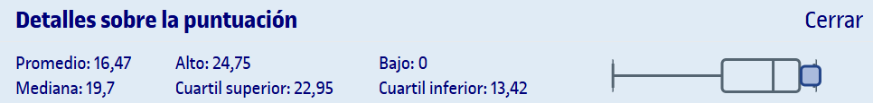

# PEC1 - ¿Qué es la memoria en una holocubierta? Descubrir que la luz tiene memoria

Para realizar esta PEC, hay que resolver los ejercicios que se detallan en el archivo `enunciado.pdf` y entregarlos en formato `.pdf` ([`entrega_evaluada.pdf`](entrega_evaluada.pdf)). Recomiendo realizar la PEC en LaTeX o Typst debido a la cantidad de fórmulas que se deben introducir.

## Recursos de aprendizaje

>[!NOTE]
>- No se incluyen los archivos `pdf` en el repositorio para evitar posibles problemas de copyright.

- [**Óptica y fotónica: la ciencia de la luz**](https://aprenentatge.recursos.uoc.edu/continguts/pdf/PID_00288403.pdf) ([resumen](pec1/recursos/README.md))

--- 

## Resultado

### Calificación

<table>
	<thead>
		<tr>
			<th>EVALUABLE</th>
			<th>C. ORIGINAL</th>
			<th>C. SOBRE 10</th>
		</tr>
	</thead>
	<tbody>
		<tr>
			<td>Entrega PDF</td>
			<td>24,30 / 25,00</td>
			<td>9,72 / 10,00</td>
		</tr>
	</tbody>
</table>

### Detalles sobre la puntuación

