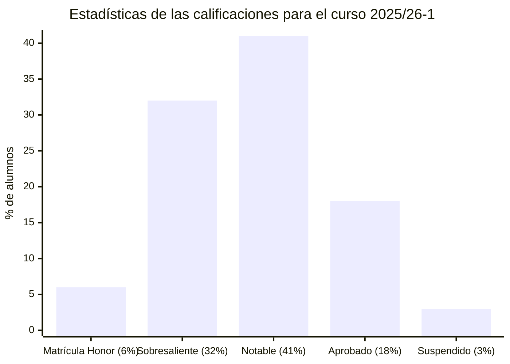

# Grafos y complejidad (25/26-1)

## Información sobre la asignatura

- **Curso**: 2025/26 (1º semestre)
- **Tipo**: Obligatoria
- **Método de evaluación**: Examen (65%) + Evaluación continua (35%)
- **Créditos**: 6
- [**Plan docente**](https://apps.uoc.edu/PlaDocent/PlaDocent?Semestre=20251&SignatureCode=75.569&Context=3&Locale=es)

>

>	
Leyenda de calificaciones

>
>	- **Matrícula de Honor (M)**: 9 a 10
>	- **Sobresaliente (EX)**: 9 a 10
>	- **Notable (NO)**: 7 a 8,99
>	- **Aprobado (A)**: 5 a 6,99
>	- **Suspendido (SU)**: 0 a 4,99
>

## Resumen de calificaciones

>[!NOTE]
>- La calificación final es la que aparece en mi expediente. No tiene por qué ser, necesariamente, el resultado de la suma de las calificaciones ponderadas de los bloques.

<table>
	<tr>
		<th>BLOQUE</th>
		<th>ACTIVIDAD</th>
		<th>PARTE</th>
		<th>CALIFICACIÓN</th>
		<th>CALIFICACIÓN PONDERADA</th>
	</tr>
	<tr>
		<td rowspan="6">
			<strong>Evaluación continua (EC)</strong> (35%)
		</td>
		<td rowspan="2">
			<a href="pec1">
				PEC1 - Las redes, omnipresentes
			</a>
			(33%)
		</td>
		<td>
			<a href="pec1">
				Actividad
			</a>
		</td>
		<td>- / 25,00 ( )</td>
		<td rowspan="6">
			

				<strong>Calificación total PEC</strong>:
				 
				- / 100,00
			

			 
			

				<strong>Calificación ponderada EC</strong>:
				 
				- / 3,50
			
	
		</td>
	</tr>
	<tr>
		<td>
			<a href="pec1">
				Cuestionario
			</a>
		</td>
		<td>- / 8,00 ( )</td>
	</tr>
	<tr>
		<td rowspan="2">
			<a href="pec2">
				PEC2 - Analizando una red
			</a>
			(33%)
		</td>
		<td>
			<a href="pec2">
				Actividad
			</a>
		</td>
		<td>- / 25,00 ( )</td>
	</tr>
	<tr>
		<td>
			<a href="pec2">
				Cuestionario
			</a>
		</td>
		<td>- / 8,00 ( )</td>
	</tr>
	<tr>
		<td rowspan="2">
			<a href="pec3">
				PEC3 - Los límites de la computación
			</a>
			(34%)
		</td>
		<td>
			<a href="pec3">
				Actividad
			</a>
		</td>
		<td> / 26,00 ( )</td>
	</tr>
	<tr>
		<td>
			<a href="pec3">
				Cuestionario
			</a>
		</td>
		<td>- / 8,00 ( )</td>
	</tr>
	<tr>
		<td>
			<a href="examen">
				<strong>Examen</strong>
			</a> (65%)
		</td>
		<td colspan="2"></td>
		<td>- / 10,00</td>
		<td>- / 6,50</td>
	</tr>
	<tr>
		<td colspan="4"></td>	
		<td></td>
	</tr>
	<tr>
		<td colspan="4">
			<strong>CALIFICACIÓN FINAL</strong>
		</td>
		<td>- / 10,00 (M)</td>
	</tr>
</table>

## Recursos de aprendizaje

>[!NOTE]
>- No se incluyen los archivos `pdf` en el repositorio para evitar posibles problemas de copyright.
>- Con el permiso de [Carlos Cactus](https://t.me/carlos_cactus), he añadido los recursos Sin Espinas que están disponibles públicamente.

### PEC1

- [**Conceptos previos: funciones y algoritmos**](https://aprenentatge.recursos.uoc.edu/continguts/pdf/PID_00267021.pdf) ([resumen](pec1/recursos/sin_espinas-fundamentos_matematicos.pdf))
- [**Fundamentos de grafos**](https://aprenentatge.recursos.uoc.edu/continguts/pdf/PID_00267019.pdf) ([Sin Espinas](pec1/recursos/sin_espinas-fundamentos_de_grafos_y_recorridos.pdf))
- [**Recorridos y conectividad**](https://aprenentatge.recursos.uoc.edu/continguts/pdf/PID_00267016.pdf) ([Sin Espinas](pec1/recursos/sin_espinas-fundamentos_de_grafos_y_recorridos.pdf))

### PEC2

- [**Árboles**](https://aprenentatge.recursos.uoc.edu/continguts/pdf/PID_00267020.pdf) ([Sin Espinas](pec2/recursos/sin_espinas-arboles.pdf))
- [**Grafos eulerianos y grafos hamiltonianos**](https://aprenentatge.recursos.uoc.edu/continguts/pdf/PID_00267017.pdf) ([Sin Espinas](pec2/recursos/sin_espinas-grafos_eulerianos_y_hamiltonianos.pdf))

### PEC3

- [**Complejidad computacional**](https://aprenentatge.recursos.uoc.edu/continguts/pdf/PID_00267022.pdf) ([resumen](pec3/recursos/complejidad_computacional.md))
- [**Problemas intratables**](https://aprenentatge.recursos.uoc.edu/continguts/pdf/PID_00293142.pdf) ([resumen](pec3/recursos/problemas_intratables.md))
