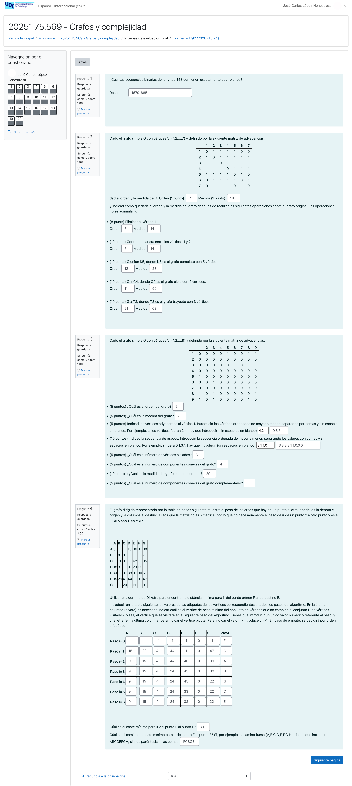
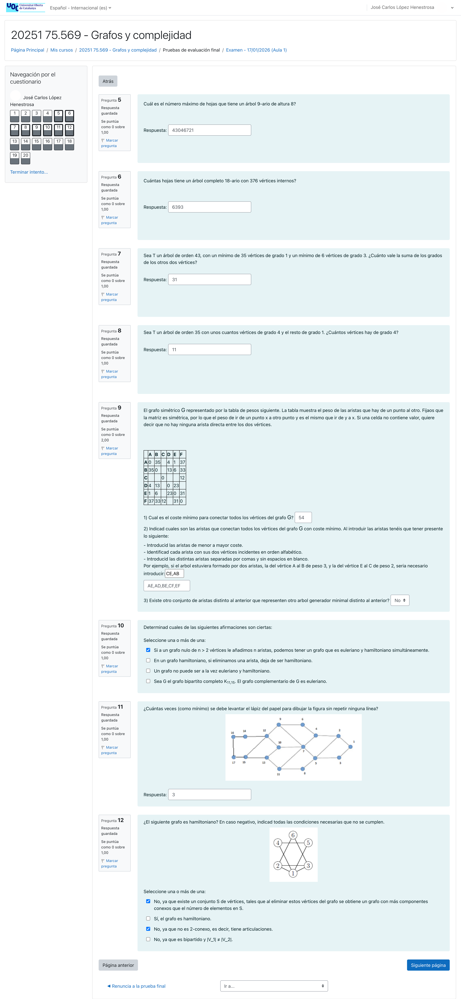
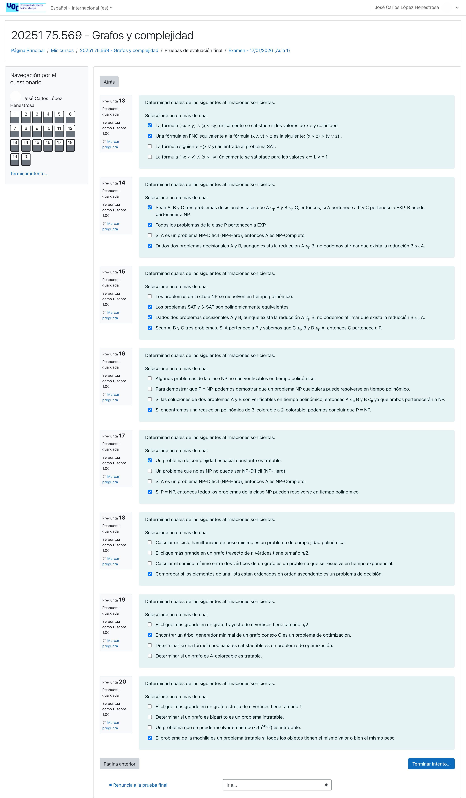

# EXAMEN Grafos y complejidad (25/26-2)

>[!NOTE]
>- Este examen fue realizado en el primer turno (17/01/2026). 
>- No hay un examen modelo para cada turno, ya que cada alumno tiene un examen distinto en Moodle. Por este motivo, esta asignatura no cuenta con un índice de exámenes como el de otras, como lógica o administración y gestión de organizaciones. No obstante, he añadido algunos exámenes que he podido hallar en el [grupo no oficial de Telegram](https://t.me/+MD1OBqbfDu5hYWNkw). Se encuentran en el directorio [archivo](archivo).
>- Los exámenes almacenados en  el directorio [archivo](archivo) NO están corregidos.

## Índice

- [Desglose de páginas](#desglose-de-ejercicios)
	- [Página 1](#página-1) (ejercicios 1-4)
	- [Página 2](#página-2) (ejercicios 5-12)
	- [Página 3](#página-3) (ejercicios 13-20)
- [Orientaciones para el examen](#orientaciones-para-el-examen)
- [Resultado](#resultado)
	- [Calificación](#calificación)

 

## Desglose de ejercicios

[Entrega](entrega.pdf)

### Página 1

	
Captura de los ejercicios 1-4

### Página 2

	
Captura de los ejercicios 5-12

### Página 3

	
Captura de los ejercicios 13-20

## Orientaciones para el examen

>[!NOTE]
>Estas orientaciones fueron dadas al alumnado a través de un anuncio oficial en la plataforma el 11/01/2026.

El examen final durará 2 horas y será un cuestionario online en la plataforma Moodle. Consistirá en 20 ejercicios, que serán semejantes a los que ya habéis resuelto en las tres PEC's del curso. No habrá ejercicios de respuesta libre o en los que haya que justificar los cálculos.

Las preguntas del cuestionario serán aleatorias: cada estudiante recibirá un enunciado diferente.

El criterio de penalizaciones por respuestas incorrectas es el siguiente:

* Preguntas tipo test con una única opción correcta. La respuesta correcta otorga 1 punto y si la respuesta es incorrecta resta 0,33.

* Preguntas tipo test con varias opciones correctas/multiopción. La puntuación de la pregunta depende del número de respuestas correctas en total:

	- Si sólo hay una respuesta correcta, marcarla otorga 1 punto. Cada respuesta incorrecta marcada resta 0,33.

	- Si hay dos respuestas correctas, cada respuesta correcta marcada otorga 0,5 puntos. Cada respuesta incorrecta marcada resta 0,5.

	- Si hay tres respuestas correctas, cada respuesta correcta marcada otorga 0,33 puntos. Si se marca la respuesta incorrecta, se resta 1 punto.

	- Si las cuatro respuestas son correctas, cada respuesta marcada otorga 0,25 puntos.

	- Preguntas de respuesta abierta, en las que se tienen que meter uno o varios números. Se dividirá la puntuación a partes iguales entre todas las respuestas pedidas. La puntuación por respuesta incorrecta será 0.

En cuanto a los recursos que se pueden consultar durante el examen, se permite sólo la consulta de los apuntes de la asignatura en papel. En cambio, no se permite el acceso a estos recursos en formato electrónico, o a cualquier otro recurso digital. Solo se permite el uso de calculadora NO programable y que NO pueda almacenar o transmitir información. No se permite el uso de teléfono, gafas de sol, o auriculares.

---

## Resultado

### Calificación

- **Calificación**: 10,00 / 10,00
- **Letra (escala internacional)**: A