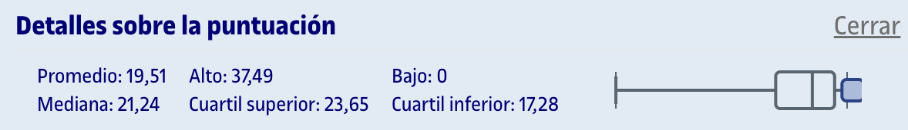
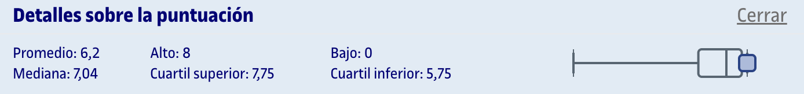

# PEC1 - Las redes, omnipresentes

Esta PEC se compone de dos partes:
1. [**Entrega PDF**](entrega_evaluada.pdf) (80%): Ejercicios de desarrollo detallados en el archivo [`enunciado.pdf`](enunciado.pdf).
2. [**Cuestionario**](cuestionario.png) (20%): Preguntas tipo test sobre el contenido que aparece en los recursos de aprendizaje de la PEC. Se permiten dos intentos, de los cuales cuenta el de mayor puntuación.

## Recursos de aprendizaje

>[!NOTE]
>- No se incluyen los archivos `pdf` en el repositorio para evitar posibles problemas de copyright.
>- Con el permiso de [Carlos Cactus](https://t.me/carlos_cactus), he añadido los recursos Sin Espinas que están disponibles públicamente.

- [**Conceptos previos: funciones y algoritmos**](https://aprenentatge.recursos.uoc.edu/continguts/pdf/PID_00267021.pdf) ([resumen](recursos/sin_espinas-fundamentos_matematicos.pdf))
- [**Fundamentos de grafos**](https://aprenentatge.recursos.uoc.edu/continguts/pdf/PID_00267019.pdf) ([Sin Espinas](recursos/sin_espinas-fundamentos_de_grafos_y_recorridos.pdf))
- [**Recorridos y conectividad**](https://aprenentatge.recursos.uoc.edu/continguts/pdf/PID_00267016.pdf) ([Sin Espinas](recursos/sin_espinas-fundamentos_de_grafos_y_recorridos.pdf))

--- 

## Resultado

### Calificación

<table>
	<thead>
		<tr>
			<th>EVALUABLE</th>
			<th>C. ORIGINAL</th>
			<th>C. SOBRE 10</th>
		</tr>
	</thead>
	<tbody>
		<tr>
			<td>Entrega PDF</td>
			<td>24,34 / 25,00</td>
			<td>9,74 / 10,00</td>
		</tr>
		<tr>
			<td>Cuestionario</td>
			<td>8,00 / 8,00</td>
			<td>10,00 / 10,00</td>
		</tr>
		<tr><td colspan="3"></td></tr>
		<tr>
			<td><strong>TOTAL</strong></td>
			<td><strong>32,34 / 33,00</strong></td>
			<td><strong>9,80 / 10,00 (A)</strong></td>
		</tr>
	</tbody>
</table>

### Detalles sobre la puntuación

>[!WARNING]
>Los detalles sobre esta puntuación están mal. Desconozco el motivo por el que se presentan así en el aula.

**Entrega PDF**

**Cuestionario**

