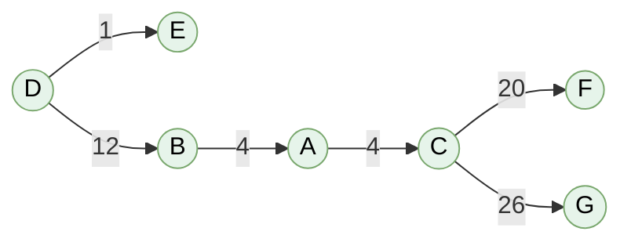

# Resolución de la PEC1 - Las redesomnipresentes

## Índice

- [Ejercicio 1](#ejercicio-1)
	- [¿Cuál es el orden del grafo?](#cuál-es-el-orden-del-grafo)
	- [¿Cuál es la medida de un grafo?](#cuál-es-la-medida-de-un-grafo)
	- [Indicad los vértices adyacentes al vértice 1](#indicad-los-vértices-adyacentes-al-vértice-1-introducid-los-vértices-ordenados-de-mayor-a-menor-separados-por-comas-y-sin-espacio-en-blanco)
	- [Indicad la secuencia de grado](#indicad-la-secuencia-de-grados-introducid-la-secuencia-ordenada-de-mayor-a-menor-separando-los-valores-con-comas-y-sin-espacios-en-blanco)
	- [¿Cuál es el número de vértices aislados?](#cuál-es-el-número-de-vértices-aislados)
	- [¿Cuál es el número de componentes conexas del grafo?](#cuál-es-el-número-de-componentes-conexas-del-grafo)
	- [¿Cuál es la medida del grafo complementario?](#cuál-es-la-medida-del-grafo-complementario)
	- [¿Cuál es el número de componentes conexas del grafo complementario?](#cuál-es-el-número-de-componentes-conexas-del-grafo-complementario)
- [Ejercicio 2](#ejercicio-2)
	- [¿Cuál es el orden de $G$?](#cuál-es-el-orden-de-g)
	- [¿Cuál es la medida de $G$?](#cuál-es-la-medida-de-g)
	- [Indicad cómo quedaría el orden y la medida del grafo al eliminar el vértice 1](#indicad-cómo-quedaría-el-orden-y-la-medida-del-grafo-al-eliminar-el-vértice-1)
	- [Indicad cómo quedaría el orden y la medida del grafo al contraer la arista entre los vértices 1 y 2](#indicad-cómo-quedaría-el-orden-y-la-medida-del-grafo-al-contraer-la-arista-entre-los-vértices-1-y-2)
	- [Indicad cómo quedaría el orden y la medida del grafo $G$ al hacer una unión con $K_5$, donde $K_5$ es el grafo completo con 5 vértices](#indicad-cómo-quedaría-el-orden-y-la-medida-del-grafo-g-al-hacer-una-unión-con-k_5-donde-k_5-es-el-grafo-completo-con-5-vértices)
	- [Indicad cómo quedaría el orden y la medida del grafo $G + C_4$, donde $C_4$ es el grafo ciclo con 4 vértices](#indicad-cómo-quedaría-el-orden-y-la-medida-del-grafo-g--c_4-donde-c_4-es-el-grafo-ciclo-con-4-vértices)
	- [Indicad cómo quedaría el orden y la medida del grafo $G \times T_3$, donde $T_3$ es el grafo trayecto con 3 vértices](#indicad-cómo-quedaría-el-orden-y-la-medida-del-grafo-g-times-t_3-donde-t_3-es-el-grafo-trayecto-con-3-vértices)
- [Ejercicio 3](#ejercicio-3)
	- [Utilizad el algoritmo de Dijkstra para encontrar la distancia mínima para ir del punto orígen D al de destino G.](#utilizad-el-algoritmo-de-dijkstra-para-encontrar-la-distancia-mínima-para-ir-del-punto-orígen-d-al-de-destino-g)
	- [Rellenad la tabla con los valores de las etiquetas de los vértices correspondientes a todos los pasos del algoritmo.](#rellenad-la-tabla-con-los-valores-de-las-etiquetas-de-los-vértices-correspondientes-a-todos-los-pasos-del-algoritmo)
	- [¿Cuál es el coste mínimo para ir del punto D al punto G?](#cuál-es-el-coste-mínimo-para-ir-del-punto-d-al-punto-g)
	- [¿Cuál es el camino de coste mínimo para ir del punto D al punto G?](#cuál-es-el-camino-de-coste-mínimo-para-ir-del-punto-d-al-punto-g)

## Ejercicio 1

>[!NOTE]
>Decir _grafo simple_ es lo mismo que decir _grafo no dirigido_.

Dado el grafo simple $G$ con vértices $V=\set{1,2,\dots,9}$ y definido por la siguiente matriz de adyacencias:

<table>
	<tr>
		<th></th>
		<th>1</th>
		<th>2</th>
		<th>3</th>
		<th>4</th>
		<th>5</th>
		<th>6</th>
		<th>7</th>
		<th>8</th>
		<th>9</th>
	</tr>
	<tr>
		<th>1</th>
		<td>0</td>
		<td>0</td>
		<td>0</td>
		<td>0</td>
		<td>0</td>
		<td>0</td>
		<td>0</td>
		<td>0</td>
		<td>1</td>
	</tr>
	<tr>
		<th>2</th>
		<td>0</td>
		<td>0</td>
		<td>0</td>
		<td>0</td>
		<td>0</td>
		<td>0</td>
		<td>0</td>
		<td>0</td>
		<td>0</td>
	</tr>
	<tr>
		<th>3</th>
		<td>0</td>
		<td>0</td>
		<td>0</td>
		<td>0</td>
		<td>0</td>
		<td>1</td>
		<td>1</td>
		<td>1</td>
		<td>0</td>
	</tr>
	<tr>
		<th>4</th>
		<td>0</td>
		<td>0</td>
		<td>0</td>
		<td>0</td>
		<td>0</td>
		<td>0</td>
		<td>0</td>
		<td>0</td>
		<td>0</td>
	</tr>
	<tr>
		<th>5</th>
		<td>0</td>
		<td>0</td>
		<td>0</td>
		<td>0</td>
		<td>0</td>
		<td>1</td>
		<td>0</td>
		<td>0</td>
		<td>1</td>
	</tr>
	<tr>
		<th>6</th>
		<td>0</td>
		<td>0</td>
		<td>1</td>
		<td>0</td>
		<td>1</td>
		<td>0</td>
		<td>0</td>
		<td>1</td>
		<td>1</td>
	</tr>
	<tr>
		<th>7</th>
		<td>0</td>
		<td>0</td>
		<td>1</td>
		<td>0</td>
		<td>0</td>
		<td>0</td>
		<td>0</td>
		<td>1</td>
		<td>0</td>
	</tr>
	<tr>
		<th>8</th>
		<td>0</td>
		<td>0</td>
		<td>1</td>
		<td>0</td>
		<td>0</td>
		<td>1</td>
		<td>1</td>
		<td>0</td>
		<td>1</td>
	</tr>
	<tr>
		<th>9</th>
		<td>1</td>
		<td>0</td>
		<td>0</td>
		<td>0</td>
		<td>1</td>
		<td>1</td>
		<td>0</td>
		<td>1</td>
		<td>0</td>
	</tr>
</table>

### ¿Cuál es el orden del grafo?

El **orden** de un grafo es el **número de vértices** que tiene. Como $V=\set{1,2,\dots,9}$, el grafo $G$ tiene $\boxed{9}$ vértices.

 

### ¿Cuál es la medida de un grafo?

La **medida** de un grafo es el **número de aristas** que tiene. Para calcularla, sumamos todos los 1 en la matriz y dividimos entre 2, ya que el grafo es no dirigido; es decir, la arista entre el nodo $i$ y el nodo $j$ aparece en las posiciones $(i,j)$ y $(j,i)$, pero es la misma arista.

**Grado de cada vértice** (suma de las aristas de cada vértice)

- **Vértice 1**: $\set{9} \to \text{deg}_G (1) = 1$
- **Vértice 2**: $\emptyset \to \text{deg}_G (2) = 0$
- **Vértice 3**: $\set{6,7,8} \to \text{deg}_G (3) = 3$
- **Vértice 4**: $\emptyset \to \text{deg}_G (4) = 0$
- **Vértice 5**: $\set{6,9} \to \text{deg}_G (5) = 2$
- **Vértice 6**: $\set{3,5,8,9} \to \text{deg}_G (6) = 4$
- **Vértice 7**: $\set{3,8} \to \text{deg}_G (7) = 2$
- **Vértice 8**: $\set{3,6,7,9} \to \text{deg}_G (8) = 4$
- **Vértice 9**: $\set{1,5,6,8} \to \text{deg}_G (9) = 4$

Grado total del grafo = $1+0+3+0+2+4+2+4+4=20$

Número de aristas = $20 / 2 = \boxed{10}$

### Indicad los vértices adyacentes al vértice 1

>[!NOTE]
>Introducid los vértices ordenados de mayor a menor, separados por comas y sin espacio en blanco.

De la matriz de adyacencia, la fila 1 es:

$$[0,0,0,0,0,0,0,0,1]$$

Esto significa que el vértice 1 solo es adyacente al vértice 9.

Ordenados de mayor a menor: solo $\boxed{9}$.

### Indicad la secuencia de grados

>[!NOTE]
>Introducid la secuencia ordenada de mayor a menor, separando los valores con comas y sin espacios en blanco.

Calculamos el grado de cada vértice sumando los 1 en cada fila de la matriz:

- **Vértice 1**: $\set{9} \to \text{deg}_G (1) = 1$
- **Vértice 2**: $\emptyset \to \text{deg}_G (2) = 0$
- **Vértice 3**: $\set{6,7,8} \to \text{deg}_G (3) = 3$
- **Vértice 4**: $\emptyset \to \text{deg}_G (4) = 0$
- **Vértice 5**: $\set{6,9} \to \text{deg}_G (5) = 2$
- **Vértice 6**: $\set{3,5,8,9} \to \text{deg}_G (6) = 4$
- **Vértice 7**: $\set{3,8} \to \text{deg}_G (7) = 2$
- **Vértice 8**: $\set{3,6,7,9} \to \text{deg}_G (8) = 4$
- **Vértice 9**: $\set{1,5,6,8} \to \text{deg}_G (9) = 4$

Secuencia de grados: $\boxed{4,4,4,3,2,2,1,0,0}$

 

### ¿Cuál es el número de vértices aislados?

Un vértice aislado es un vértice de grado 0.

De la secuencia de grados calculada, tenemos los siguientes vértices con grado 0:

- Vértice 2
- Vértice 4

En total, son $\boxed{2}$ **vértices aislados**.

 

### ¿Cuál es el número de componentes conexas del grafo?

Una componente conexa es un conjunto máximo de vértices donde **cualquier par** está unido por algún camino (ignorando duplicidades).

Para calcular el número, usamos la matriz de adyecencia y la lista de aristas:

Aristas (no dirigidas):

- $1-9$
- $3-6, 3-7, 3-8$
- $5-6, 5-9$
- $6-9, 6-9$
- $7-8$
- $8-9$

Agrupamos vértices conectados empezando por el vértice 1:

- 1 está conectado a 9.  
- 9 está conectado a 5, 6, 8.  
- 5 está conectado a 6.  
- 6 está conectado a 3, 8.  
- 3 está conectado a 7.  
- 7 está conectado a 8.

Así que $\set{1,9,5,6,8,3,7}$ forman una componente conexa.

**Vértices restantes**: 2 y 4 (aislados).

**Componentes conexas** ($C$):

1. $C_1 = \set{1,9,5,6,8,3,7}$
2. $C_2 = \set{2}$
3. $C_3 = \set{4}$

Número de componentes conexas: $\boxed{3}$

 

### ¿Cuál es la medida del grafo complementario?

El grafo complementario $\overline{G}$ de un grafo simple $G$ tiene el mismo conjunto de vértices, y dos vértices son adyacentes en $\overline{G}$ si y solo si no son adyacentes en $G$.

**Datos de $G$**:

- Orden $n = 9$
- Número de aristas $m = 10$

**Fórmula**:

En el grafo complementario $\overline{G}$, el número de aristas es:

$$\frac{n(n-1)}{2} = \frac{9 \cdot 8}{2} = 36$$

El grafo complementario tendrá la siguiente medida (número de aristas):

$$m(\overline{G}) = 36 - m(G) = 36 - 10 = \boxed{26}$$

 

### ¿Cuál es el número de componentes conexas del grafo complementario?

Dado un grafo simple $G$ con $n$ vértices, su **complementario** $\overline{G}$ tiene las mismas $n$ etiquetas y une exactamente los pares de vértices que no estaban unidos en $G$ (sin bucles).

Calculamos el grado de cada vértice sumando los 1 en cada fila de la matriz:

- **Vértice 1**: $\set{9} \to \text{deg}_G (1) = 1$
- **Vértice 2**: $\emptyset \to \text{deg}_G (2) = 0$
- **Vértice 3**: $\set{6,7,8} \to \text{deg}_G (3) = 3$
- **Vértice 4**: $\emptyset \to \text{deg}_G (4) = 0$
- **Vértice 5**: $\set{6,9} \to \text{deg}_G (5) = 2$
- **Vértice 6**: $\set{3,5,8,9} \to \text{deg}_G (6) = 4$
- **Vértice 7**: $\set{3,8} \to \text{deg}_G (7) = 2$
- **Vértice 8**: $\set{3,6,7,9} \to \text{deg}_G (8) = 4$
- **Vértice 9**: $\set{1,5,6,8} \to \text{deg}_G (9) = 4$

Para hallar los grados de $\overline{G}$, aplicamos la fórmula $\text{deg}_{\overline{G}}(v) = 8 - \text{deg}_G (v)$

- **Vértice 1**: $\text{deg}_{\overline{G}} (1) = 7$
- **Vértice 2**: $\text{deg}_{\overline{G}} (2) = 8$
- **Vértice 3**: $\text{deg}_{\overline{G}} (3) = 5$
- **Vértice 4**: $\text{deg}_{\overline{G}} (4) = 8$
- **Vértice 5**: $\text{deg}_{\overline{G}} (5) = 6$
- **Vértice 6**: $\text{deg}_{\overline{G}} (6) = 4$
- **Vértice 7**: $\text{deg}_{\overline{G}} (7) = 6$
- **Vértice 8**: $\text{deg}_{\overline{G}} (8) = 4$
- **Vértice 9**: $\text{deg}_{\overline{G}} (9) = 4$

Si nos fijamos, 2 y 4 son **vértices universales** en $\overline{G}$, ya que tienen grado 8. Es decir, están conectados con todos los demás vértices excepto sí mismo, por eso no tiene grado 9.

Si un grafo tiene un vértice universal, entonces es conexo para cualesquiera $u, v$ vértices:

- O bien $u$ y $v$ están unidos directamente (longitud 1).
- O bien existe el camino de longitud 2 ($u - x - v$), donde $x$ es un vértice universal (2 o 4). 

Demostración para cualquier par $u,v$:
- Si hay arista $uv$, tenemos un camino directo de longitud 1.
- Si **no** hay arista $uv$, como $x$ es universal, sí existen las aristas $ux$ y $xv$. Por tanto, $u \to x \to v$ es un camino de longitud 2.

Como conclusión, si hay un vértice universal, el grafo $\overline{G}$ tiene $\boxed{1 \text{ componente conexa}}$.

---

 

## Ejercicio 2

Dado el grafo simple $\overline{G}$ con vértices $V=\set{1,2,...,9}$ y definido por la siguiente matriz de adyacencias:

<table>
	<thead>
		<tr>
			<th></th>
			<th>1</th>
			<th>2</th>
			<th>3</th>
			<th>4</th>
			<th>5</th>
			<th>6</th>
			<th>7</th>
			<th>8</th>
			<th>9</th>
		</tr>
	</thead>
	<tbody>
		<tr>
			<th>1</th>
			<td>0</td>
			<td>1</td>
			<td>1</td>
			<td>1</td>
			<td>0</td>
			<td>1</td>
			<td>1</td>
			<td>0</td>
			<td>0</td>
		</tr>
		<tr>
			<th>2</th>
			<td>1</td>
			<td>0</td>
			<td>0</td>
			<td>0</td>
			<td>0</td>
			<td>1</td>
			<td>1</td>
			<td>1</td>
			<td>0</td>
		</tr>
		<tr>
			<th>3</th>
			<td>1</td>
			<td>0</td>
			<td>0</td>
			<td>0</td>
			<td>1</td>
			<td>1</td>
			<td>1</td>
			<td>0</td>
			<td>1</td>
		</tr>
		<tr>
			<th>4</th>
			<td>1</td>
			<td>0</td>
			<td>0</td>
			<td>0</td>
			<td>1</td>
			<td>1</td>
			<td>1</td>
			<td>1</td>
			<td>1</td>
		</tr>
		<tr>
			<th>5</th>
			<td>0</td>
			<td>0</td>
			<td>1</td>
			<td>1</td>
			<td>0</td>
			<td>0</td>
			<td>0</td>
			<td>0</td>
			<td>1</td>
		</tr>
		<tr>
			<th>6</th>
			<td>1</td>
			<td>1</td>
			<td>1</td>
			<td>1</td>
			<td>0</td>
			<td>0</td>
			<td>1</td>
			<td>1</td>
			<td>0</td>
		</tr>
		<tr>
			<th>7</th>
			<td>1</td>
			<td>1</td>
			<td>1</td>
			<td>1</td>
			<td>0</td>
			<td>1</td>
			<td>0</td>
			<td>1</td>
			<td>1</td>
		</tr>
		<tr>
			<th>8</th>
			<td>0</td>
			<td>1</td>
			<td>0</td>
			<td>1</td>
			<td>0</td>
			<td>1</td>
			<td>1</td>
			<td>0</td>
			<td>0</td>
		</tr>
		<tr>
			<th>9</th>
			<td>0</td>
			<td>0</td>
			<td>1</td>
			<td>1</td>
			<td>1</td>
			<td>0</td>
			<td>1</td>
			<td>0</td>
			<td>0</td>
		</tr>
	</tbody>
</table>

### ¿Cuál es el orden de $G$?

El orden de un grafo es su **número de vértices**, el cual está definido por $V = \set{1,2,\dots,9}$. Por lo tanto, su orden es $\boxed{9}$.

 

### ¿Cuál es la medida de $G$?

La **medida** de un grafo es su **número de aristas**. Esto es la suma de grados entre 2, ya que es no dirigido.

- $\text{deg}_G (1) = 5$
- $\text{deg}_G (2) = 4$
- $\text{deg}_G (3) = 5$
- $\text{deg}_G (4) = 6$
- $\text{deg}_G (5) = 3$
- $\text{deg}_G (6) = 6$
- $\text{deg}_G (7) = 7$
- $\text{deg}_G (8) = 4$
- $\text{deg}_G (9) = 4$

Suma de grados = $5+4+5+6+3+6+7+4+4 = 44$

**Medida** = Número de aristas $m = 44/2 = \boxed{22}$

 

### Indicad cómo quedaría el orden y la medida del grafo al eliminar el vértice 1

**Orden ($n'$)**:

Al eliminar el vértice 1, también eliminamos todas las aristas relacionadas con en él.

El nuevo conjunto de vértices pasa a ser $V'=\set{2,3,4,5,6,7,8,9}$, lo cual tiene un **orden** de $\boxed{8}$.

**Medida ($m'$)**:

El vértice 1 contenía 5 aristas, por lo que las restamos de las 22 que teníamos anteriormente (ninguna se cuenta dos veces porque todas son relativas al vértice 1). Por lo tanto, la nueva **medida** es $22 - 5 = \boxed{17}$.

**Conclusión**:

- **Orden**: $\boxed{8}$
- **Medida**: $\boxed{17}$

 

### Indicad cómo quedaría el orden y la medida del grafo al contraer la arista entre los vértices 1 y 2

**Orden ($n'$)**: Al contraer la arista $1-2$, se fusionan 1 y 2 en un mismo vértice, así que el grafo pasa de 9 a 8 vértices; es decir, de grado 9 a $\boxed{8}$.

**Medida ($m'$)**:

Al contraer la arista $1-2$, se fusionan los dos vértices $u$ y $v$ en uno nuevo (digamos $w$). La arista $uv$ pasa a ser una **lazo** $ww$ (una arista que va de un vértice hacia sí mismo). En un grafo simple, los lazos **no están permitidos**, por lo que se elimina la arista $ww$.

Además, se fusionan en una sola arista $w-x$ las aristas $u-x$ y $v-x$ que van hacia un vecino común $x$, ya que en un grafo simple no pueden haber **paralelas** (entre dos vértices puede haber, a lo sumo, una arista).

Dicho lo cual, al contraer la arista $1-2$ se elimina esa arista, ya que es una lazo, y, como los vértices 1 y 2 tienen dos vecinos comunes (6 y 7), los pares $(1,6), (2,6)$ y $(1,7), (2,7)$, tal y como se puede apreciar aquí:

- Arista $1–3 \to v_{12}-3$
- Arista $1–4 \to v_{12}-4$
- Arista $1–6 \to v_{12}-6$
- Arista $1–7 \to v_{12}-7$
- Arista $2–6 \to v_{12}-3$ (repetida, se cuenta una vez)
- Arista $2–7 \to v_{12}-7$ (repetida, se cuenta una vez)
- Arista $2–8 \to v_{12}-8$

Por lo tanto, dichos pares se fusionan en una sola arista cada uno (en total, 2). Dado que el grafo original tiene 22 aristas, podemos hallar la medida del grafo resultante:

$$m' = 22 - 1 - 2 = \boxed{19}$$

**Conclusión**:

- **Orden**: $\boxed{8}$
- **Medida**: $\boxed{19}$

 

### Indicad cómo quedaría el orden y la medida del grafo $G$ al hacer una unión con $K_5$, donde $K_5$ es el grafo completo con 5 vértices

Este ejercicio consiste en realizar una **unión disjunta** de grafos, la cual consiste en tomar **copias disjuntas**: duplicar los grafos de modo que sus conjuntos de vértices no compartan nombres.

Por ejemplo, imaginemos que tenemos estos grafos:

- $G$: vértices $\set{1,2}$, arista $1-2$.
- $H$: vértices $\set{1,3}$, arista $1-3$.

Si hiciéramos una unión tal cual, el 1 de $G$ y el 1 de $H$ chocarían. Por lo tanto, tomamos copias disjuntas renombrando $H: \set{1',3'}$ con arista $1'-3'$.

Entonces,

$$G \cup H \text{ (disjunto)}: \quad V = \set{1,2,1',3'}, E = \set{1-2,1'-3'}$$

Donde $V$ son los vértices y $E$ es el conjunto de aristas.

Una vez aclarado este concepto, pasamos a realizar el ejercicio.

**Orden ($n'$)**: 

$$n(G \cup K_5) = n(G) + n(K_5) = 9 + 5 = \boxed{14}$$

**Medida ($m'$)**:

Se suman las aristas:

$$
m(G \cup K_5)
= m(G) + m(K_5)
= 22 + \binom{5}{2}
= 22 + 10
= \boxed{32}
$$

**Conclusión**:

- **Orden**: $\boxed{14}$
- **Medida**: $\boxed{32}$

 

### Indicad cómo quedaría el orden y la medida del grafo $G + C_4$, donde $C_4$ es el grafo ciclo con 4 vértices

Un **grado ciclo**, denotado como $C_n$, es un grafo simple con $n \ge 3$ vértices dispuestos en un anillo, donde cada vértice se conecta exactamente con **dos vecinos**: el anterior y el siguiente. En este caso, $C_4$ tiene forma de cuadrado (4 vértices y 4 aristas).

La suma de dos grafos consiste en realizar un _join_. Para ello, seguimos estos pasos:

1. Tomar **copias disjuntas** de $G$ y $C$ para que sus vértices no se solapen.
2. Añadir todas las aristas entre cada vértice de $G$ y cada vértice de $H$.

Una vez aclarados estos conceptos, pasamos a realizar el ejercicio.

**Orden ($n'$)**:

$$n(G+C_4) = n(G) + n(C_4) = 9 + 4 = \boxed{13}$$

**Medida ($m'$)**:

El _join_ añade todas las aristas entre $G$ y $C_4$. Eso son

$$n(G) \cdot n(C_4) = 9 \cdot 4 = \boxed{36}$$

aristas nuevas, además de las que ya había en cada grafo:

$$m(G + C_4) = m(G) + m(C_4) + 9 \cdot 4 = 22 + 4 + 36 = \boxed{62}$$

**Conclusión**:

- **Orden**: $\boxed{13}$
- **Medida**: $\boxed{62}$

 

### Indicad cómo quedaría el orden y la medida del grafo $G \times T_3$, donde $T_3$ es el grafo trayecto con 3 vértices

Un **grafo trayecto** con $n$ vértices (denotado por $P_n$) es una **cadena lineal** de $n$ vértices:

$$v_1 - v_2 - \dots - v_n$$

En este caso, $T_3$ tiene:

- $n(T_3) = 3$
- $m(T_3) = n - 1 = 3 - 1 = 2$ (se puede ver mejor en la secuencia lineal, donde solo hay dos conexiones).
- **Secuencia lineal** $a - b - c$: grados $(1,2,1)$.

El ejercicio nos pide realizar el producto cartesiano (normalmente, se denota con $\square$ en vez de $\times$), por lo que procedemos a hallar el orden y la medida.

**Orden ($n'$)**:

$$n' = n(G) \cdot n(T_3) = 9 \cdot 3 = \boxed{27}$$

**Medida ($m'$)**:

$$m(G \square T_3) = m(G) \cdot n(T_3) + n(G) \cdot m(T_3)$$

Entonces:

$$m = 22 \cdot 3 + 9 \cdot 2 = 66 + 18 = \boxed{84}$$

**Conclusión**:

- **Orden**: $\boxed{27}$
- **Medida**: $\boxed{84}$

---

 

## Ejercicio 3

### Utilizad el algoritmo de Dijkstra para encontrar la distancia mínima para ir del punto orígen D al de destino G

>[!IMPORTANT]
>Recomiendo ver [este vídeo](https://www.youtube.com/watch?v=18-XBTyR-N8) del canal [Aprende Sin Espinas](https://www.youtube.com/@AprendeSinEspinas) en el que explica este algoritmo de una forma visual, breve y clara.

>[!NOTE]
>El grafo dirigido representado por la tabla de pesos siguiente muestra el peso de los arcos que hay de un punto al otro; donde la fila denota el origen y la columna el destino. Fijaos que la matriz no es simétrica, por lo que no necesariamente el peso de ir de un punto x a otro punto y es el mismo que ir de y a x.

<table>
	<tr>
		<th></th>
		<th>A</th>
		<th>B</th>
		<th>C</th>
		<th>D</th>
		<th>E</th>
		<th>F</th>
		<th>G</th>
	</tr>
	<tr>
		<th>A</th>
		<td>0</td>
		<td>40</td>
		<td>4</td>
		<td></td>
		<td></td>
		<td>7</td>
		<td>34</td>
	</tr>
	<tr>
		<th>B</th>
		<td>4</td>
		<td>0</td>
		<td>18</td>
		<td>31</td>
		<td>34</td>
		<td>43</td>
		<td>48</td>
	</tr>
	<tr>
		<th>C</th>
		<td></td>
		<td></td>
		<td>0</td>
		<td></td>
		<td></td>
		<td>20</td>
		<td>26</td>
	</tr>
	<tr>
		<th>D</th>
		<td>23</td>
		<td>12</td>
		<td></td>
		<td>0</td>
		<td>1</td>
		<td>39</td>
		<td></td>
	</tr>
	<tr>
		<th>E</th>
		<td>21</td>
		<td></td>
		<td></td>
		<td>14</td>
		<td>0</td>
		<td>34</td>
		<td></td>
	</tr>
	<tr>
		<th>F</th>
		<td></td>
		<td></td>
		<td>42</td>
		<td></td>
		<td></td>
		<td>0</td>
		<td></td>
	</tr>
	<tr>
		<th>G</th>
		<td>47</td>
		<td></td>
		<td>19</td>
		<td></td>
		<td></td>
		<td>11</td>
		<td>0</td>
	</tr>
</table>

 

### Rellenad la tabla con los valores de las etiquetas de los vértices correspondientes a todos los pasos del algoritmo

>[!NOTE]
>En la última columna (pivote) es necesario indicar cuál es el vértice de peso mínimo del conjunto de vértices que no están en el conjunto U de vértices visitados, o sea, el vértice que se visitará en el siguiente paso del algoritmo. Tienes que introducir un único valor númerico referente al peso, y una letra (en la última columna) para indicar el vértice pivote. Para indicar el valor $\infty$ introduce un -1. En caso de empate, se decidirá por orden alfabético.

Para rellenar la tabla, primero tenemos que entender el grafo dado, el cual es **ponderado**. Esto significa que recorrer las aristas tiene un coste especificado (en unidades arbitrarias) en las celdas de la matriz.

Cada columna de la tabla de abajo almacena el coste del mejor camino encontrado para cada vértice hasta el momento actual de la ejecución del algoritmo. La ejecución se guía a través del pivote, que va pasando de vértice en vértice por cada iteración. Cada fila representa una iteración que empieza con la exploración de las adyacencias del pivote seleccionado de las filas de la matriz de adyacencias y termina con la selección de un nuevo pivote. El contenido de las celdas representa los costes acumulados de los caminos hasta ese vértice.

Para saber qué pivote tenemos que seleccionar para la siguiente iteración, tenemos que seleccionar el vértice con en el menor coste de la fila. Por ejemplo, si vemos el paso $i=1$, vemos que el pivote es el vértice E ya que tiene el menor valor de todos los vértices **que aún no hemos usado como pivote**.

Pasos para ejecutar el algoritmo en este ejercicio:

0. Dado el vértice de origen D, asignamos un valor -1 ($\infty$) a los vértices que no son el vértice de origen. Le asignamos un 0 al vértice D en toda la columna. El vértice pivote es D (0), ya que es el que tiene el menor valor de la fila. Hay que recordar que -1 representa a $\infty$. 
1. Como nos ha costado 0 llegar hasta el pivote D desde D, no tenemos que sumar los costes del camino acumulado. Como no podemos mejorar el coste del camino hacia el vértice C y G, mantenemos los mismos valores anteriores. El menor valor de la fila correspondiente a un vértice que aún no ha sido pivote es E (1), por lo que lo tomamos como pivote.
2. El coste acumulado del origen (E) es 1, por lo que para calcular el coste acumulado de este paso tendremos que sumar el coste acumulado de E + el coste acumulado de los vértices en la fila E. El coste acumulado para ir desde E hasta F es 34, por lo que 34 + 1 = 35 para ir hasta F. El menor valor de la fila correspondiente a un vértice que aún no ha sido pivote es B (12), por lo que lo tomamos como pivote.
3. Como ha costado 12 unidades llegar hasta B, sumamos ese valor más el resto de valores respectivos a la fila B. Hay que recordar que solo se actualizan el valor de los vértices en caso de que el resultado sea MENOR respecto al del paso anterior y que no hayan sido usados como pivotes. En este caso, actualizamos A (12 + 4 = 16), C (12 + 18 = 30) y G (12 + 48 = 60). El menor valor de la fila correspondiente a un vértice que aún no ha sido pivote es A (12), por lo que lo tomamos como pivote.
4. Como nos ha costado 16 unidades llegar hasta A, sumamos ese valor más el resto de valores respectivos a la fila A. En este caso, actualizamos C (16 + 4 = 20), F (16 + 7 = 23) y G (16 + 34 = 50). El menor valor de la fila correspondiente a un vértice que aún no ha sido pivote es C (20), por lo que lo tomamos como pivote.
5. Como nos ha costado 20 unidades llegar hasta C, sumamos ese valor más el resto de valores respectivos a la fila C. En este caso, actualizamos solo G (20 + 26 = 46). El menor valor de la fila correspondiente a un vértice que aún no ha sido pivote es F (23), por lo que lo tomamos como pivote.
6. Como nos ha costado 23 unidades llegar hasta F, sumamos ese valor más el resto de valores respectivos a la fila F. En este caso, no actualizamos el valor de G, ya que $46 < \infty$. El menor valor de la fila correspondiente a un vértice que aún no ha sido pivote es G (46), por lo que lo tomamos como pivote.

<table>
	<tr>
		<th></th>
		<th>A</th>
		<th>B</th>
		<th>C</th>
		<th>D</th>
		<th>E</th>
		<th>F</th>
		<th>G</th>
		<th>Pivot</th>
	</tr>
	<tr>
		<td><strong>Paso i=0</strong></td>
		<td>-1</td>
		<td>-1</td>
		<td>-1</td>
		<td>0</td>
		<td>-1</td>
		<td>-1</td>
		<td>-1</td>
		<td>D</td>
	</tr>
	<tr>
		<td><strong>Paso i=1</strong></td>
		<td>23</td>
		<td>12</td>
		<td>-1</td>
		<td>0</td>
		<td>1</td>
		<td>39</td>
		<td>-1</td>
		<td>E</td>
	</tr>
	<tr>
		<td><strong>Paso i=2</strong></td>
		<td>22</td>
		<td>12</td>
		<td>-1</td>
		<td>0</td>
		<td>1</td>
		<td>35</td>
		<td>-1</td>
		<td>B</td>
	</tr>
	<tr>
		<td><strong>Paso i=3</strong></td>
		<td>16</td>
		<td>12</td>
		<td>30</td>
		<td>0</td>
		<td>1</td>
		<td>35</td>
		<td>60</td>
		<td>A</td>
	</tr>
	<tr>
		<td><strong>Paso i=4</strong></td>
		<td>16</td>
		<td>12</td>
		<td>20</td>
		<td>0</td>
		<td>1</td>
		<td>23</td>
		<td>50</td>
		<td>C</td>
	</tr>
	<tr>
		<td><strong>Paso i=5</strong></td>
		<td>16</td>
		<td>12</td>
		<td>20</td>
		<td>0</td>
		<td>1</td>
		<td>23</td>
		<td>46</td>
		<td>F</td>
	</tr>
	<tr>
		<td><strong>Paso i=6</strong></td>
		<td>16</td>
		<td>12</td>
		<td>20</td>
		<td>0</td>
		<td>1</td>
		<td>23</td>
		<td>46</td>
		<td>G</td>
	</tr>
</table>

 

### ¿Cuál es el coste mínimo para ir del punto D al punto G?

**46**. Tomamos el valor del último paso (fila) de la tabla, ya que son los valores mínimos para ir desde el punto D a cualquier otro punto del grafo.

 

### ¿Cuál es el camino de coste mínimo para ir del punto D al punto G?

>[!NOTE]
>Si, por ejemplo, el camino fuese (A,B,C,D,E,F,G,H), tienes que introducir ABCDEFGH, sin los paréntesis ni las comas.

Para determinar el camino, tenemos que fijarnos en los vértices pivote de la tabla de arriba y consultar en el grafo el coste asociado para ir desde dicho vértice al siguiente. Sabemos que partimos desde D, por lo que vamos estableciendo las siguientes conexiones:

<table>
	<tr>
		<th>DESDE (FILA)</th>
		<th>HASTA (COLUMNA)</th>
		<th>COSTE (MIRAR GRAFO)</th>
		<th>OBSERVACIONES</th>
	</tr>
	<tr>
		<td>D</td>
		<td>E</td>
		<td>1</td>
		<td></td>
	</tr>
	<tr>
		<td>E</td>
		<td>B</td>
		<td>-</td> 
		<td>No hay conexión. Tomamos el anterior vértice como referencia en el siguiente paso.</td> 
	</tr> 
	<tr>
		<td>D</td>
		<td>B</td>
		<td>12</td> 
		<td></td> 
	</tr> 
	<tr>
		<td>B</td>
		<td>A</td>
		<td>4</td> 
		<td></td> 
	</tr> 
	<tr>
		<td>A</td>
		<td>C</td>
		<td>4</td> 
		<td></td> 
	</tr> 
	<tr>
		<td>C</td>
		<td>F</td>
		<td>20</td> 
		<td></td> 
	</tr> 
	<tr>
		<td>F</td>
		<td>G</td>
		<td>-</td> 
		<td>No hay conexión. Tomamos el anterior vértice como referencia en el siguiente paso.</td> 
	</tr> 
	<tr>
		<td>C</td>
		<td>G</td>
		<td>26</td>
		<td></td> 
	</tr>
</table>

Para comprobar si lo hemos hecho bien, sumamos los costes para ir desde D hasta G (12 + 4 + 4 + 26 = 46). Como podemos comprobar, obtenemos el mismo resultado que el que se muestra en el paso 6 de la tabla al aplicar el algoritmo de Dijkstra, por lo que el camino $\boxed{\text{DBACG}}$ es **correcto**.
