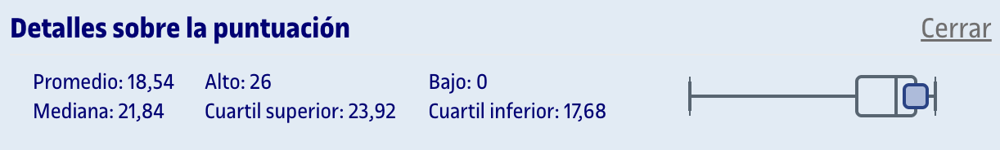
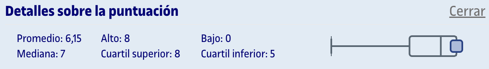

# PEC3 - Los límites de la computación

Esta PEC se compone de dos partes:
1. [**Entrega PDF**](entrega_evaluada.pdf) (80%): Ejercicios de desarrollo detallados en el archivo [`enunciado.pdf`](enunciado.pdf).
2. [**Cuestionario**](cuestionario.png) (20%): Preguntas tipo test sobre el contenido que aparece en los recursos de aprendizaje de la PEC. Se permiten dos intentos, de los cuales cuenta el de mayor puntuación.

## Recursos de aprendizaje

>[!NOTE]
>- No se incluyen los archivos `pdf` en el repositorio para evitar posibles problemas de copyright.

- [**GraphSolver**](https://graphsolver.com)
- [**Complejidad computacional**](https://aprenentatge.recursos.uoc.edu/continguts/pdf/PID_00267022.pdf)
- [**Problemas intratables**](https://aprenentatge.recursos.uoc.edu/continguts/pdf/PID_00293142.pdf)

--- 

## Resultado

### Calificación

<table>
	<thead>
		<tr>
			<th>EVALUABLE</th>
			<th>C. ORIGINAL</th>
			<th>C. SOBRE 10</th>
		</tr>
	</thead>
	<tbody>
		<tr>
			<td>Entrega PDF</td>
			<td>23,92 / 25,00</td>
			<td>9,57 / 10,00</td>
		</tr>
		<tr>
			<td>Cuestionario</td>
			<td>8,00 / 8,00</td>
			<td>10,00 / 10,00</td>
		</tr>
		<tr><td colspan="3"></td></tr>
		<tr>
			<td><strong>TOTAL</strong></td>
			<td><strong>31,92 / 33,00</strong></td>
			<td><strong>9,67 / 10,00 (A)</strong></td>
		</tr>
	</tbody>
</table>

### Detalles sobre la puntuación

Entrega PDF

Cuestionario

