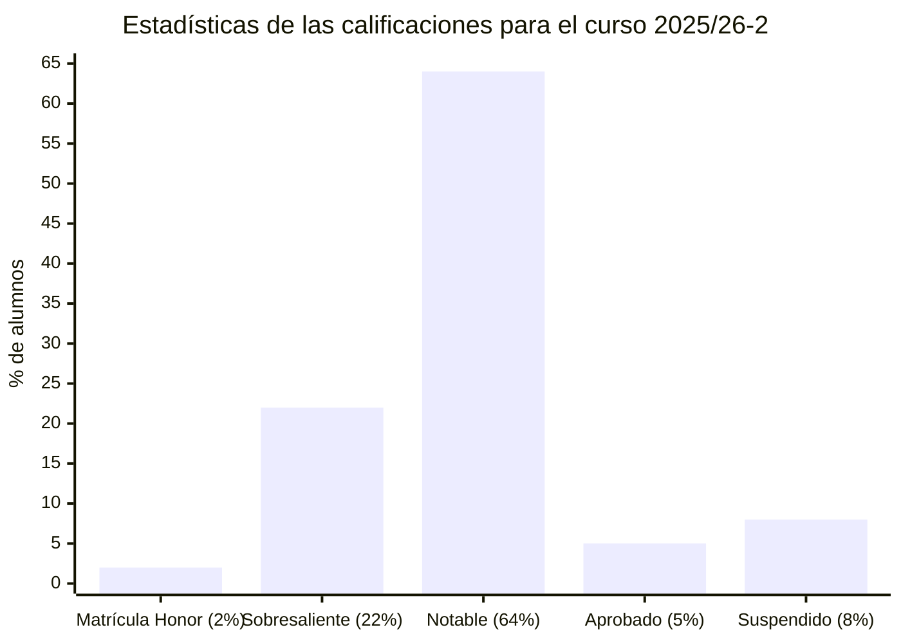
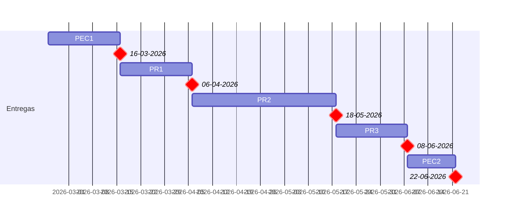

# Ingeniería del software de componentes y sistemas distribuidos (25/26-2)

- [Información sobre la asignatura](#información-sobre-la-asignatura)
- [Calendario de entregas](#calendario-de-entregas)
- [Resumen de calificaciones](#resumen-de-calificaciones)
- [Recursos de aprendizaje](#recursos-de-aprendizaje)
	- [PEC1](#pec1)
	- [PEC2](#pec2)
	- [PR1](#pr1)
	- [PR2](#pr2)
	- [PR3](#pr3)

## Información sobre la asignatura

- **Código**: 75.587
- **Curso**: 2025/26 (2º semestre)
- **Tipo**: Obligatoria (itinerario ingeniería del software) / Optativa (en caso de cursar otro itinerario)
- **Método de evaluación**: Evaluación continua (100%: PR 70% + PEC 30%)
- **Créditos**: 6
- [**Plan docente**](https://apps.uoc.edu/PlaDocent/PlaDocent?Semestre=20252&SignatureCode=75.587&Context=3&Locale=es)

>

>	
Leyenda de calificaciones

>
>	- **Matrícula de Honor (M)**: 9 a 10
>	- **Sobresaliente (EX)**: 9 a 10
>	- **Notable (NO)**: 7 a 8,99
>	- **Aprobado (A)**: 5 a 6,99
>	- **Suspendido (SU)**: 0 a 4,99
>

## Calendario de entregas

## Resumen de calificaciones

>[!NOTE]
>- La calificación final es la que aparece en mi expediente. No tiene por qué ser, necesariamente, el resultado de la suma de las calificaciones ponderadas de los bloques.

<table>
	<tr>
		<th>BLOQUE</th>
		<th>DESGLOSE</th>
		<th>ACTIVIDAD</th>
		<th>CALIFICACIÓN</th>
		<th>CALIFICACIÓN PONDERADA</th>
	</tr>
	<tr>
		<td rowspan="5">
			<strong>Evaluación continua (EC)</strong> (100%)
		</td>
		<td rowspan="2">
			<strong>
				Pruebas de evaluación continua (PEC)
			</strong>
			(30%)
		</td>
		<td>
			<a href="pec1">
				PEC1 - Arquitecturas de software distribuido: una solución para cada problema
			</a> (50%)
		</td>
		<td>
			45,00 / 50,00 (A)
		</td>
		<td rowspan="5">
			

				<strong>Calificación total PEC</strong>:
				 
				92,50 / 100,00
			

			 
			

				<strong>Calificación ponderada PEC</strong>:
				 
				2,78 / 3,00
			

			 
			 
			

				<strong>Calificación total PR</strong>:
				 
				83,75 / 100,00
			

			 
			

				<strong>Calificación ponderada PR</strong>:
				 
				5,86 / 7,00
			

			 
			 
			

				<strong>Calificación ponderada EC</strong>:
				 
				8,64 / 10,00
			

		</td>
	</tr>
	<tr>
		<td>
			<a href="pec2">
				PEC2 - CD/CI, DevOps y cultura ágil: buenas prácticas para el desarrollo de software distribuido
			</a> (50%)
		</td>
		<td>
			47,50 / 50,00 (A)
		</td>
	</tr>
	<tr>
		<td rowspan="3">
			<strong>Práctica (PR)</strong> 
			(70%)
		</td>	
		<td>
			<a href="pr1">
				PR1 - Arquitecturas hexagonales y diseño de microservicios: una relación bien avenida
			</a> (25%)
		</td>
		<td>25,00 / 25,00 (A)</td>
	</tr>
	<tr>
		<td>
			<a href="pr2">
				PR2 - De la creación a la interconexión de microservicios
			</a> (50%)
		</td>
		<td>
			47,50 / 50,00 (A)
		</td>
	</tr>
	<tr>
		<td>
			<a href="pr3">
				PR3 - Calidad del software distribuido: inherente, transversal y crítico
			</a> (25%)
		</td>
		<td>
			11,25 / 25,00 (C-)*
		</td>
	</tr>
	<tr>
		<td colspan="4">
		</td>
		<td></td>
	</tr>
	<tr>
		<td colspan="4">
			<strong>CALIFICACIÓN FINAL</strong>
		</td>
		<td>8,6 / 10,00 (B)</td>
	</tr>
</table>

>(*) La baja calificación de la PR3 se debe a un problema con el plazo de la entrega, no a su calidad en sí. Al compararla con la [solucion oficial](pr3/solucion_oficial.pdf), debería tener la máxima puntuación.

## Recursos de aprendizaje

>[!NOTE]
>- No se incluyen los archivos `pdf` en el repositorio para evitar posibles problemas de copyright.
>- Las actividades están ordenadas por fecha de realización.

### PEC1

- [**Richards & Ford. Fundamentals of Software Architecture. O'Reilly, 2020. ISBN: 1492043443**](https://learning.oreilly.com/library/view/fundamentals-of-software/9781492043447/)
	- Chapter 1. Introduction
	- Chapter 2. Architectural Thinking
	- Chapter 4. Architecture Characteristics Defined
	- Chapter 5. Identifying Architectural Characteristics
	- Chapter 8. Component-Based Thinking
	- Chapter 9. Foundations
	- Chapter 10. Layered Architecture Style
	- Chapter 11. Pipeline Architecture Style
	- Chapter 12. Microkernel Architecture Style
	- Chapter 13. Service-Based Architecture Style
	- Chapter 14. Event-Driven Architecture Style
	- Chapter 16. Orchestration-Driven Service-Oriented Architecture
	- Chapter 17. Microservices Architecture
	- Chapter 18. Choosing the Appropriate Architecture Style

### PR1

- [**Richardson, Chris. Microservices patterns. Shelter Island, NY: Manning Publications, 2019. ISBN: 1617294543**](https://learning.oreilly.com/library/view/microservices-patterns/9781617294549/OEBPS/Text/01.html?sso_link=yes&sso_link_from=uoc-edu#ch01)
	- Chapter 1. Escaping monolithic hell
	- Chapter 2.1.2. Overview of architectural styles (hasta el final del capítulo)
	- Chapter 3. Interprocess communication in a microservice architecture
	- Chapter 5. Designing business logic in a microservice architecture
- [**A pattern language for microservices**](https://microservices.io/patterns/index.html) (opcional)

### PR2

- [**Richardson, Chris. Microservices patterns. Shelter Island, NY: Manning Publications, 2019. ISBN: 1617294543**](https://learning.oreilly.com/library/view/microservices-patterns/9781617294549/OEBPS/Text/01.html?sso_link=yes&sso_link_from=uoc-edu#ch01)
	- Chapter 6. Developing business logic with event sourcing (sección 6.3 no es necesaria)
	- Chapter 7. Implementing queries in a microservice architecture
	- Chapter 8. External API patterns (sección 8.3 no es necesaria)
- [**Implementación de la aplicación FTGO**](https://github.com/microservices-patterns/ftgo-application) (opcional)

### PR3

- [**Richardson, Chris. Microservices patterns. Shelter Island, NY: Manning Publications, 2019. ISBN: 1617294543**](https://learning.oreilly.com/library/view/microservices-patterns/9781617294549/OEBPS/Text/01.html?sso_link=yes&sso_link_from=uoc-edu#ch01)
	- Chapter 9. Testing microservices: Part 1
	- Chapter 10. Testing microservices: Part 2
- [**Richards & Ford. Fundamentals of Software Architecture. O'Reilly, 2020. ISBN: 1492043443**](https://learning.oreilly.com/library/view/fundamentals-of-software/9781492043447/)
	- Chapter 3. Modularity
	- Chapter 6. Measuring and Governing Architecture Characteristics

### PEC2

- [**Richardson, Chris. Microservices patterns. Shelter Island, NY: Manning Publications, 2019. ISBN: 1617294543**](https://learning.oreilly.com/library/view/microservices-patterns/9781617294549/OEBPS/Text/01.html?sso_link=yes&sso_link_from=uoc-edu#ch01)
	- Chapter 12. Deploying microservices
- [**Humble & Farley. Continuous Delivery: Reliable Software Releases through Build, Test, and Deployment Automation. Addison-Wesley Professional, 2010. ISBN: 9780321670250**](https://learning.oreilly.com/library/view/continuous-delivery-reliable/9780321670250/)
	- Preface
	- Foreword
	- Chapter 3. Continuous Integration
	- Chapter 5. Anatomy of the Deployment Pipeline
	- Chapter 7. The Commit Stage (**opcional**)
	- Chapter 10. Deploying and Releasing Applications
- [**Patrick Debois; John Willis; Jez Humble; Gene Kim. The DevOps Handbook. ISBN: 9781457191381**](https://learning.oreilly.com/library/view/the-devops-handbook/9781457191381/)
	- Part I - The Three Ways
