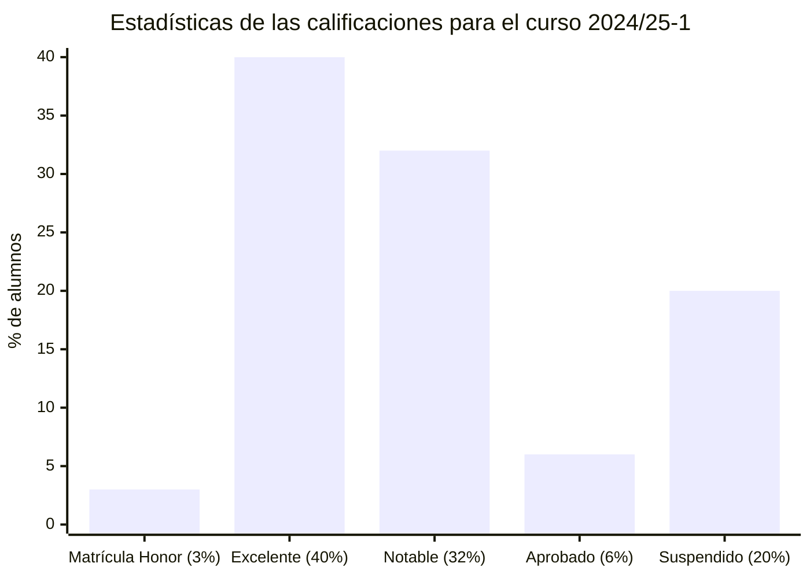

# Iniciación a las matemáticas para la ingeniería (24/25-1)

## Información sobre la asignatura

- **Curso**: 2024/25 (1º semestre)
- **Tipo**: Optativa
- **Método de evaluación**: Evaluación continua
- **Ponderación**: PEC 100% (50% Bloque 1 + 50% Bloque 2)
- **Créditos**: 6
- [**Plan docente**](https://cv.uoc.edu/tren/trenacc/web/GAT_EXP.PLANDOCENTE?any_academico=20241&cod_asignatura=75.614&idioma=CAS&pagina=PD_PREV_PORTAL)

>[!NOTE]
>- Cada PEC se divide en una Actividad Evaluable (AC). 
>- Cada AC se corresponde con un bloque del [libro](https://campus.uoc.edu/autors/MostraPDFMaterialAction.do?id=273914&hash=44d365d71c2f61ac6cb2d049701a0fb93de2211c41e2dcbaed7291589a05a02a).

## Calificación final 

9,60 / 10,00 (MH)

## Pruebas de evaluación continua (PECs)

<table>
	<tr>
		<th>PEC</th>
		<th>ACTIVIDAD</th>
		<th>CALIFICACIÓN</th>
	</tr>
	<tr>
		<td rowspan="9">
			<a href="https://github.com/HenestrosaDev/uoc-ingenieria-informatica/tree/main/iniciacion_a_las_matematicas_para_la_ingenieria_pec1">
				PEC1 - Bloque 1: Álgebra
			</a>
		</td>
		<td>
			<a href="https://github.com/HenestrosaDev/uoc-ingenieria-informatica/tree/main/iniciacion_a_las_matematicas_para_la_ingenieria/pec1/ac01_numeros">
				AC1 - Números
			</a>
		</td>
		<td>
			6,17 / 7,00 (B)
		</td>
	</tr>
	<tr>
		<td>
			<a href="https://github.com/HenestrosaDev/uoc-ingenieria-informatica/tree/main/iniciacion_a_las_matematicas_para_la_ingenieria/pec1/ac02_ecuaciones">
				AC2 - Ecuaciones
			</a>
		</td>
		<td>
			7,00 / 7,00 (A)
		</td>
	</tr>
	<tr>
		<td>
			<a href="https://github.com/HenestrosaDev/uoc-ingenieria-informatica/tree/main/iniciacion_a_las_matematicas_para_la_ingenieria/pec1/ac03_sistemas_de_ecuaciones">
				AC3 - Sistemas de ecuaciones
			</a>
		</td>
		<td>
			6,50 / 7,00 (A)
		</td>
	</tr>
	<tr>
		<td>
			<a href="https://github.com/HenestrosaDev/uoc-ingenieria-informatica/tree/main/iniciacion_a_las_matematicas_para_la_ingenieria/pec1/ac04_polinomios">
				AC4 - Polinomios
			</a>
		</td>
		<td>
			7,00 / 7,00 (A)
		</td>
	</tr>
	<tr>
		<td>
			<a href="https://github.com/HenestrosaDev/uoc-ingenieria-informatica/tree/main/iniciacion_a_las_matematicas_para_la_ingenieria/pec1/ac05_matrices">
				AC5 - Matrices
			</a>
		</td>
		<td>
			7,00 / 7,00 (A)
		</td>
	</tr>
	<tr>
		<td>
			<a href="https://github.com/HenestrosaDev/uoc-ingenieria-informatica/tree/main/iniciacion_a_las_matematicas_para_la_ingenieria/pec1/ac_recapitulacion_1">
				AC - Recapitulación 1
			</a>
		</td>
		<td>
			6,00 / 7,00 (B)
		</td>
	</tr>
	<tr>
		<td></td>
		<td></td>
	</tr>
	<tr>
		<td><strong>SUMA DE CALIFICACIONES</strong></td>
		<td><strong>39,67 / 42,00 (A)</strong></td>
	</tr>
	<tr>
		<td><strong>CALIFICACIÓN PONDERADA</strong> (50%)</td>
		<td><strong>47,23 / 50,00 (A)</strong></td>
	</tr>
	<tr>
		<td rowspan="12">
			<a href="https://github.com/HenestrosaDev/uoc-ingenieria-informatica/tree/main/iniciacion_a_las_matematicas_para_la_ingenieria/pec2">
				PEC2 - Bloque 2: Análisis
			</a>
		</td>
		<td>
			<a href="https://github.com/HenestrosaDev/uoc-ingenieria-informatica/tree/main/iniciacion_a_las_matematicas_para_la_ingenieria/pec2/ac06_funciones_polinomicas">
				AC6 - Funciones polinómicas
			</a>
		</td>
		<td>
			7,00 / 7,00 (A)
		</td>
	</tr>
	<tr>
		<td>
			<a href="https://github.com/HenestrosaDev/uoc-ingenieria-informatica/tree/main/iniciacion_a_las_matematicas_para_la_ingenieria/pec2/ac07_funciones_trigonometricas">
				AC7 - Funciones trigonométricas
			</a>
		</td>
		<td>
			7,00 / 7,00 (A)
		</td>
	</tr>
	<tr>
		<td>
			<a href="https://github.com/HenestrosaDev/uoc-ingenieria-informatica/tree/main/iniciacion_a_las_matematicas_para_la_ingenieria/pec2/ac08_funciones_exponenciales_y_logaritmicas">
				AC8 - Funciones exponenciales y logarítmicas
			</a>
		</td>
		<td>
			7,00 / 7,00 (A)
		</td>
	</tr>
	<tr>
		<td>
			<a href="https://github.com/HenestrosaDev/uoc-ingenieria-informatica/tree/main/iniciacion_a_las_matematicas_para_la_ingenieria/pec2/ac09_continuidad_de_funciones">
				AC9 - Continuidad de funciones
			</a>
		</td>
		<td>
			5,50 / 7,00 (B)
		</td>
	</tr>
	<tr>
		<td>
			<a href="https://github.com/HenestrosaDev/uoc-ingenieria-informatica/tree/main/iniciacion_a_las_matematicas_para_la_ingenieria/pec2/ac10-1_derivacion_de_funciones">
				AC10-1 - Derivación de funciones 1
			</a>
		</td>
		<td>
			7,00 / 7,00 (A)
		</td>
	</tr>
	<tr>
		<td>
			<a href="https://github.com/HenestrosaDev/uoc-ingenieria-informatica/tree/main/iniciacion_a_las_matematicas_para_la_ingenieria/pec2/ac10-2_derivacion_de_funciones">
				AC10-2 - Derivación de funciones 2
			</a>
		</td>
		<td>
			7,00 / 7,00 (A)
		</td>
	</tr>
	<tr>
		<td>
			<a href="https://github.com/HenestrosaDev/uoc-ingenieria-informatica/tree/main/iniciacion_a_las_matematicas_para_la_ingenieria/pec2/ac11-1_integracion_de_funciones">
				AC11-1 - Integración de funciones 1
			</a>
		</td>
		<td>
			7,00 / 7,00 (A)
		</td>
	</tr>
	<tr>
		<td>
			<a href="https://github.com/HenestrosaDev/uoc-ingenieria-informatica/tree/main/iniciacion_a_las_matematicas_para_la_ingenieria/pec2/ac11-2_integracion_de_funciones">
				AC11-2 - Integración de funciones 2
			</a>
		</td>
		<td>
			7,00 / 7,00 (A)
		</td>
	</tr>
	<tr>
		<td>
			<a href="https://github.com/HenestrosaDev/uoc-ingenieria-informatica/tree/main/iniciacion_a_las_matematicas_para_la_ingenieria/pec2/ac_recapitulacion_2">
				AC - Recapitulación 2
			</a>
		</td>
		<td>
			7,00 / 7,00 (A)
		</td>
	</tr>
	<tr>
		<td></td>
		<td></td>
	</tr>
	<tr>
		<td><strong>SUMA DE CALIFICACIONES</strong></td>
		<td><strong>61,50 / 63,00 (A)</strong></td>
	</tr>
	<tr>
		<td><strong>CALIFICACIÓN PONDERADA</strong> (50%)</td>
		<td><strong>48,81 / 50,00 (A)</strong></td>
	</tr>
</table>

## Recursos de aprendizaje

>[!NOTE]
>Cada bloque del libro tiene un resumen asociado en la carpeta correspondiente a su actividad.

- [**Iniciación a las matemáticas para la ingeniería**](https://campus.uoc.edu/autors/MostraPDFMaterialAction.do?id=273914&hash=44d365d71c2f61ac6cb2d049701a0fb93de2211c41e2dcbaed7291589a05a02a)