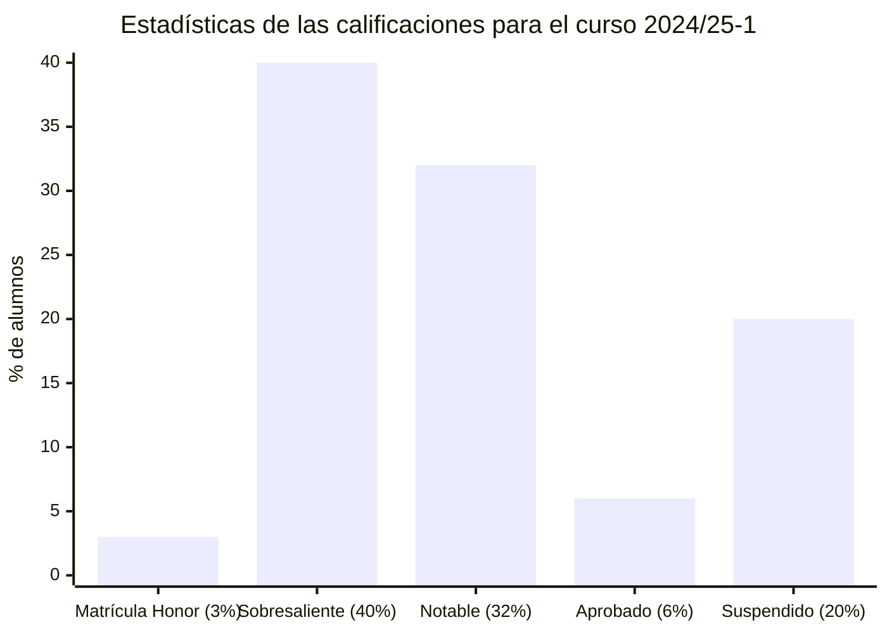
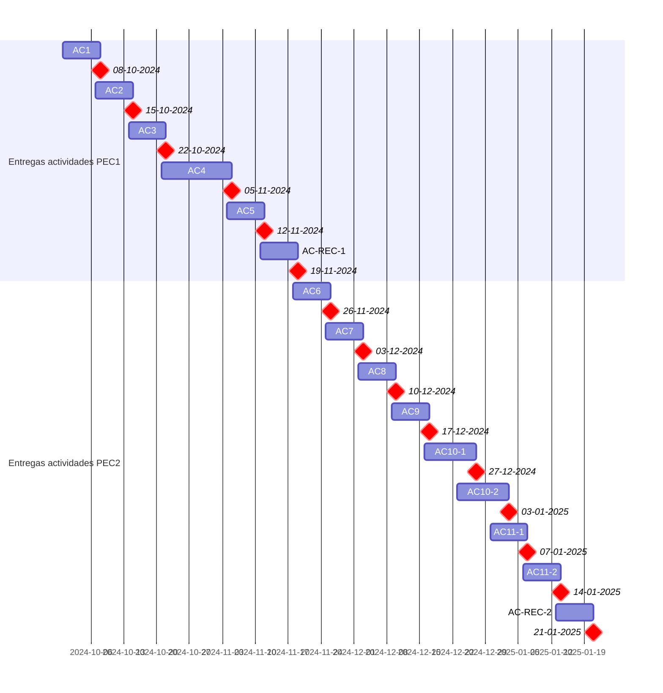

# Iniciación a las matemáticas para la ingeniería (24/25-1)

- [Información sobre la asignatura](#información-sobre-la-asignatura)
- [Calendario de entregas](#calendario-de-entregas)
- [Resumen de calificaciones](#resumen-de-calificaciones)
- [Recursos de aprendizaje](#recursos-de-aprendizaje)

## Información sobre la asignatura

- **Código**: 75.614
- **Curso**: 2024/25 (1º semestre)
- **Tipo**: Optativa
- **Método de evaluación**: Evaluación continua (100%: PEC1 50% + PEC2 50%)
- **Créditos**: 6
- [**Plan docente**](https://cv.uoc.edu/tren/trenacc/web/GAT_EXP.PLANDOCENTE?any_academico=20241&cod_asignatura=75.614&idioma=CAS&pagina=PD_PREV_PORTAL)

>

>	
Leyenda de calificaciones

>
>	- **Matrícula de Honor (M)**: 9 a 10
>	- **Sobresaliente (EX)**: 9 a 10
>	- **Notable (NO)**: 7 a 8,99
>	- **Aprobado (A)**: 5 a 6,99
>	- **Suspendido (SU)**: 0 a 4,99
>

## Calendario de entregas

## Resumen de calificaciones

>[!NOTE]
>- Cada PEC se divide en una Actividad Evaluable (AC). 
>- Cada AC se corresponde con un bloque del [libro](https://campus.uoc.edu/autors/MostraPDFMaterialAction.do?id=273914&hash=44d365d71c2f61ac6cb2d049701a0fb93de2211c41e2dcbaed7291589a05a02a).
>- Cada AC contiene un reto optativo y actividades paso a paso, que son de carácter opcional y discriminantes a la hora de obtener la matrícula de honor.
>- La calificación final es la que aparece en mi expediente. No tiene por qué ser, necesariamente, el resultado de la suma de las calificaciones ponderadas de los bloques.

<table>
	<tr>
		<th>BLOQUE</th>
		<th>DESGLOSE</th>
		<th>PRUEBA DE EVALUACIÓN CONTINUA (PEC)</th>
		<th>ACTIVIDAD</th>
		<th>CALIFICACIÓN</th>
		<th>CALIFICACIÓN PONDERADA</th>
	</tr>
	<tr>
		<td rowspan="15">
			<strong>Evaluación continua (EC)</strong> (100%)
		</td>
		<td rowspan="15">
			<strong>
				Pruebas de evaluación continua (PEC)
			</strong> 
			(100%)
		</td>
		<td rowspan="6">
			<a href="https://github.com/HenestrosaDev/uoc-ingenieria-informatica/tree/main/iniciacion_a_las_matematicas_para_la_ingenieria/pec1">
				PEC1 - Bloque 1: Álgebra
			</a> (50%)
		</td>
		<td>
			<a href="https://github.com/HenestrosaDev/uoc-ingenieria-informatica/tree/main/iniciacion_a_las_matematicas_para_la_ingenieria/pec1/ac01">
				AC1 - Números
			</a>
		</td>
		<td>
			6,17 / 7,00 (B)
		</td>
		<td rowspan="15">
			

				<strong>Calificación total PEC1</strong>:
				 
				 39,67 / 42,00
			

			 
			

				<strong>Calificación ponderada PEC1</strong>:
				 
				4,72 / 5,00
			

			 
			 
			

				<strong>Calificación total PEC2</strong>:
				 
				61,50 / 63,00
			

			 
			

				<strong>Calificación ponderada PEC2</strong>:
				 
				4,88 / 5,00
			

			 
			 
			

				<strong>Calificación ponderada EC</strong>:
				 
				9,60 / 10,00
			

		</td>
	</tr>
	<tr>
		<td>
			<a href="https://github.com/HenestrosaDev/uoc-ingenieria-informatica/tree/main/iniciacion_a_las_matematicas_para_la_ingenieria/pec1/ac02">
				AC2 - Ecuaciones
			</a>
		</td>
		<td>
			7,00 / 7,00 (A)
		</td>
	</tr>
	<tr>
		<td>
			<a href="https://github.com/HenestrosaDev/uoc-ingenieria-informatica/tree/main/iniciacion_a_las_matematicas_para_la_ingenieria/pec1/ac03">
				AC3 - Sistemas de ecuaciones
			</a>
		</td>
		<td>
			6,50 / 7,00 (A)
		</td>
	</tr>
	<tr>
		<td>
			<a href="https://github.com/HenestrosaDev/uoc-ingenieria-informatica/tree/main/iniciacion_a_las_matematicas_para_la_ingenieria/pec1/ac04">
				AC4 - Polinomios
			</a>
		</td>
		<td>
			7,00 / 7,00 (A)
		</td>
	</tr>
	<tr>
		<td>
			<a href="https://github.com/HenestrosaDev/uoc-ingenieria-informatica/tree/main/iniciacion_a_las_matematicas_para_la_ingenieria/pec1/ac05">
				AC5 - Matrices
			</a>
		</td>
		<td>
			7,00 / 7,00 (A)
		</td>
	</tr>
	<tr>
		<td>
			<a href="https://github.com/HenestrosaDev/uoc-ingenieria-informatica/tree/main/iniciacion_a_las_matematicas_para_la_ingenieria/pec1/ac_recapitulacion-1">
				AC - Recapitulación 1
			</a>
		</td>
		<td>
			6,00 / 7,00 (B)
		</td>
	</tr>
	<tr>
		<td rowspan="9">
			<a href="https://github.com/HenestrosaDev/uoc-ingenieria-informatica/tree/main/iniciacion_a_las_matematicas_para_la_ingenieria/pec2">
				PEC2 - Bloque 2: Análisis
			</a> (50%)
		</td>
		<td>
			<a href="https://github.com/HenestrosaDev/uoc-ingenieria-informatica/tree/main/iniciacion_a_las_matematicas_para_la_ingenieria/pec2/ac06">
				AC6 - Funciones polinómicas
			</a>
		</td>
		<td>
			7,00 / 7,00 (A)
		</td>
	</tr>
	<tr>
		<td>
			<a href="https://github.com/HenestrosaDev/uoc-ingenieria-informatica/tree/main/iniciacion_a_las_matematicas_para_la_ingenieria/pec2/ac07">
				AC7 - Funciones trigonométricas
			</a>
		</td>
		<td>
			7,00 / 7,00 (A)
		</td>
	</tr>
	<tr>
		<td>
			<a href="https://github.com/HenestrosaDev/uoc-ingenieria-informatica/tree/main/iniciacion_a_las_matematicas_para_la_ingenieria/pec2/ac08">
				AC8 - Funciones exponenciales y logarítmicas
			</a>
		</td>
		<td>
			7,00 / 7,00 (A)
		</td>
	</tr>
	<tr>
		<td>
			<a href="https://github.com/HenestrosaDev/uoc-ingenieria-informatica/tree/main/iniciacion_a_las_matematicas_para_la_ingenieria/pec2/ac09">
				AC9 - Continuidad de funciones
			</a>
		</td>
		<td>
			5,50 / 7,00 (B)
		</td>
	</tr>
	<tr>
		<td>
			<a href="https://github.com/HenestrosaDev/uoc-ingenieria-informatica/tree/main/iniciacion_a_las_matematicas_para_la_ingenieria/pec2/ac10-1">
				AC10-1 - Derivación de funciones 1
			</a>
		</td>
		<td>
			7,00 / 7,00 (A)
		</td>
	</tr>
	<tr>
		<td>
			<a href="https://github.com/HenestrosaDev/uoc-ingenieria-informatica/tree/main/iniciacion_a_las_matematicas_para_la_ingenieria/pec2/ac10-2">
				AC10-2 - Derivación de funciones 2
			</a>
		</td>
		<td>
			7,00 / 7,00 (A)
		</td>
	</tr>
	<tr>
		<td>
			<a href="https://github.com/HenestrosaDev/uoc-ingenieria-informatica/tree/main/iniciacion_a_las_matematicas_para_la_ingenieria/pec2/ac11-1">
				AC11-1 - Integración de funciones 1
			</a>
		</td>
		<td>
			7,00 / 7,00 (A)
		</td>
	</tr>
	<tr>
		<td>
			<a href="https://github.com/HenestrosaDev/uoc-ingenieria-informatica/tree/main/iniciacion_a_las_matematicas_para_la_ingenieria/pec2/ac11-2">
				AC11-2 - Integración de funciones 2
			</a>
		</td>
		<td>
			7,00 / 7,00 (A)
		</td>
	</tr>
	<tr>
		<td>
			<a href="https://github.com/HenestrosaDev/uoc-ingenieria-informatica/tree/main/iniciacion_a_las_matematicas_para_la_ingenieria/pec2/ac_recapitulacion-2">
				AC - Recapitulación 2
			</a>
		</td>
		<td>
			7,00 / 7,00 (A)
		</td>
	</tr>
	<tr>
		<td colspan="5"></td>
		<td></td>
	</tr>
	<tr>
		<td colspan="5">
			<strong>CALIFICACIÓN FINAL</strong>
		</td>	
		<td>9,60 / 10,00 (M)</td>	
	</tr>
</table>

## Recursos de aprendizaje

>[!NOTE]
>- No se incluyen los archivos `pdf` en el repositorio para evitar posibles problemas de copyright.
>- Cada bloque del libro tiene un resumen asociado en la carpeta correspondiente a su actividad.
- [**Iniciación a las matemáticas para la ingeniería**](https://campus.uoc.edu/autors/MostraPDFMaterialAction.do?id=273914&hash=44d365d71c2f61ac6cb2d049701a0fb93de2211c41e2dcbaed7291589a05a02a)