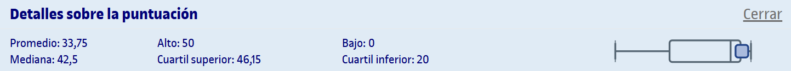

# PEC1 - Bloque 1: Álgebra

## Actividades

>[!NOTE]
>- Cada AC se corresponde con un bloque del [libro](https://campus.uoc.edu/autors/MostraPDFMaterialAction.do?id=273914&hash=44d365d71c2f61ac6cb2d049701a0fb93de2211c41e2dcbaed7291589a05a02a).
>- Cada AC contiene un reto optativo y actividades paso a paso, que son de carácter opcional y discriminantes a la hora de obtener la matrícula de honor.

<table>
	<tr>
		<th>ACTIVIDAD</th>
		<th>CALIFICACIÓN</th>
	</tr>
	<tr>
		<td>
			<a href="https://github.com/HenestrosaDev/uoc-ingenieria-informatica/tree/main/iniciacion_a_las_matematicas_para_la_ingenieria/pec1/ac01">
				AC1 - Números
			</a>
		</td>
		<td>
			6,17 / 7,00 (B)
		</td>
	</tr>
	<tr>
		<td>
			<a href="https://github.com/HenestrosaDev/uoc-ingenieria-informatica/tree/main/iniciacion_a_las_matematicas_para_la_ingenieria/pec1/ac02">
				AC2 - Ecuaciones
			</a>
		</td>
		<td>
			7,00 / 7,00 (A)
		</td>
	</tr>
	<tr>
		<td>
			<a href="https://github.com/HenestrosaDev/uoc-ingenieria-informatica/tree/main/iniciacion_a_las_matematicas_para_la_ingenieria/pec1/ac03">
				AC3 - Sistemas de ecuaciones
			</a>
		</td>
		<td>
			6,50 / 7,00 (A)
		</td>
	</tr>
	<tr>
		<td>
			<a href="https://github.com/HenestrosaDev/uoc-ingenieria-informatica/tree/main/iniciacion_a_las_matematicas_para_la_ingenieria/pec1/ac04">
				AC4 - Polinomios
			</a>
		</td>
		<td>
			7,00 / 7,00 (A)
		</td>
	</tr>
	<tr>
		<td>
			<a href="https://github.com/HenestrosaDev/uoc-ingenieria-informatica/tree/main/iniciacion_a_las_matematicas_para_la_ingenieria/pec1/ac05">
				AC5 - Matrices
			</a>
		</td>
		<td>
			7,00 / 7,00 (A)
		</td>
	</tr>
	<tr>
		<td>
			<a href="https://github.com/HenestrosaDev/uoc-ingenieria-informatica/tree/main/iniciacion_a_las_matematicas_para_la_ingenieria/pec1/ac_recapitulacion-1">
				AC - Recapitulación 1
			</a>
		</td>
		<td>
			6,00 / 7,00 (B)
		</td>
	</tr>
	<tr>
		<td colspan="2"></td>
	</tr>
	<tr>
		<td>
			<strong>CALIFICACIÓN FINAL</strong>
		</td>	
		<td>39,67 / 42,00 (A)</td>	
	</tr>
	<tr>
		<td>
			<strong>CALIFICACIÓN FINAL SOBRE 10</strong>
		</td>	
		<td>9,45 / 10,00 (A)</td>	
	</tr>
</table>

## Recursos de aprendizaje

>[!NOTE]
>- No se incluyen los archivos `pdf` en el repositorio para evitar posibles problemas de copyright.
>- Cada bloque del libro tiene un resumen asociado en la carpeta correspondiente a su actividad.
- [**Iniciación a las matemáticas para la ingeniería**](https://campus.uoc.edu/autors/MostraPDFMaterialAction.do?id=273914&hash=44d365d71c2f61ac6cb2d049701a0fb93de2211c41e2dcbaed7291589a05a02a)

---

## Resultado

### Calificación

<table>
	<thead>
		<tr>
			<th>EVALUABLE</th>
			<th>C. ORIGINAL</th>
			<th>C. SOBRE 10</th>
		</tr>
	</thead>
	<tbody>
		<tr>
			<td>Cuestionario</td>
			<td>39,67 / 42,00</td>
			<td>9,45 / 10,00 (A)</td>
		</tr>
	</tbody>
</table>

### Detalles sobre la puntuación

