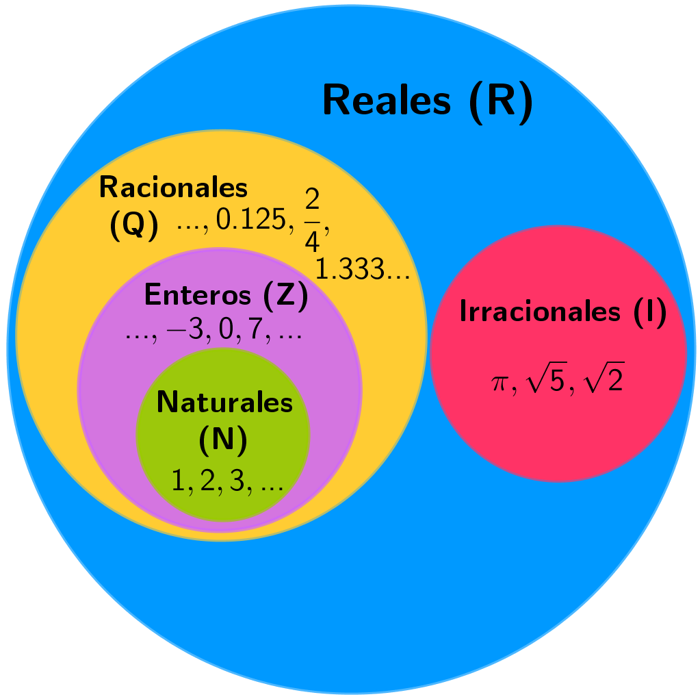

# NÚMEROS

	

## Números naturales (natural numbers) $(\mathbb{N})$

Permiten contar objetos. La lista de los números naturales se inicia con el 1 y no tiene fin: 1, 2, 3, 4, 5, 6, ... No incluye el 0.

Operaciones:
- Suma
- Resta
- Multiplicación
- División

Un número es múltiplo de otro si puede obtenerse multiplicándolo por otro número natural.
Cuando una división entre dos números naturales es exacta, se dice que un número es divisor del otro.

>Ejemplo: 36 es múltiplo de 2, 3, 6, 12 y 18. Y, por lo tanto, podemos decir que 2, 3, 6, 12 y 18 son divisores de 36. Además, 36 es divisible por 2, 3, 6, 12 y 18.

### Máximo común divisor (MCD)

Se cumplen estos dos factores:

- Se descomponen los dos (o más) números en factores primos.
- Es el mayor de estos divisores

>$MCD(30, 36) = 6$ porque $36 = 1 \cdot 2^2 \cdot 3^{2}$, mientras que $30 = 1 \cdot 2 \cdot 3 \cdot 5$. Los primos comunes son $1, 2$ y $3$ y su exponente tiene que ser 1, porque es el menor. Por tanto, $MCD(36, 30) = 1 \cdot 2 \cdot 3 = 6$.

### Mínimo común múltiplo (mcm)

Se cumplen estos dos factores:

- Es un múltiplo de cada uno de estos dos (o más) números.
- Es el menor de estos múltiplos.

>$mcm(4, 10) = 1 \cdot 2^{2} \cdot 5 = 20$ porque al descomponer los números 4 y 10 en números primos: $4 = 1 \cdot 2^{2}$ y $10 = 1 \cdot 2 \cdot 5$. Vemos que los primeros comunes son el $1$ y el $2$, este último elevado al cuadrado porque es el de exponente mayor.

## Números enteros (integers) $(\mathbb{Z})$

Números naturales con un signo $-$ junto al 0 y todos los números naturales ($\mathbb{Z}^{-} \cup {0} \cup \mathbb{Z}^{+}$).

$(\mathbb{Z})$ viene de la palabra _zahlen_ en alemán, que significa _número_.

### Valor absoluto

Mismo número entero sin su signo. Se expresa como $|-23| = 23$

## Números racionales (rational numbers) $(\mathbb{Q})$

Aquellos que se pueden expresar como una fracción.

$\mathbb{Q}$ viene de _quotient_.

### Números fraccionarios

Formado por numerador (arriba) y denominador (abajo). 

**Fracciones equivalentes**: Fracciones diferentes que representan el mismo número. Por ejemplo, $\frac{1}{2}$ y $\frac{2}{4}$. También se pueden multiplicar en cruz el numerador y el denominador para saber si son equivalentes ($1 \cdot 4$ y $2 \cdot 2$).

**Fracciones irreducibles**: El numerador y denominador son primos entre ellos, esto es, son números cuyo MCD es $1$.

### Operaciones

#### Suma

- Mismo denominador: $\frac{1}{6} + \frac{3}{6} = \frac{1+3}{6} = \frac{4}{6}$
- Diferente denominador: Se puede hacer de dos formas diferentes. Ambas son siempre aplicables.
	- Multiplicar el numerador y el denominador de las dor fracciones que se suman por el denominador de la otra.  
	$$\frac{3}{18} + \frac{5}{12} = \frac{3 \cdot 12}{18 \cdot 12} + \frac{5 \cdot 18}{12 \cdot 18} = \frac{36}{216} + \frac{90}{216} = \frac{126}{216}$$
	- Cálculo del MCM de los denominadores:
		1. En el ejemplo anterior, $MCM(12, 18) = 36$.
		2. Multiplicar el numerador de cada fracción por el resultado de dividir el MCM entre el denominador de la fracción respectiva. Así, en el ejemplo, el numerador de la fracción $\frac{3}{18}$, que es 3, se tiene que multiplicar el resultado de 36 : 18 = 2; del mismo modo, el numerador de la fracción $\frac{5}{12}$, que es 5, se tiene que multiplicar por el resultado de 36 : 12 = 3.  Las fracciones resultantes son equivalentes a las anteriores y tienen el denominador común:  
		$$\frac{3}{18} = \frac{6}{36} \qquad \frac{5}{12} = \frac{15}{36}$$
		3. Finalmente, hay que sumar las fracciones con el mismo denominador encontradas en el apartado anterior. En el ejemplo,
		$$\frac{3}{18} + \frac{5}{12} = \frac{6}{36} + \frac{15}{36} = \frac{21}{36}$$

>Si no hay demasiadas sumas y los números son pequeños, es posible utilizar el primer método, pero si hay tres o más, es recomendable seguir el método del cálculo del MCM.

#### Resta

Igual que la suma.

#### Multiplicación

$$ 
\frac{2}{7} + \frac{3}{5} = \frac{2 \cdot 3}{7 \cdot 5} = \frac{6}{35}
$$

$$
\frac{3}{4} \cdot 120 = \frac{3 \cdot 120}{4} = \frac{360}{4} = 90
$$

#### División

Multiplicar en cruz numeradores con denominadores.

$$ 
\frac{2}{3} \div \frac{7}{11} = \frac{2 \cdot 11}{3 \cdot 7} = \frac{22}{21}
$$

A partir de la división de números, se puede expresar el inverso de un número racional de otra forma: como $1$ dividido entre el número. Por ejemplo, el inverso de: $\frac{4}{7}$ es $\frac{1}{\frac{4}{7}} = \frac{7}{4}$

### Forma decimal

La forma decimal de una fracción es una expresión numérica que está formada por una parte entera, a la izquierda del punto, y una parte decimal o sencillamente decimales, a la derecha del punto.

#### Tipos de formas decimales

- **Estricta**: La división del numerador entre el denominador tiene un número de decimales finito. 
- **Periódica**: Los decimales que se repiten infinitas veces.
	- **Periódico puro**: El periodo empieza justo después de la coma ($0.\overline{3}$).
	- **Periódico mixto**: El periodo empieza después de un grupo de cifras decimales que no se repiten ($0.5689\overline{856}$).
	
#### Transformar forma decimal a forma fraccionaria

- **Si decimal exacto**, $3.465$ es $\frac{3465}{1000}$. Se añaden tantos 0 al 1 como decimales tenga el número decimal.
- **Si decimal periódico**: 
	- **Numerador**: Diferencia entre el número sin coma ni periodo y el mismo número sin comas ni cifra debajo del periodo ($23.4\overline{52} = 23452 - 234$). 
	- **Denominador**: Número entero con tantos 9 como cifras debajo del símbolo periódico y tantos 0 como cifras de la sección decimal que no están dentro del símbolo periódico.
	$$23.4\overline{52} = \frac{23452 - 234}{990} = \frac{23218}{990}$$

#### Aproximaciones

- **Redondeo**: Número decimal más cercano a la cifra de redondeo. Por ejemplo, el redondeo a dos decimales de $\frac{1}{3} \approx 0.33$.
- **Truncamiento**: Truncamiento de $2.56147215$ a 4 decimales es $2.5614$.

#### Ordenación

La manera más sencilla de ordenar dos números racionales es escribir la expresión decimal, que muestra de manera inmediata cuál de los dos es más grande.

Entre dos números racionales siempre se puede encontrar otro. Para encontrarlo, hay que sumar los dos números racionales y dividir el resultado entre 2. Ejemplo para $\frac{3}{4}$ y $\frac{9}{5}$.

$$\frac{\frac{3}{4} + \frac{9}{5}}{2} = \frac{51}{40}$$
$$\frac{3}{4} < \frac{51}{40} < \frac{9}{5} $$

## Números reales (real numbers) $(\mathbb{R})$

Conjunto de todos los números, tanto racionales como irracionales.

- $\mathbb{N}$ números naturales.
- $\mathbb{Z}$ números enteros.
- $\mathbb{Q}$ números racionales.

$\subset$ es el símbolo de inclusión, e indica que el conjunto que se sitúa a la izquierda es incluido en el conjunto de la derecha. Ejemplo:

$\mathbb{N} \subset \mathbb{Z} \subset \mathbb{Q} \subset \mathbb{R}$

### Potencias

Expresión para abreviar un grupo de multiplicaciones con los mismos factores. $7 \cdot 7 \cdot 7 \cdot 7 \cdot 7 = 7^{5}$. $7$ es la base --número que se multiplica varias veces-- y $5$ la potencia --número de veces que se repite la base en la multiplicación.

Si el signo del número es negativo y el exponente es par, el número resultante es positivo, como $(-2)^{4} = 2^{4}$. Si es impar, es negativo, como $(-2)^{5} = -2^{5}$.

En la **potencia de una fracción**, se eleva el numerador y el denominador a dicha potencia.

$$\left(\frac{7}{5}\right)^{3} = \frac{7^{3}}{5^{3}}$$

Una potencia con exponente negativo es igual al inverso de la misma potencia con exponente positivo.

$$\left(\frac{7}{9}\right)^{-6} = \frac{1}{{\left(\frac{7}{9}\right)^{6}}} \qquad\qquad 6^{-1} = \frac{1}{6}$$

### Raíces

Opuestas a las potencias. El número interior en el radical es el radicando ($4$), el de fuera es el índice ($3$), y el resultado es la raíz ($3$). $\sqrt[3]{27} = 3$

Para las fracciones:

$$\sqrt[3]{\frac{27}{125}} = \frac{\sqrt[3]{27}}{\sqrt[3]{125}} = \frac{3}{5}$$

Toda raíz se puede expresar también como una potencia con exponente un número fraccionario igual al inverso del índice. Por ejemplo:

$$\sqrt[4]{16} = 16^{\frac{1}{4}}$$

$$\sqrt[4]{\left(\frac{16}{81}\right)^{-3}} = \left(\frac{16}{81}\right)^{\frac{-3}{4}}$$

#### Propiedades potencias y raíces

- **Potencia de exponente 1**: $a^{1} = a$
- **Producto de potencias de la misma base**: $a^{p} \cdot a^{q} = a^{p+q}$
- **Cociente de potencias de la misma base**: $a^{p} : a^{q} = a^{p-q}$
- **Potencia de exponente 0**: $a^{0} = 1$
- **Potencia de una potencia**: $(a^{p})^{q} = a^{p \cdot q}$
- **Producto de potencias con el mismo exponente**: $a^{p} \cdot b^{p} = (a \cdot b)^{p}$
- **Cociente de potencias con el mismo exponente**: $a^{p} : b^{p} = (a : b)^{p}$.

Se tiene que tener en cuenta que estas propiedades son correctas siempre que $a, b, p, q$ sean números racionales correctos para la operación que se tiene que hacer. Por ejemplo, en el caso de la potencia de exponente 0, la base no puede ser 0; en el caso de los exponentes, sabemos que no pueden tener el denominador par si la base es negativa (porque no existe la raíz de índice par de un número negativo).

### Números irracionales (irrational numbers) $(\mathbb{R ∖ Q})$

Números cuyos decimales no tienen un patrón fijo de repetición y que no se pueden expresar en forma de una fracción de números enteros. Ejemplo: $\sqrt{2}, \pi...$

**Racionalización**: No es habitual dejar una fracción con raíces en el denominador. El proceso de eliminarlas se denomina racionalización y consiste en multiplicar la fracción por una expresión que permita eliminar las raíces del denominador.

$$\frac{1}{\sqrt{3}} = \frac{1 \cdot \sqrt{3}}{(\sqrt{3})^{2}} = \frac{\sqrt{3}}{3}$$

En otros casos, podemos encontrar una suma o resta de raíces en el denominador, por lo que se tiene que multiplicar el denominador y el numerador por la operación opuesta del denominador (**conjugado del denominador**).

$$\frac{4}{\sqrt{3} - \sqrt{5}} = \frac{4 (\sqrt{3} + \sqrt{5})}{(\sqrt{3} - \sqrt{5})(\sqrt{3} + \sqrt{5})} = \frac{4 (\sqrt{3} + \sqrt{5})}{3 - 5} = -2 (\sqrt{3} + \sqrt{5})$$

>Esto es así porque $(\sqrt{3} - \sqrt{5}) \cdot (\sqrt{3} + \sqrt{5}) = (\sqrt{3})^{2} - (\sqrt{5})^{2} = 3 - 5 = -2$

### Operaciones

- **Elemento neutro de la suma** es el 0 por lo que si $a$ es un número real, entonces $a + 0 = 0 + a = a$.
- **Elemento neutro de la multiplicación** es el 1, por lo que si $a$ es un número real, entonces $a \cdot 1 = 1 \cdot a = a$

A partir de esto, se define:

- **Opuesto**: Siendo $a$ real, $a + (-a) = (-a) + a = 0$.
- **Inverso**: Siendo $a$ real (excepto el 0), $a \cdot \frac{1}{a} = \frac{1}{a} \cdot a = 1$.

A partir de esto, se define:

- **Resta**: Igual a la suma con el opuesto. Siendo $a$ y $b$ reales, $a - b = a + (-b)$.
- **División**: Igual a la multiplicación con el inverso. Siendo $a$ y $b$ reales, y $b \neq 0$, $\frac{a}{b} = a \cdot \frac{1}{b}$.
- **Potenciación**: Si $a$ es real y $n$ y $m$ son enteros (diferentes de 0):
	$$a^{-n} = \frac{1}{a^{n}} \qquad\qquad a^{\frac{m}{n}} = \sqrt[n]{a^{m}}\$$

#### Propiedades de las operaciones

Propiedades de la suma:

- **Propiedad conmutativa**: $a + b = b + a$
- **Propiedad asociativa**: $a + b + c = (a + b) + c = a + (b + c)$

Propiedades del producto:

- **Propiedad conmutativa**: $a \cdot b = b \cdot a$
- **Propiedad asociativa**: $a \cdot b \cdot c = (a \cdot b) \cdot c = a \cdot (b \cdot c)$
- **Propiedad distributiva del producto respecto de la suma**: $a \cdot (b + c) = (b + c) \cdot a = a \cdot b + (a \cdot c)$

## Expresiones numéricas

### Recta numérica

### Intervalos

Conjunto de todos los números más pequeños (o iguales) que un número dado y más grandes (o iguales) que otro. Estos dos números son los **extremos** del intervalo. $[-5, +\infty)$ representa todos los números reales mayores que -5 (incluido).

### Notación científica

#### De notación decimal a notación científica

En números positivos, el exponente es igual al número de cifras del número
menos uno si el número no tiene decimales. Por ejemplo, $180200000000000$ tiene 15 cifras, por lo que:

$$180200000000000  = 1.802 \cdot 10^{14}$$

En números negativos, el exponente es igual al número de ceros del número en valor absoluto. El ejemplo abajo tiene 13 ceros (contando la parte entera).

$$0.000000000000874 = 8.74 \cdot 10^{-13}$$

>$0.4034$ y $0.74$ son la mantisa.

#### De notación científica a notación decimal

Si el exponente es positivo, se desplaza la coma decimal de la mantisa hacia la derecha tantas posiciones como indique el exponente, añadiendo los 0 que hagan falta.

$$5.201 \cdot 10^{11} = 520100000000 \text{ (20100000000 son 11 posiciones)}$$

Si el exponente es negativo, se tiene que desplazar la coma decimal de la
mantisa hacia la izquierda tantas posiciones como indique el número del exponente (sin signo), añadiendo tantos 0 como sea necesario.

$$1.032 \cdot 10^{-9} = 0.000000001032 \text{ (0.00000000 son 9 ceros (1 entero + 8 decimales))}$$

### Igualdades notables

HAY MÁS DE LAS MENCIONADAS AQUÍ, PERO ESTAS SON LAS MÁS RECURRENTES.

$$(a + b)^{2} = a^{2} + 2 \cdot a \cdot b + b^{2} \quad \text{el cuadrado de una suma}$$
$$(a - b)^{2} = a^{2} - 2 \cdot a \cdot b + b^{2} \quad \text{la diferencia de cuadrados}$$
$$(a + b)(a - b) = a^{2} - b^{2} \quad \text{suma por diferencia es igual a la diferencia de cuadrados}$$

