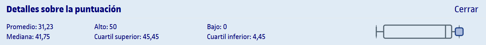

# PEC2 - Bloque 2: Análisis

## Actividades

>[!NOTE]
>- Cada AC se corresponde con un bloque del [libro](https://campus.uoc.edu/autors/MostraPDFMaterialAction.do?id=273914&hash=44d365d71c2f61ac6cb2d049701a0fb93de2211c41e2dcbaed7291589a05a02a).
>- Cada AC contiene un reto optativo y actividades paso a paso, que son de carácter opcional y discriminantes a la hora de obtener la matrícula de honor.

<table>
	<tr>
		<th>ACTIVIDAD</th>
		<th>CALIFICACIÓN</th>
	</tr>
	<tr>
		<td>
			<a href="https://github.com/HenestrosaDev/uoc-ingenieria-informatica/tree/main/iniciacion_a_las_matematicas_para_la_ingenieria/pec2/ac06">
				AC6 - Funciones polinómicas
			</a>
		</td>
		<td>
			7,00 / 7,00 (A)
		</td>
	</tr>
	<tr>
		<td>
			<a href="https://github.com/HenestrosaDev/uoc-ingenieria-informatica/tree/main/iniciacion_a_las_matematicas_para_la_ingenieria/pec2/ac07">
				AC7 - Funciones trigonométricas
			</a>
		</td>
		<td>
			7,00 / 7,00 (A)
		</td>
	</tr>
	<tr>
		<td>
			<a href="https://github.com/HenestrosaDev/uoc-ingenieria-informatica/tree/main/iniciacion_a_las_matematicas_para_la_ingenieria/pec2/ac08">
				AC8 - Funciones exponenciales y logarítmicas
			</a>
		</td>
		<td>
			7,00 / 7,00 (A)
		</td>
	</tr>
	<tr>
		<td>
			<a href="https://github.com/HenestrosaDev/uoc-ingenieria-informatica/tree/main/iniciacion_a_las_matematicas_para_la_ingenieria/pec2/ac09">
				AC9 - Continuidad de funciones
			</a>
		</td>
		<td>
			5,50 / 7,00 (B)
		</td>
	</tr>
	<tr>
		<td>
			<a href="https://github.com/HenestrosaDev/uoc-ingenieria-informatica/tree/main/iniciacion_a_las_matematicas_para_la_ingenieria/pec2/ac10-1">
				AC10-1 - Derivación de funciones 1
			</a>
		</td>
		<td>
			7,00 / 7,00 (A)
		</td>
	</tr>
	<tr>
		<td>
			<a href="https://github.com/HenestrosaDev/uoc-ingenieria-informatica/tree/main/iniciacion_a_las_matematicas_para_la_ingenieria/pec2/ac10-2">
				AC10-2 - Derivación de funciones 2
			</a>
		</td>
		<td>
			7,00 / 7,00 (A)
		</td>
	</tr>
	<tr>
		<td>
			<a href="https://github.com/HenestrosaDev/uoc-ingenieria-informatica/tree/main/iniciacion_a_las_matematicas_para_la_ingenieria/pec2/ac11-1">
				AC11-1 - Integración de funciones 1
			</a>
		</td>
		<td>
			7,00 / 7,00 (A)
		</td>
	</tr>
	<tr>
		<td>
			<a href="https://github.com/HenestrosaDev/uoc-ingenieria-informatica/tree/main/iniciacion_a_las_matematicas_para_la_ingenieria/pec2/ac11-2">
				AC11-2 - Integración de funciones 2
			</a>
		</td>
		<td>
			7,00 / 7,00 (A)
		</td>
	</tr>
	<tr>
		<td>
			<a href="https://github.com/HenestrosaDev/uoc-ingenieria-informatica/tree/main/iniciacion_a_las_matematicas_para_la_ingenieria/pec2/ac_recapitulacion-2">
				AC - Recapitulación 2
			</a>
		</td>
		<td>
			7,00 / 7,00 (A)
		</td>
	</tr>
	<tr>
		<td colspan="2"></td>
	</tr>
	<tr>
		<td>
			<strong>CALIFICACIÓN FINAL</strong>
		</td>	
		<td>61,50 / 63,00 (A)</td>	
	</tr>
	<tr>
		<td>
			<strong>CALIFICACIÓN FINAL SOBRE 10</strong>
		</td>	
		<td>9,76 / 10,00 (A)</td>	
	</tr>
</table>

## Recursos de aprendizaje

>[!NOTE]
>- No se incluyen los archivos `pdf` en el repositorio para evitar posibles problemas de copyright.
>- Cada bloque del libro tiene un resumen asociado en la carpeta correspondiente a su actividad.
- [**Iniciación a las matemáticas para la ingeniería**](https://campus.uoc.edu/autors/MostraPDFMaterialAction.do?id=273914&hash=44d365d71c2f61ac6cb2d049701a0fb93de2211c41e2dcbaed7291589a05a02a)

---

## Resultado

### Calificación

- **Calificación original**: 61,50 / 63,00
- **Calificación sobre 10**: 9,76 / 10,00
- **Letra (escala internacional)**: A

### Detalles sobre la puntuación

