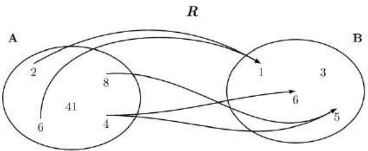
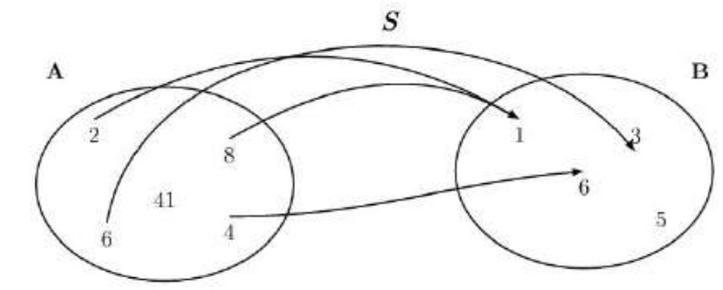
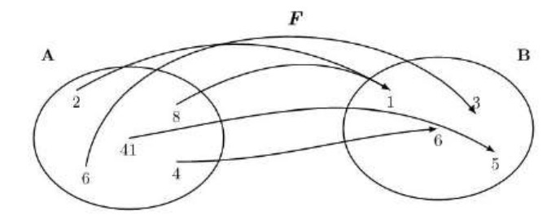
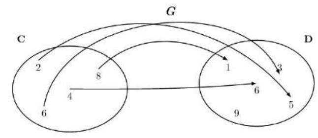
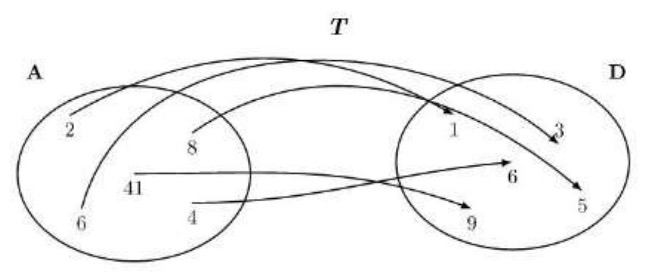
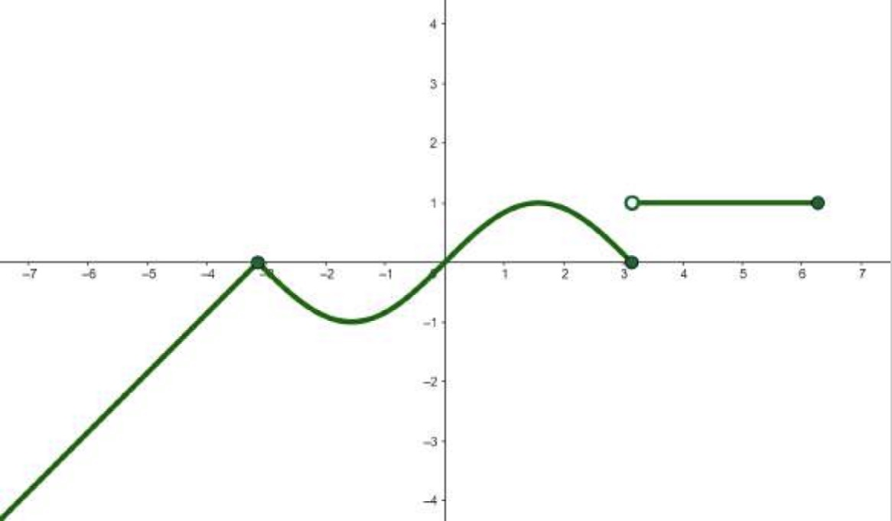
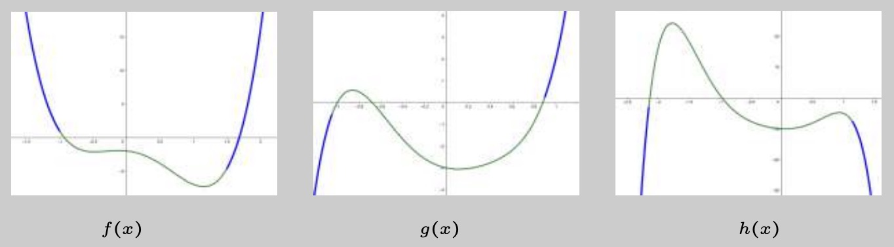

# 6. Funciones

## 6.1. Concepto de función

Expresión matemática formada por la suma de términos, donde cada término consiste en un coeficiente (un número) multiplicado por una variable elevada a un exponente no negativo.

### 6.1.1. Correspondencia entre conjuntos

Relación entre conjuntos que hace corresponder elementos del segundo a elementos del primero. Una correspondencia puede representarse gráficamente mediante diagramas.

**Representación de un conjunto de números**

El conjunto formado por los números naturales $1, 2, 3, 4, 6$ y $11$ puede denominarse $A$.

Entonces, el conjunto puede expresarse así:

$$A = \set{1, 2, 3, 4, 6, 11}$$

**Elementos de una correspondencia entre dos conjuntos**

Consideramos $R$ que relaciona los conjuntos $A = \set{2, 4, 6, 8, 41}$ y $B = \set{1, 3, 5, 6}$.



Entonces:
- El **dominio** de una función es el conjunto de todos los valores de entrada ($x$) para los cuales la función está definida y produce un resultado válido.
	- El dominio de la correspondencia es el conjunto $\text{Dom}R = \set{2, 6, 4, 8}$ y la imagen de la correspondencia es $\text{Im}R = \set{1, 5, 6}$.
- El **codominio** de una función es el conjunto de todos los valores posibles de salida ($y$).
- La **imagen o recorrido** de una función son todos aquellos valores que puede llegar a tomar una función.
	- La imagen del $2$ es el conjunto $\set{1} \implies f(2) = 1, \text{, punto } (2,1)$.
	- La imagen del $8$ es el conjunto $\set{5} \implies f(8) = 5 \text{, punto } (8,5)$.
	- La imagen del $4$ es el conjunto $\set{5, 6} \implies f(4) = 5 \text{, punto (4,5) y } f(4) = 6 \text{, punto } (4,6)$.
	- La imagen del $6$ es el conjunto $\set{1} \implies f(6) = 1 \text{, punto } (6,1)$.
- La **antiimagen** de una función es el conjunto de valores en el dominio que, al aplicarse en la función, dan como resultado un valor específico en el codominio.
	- La antiimagen del $1$ es el conjunto $\set{2, 6}$.
	- La antiimagen del $5$ es $\set{4, 8} \implies f(4) = 5 \text{, punto (4,5) y } f(8) = 5 \text{, punto (8,5)}$.
	- La antiimagen del $6$ es $\set{4} \implies f(4) = 6 \text{, punto} (4,6)$.

### 6.1.2. Aplicaciones y funciones

Para que una correspondencia entre conjuntos sea una aplicación, se tiene que cumplir que todos los elementos de su dominio tengan un único elemento en su imagen. Es decir, en la representación de una aplicación, de cualquier elemento del dominio tiene que salir **una única flecha**.



Hay tres tipos de aplicaciones (esta clasificación no abarca todas las aplicaciones):
- **Exhaustivas**:  aplicaciones en las que su imagen coincide con el conjunto de llegada.
	
- **Inyectivas**: aplicaciones en las que cada elemento de la imagen solo tiene una
única antiimagen.
	
- **Biyectivas**: aplicaciones exhaustivas e inyectivas al mismo tiempo.
	

## 6.2. Representación de una función

### 6.2.1. Tabla de una función

Es una tabla con dos columnas. La primera contiene valores del dominio de la función y la segunda los valores correspondientes de su imagen. Cuando el dominio o la imagen son conjuntos demasiado grandes, una tabla de la función solo contiene algunos de los valores de la función.

La función $F$ definida anteriormente se puede expresar mediante esta tabla:

| $\text{Dom}F$ | $\text{Im}F$ |
|---------------|--------------|
| 2             | 1            |
| 4             | 6            |
| 6             | 3            |
| 8             | 1            |
| 41            | 5            |

### 6.2.2. Expresión de una función

Expresión algebraica con una variable que permite encontrar la imagen de cualquier elemento del dominio de la función. Para hacerlo, tiene que sustituirse la variable de la expresión por el valor del dominio. El valor numérico resultante de esta expresión es el valor de la imagen de este elemento del dominio.

Por ejemplo, la expresión algebraica de la función $g$ es $g(x) = x^{2}$, por lo que el valor de la función $g$ para el valor del dominio $4$ es $g(4) = 4^{2}= 16$.

### 6.2.3. Gráfica de una función

Conjunto de todos los pares de puntos $(x, y)$ del plano cartesiano que coinciden con los valores de esta función. La coordenada $x$ es un valor del dominio, y la coordenada $y = f(x)$, el valor correspondiente de la imagen. Para dibujar la gráfica de una función, basta con dibujar en el plano los puntos que se describen en una tabla de la función de la manera $(x, f(x))$.

```mermaid
xychart-beta
	x-axis 0 --> 3
	y-axis 0 --> 6
	line [0, 2, 4, 6]
```
>Representación de la función $f(x) = 2x$ en los puntos de dominio en el intervalo $[0, 3]$.


>[!IMPORTANT]
>La gráfica de una función no puede tener más de un valor para el mismo punto del eje X.

## 6.3. Operaciones entre funciones

### 6.3.1. Operaciones básicas

**Suma y resta**

$$(f ± g)(x) = f(x) ± g(x)$$

Esta suma puede calcularse siempre que $x$ esté en el dominio de las dos funciones que se suman. 

Por ejemplo, la suma de las funciones $f(x) = 3x$ y $g(x) = 4x^{2} - 1$ es $(f + g)(x) = f(x) + g(x) = 3x + 4x^{2} - 1 = 4x^{2} + 3x - 1$

Propiedades:
- **Conmutativa**: $f ± g = g ± f$
- **Asociativa**: $f ± (g ± h) = (f ± g) ± h$
- **Elemento neutro**: Función cero $z(x) = 0$
- **Función opuesta** de $f(x)$ es $-f(x)$

**Producto**

$$(f \cdot g)(x) = f(x) \cdot g(x)$$

Este producto puede calcularse siempre que la variable $x$ esté en el dominio de las funciones que se multiplican.

Por ejemplo, la suma de las funciones $f(x) = 3x$ y $g(x) = 4x^{2} - 1$ es $(f \cdot g)(x) = f(x) \cdot g(x) = 3x(4x^{2} - 1) = 12x^{3} - 3x$

Propiedades:
- **Conmutativa**: $f \cdot g = g \cdot f$
- **Asociativa**: $f \cdot (g \cdot h) = (f \cdot g) \cdot h$
- **Elemento neutro**: Función unidad $u(x) = 1$

**Cociente**

$$(\frac{f}{g})(x) = \frac{f(x)}{g(x)}$$

Este cociente puede calcularse siempre que la variable $x$ esté en el dominio de las funciones que se consideran y, además, la función del denominador $g(x)$ no sea la función $0$.

Por ejemplo, el cociente de las funciones $f(x) = x^{2} - 1$ y $g(x) = x + 1$ es $(\frac{f}{g})(x) = \frac{f(x)}{g(x)} = \frac{x^{2} - 1}{x + 1} = x - 1$

**Potencia**

$$(f^g)(x) = f(x)^{g(x)}$$

Esta potencia puede calcularse siempre que la variable, $x$, esté en el dominio de ambas
funciones, $f$ y $g$, y que ninguna de las dos funciones se anulen.

Por ejemplo, la potencia de la función $f(x) = 4x^2 − 1$ por $g(x) = 3x$ es $(f^g)(x) = f(x)^{g(x)} = (4x^2 − 1)^{3x}$

### 6.3.2. Composición de funciones y función inversa

La composición de una función $f$ con una función $g$ es otra función, $g ○ f$, que  cumple $(g ○ f)(x) = g(f(x))$. Esta nueva función puede calcularse siempre que $f(x)$ esté en el dominio de la función que se aplica en segundo lugar, $g$.

Por ejemplo, dadas las funciones $f(x) = x^2$
y $g(x) = 2x$, pueden definirse las composiciones
de funciones:

$$(g ○ f)(x) = g(f(x)) = g(x^2) = 2(x^2) = 2x^2$$
$$(f ○ g)(x) = f(g(x)) = f(2x) = (2x)^2 = 4x^2$$

La composición de funciones **no es conmutativa**.

---

Las funciones f y g son inversas una de la otra si $(g ○ f)(x) = x$ y $(f ○ g)(x) = x$ a la vez. Si hay inversa, ambas funciones son biyectivas. La función inversa de $f$ se denota por $f^{−1}$.

$\text{Dom}f = \text{Im}g$.

## 6.4. Características de una función

Se clasifican en tipos diferentes según como se utiliza la variable independiente. En particular, cada uno de estos tipos de funciones presenta un dominio, una imagen y una forma gráfica específica. En este sentido, puede hablarse de familias de funciones: polinómicas, trigonométricas, exponenciales, logarítmicas...

## 6.5. Funciones definidas a trozos

Presentan una definición distinta para cada uno de los trozos del dominio en que están definidas.

$$
f(x) =
\begin{cases}
x + \pi, 	& \text{si } x \leq -\pi \\
sin(x), 	& \text{si } -\pi < x \leq \pi \\
1,				& \text{si } \pi < x \leq 2\pi
\end{cases}
$$



# 7. Funciones polinómicas

## 7.1. Funciones lineales

### 7.1.1. Definición y ejemplos

Función lineal o de proporcionalidad directa: Producto de un polinomio de grado $1$ sin término independiente, es decir, del tipo $f(x) = ax$. El número $a$ recibe el nombre de pendiente de la recta e informa de su inclinación. La gráfica correspondiente es una recta que pasa por el origen de coordenadas.

### 7.1.2. Representación gráfica

Si la razón de proporcionalidad es positiva, la recta crece con más rapidez cuanto mayor es la razón. 

Si la razón de proporcionalidad es negativa, la recta decrece con más rapidez cuanto más pequeña (más negativa) es la razón.

## 7.2. Funciones afines

### 7.2.1. Definición y ejemplos

La expresión algebraica de una función afín es un polinomio de grado 1, es decir, del tipo $f(x) = ax + b$. El número a recibe el nombre de pendiente de la recta e informa de su inclinación. El número $b$ se denomina término independiente e informa del corte con el eje Y. La gráfica de una función afín es una recta.

### 7.2.2. Representación gráfica

A partir del punto de intersección entre la recta de la función y el eje Y y el punto de intersección entre la recta de la función y el eje X se puede trazar la función entera.

**Encontrar una función afín a partir de dos puntos**

Queremos encontrar una función afín de forma que su gráca contenga los
puntos del plano (1,−1) y (−2,−7).
Dado que el punto (1,−1) es de la gráca de la función: f(1) = −1. Dado que
buscamos f(x) = ax + b, a ⋅ 1 + b = −1.
Dado que el punto (−2,−7) es de la gráca de la función, f(−2) = −7. Por el
mismo razonamiento que antes, a ⋅ (−2) + b = −2a + b = −7.
Hay que resolver el sistema de ecuaciones que surge de las dos condiciones
anteriores 

$$
\begin{cases}
a + b & = −1 \\
−2a + b & = −7
\end{cases}
$$

Al resolver el sistema se obtiene que las soluciones del sistema son $a = 2$ y $b = −3$. Solo hay que sustituir el valores de a y b hallados en la expresión general $f(x) = ax + b$, de donde resulta $f(x) = 2x − 3$.

### 7.2.3. Propiedades

Tres tipos de funciones afines según el valor de su pendiente:
- **Funciones crecientes**: Crecen a medida que se desplaza la vista hacia la derecha. Pendiente positiva ($f(x) = ax + b$ con $a > 0$).
- **Funciones decrecientes**: Decrecen a medida que desplazamos la vista hacia la derecha. Pendiente negativa ($f(x) = ax + b$ con $a < 0$).
- **Funciones constantes**: Paralelas al eje x. Pendiente nula ($f(x) = ax + b$ con $a = 0$).

## 7.3. Funciones cuadráticas

### 7.3.1. Definición y ejemplos

La expresión algebraica de una función cuadrática es un polinomio de grado $2$. Su representación gráfica es una parábola y los puntos esenciales de ella son el eje de simetría, el vértice y las ramas.

$$f(x) = ax^2 + bx + c$$

donde $a, b, c ∈ \R$ y $a ≠ 0$.

### 7.3.2. Representación gráfica

La gráfica de una función cuadrática es una curva que recibe el nombre de _parábola_.

Elementos principales de una parábola:
- **Eje de simetría y vértice**: El eje de simetría es una línea recta que divide la parábola en dos partes exactamente iguales. La intersección entre la parábola y el eje de simetría es un punto que recibe del nombre de _vértice de la parábola_. Se determinan por la ecuación $x = -\frac{b}{2a}$
- **Ramas**: Dos trazos simétricos a ambos lados desarrollados a partir del vértice de la parábola. 
	- Si $a > 0$, las dos ramas de la parábola se dirigen hacia arriba, y la función es decreciente en el intervalo ($−∞$, $−\frac{b}{2a}$) y creciente en el intervalo ($−\frac{b}{2a}$, $+∞$).
	- Si $a < 0$, las dos ramas de la parábola se dirigen hacia abajo, y la función es creciente en el intervalo ($−∞$, $−\frac{b}{2a}$), y decreciente en el intervalo ($−\frac{b}{2a}$ ,$+∞$).
- **Punto de corte con el eje de abscisas**: Se calcula el discriminante ($\Delta$) de la ecuación cuadrática ($\Delta = b^2 - 4ac$). Como solo hay un punto de corte, el discriminante debe ser 0 para que haya una raíz doble ($\Delta = b^2 - 4ac = 0$).

Intersecciones de la parábola con los ejes coordenados:
- Una **única intersección con el eje Y**, que se halla con $x = 0$.
- Para ver las **dos intersecciones con el eje X**, se tiene que igualar la función a 0. Los dos resultados son los dos puntos de intersección.

**Representación gráfica de una función cuadrática**

1. Encontrar el vértice de la parábola.
2. Encontrar diferentes pares de puntos de la función que tengan la coordenada $x$ equidistante respecto a la coordenada $x$ del vértice, y se representan estos puntos junto con el vértice. Basta con representar dos para hacernos una idea de la forma de la parábola.
3. Unir estos puntos con una curva parabólica.

**Modificaciones en la expresión algebraica y efectos en la expresión gráfica**

- **Término independiente $c$**: Si el término aumenta, la parábola sube. Si disminuye, la parábola baja.
- **Coeficiente del término de grado 2, $a$**: Si el coeficiente es positivo, las ramas de la parábola se dirigen hacia arriba (parábola convexa), y, si es negativo, se dirigen hacia abajo (parábola cóncava).
- **Valor absoluto del coeficiente del término de grado 2, $a$**: Si en valor absoluto este coeficiente disminuye, las ramas de la parábola se separan, y, en cambio, si en valor absoluto el coeficiente aumenta, las ramas de la parábola se acercan.

## 7.4. Funciones polinómicas

### 7.4.1. Definición y ejemplos

La expresión algebraica de una función polinómica de grado $n$ es un polinomio. En la parte central la función polinómica se pliega varias veces, como máximo, tantas como el grado del polinomio.

Dadas 

$$f(x) = 4x^4 − 3x^3 − 5x^2 − x − 2$$
$$g(x) = 5x^5 − x^4 − 3x^3 + 5x^2 − x − 3$$
$$h(x) = −3x^6 − 5x^5 + 3x^4 + 3x^3 + 8x^2 − x − 10$$

Estas son sus representaciones gráficas:



Elementos:
- **Ramas**: Dos brazos laterales en los que se desarrolla la función. Nunca llegan a ser completamente rectos. Pueden dirigirse ambas hacia arriba, ambas hacia abajo, o bien una rama hacia arriba y la otra hacia abajo. 
	- La **rama de la derecha** se dirige hacia arriba cuando el coeficiente de grado máximo es positivo, y hacia abajo cuando es negativo.
	- La **rama de la izquierda** se dirige hacia abajo cuando el polinomio es de grado par y el coeficiente de grado máximo es negativo, o bien cuando el polinomio es de grado impar y el coeficiente de grado máximo es positivo. En caso contrario, el extremo de la izquierda se dirige hacia arriba.
- **Parte central**: Parte en la que la gráfica se pliega varias veces. El número de pliegues depende del grado del polinomio: cuanto mayor es el grado más pliegues puede presentar la gráfica correspondiente. El máximo número de pliegues de una función polinómica es su grado menos uno. Así, un polinomio de grado 1 no puede tener ningún pliegue. En cambio, un polinomio de grado 2 tiene exactamente un pliegue, un polinomio de grado 3 puede tener dos pliegues...

**Monotonía de una función**

- Una función $f(x)$ es creciente cuando, a medida que aumenta la variable $x$, el valor de la imagen de función, $y = f(x)$, también aumenta.
- Una función $f(x)$ es decreciente cuando, a medida que aumenta la variable $x$, el valor de la imagen de la función, $y = f(x)$, disminuye.

Por ejemplo, dada la representación gráfica de la función $f(x) = 2x^3 + 3x^2 − 12x + 3$, la función es creciente cuando x es menor que $−2$, es decreciente entre $−2$ y $1$, y vuelve a ser creciente a partir de $x = 1$.

**Puntos destacados**

- **Extremos**: 
	- **Máximo relativo (o local)**: Punto en el que la función pasa de ser creciente a ser decreciente.
	- **Mínimo relativo (o local)**: Punto en el que la función pasa de ser decreciente a ser creciente. El valor de la función en este punto es menor que el de cualquiera otro punto de la gráfica que sea cercano.
- **Intersección con el eje Y**: Sólo un punto de intersección entre la gráfica de cualquier polinomio y el eje Y. Este punto es el que tiene coordenada $x = 0$ y, por lo tanto, se trata del punto del plano $(0, f(0))$.
- **Intersección con el eje X**: Puede haber un número de intersecciones con el eje X igual al grado del polinomio como máximo. Para encontrar los puntos de intersección con el eje X, se tiene que resolver la ecuación asociada a la función $f(x) = 0$.