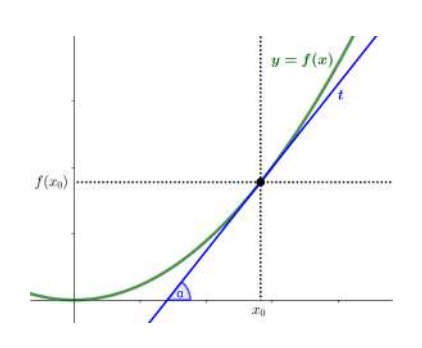
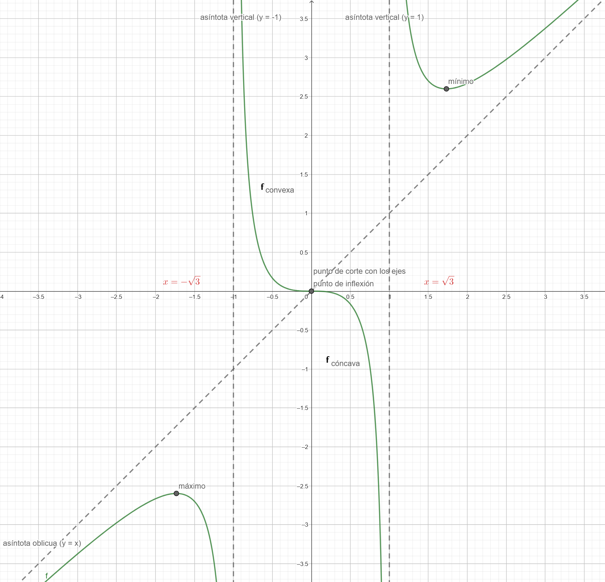

# 11. Derivación de funciones

## 11.1. Derivada de una función en un punto

### 11.1.1. & 11.1.2. Definición, interpretación y cálculo

**Definición y cálculo**

La derivada de una función $f(x)$ en un punto $x_0$ se indica por $f'(x_0)$ y se define por este límite:

$$f'(x_0) = \lim_{x \to x_0} \frac{f(x_0) - f(x)}{x_0 - x}$$

Si este límite no existe, se dice que la función $f(x)$ no es derivable en $x_0$.

**Interpretación**

La derivada de una función $f(x)$ en un punto $x_0$ de su dominio coincide con la pendiente de la recta tangente de la función en este punto. Es decir,

$$f'(x_0) = \tan(\alpha)$$

donde $\alpha$ es el ángulo que hay entre el eje X y la recta tangente a la función en el punto $x_0$.

>Representación gráfica de la derivada de una función en un punto

## 11.2. Derivada de una función

### 11.2.1. Definición e interpretación

La derivada de una función $f(x)$ es aquella función que asocia a cada punto $x$ del dominio la derivada de esta función. La función derivada se designa por $f'(x)$.

| TIPO DE FUNCIÓN                  | EXPRESIÓN MATEMÁTICA          | FÓRMULA DE DERIVACIÓN                                                                    | EJEMPLO APLICADO                                                                                                                            |
| -------------------------------- | ----------------------------- | ---------------------------------------------------------------------------------------- | ------------------------------------------------------------------------------------------------------------------------------------------- |
| **Constante**                    | $k, k \in \mathbb{Z}$         | $0$                                                                                      | $f(x) = 5 \Rightarrow f'(x) = 0$                                                                                                            |
| **Lineal**                       | $a \cdot x, a \in \mathbb{R}$ | $a$                                                                                      | $f(x) = 7x \Rightarrow f'(x) = 7$   $g(x) = -\frac{2}{3}x \Rightarrow g'(x) = -\frac{2}{3}$                                              |
| **Potencia**                     | $x^n, n \in \mathbb{Z}$       | $n \cdot x^{n-1}$                                                                        | $f(x) = x^5 \Rightarrow f'(x) = 5x^4$   $g(x) = \frac{1}{x^3} \Rightarrow g'(x) = -\frac{3}{x^4}$                                        |
| **Exponencial (base constante)** | $a^{f(x)}, a \in \mathbb{R}$  | $a^{f(x)} \cdot \ln(a) \cdot f' (x)$                                                    | $f(x) = 2^{2x} \Rightarrow f'(x) = 2^{2x} \cdot \ln(2) \cdot 2$                                                                            |
| **Exponencial (base variable)**  | $f(x)^{g(x)}$                 | $f(x)^{g(x)} \left ( g' (x) \cdot \ln(f(x)) + \frac{g(x) \cdot f' (x)}{f(x)} \right )$ | $f(x) = x^{x} \Rightarrow f'(x) = x^x \left ( 1 \cdot \ln (x) + \frac{x \cdot 1}{x} \right ) = x^x (\ln (x) + 1)$                          |
| **Raíz n-ésima**                 | $\sqrt[n]{f(x)}$              | $\frac{f' (x)}{n \cdot \sqrt[n]{f(x)^{n-1}}}$                                           | $f(x) = \sqrt{-2x^5} \Rightarrow f'(x) = \frac{-5x^4}{\sqrt{-2x^5}}$   $f(x) = \sqrt[3]{-2x^5} \Rightarrow \frac{-5 \sqrt[3]{2x^5}}{3x}$ |
| **Logarítmica (natural)**        | $\ln(f(x))$                   | $\frac{f' (x)}{x}$                                                                      | $f(x) = \ln(x^2) \Rightarrow f'(x) = \frac{2x}{x^2}$                                                                                        |
| **Logarítmica (base $a$)**       | $\log_a(f(x))$                | $\frac{f' (x)}{f(x) \ln (a)}$                                                           | $f(x) = \log_2(x^2) \Rightarrow f'(x) = \frac{2x}{x^2 \cdot \ln (2)}$                                                                       |
| **Seno**                         | $\sin(f(x))$                  | $f' (x) \cos(f(x))$                                                                     | $f(x) = \sin(2x) \Rightarrow f'(x) = 2\cos(2x)$                                                                                             |
| **Coseno**                       | $\cos(f(x))$                  | $-f' (x) \sin(f(x))$                                                                    | $f(x) = \cos(3x) \Rightarrow f'(x) = -3\sin(3x)$                                                                                            |
| **Tangente**                     | $\tan(f(x))$                  | $\frac{f' (x)}{\cos^2(f(x))}$   $f' (x) + \tan^2(f(x))$                             | $f(x) = \tan(\frac{x}{2}) \Rightarrow f'(x) = \frac{1}{2\cos^2(\frac{x}{2})}$                                                               |
| **Arcoseno**                     | $\arcsin(f(x))$               | $\frac{f' (x)}{\sqrt{1-[f(x)]^2}}$                                                      | $f(x) = \arcsin(\frac{x}{2}) \Rightarrow f'(x) = \frac{1}{\sqrt{4-x^2}}$                                                                    |
| **Arcocoseno**                   | $\arccos(f(x))$               | $-\frac{f' (x)}{\sqrt{1-[f(x)]^2}}$                                                     | $f(x) = \arccos(\sqrt{x}) \Rightarrow f'(x) = -\frac{1}{2\sqrt{x}\sqrt{1-x}}$                                                               |
| **Arcotangente**                 | $\arctan(f(x))$               | $\frac{f' (x)}{1+[f(x)]^2}$                                                             | $f(x) = \arctan(3x) \Rightarrow f'(x) = \frac{3}{1+9x^2}$                                                                                   |

### 11.2.2. Reglas de cálculo

**Suma y resta**

$(f(x) ± g(x))' = f'(x) ± g'(x)$

**Producto**

$(f(x) \cdot g(x))' = f'(x) \cdot g(x) + f(x) \cdot g'(x)$

**Cociente**

$\left(\frac{f(x)}{g(x)}\right)' = \frac{f'(x) \cdot g(x) − f(x) \cdot g'(x)}{g^2(x)}$

**Composición**

$(f ○ g)'(x) = (f(g(x)))' = f'(g(x)) \cdot g'(x)$

**Exponente**

$f(x) = a^u \to f'(x) = a^u \cdot \ln (a) \cdot u'$

$f(x) = e^u \to f'(x) = e^u \cdot u'$

## 11.3. Aplicaciones de una derivada

<table>
	<tbody>
		<tr>
			<th>
				ELEMENTOS PARA EL ANÁLISIS GRÁFICO DE FUNCIONES
			</th>
			<th>
				EJEMPLO: $f(x) = \frac{x^3}{x^2 - 1}$
			</th>
		</tr>
		<tr>
			<td align="center" colspan="2">
				<strong>① DOMINIO</strong>
			</td>
		</tr>
		<tr>
			<td>
				<strong>Definición</strong>: Conjunto de valores de $x$ para los que $f(x)$ existe.
				 
				<strong>Método</strong>: Buscar valores que hagan cero el denominador o generen indefiniciones.
			</td>
			<td>
				$Dom\ f = \mathbb{R} \setminus \set{-1, 1}$
				 
				<strong>Explicación</strong>: El denominador $x^2 - 1 = 0$ cuando $x = \pm 1$
			</td>
		</tr>
		<tr>
			<td align="center" colspan="2"><strong>② PUNTOS DE CORTE</strong>
		</tr>
		<tr>
			<td>
				<strong>Con eje X</strong>: Raíces de $f(x) = 0$
				 
				<strong>Con eje Y</strong>: $(0, f(0))$
			</td>
			<td>
				<strong>Corte X</strong>: $(0,0)$ (triple raíz en $x = 0$)</li>
				 
				<strong>Corte Y</strong>: $(0,0)$ (único punto de corte)</li>
			</td>
		</tr>
		<tr>
			<td align="center" colspan="2">
				<strong>③ SIMETRÍA</strong>
			</td>
		</tr>
		<tr>
			<td>
				<strong>Función par</strong>: $f(-x) = f(x)$ (simetría axial)
				 
				<strong>Función impar</strong>: $f(-x) = -f(x)$ (simetría central)
			</td>
			<td>
				$f(-x) = \frac{(-x)^3}{(-x)^2 - 1} = -\frac{x^3}{x^2 - 1} = -f(x)$
				 
				<strong>Conclusión</strong>: Función impar (simétrica respecto al origen)
			</td>
		</tr>
		<tr>
			<td align="center" colspan="2">
				<strong>④ MONOTONÍA (CRECIMIENTO Y DECRECIMIENTO)</strong>
			</td>
		</tr>
		<tr>
			<td>
				<strong>Derivada primera</strong>:
				<ul>
					<li>$f'(x) > 0 \to$ Creciente</li>
					<li>$f'(x) < 0 \to$ Decreciente</li>
				</ul>
			</td>
			<td>
				$f'(x) = \frac{x^2(x^2 - 3)}{(x^2 - 1)^2}$
				 
				<strong>Crece en</strong> $(-\infty, -\sqrt{3}) \cup (\sqrt{3}, +\infty)$ 
				 
				<strong>Decrece en</strong> $(-\sqrt{3}, -1) \cup (-1, 1) \cup (1, \sqrt{3})$
			</td>
		</tr>
		<tr>
			<td align="center" colspan="2">
				<strong>⑤ EXTREMOS RELATIVOS (MÁXIMOS Y MÍNIMOS)</strong>
			</td>
		</tr>
		<tr>
			<td>
				<strong>Criterio</strong>:
				<ul>
					<li>Máximo si $f'(x_0) = 0$ y $f''(x_0) < 0$</li>
					<li>Mínimo si $f'(x_0) = 0$ y $f''(x_0) > 0$</li>
				</ul>
			</td>
			<td>
				<strong>Máximo</strong>: $(-\sqrt{3}, f(-\sqrt{3})) = \left(-\sqrt{3}, -\frac{3\sqrt{3}}{2}\right)$  
				 
				<strong>Mínimo</strong>: $\left(\sqrt{3}, f(\sqrt{3})) = (\sqrt{3}, \frac{3\sqrt{3}}{2}\right)$
				 
				<em>Nota</em>: No hay extremos en $x = \pm 1$ (no pertenecen al dominio)
			</td>
		</tr>
		<tr>
			<td align="center" colspan="2">
				<strong>⑥ CURVATURA (CONCAVIDAD Y CONVEXIDAD)</strong>
			</td>
		</tr>
		<tr>
			<td>
				<strong>Derivada segunda</strong>:
				<ul>
					<li>$f''(x) > 0 \to$ Convexa ($\cup$)</li>
					<li>$f''(x) < 0 \to $ Cóncava ($\cap$)</li>
				</ul>
			</td>
			<td>
				<strong>Convexa</strong> $\cup$: $(-\infty, -1) \cup (0, 1)$
				 
				<strong>Cóncava</strong> $\cap$: $(-1, 0) \cup (1, \infty)$
			</td>
		</tr>
		<tr>
			<td align="center" colspan="2">
				<strong>⑦ PUNTOS DE INFLEXIÓN</strong>
			</td>
		</tr>
		<tr>
			<td>
				<strong>Condición</strong>: $f''(x_0) = 0$ con cambio de curvatura (de cóncava a convexa o viceversa)
			</td>
			<td>
				<strong>Punto de inflexión</strong>: $(0, f(0)) = (0, 0)$
				 
				<em>Verificación:</em> $f''(0) = 0$ (cambia de cóncava a convexa)
			</td>
		</tr>
		<tr>
			<td align="center" colspan="2">
				<strong>⑧ ASÍNTOTAS</strong>
			</td>
		</tr>
		<tr>
			<td>
				<strong>Tipos:</strong>
				<ul>
					<li>Verticales</li>
					<li>Horizontales</li>
					<li>Oblicuas</li>
				</ul>
			</td>
			<td>
				<strong>Asíntotas verticales</strong>: $x = -1$ y $x = 1$ (al menos uno de los límites laterales cuando $x \to \pm 1 = \pm \infty$)
				<ul>
					<li>$\lim_{x \to -1^-} f(x) = -\infty$</li>
					<li>$\lim_{x \to -1^+} f(x) = +\infty$</li>
					<li>$\lim_{x \to 1^-} f(x) = -\infty$</li>
					<li>$\lim_{x \to 1^+} f(x) = +\infty$</li>
				</ul>
				 
				<strong>Asíntota horizontal</strong>: No hay (ambos límites tienen que ser finitos)
				<ul>
					<li>$\lim_{x \to -\infty} f(x) = -\infty$</li>
					<li>$\lim_{x \to +\infty} f(x) = +\infty$</li>
				</ul>
				 
				<strong>Asíntota oblicua</strong>: $y = x$
				<ul>
					<li>$m = \lim_{x \to \pm \infty} \frac{f(x)}{x} = 1$</li>
					<li>$n = \lim_{x \to \pm \infty} [f(x) - mx] = 0$</li>
				</ul>
			</td>
		</tr>
		<tr>
			<td align="center" colspan="2">
				<strong>⑨ REPRESENTACIÓN GRÁFICA</strong>
			</td>
		</tr>
		<tr>
			<td colspan="2">
				
				<blockquote>Comportamiento completo de la función con todos los elementos analizados</blockquote>
			</td>
		</tr>
	</tbody>
</table>
