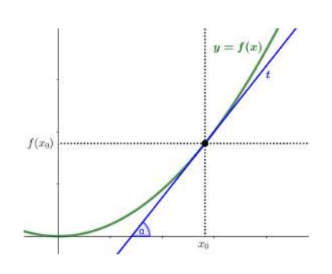
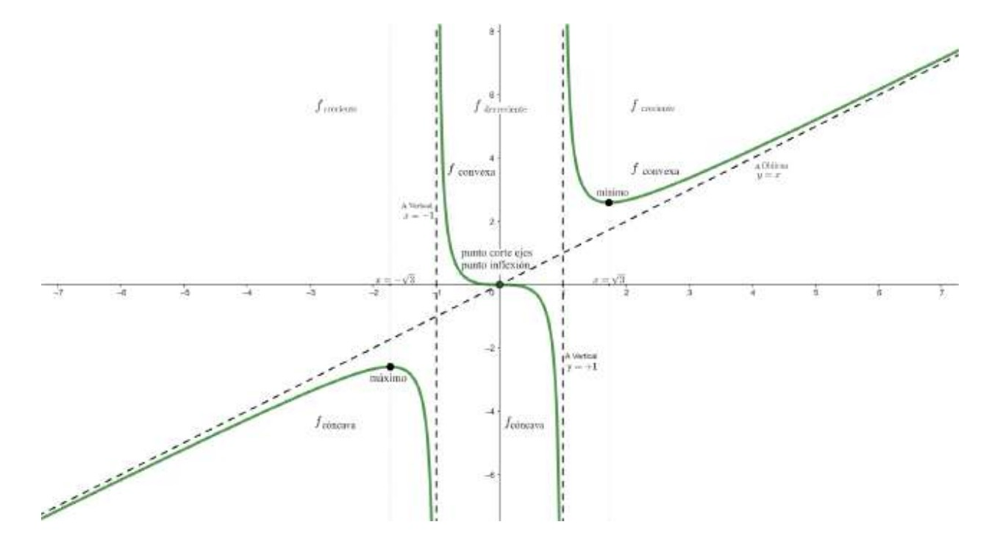

# 11. Derivación de funciones

## 11.1. Derivada de una función en un punto

### 11.1.1. & 11.1.2. Definición, interpretación y cálculo

**Definición y cálculo**

La derivada de una función $f(x)$ en un punto $x_0$ se indica por $f'(x_0)$ y se define por este límite:

$$f'(x_0) = \lim_{x \to x_0} \frac{f(x_0) - f(x)}{x_0 - x}$$

Si este límite no existe, se dice que la función $f(x)$ no es derivable en $x_0$.

**Interpretación**

La derivada de una función $f(x)$ en un punto $x_0$ de su dominio coincide con la pendiente de la recta tangente de la función en este punto. Es decir,

$$f'(x_0) = \tan(\alpha)$$

donde $\alpha$ es el ángulo que hay entre el eje X y la recta tangente a la función en el punto $x_0$.

>Representación gráfica de la derivada de una función en un punto

## 11.2. Derivada de una función

### 11.2.1. Definición e interpretación

La derivada de una función $f(x)$ es aquella función que asocia a cada punto $x$ del dominio la derivada de esta función. La función derivada se designa por $f'(x)$.

| TIPO DE FUNCIÓN                  | EXPRESIÓN MATEMÁTICA          | FÓRMULA DE DERIVACIÓN                                                                    | EJEMPLO APLICADO                                                                                                                            |
| -------------------------------- | ----------------------------- | ---------------------------------------------------------------------------------------- | ------------------------------------------------------------------------------------------------------------------------------------------- |
| **Constante**                    | $k, k \in \mathbb{Z}$         | $0$                                                                                      | $f(x) = 5 \Rightarrow f'(x) = 0$                                                                                                            |
| **Lineal**                       | $a \cdot x, a \in \mathbb{R}$ | $a$                                                                                      | $f(x) = 7x \Rightarrow f'(x) = 7$   $g(x) = -\frac{2}{3}x \Rightarrow g'(x) = -\frac{2}{3}$                                              |
| **Potencia**                     | $x^n, n \in \mathbb{Z}$       | $n \cdot x^{n-1}$                                                                        | $f(x) = x^5 \Rightarrow f'(x) = 5x^4$   $g(x) = \frac{1}{x^3} \Rightarrow g'(x) = -\frac{3}{x^4}$                                        |
| **Exponencial (base constante)** | $a^{f(x)}, a \in \mathbb{R}$  | $a^{f(x)} \cdot \ln(a) \cdot f' (x)$                                                    | $f(x) = 2^{2x} \Rightarrow f'(x) = 2^{2x} \cdot \ln(2) \cdot 2$                                                                            |
| **Exponencial (base variable)**  | $f(x)^{g(x)}$                 | $f(x)^{g(x)} \left ( g' (x) \cdot \ln(f(x)) + \frac{g(x) \cdot f' (x)}{f(x)} \right )$ | $f(x) = x^{x} \Rightarrow f'(x) = x^x \left ( 1 \cdot \ln (x) + \frac{x \cdot 1}{x} \right ) = x^x (\ln (x) + 1)$                          |
| **Raíz n-ésima**                 | $\sqrt[n]{f(x)}$              | $\frac{f' (x)}{n \cdot \sqrt[n]{f(x)^{n-1}}}$                                           | $f(x) = \sqrt{-2x^5} \Rightarrow f'(x) = \frac{-5x^4}{\sqrt{-2x^5}}$   $f(x) = \sqrt[3]{-2x^5} \Rightarrow \frac{-5 \sqrt[3]{2x^5}}{3x}$ |
| **Logarítmica (natural)**        | $\ln(f(x))$                   | $\frac{f' (x)}{x}$                                                                      | $f(x) = \ln(x^2) \Rightarrow f'(x) = \frac{2x}{x^2}$                                                                                        |
| **Logarítmica (base $a$)**       | $\log_a(f(x))$                | $\frac{f' (x)}{f(x) \ln (a)}$                                                           | $f(x) = \log_2(x^2) \Rightarrow f'(x) = \frac{2x}{x^2 \cdot \ln (2)}$                                                                       |
| **Seno**                         | $\sin(f(x))$                  | $f' (x) \cos(f(x))$                                                                     | $f(x) = \sin(2x) \Rightarrow f'(x) = 2\cos(2x)$                                                                                             |
| **Coseno**                       | $\cos(f(x))$                  | $-f' (x) \sin(f(x))$                                                                    | $f(x) = \cos(3x) \Rightarrow f'(x) = -3\sin(3x)$                                                                                            |
| **Tangente**                     | $\tan(f(x))$                  | $\frac{f' (x)}{\cos^2(f(x))}$   $f' (x) + \tan^2(f(x))$                             | $f(x) = \tan(\frac{x}{2}) \Rightarrow f'(x) = \frac{1}{2\cos^2(\frac{x}{2})}$                                                               |
| **Arcoseno**                     | $\arcsin(f(x))$               | $\frac{f' (x)}{\sqrt{1-[f(x)]^2}}$                                                      | $f(x) = \arcsin(\frac{x}{2}) \Rightarrow f'(x) = \frac{1}{\sqrt{4-x^2}}$                                                                    |
| **Arcocoseno**                   | $\arccos(f(x))$               | $-\frac{f' (x)}{\sqrt{1-[f(x)]^2}}$                                                     | $f(x) = \arccos(\sqrt{x}) \Rightarrow f'(x) = -\frac{1}{2\sqrt{x}\sqrt{1-x}}$                                                               |
| **Arcotangente**                 | $\arctan(f(x))$               | $\frac{f' (x)}{1+[f(x)]^2}$                                                             | $f(x) = \arctan(3x) \Rightarrow f'(x) = \frac{3}{1+9x^2}$                                                                                   |

### 11.2.2. Reglas de cálculo

**Suma y resta**

$(f(x) ± g(x))' = f'(x) ± g'(x)$

**Producto**

$(f(x) \cdot g(x))' = f'(x) \cdot g(x) + f(x) \cdot g'(x)$

**Cociente**

$\left(\frac{f(x)}{g(x)}\right)' = \frac{f'(x) \cdot g(x) − f(x) \cdot g'(x)}{g^2(x)}$

**Composición**

$(f ○ g)'(x) = (f(g(x)))' = f'(g(x)) \cdot g'(x)$

**Exponente**

$f(x) = a^u \to f'(x) = a^u \cdot \ln (a) \cdot u'$

$f(x) = e^u \to f'(x) = e^u \cdot u'$

## 11.3. Aplicaciones de una derivada

<table>
	<tbody>
		<tr>
			<td>
				<strong>Descripción de los elementos</strong> para representar gráficamente una función $f(x)$
			</td>
			<td>
				<strong>Ejemplo</strong>. Representar gráficamente $f(x) = \frac{x^3}{x^2 - 1}$
			</td>
		</tr>
		<tr>
			<td colspan="2"></td>
		</tr>
		<tr>
			<td align="center" colspan="2">
				<strong>DOMINIO</strong>
			</td>
		</tr>
		<tr>
			<td>Puntos del eje X donde $f(x)$ está definida.</td>
			<td>$Dom\ f = \mathbb{R} \setminus \set{-1, 1}$</td>
		</tr>
		<tr>
			<td align="center" colspan="2"><strong>PUNTOS DE CORTE CON LOS EJES</strong>
		</tr>
		<tr>
			<td>Puntos del tipo $(0, f(0))$ y $(x, 0)$.</td>
			<td>Un único punto de corte, el $(0, 0)$</td>
		</tr>
		<tr>
			<td align="center" colspan="2">
				<strong>SIMETRÍA</strong>
			</td>
		</tr>
		<tr>
			<td>
				Una función $f$ es par o simétrica respecto del eje Y cuando $f(-x) = f(x)$.
				 
				Una función $f$ es simétrica respecto del origen cuando $f(-x) = -f(x)$.
			</td>
			<td>
				Es simétrica respecto del origen:  
				$f(-x) = \frac{(-x)^3}{(-x)^2 - 1} = -\frac{x^3}{x^2 - 1} = -f(x)$
			</td>
		</tr>
		<tr>
			<td align="center" colspan="2">
				<strong>INTERVALOS DE CRECIMIENTO Y DECRECIMIENTO</strong>
			</td>
		</tr>
		<tr>
			<td>
				Signo de la derivada de la función:
				<ul>
					<li>$f(x)$ es creciente en $f'(x) > 0$.</li>
					<li>$f(x)$ es decreciente en $f'(x) < 0$.</li>
				</ul>
			</td>
			<td>
				Es creciente en $(-\infty, -\sqrt{3}) \cup (\sqrt{3}, +\infty)$ y decreciente en $(-\sqrt{3}, -1) \cup (-1, 1) \cup (1, \sqrt{3})$
			</td>
		</tr>
		<tr>
			<td align="center" colspan="2">
				<strong>EXTREMOS: MÁXIMOS Y MÍNIMOS</strong>
			</td>
		</tr>
		<tr>
			<td>
				Cuando se anula la derivada de la función,
				<ul>
					<li>
						

							Un <strong>máximo</strong> de una función $f(x)$ es un punto de la función la imagen del cual es más grande o igual que la imagen de cualquier otro punto que es cercano al punto:  
						

						

							$x_0$ máximo de $f(x)$ si $f'(x_0) = 0$ y $f''(x_0) < 0$.
						

					</li>
					<li>
						

							Un <strong>mínimo</strong> es un punto de la función la imagen del cual es menor o igual que la imagen de cualquier otro punto que es cercano al punto:
						

						

							$x_0$ mínimo de $f(x)$ si $f'(x_0) = 0$ y $f''(x_0) > 0$.
						

					</li>
				</ul>
			</td>
			<td>
				$(-\sqrt{3}, f(-\sqrt{3})) = (-\sqrt{3}, -\frac{3\sqrt{3}}{2})$ es máximo.  
				$(\sqrt{3}, f(\sqrt{3})) = (\sqrt{3}, \frac{3\sqrt{3}}{2})$ es mínimo.
			</td>
		</tr>
		<tr>
			<td align="center" colspan="2">
				<strong>PUNTOS DE INFLEXIÓN</strong>
			</td>
		</tr>
		<tr>
			<td>
				

					Un <strong>punto de inflexión</strong> de una función $f(x)$ es un punto en el que la función cambia su curvatura, es decir, pasa de ser cóncava a convexa, o viceversa.
				

				

					Cuando la segunda derivada de la función $f(x)$ se anula, $x_0$ es un punto de inflexión si $f''(x_0) = 0$ y $f''(x)$ cambia de signo en un intervalo alrededor de $x_0$.
				

			</td>
			<td>
				$(0, f(0)) = (0, 0)$ es un punto de inflexión.
			</td>
		</tr>
		<tr>
			<td align="center" colspan="2">
				<strong>INTERVALOS DE CONCAVIDAD Y CONVEXIDAD</strong>
			</td>
		</tr>
		<tr>
			<td>Signo de la segunda derivada de la función:
				<ul>
					<li>
						Parte de la función cuya gráfica tiene la forma de un "arco hacia arriba".  
						$f(x)$ convexa si $f''(x) > 0$.
					</li>
					<li>
						Parte de la función cuya gráfica tiene la forma de un "arco hacia abajo".  
						$f(x)$ cóncava si $f''(x) < 0$.
					</li>
				</ul>
			</td>
			<td>
				Es cóncava en $(-1, 0)$ y $(1, \infty)$.  
				Es convexa en $(-\infty, -1)$ y $(0, 1)$.
			</td>
		</tr>
		<tr>
			<td align="center" colspan="2"><strong>COMPORTAMIENTO ASINTÓTICO</strong>
		</tr>
		<tr>
			<td>Estudio de la existencia de asíntotas verticales, horizontales u oblicuas de la función (visto en el bloque de continuidad de funciones).</td>
			<td>$x = -1$ y $x = 1$ son asíntotas verticales y $y = x$ es una asíntota oblicua.</td>
		</tr>
		<tr>
			<td align="center" colspan="2">
				<strong>GRÁFICA</strong>
			</td>
		</tr>
		<tr>
			<td colspan="2">
				
			</td>
		</tr>
	</tbody>
</table>
