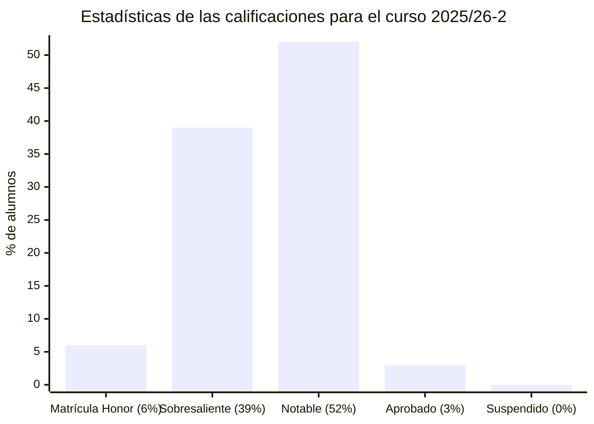
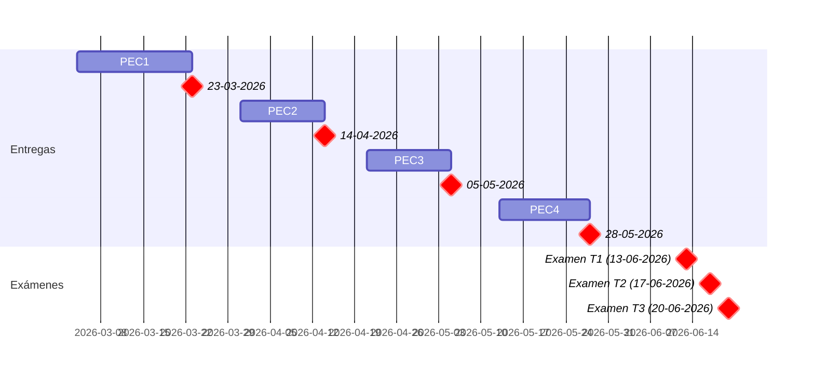

# Inteligencia artificial (25/26-2)

- [Información sobre la asignatura](#información-sobre-la-asignatura)
- [Archivo de exámenes y pruebas de síntesis](#archivo-de-exámenes-y-pruebas-de-síntesis)
- [Calendario de entregas](#calendario-de-entregas)
- [Resumen de calificaciones](#resumen-de-calificaciones)
- [Recursos de aprendizaje](#recursos-de-aprendizaje)
	- [PEC1](#pec1)
	- [PEC2](#pec2)
	- [PEC3](#pec3)
	- [PEC4](#pec4)

## Información sobre la asignatura

- **Código**: 75.582
- **Curso**: 2025/26 (2º semestre)
- **Tipo**: Obligatoria
- **Método de evaluación**: [Evaluación continua (60%) + Prueba de síntesis (40%)] o [Evaluación continua (35%) + Examen (65%)]
- **Créditos**: 6
- [**Plan docente**](https://apps.uoc.edu/PlaDocent/PlaDocent?Semestre=20252&SignatureCode=75.582&Context=3&Locale=es)

>

>	
Leyenda de calificaciones

>
>	- **Matrícula de Honor (M)**: 9 a 10
>	- **Sobresaliente (EX)**: 9 a 10
>	- **Notable (NO)**: 7 a 8,99
>	- **Aprobado (A)**: 5 a 6,99
>	- **Suspendido (SU)**: 0 a 4,99
>

## Archivo de exámenes y pruebas de síntesis

>[!NOTE]
>A diferencia del resto de asignaturas con examen o prueba de síntesis, el profesorado de esta asignatura no comparte las pruebas corregidas. No obstante, la compilación que presento incluye exámenes NO CORREGIDOS —pero con notas por encima del 9— realizados por alumnos de cursos anteriores.

- [Compilación de 13 plantillas de pruebas de síntesis y 6 soluciones planteadas por alumnos desde 2019](examenes)

## Calendario de entregas

## Resumen de calificaciones

>[!NOTE]
>- Considero que realizar la prueba de síntesis es una opción mejor que el examen, ya que es asequible de completar en una hora y no ofrece una dificultad particularmente elevada en comparación con el examen.
>- La calificación final es la que aparece en mi expediente. No tiene por qué ser, necesariamente, el resultado de la suma de las calificaciones ponderadas de los bloques.

<table>
	<tr>
		<th>BLOQUE</th>
		<th>ACTIVIDAD</th>
		<th>CALIFICACIÓN</th>
		<th>CALIFICACIÓN PONDERADA</th>
	</tr>
	<tr>
		<td rowspan="4">
			<strong>Evaluación continua (EC)</strong> (60%)
		</td>
		<td>
			<a href="pec1">
				PEC1 - Resolución de problemas y búsqueda
			</a>
			(25%)
		</td>
		<td>25,00 / 25,00 (A)</td>
		<td rowspan="4">
			

				<strong>Calificación total PEC</strong>:
				 
				97,25 / 100,00
			

			 
			

				<strong>Calificación ponderada EC</strong>:
				 
				5,84 / 6,00
			

		</td>
	</tr>
	<tr>
		<td>
			<a href="pec2">
				PEC2 - Sistemas basados en el conocimiento
			</a>
			(25%)
		</td>
		<td>22,25 / 25,00 (B)</td>
	</tr>
	<tr>
		<td>
			<a href="pec3">
				PEC3 - Incertidumbre y razonamiento aproximado
			</a>
			(25%)
		</td>
		<td>25,00 / 25,00 (A)</td>
	</tr>
	<tr>
		<td>
			<a href="pec4">
				PEC4 - Introducción al aprendizaje computacional
			</a>
			(25%)
		</td>
		<td>25,00 / 25,00 (A)</td>
	</tr>
	<tr>
		<td>
			<a href="examenes/2025/junio/espanol/20242_75570_210625_1_E">
				<strong>Prueba de síntesis</strong>
			</a> (40%)
		</td>
		<td></td>
		<td>10,00 / 10,00</td>
		<td>4,00 / 4,00</td>
	</tr>
	<tr>
		<td colspan="3"></td>
		<td></td>
	</tr>
	<tr>
		<td colspan="3">
			<strong>CALIFICACIÓN FINAL</strong>
		</td>
		<td>9,80 / 10,00 (A)</td>
	</tr>
</table>

## Recursos de aprendizaje

>[!NOTE]
>- No se incluyen los archivos `pdf` en el repositorio para evitar posibles problemas de copyright.

### PEC1

- [**Resolución de problemas y búsqueda**](https://materials.campus.uoc.edu/daisy/Materials/PID_00267997/pdf/PID_00267997.pdf) ([resumen](pec1/recursos/README.md))

### PEC2

- [**Sistemas basados en el conocimiento**](https://materials.campus.uoc.edu/daisy/Materials/PID_00267995/pdf/PID_00267995.pdf) ([resumen](pec2/recursos/README.md))

### PEC3

- [**Incertidumbre y razonamiento aproximado**](https://materials.campus.uoc.edu/daisy/Materials/PID_00267998/pdf/PID_00267998.pdf) ([resumen](pec3/recursos/README.md))

### PEC4

- [**Introducción al aprendizaje computacional**](https://materials.campus.uoc.edu/daisy/Materials/PID_00267996/pdf/PID_00267996.pdf) ([resumen](pec4/recursos/README.md))
