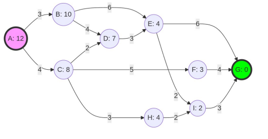

# RESUMEN Sistemas basados en el conocimiento

- [1. Introducción a la resolución de problemas y búsqueda](#1-introducción-a-la-resolución-de-problemas-y-búsqueda)
	- [1.1. Espacio de estados y representación de un problema](#11-espacio-de-estados-y-representación-de-un-problema)
		- [1.1.1. Algunas clases de problemas: Satisfacción de restricciones y planificación](#111-algunas-clases-de-problemas-satisfacción-de-restricciones-y-planificación)
- [2. Construcción de una solución](#2-construcción-de-una-solución)
	- [2.1. Implementación general](#21-implementación-general)
	- [2.2. Consideraciones adicionales y evaluación de algoritmos](#22-consideraciones-adicionales-y-evaluación-de-algoritmos)
- [3. Estrategias de búsqueda no informada](#3-estrategias-de-búsqueda-no-informada)
	- [3.1. Búsqueda en anchura](#31-búsqueda-en-anchura)
		- [3.1.1. Ejemplo práctico: Trazado de la búsqueda en anchura](#311-ejemplo-práctico-trazado-de-la-búsqueda-en-anchura)
	- [3.2. Búsqueda en profundidad](#32-búsqueda-en-profundidad)
		- [3.2.1. Ejemplo práctico: Trazado de la búsqueda en profundidad](#321-ejemplo-práctico-trazado-de-la-búsqueda-en-profundidad)
- [4. Coste y función heurística (búsqueda informada)](#4-coste-y-función-heurística-búsqueda-informada)
	- [4.1. Búsqueda de coste uniforme](#41-búsqueda-de-coste-uniforme)
		- [4.1.1. Ejemplo práctico: Trazado de la búsqueda de coste uniforme](#411-ejemplo-práctico-trazado-de-la-búsqueda-de-coste-uniforme)
	- [4.2. Búsqueda con función heurística: búsqueda ávida o voraz](#42-búsqueda-con-función-heurística-búsqueda-ávida-o-voraz)
		- [4.2.1. Ejemplo práctico: Trazado de la búsqueda ávida](#421-ejemplo-práctico-trazado-de-la-búsqueda-ávida)
	- [4.3. Algoritmo A\*](#43-algoritmo-a)
		- [4.3.1. Algunas cuestiones de la función heurística](#431-algunas-cuestiones-de-la-función-heurística)
		- [4.3.2. Consistencia del heurístico](#432-consistencia-del-heurístico)
		- [4.3.3. Ejemplo práctico: Trazado del algoritmo A\*](#433-ejemplo-práctico-trazado-del-algoritmo-a)
	- [4.4. Otros métodos de búsqueda heurística](#44-otros-métodos-de-búsqueda-heurística)
- [5. Búsqueda con adversario: los juegos](#5-búsqueda-con-adversario-los-juegos)
	- [5.1. Decisiones perfectas: Minimax](#51-decisiones-perfectas-minimax)
		- [5.1.1. La poda α−β](#511-la-poda-αβ)
		- [5.1.2. Ejemplo práctico: Trazado de la poda α−β](#512-ejemplo-práctico-trazado-de-la-poda-αβ)
		- [5.1.3. Ejemplo práctico: Trazado del algoritmo Minimax (sin poda)](#513-ejemplo-práctico-trazado-del-algoritmo-minimax-sin-poda)
	- [5.2. Decisiones imperfectas](#52-decisiones-imperfectas)
	- [5.3. Juegos con elementos de azar](#53-juegos-con-elementos-de-azar)

## 1. Introducción a la resolución de problemas y búsqueda

La inteligencia artificial resuelve problemas modelizando las situaciones de un entorno y las acciones que un sistema puede aplicar para transformarlo y hallar una solución.

### 1.1. Espacio de estados y representación de un problema

La formalización de un problema requiere definir tres componentes principales:

- **El entorno (estado)**: Un estado es la representación del mundo en un instante concreto. Se deben definir todos los estados posibles, diferenciando aquellos representables de los que son verdaderamente válidos según las restricciones.
- **Las acciones del sistema**: Se modelizan como las transiciones entre estados. Estas transiciones las ejecutan los operadores. Al número de acciones aplicables a un estado se le llama factor de ramificación (b). El conjunto de todos los estados y acciones forma el espacio de estados.
- **Definición del problema**: Se requiere conocer la situación de partida o estado inicial y una función objetivo, la cual devuelve verdadero si el estado actual cumple los requisitos de la solución.

#### 1.1.1. Algunas clases de problemas: Satisfacción de restricciones y planificación

- **Problemas de satisfacción de restricciones (CSP)**: Se definen mediante variables y dominios (valores posibles). La solución se obtiene al asignar un valor a cada variable sin violar las restricciones establecidas (ej. el problema de las 8 reinas o problemas criptoaritméticos).
- **Planificación**: Trata de encontrar un plan (secuencia de acciones) que lleve a una meta. Actualmente es más eficiente realizar la búsqueda en un "espacio de planes" (donde las acciones son operaciones de refinamiento sobre planes parciales) que en un espacio de estados clásico.

## 2. Construcción de una solución

Para encontrar el camino desde el estado inicial hasta el objetivo, el algoritmo emplea un árbol de búsqueda. En dicho árbol, la raíz es el estado inicial, los arcos son las acciones y las hojas son estados terminales de los caminos explorados. Es importante destacar que el árbol de búsqueda y el espacio de estados no son iguales: el espacio de estados tiene un nodo único por cada estado, mientras que el árbol de búsqueda puede contener estados repetidos a medida que se exploran distintos caminos.

- **Expansión y frontera**: La expansión de un nodo consiste en aplicarle todos los operadores para generar sus hijos. La frontera es el conjunto de nodos pendientes de ser expandidos.

### 2.1. Implementación general

El esquema general utiliza dos estructuras principales, las cuales a nivel práctico suelen implementarse en lenguajes como Python para una gestión eficiente:

- **Lista de nodos a expandir**: Implementada como una cola con prioridades para decidir qué nodo tratar según la estrategia elegida.
- **Lista de nodos ya expandidos**: Evita perder el rastro del camino tomado.

### 2.2. Consideraciones adicionales y evaluación de algoritmos

Los algoritmos de búsqueda se evalúan según las siguientes propiedades:

1. **Completitud**: Garantiza encontrar una solución si esta existe.
2. **Optimalidad**: Garantiza encontrar la solución de mayor calidad (menor coste) entre todas las posibles.
3. **Complejidad temporal**: El tiempo de ejecución.
4. **Complejidad espacial**: El uso de memoria.
5. **Algoritmos _anytime_**: Retornan una solución para cualquier límite de tiempo dado, mejorándola si se les otorga más tiempo.

Para evitar ciclos infinitos o ineficiencia por **estados repetidos**, se puede: no volver al padre, evitar ciclos en el camino actual, o mantener un historial completo de estados generados ($O(s)$) para no repetir ninguno.

## 3. Estrategias de búsqueda no informada

Estos métodos ordenan la frontera utilizando exclusivamente la información de los operadores y la estructura del árbol, sin conocimiento adicional del problema.

### 3.1. Búsqueda en anchura

Explora el árbol nivel por nivel; no expande nodos del nivel d+1 hasta vaciar el nivel d.

- **Propiedades**: Es completo. Solo es óptimo si el coste del camino crece uniformemente con la profundidad (costes unitarios).
- **Complejidad**: Tanto el tiempo como la memoria son exponenciales: $O(b^d)$. Consume demasiada memoria para problemas complejos.

#### 3.1.1. Ejemplo práctico: Trazado de la búsqueda en anchura

Para ilustrar este método, utilizaremos el problema del rompecabezas lineal, donde el estado inicial es la secuencia `[1, 4, 3, 2]` y el objetivo es llegar a `[1, 2, 3, 4]`. Las acciones posibles son intercambios: Izquierdo (IE), Central (IC) y Derecho (ID).

**Regla principal:** La frontera (lista de **Abiertos**) se gestiona como una cola FIFO (First In, First Out). Los nuevos nodos generados se insertan siempre **al final** de la lista, lo que garantiza que se explore todo un nivel de profundidad $d$ antes de pasar al nivel $d+1$.

* **Paso 0: Inicialización (Nivel 0)**
  * **Abiertos:** `[[1, 4, 3, 2]]`
  * *Explicación:* Se añade el estado inicial.

* **Paso 1: Expandir el Nivel 0**
  * **Abiertos:** `[[4, 1, 3, 2], [1, 3, 4, 2], [1, 4, 2, 3]]` (Hijos generados por IE, IC e ID).
  * *Explicación:* Se extrae el nodo inicial. Como no es la solución, se generan sus tres hijos y se colocan al final de la cola. 

* **Paso 2: Expandir el Nivel 1 (Primer nodo)**
  * **Abiertos:** `[[1, 3, 4, 2], [1, 4, 2, 3], [1, 4, 3, 2], [4, 3, 1, 2], [4, 1, 2, 3]]`
  * *Explicación:* Se extrae `[4, 1, 3, 2]`. Sus tres hijos se añaden **al final** de la cola. De este modo, el primer grupo de elementos que se evaluará será el formado por `[1, 3, 4, 2]` y `[1, 4, 2, 3]` (ambos del Nivel 1), antes de los creados recientemente del Nivel 2.

>[!NOTE]
>**Nota teórica:** Este algoritmo encontrará la solución óptima en cuanto a número de pasos, pero su cola de Abiertos crecerá exponencialmente, al igual que el consumo de memoria.

### 3.2. Búsqueda en profundidad

Expande siempre el nodo más profundo de la frontera.

- **Propiedades**: **No es completo**, ya que puede caer en ciclos infinitos si no controla repetidos. No es óptimo.
- **Complejidad**: Su gran ventaja es la memoria, que es lineal: $O(b \cdot m)$, donde $m$ es la profundidad máxima. Su tiempo es $O(b^m)$.

Para aprovechar su baja memoria evitando sus riesgos, existen variantes:

- **Búsqueda en profundidad limitada**: Acota la exploración a una profundidad $p$. Es completa solo si la solución está a una profundidad menor o igual a $p$. Sus costes son $O(b^p)$.
- **Búsqueda iterativa con profundidad**: Realiza búsquedas limitadas incrementando el límite progresivamente. Es **completo** y ahorra mucha memoria ($O(b \cdot d)$) a expensas de un ligero sobrecoste temporal por re-expandir niveles superiores (tiempo $O(b^d)$).

#### 3.2.1. Ejemplo práctico: Trazado de la búsqueda en profundidad

Utilizando el mismo rompecabezas lineal, veamos cómo se comporta la búsqueda en profundidad pura.

**Regla principal:** La frontera se gestiona como una pila LIFO (Last In, First Out). Los nuevos nodos generados se insertan siempre **al principio** de la lista, delante de los existentes, lo que obliga al algoritmo a profundizar por una sola rama hasta el final.

* **Paso 0: Inicialización**
  * **Abiertos:** `[[1, 4, 3, 2]]`

* **Paso 1: Expandir Nivel 0**
  * **Abiertos:** `[[4, 1, 3, 2], [1, 3, 4, 2], [1, 4, 2, 3]]`
  * *Explicación:* Hasta aquí, igual que en anchura.

* **Paso 2: Expandir Nivel 1 (primer nodo)**
  * **Abiertos:** `[[1, 4, 3, 2], [4, 3, 1, 2], [4, 1, 2, 3], [1, 3, 4, 2], [1, 4, 2, 3]]`
  * *Explicación:* Al expandir `[4, 1, 3, 2]`, sus hijos se insertan **al principio** de la lista. En la siguiente iteración, el algoritmo extraerá `[1, 4, 3, 2]`, que es un hijo del Nivel 2, en lugar de evaluar a sus hermanos del Nivel 1.

> **Nota teórica sobre el riesgo de ciclos:** Fíjate que el primer nodo de Abiertos en el Paso 2 vuelve a ser el estado inicial `[1, 4, 3, 2]`, generado al aplicar IE otra vez. Si el algoritmo no controla los estados repetidos, en el Paso 3 volverá a generar `[4, 1, 3, 2]`, entrando en un ciclo infinito y demostrando que este algoritmo **no es completo**.

## 4. Coste y función heurística (búsqueda informada)

Estos métodos priorizan la expansión usando información que estima la proximidad al objetivo.

### 4.1. Búsqueda de coste uniforme

Expande el nodo cuyo coste de camino acumulado desde el origen, $g(n)$, es el menor. Es equivalente a la búsqueda en anchura cuando la heurística es $h(n)=0$ para todos los nodos. Es **completo y óptimo** siempre que el coste de las aristas sea positivo.

#### 4.1.1. Ejemplo práctico: Trazado de la búsqueda de coste uniforme

Supongamos que buscamos la ruta más corta desde Montblanc hasta Tarragona en un mapa de carreteras. 

**Regla principal:** La frontera se ordena de menor a mayor coste real acumulado ($g(n)$). No utiliza heurística.

* **Paso 0: Inicialización**
  * **Abiertos:** `[['Montblanc', 0]]`

* **Paso 1: Expandir Montblanc**
  * **Abiertos:** `[['L'Espluga', 6], ['Valls', 17], ['Alcover', 18], ['El Vendrell', 41]]`
  * *Explicación:* Se expande el origen. Los nodos se insertan ordenados por la distancia real desde Montblanc.

* **Paso 2: Expandir L'Espluga**
  * **Abiertos:** `[['Poblet', 10], ['Valls', 17], ['Alcover', 18], ['El Vendrell', 41]]`
  * *Explicación:* Se extrae L'Espluga ($g=6$). Se genera Poblet ($g = 6 + 4 = 10$). Como 10 es menor que 17, Poblet se coloca en la cabeza de la lista.

* **Paso 3: Expandir Poblet**
  * **Abiertos:** `[['Valls', 17], ['Alcover', 18], ['El Vendrell', 41], ['Tarragona', 94]]`
  * *Explicación:* Se extrae Poblet. Se genera el destino Tarragona ($g = 10 + 84 = 94$). Aunque Tarragona es el objetivo, **el algoritmo no se detiene** porque su coste (94) es peor que el de Valls (17). Extraerá Valls y seguirá buscando rutas alternativas más baratas hasta que Tarragona sea el primer elemento de la lista.

### 4.2. Búsqueda con función heurística: búsqueda ávida o voraz

Utiliza una **función heurística** $h(n)$ que estima el coste restante desde el nodo n hasta el objetivo. Expande siempre el nodo con el menor $h(n)$. Se dirige rápido hacia la meta, pero **no es completo ni óptimo**.

#### 4.2.1. Ejemplo práctico: Trazado de la búsqueda ávida

>Figura 1: Grafo de ejemplo

Para comprender cómo funciona la búsqueda ávida en la práctica, consideremos la tarea de encontrar el camino desde un nodo inicial $A$ hasta un nodo objetivo $G$ del grafo representado en la figura 1.

**Regla principal:** Este algoritmo ignora por completo el coste real acumulado de las aristas ($g(n)$) y ordena la frontera (lista de nodos **Abiertos**) de menor a mayor valor según su función heurística ($h(n)$).

El trazado paso a paso (indicando `[Nodo, h(n)]`) sería el siguiente:

* **Paso 0: Inicialización**
  * **Abiertos:** `[['A', 12]]`
  * **Cerrados:** `[]`
  * *Explicación:* Se añade el estado inicial a la frontera.

* **Paso 1: Expandir A**
  * **Abiertos:** `[['C', 8], ['B', 10]]`
  * **Cerrados:** `[['A', 12]]`
  * *Explicación:* El nodo $A$ tiene dos hijos: $B$ ($h=10$) y $C$ ($h=8$). Se insertan en la lista de Abiertos ordenados de mejor (menor $h$) a peor.

* **Paso 2: Expandir C (el más prometedor)**
  * **Abiertos:** `[['F', 3], ['H', 4], ['D', 7], ['B', 10]]`
  * **Cerrados:** `[['C', 8], ['A', 12]]`
  * *Explicación:* Se extrae $C$ y se pasa a Cerrados. Sus hijos son $D$ ($h=7$), $F$ ($h=3$) y $H$ ($h=4$). Se añaden a Abiertos y se reordena toda la lista. El nodo $B$ queda relegado al final por tener la peor heurística.

* **Paso 3: Expandir F**
  * **Abiertos:** `[['G', 0], ['H', 4], ['D', 7], ['B', 10]]`
  * **Cerrados:** `[['F', 3], ['C', 8], ['A', 12]]`
  * *Explicación:* Se extrae $F$ por tener la mejor heurística ($h=3$). Su único hijo es $G$ ($h=0$). Al insertarlo, se coloca en la cabeza de la lista.

* **Paso 4: Expandir G**
  * Al extraer $G$ de la lista de Abiertos, el algoritmo detecta que es el estado objetivo ($h=0$) y se detiene la búsqueda.

**Resultado:** Reconstruyendo los pasos a través de la lista de Cerrados, obtenemos que el camino elegido es: $A \rightarrow C \rightarrow F \rightarrow G$.

>[!NOTE]
> **Nota teórica sobre la optimalidad:** Si analizamos el grafo real, el coste de este camino elegido por la búsqueda ávida es de **13**. Sin embargo, existe otro camino ($A \rightarrow C \rightarrow H \rightarrow I \rightarrow G$) cuyo coste real es **12**. Esto demuestra de forma práctica lo indicado en la teoría: **la búsqueda ávida no es óptima**. Tomó decisiones "golosas" hacia $F$ porque parecía estar más cerca ($h=3$) que $H$ ($h=4$), perdiéndose la ruta más barata. El algoritmo A* resuelve este problema.

### 4.3. Algoritmo A*

Combina los dos métodos anteriores. Selecciona el nodo que minimice la función: $f(n)=g(n)+h(n)$.

- **Admisibilidad**: $A^*$ es óptimo y completo si la heurística es **admisible**; es decir, si nunca sobrestima el coste real ($h(n) \le h^*(n)$). Es una heurística "optimista".

#### 4.3.1. Algunas cuestiones de la función heurística

- **Factor de ramificación efectivo ($b^*$)**: Mide la calidad de la heurística. Se extrae de $N=1+b^*+(b^*)^2+...+(b^*)^d$. Cuanto más cercano a 1 sea $b^*$, mejor es la heurística.
- **Dominancia**: Si para todo nodo una heurística $h_2(n) \ge h_1(n)$ siendo ambas admisibles, se dice que $h_2$ domina a $h_1$. La dominancia implica que el uso de $h_2$ expandirá la misma o menor cantidad de nodos que $h_1$, por lo que es más eficiente.
- **$A^*$ ponderado**:* Variación que utiliza $f(n)=g(n)+W⋅h(n)$ con $W>1$. Vuelve la búsqueda más rápida (voraz), pero pierde la garantía de optimalidad.

#### 4.3.2. Consistencia del heurístico

Una heurística es **consistente (o monótona)** si cumple que avanzar a un nodo vecino nunca reduce $h$ en una cantidad mayor a lo que cuesta el paso: $h(x)≤\text{coste}(x,y)+h(y)$.

- **$A^*$ simplificado vs. $A^*$ completo:** Si la heurística es consistente (el valor $f(n)$ nunca decrece) y un nodo ya visitado (en la lista de Cerrados) no tiene que ser revisado. Si la heurística es admisible pero inconsistente, el algoritmo debe ser el $A^*$ **completo**: si un nodo vecino ya está en la lista de Cerrados pero se descubre un camino con menor coste $g$, dicho nodo **debe volver a la lista de Abiertos** para re-propagar la mejora y encontrar el óptimo. Un heurístico inconsistente hace que falle el algoritmo $A^*$ simplificado y que sea necesario realizar este recálculo con el algoritmo $A^*$ completo.

#### 4.3.3. Ejemplo práctico: Trazado del algoritmo A*

Para comprender la diferencia con la búsqueda ávida, resolvamos el mismo camino desde el nodo $A$ hasta el nodo $G$ del grafo representado en la [Figura 1](#421-ejemplo-práctico-trazado-de-la-búsqueda-ávida) utilizando el algoritmo $A^*$.

**Regla principal:** Este algoritmo evalúa cada nodo minimizando la función $f(n) = g(n) + h(n)$. Es decir, suma el coste real acumulado desde el origen ($g(n)$) y la heurística hasta la meta ($h(n)$). La frontera (lista de nodos **Abiertos**) se ordena siempre de menor a mayor valor $f(n)$.

El trazado paso a paso (indicando `[Nodo, f(n)]`) sería el siguiente:

* **Paso 0: Inicialización**
  * **Abiertos:** `[['A', 12]]` (Coste: $g=0, h=12 \rightarrow f=12$)
  * **Cerrados:** `[]`
  * *Explicación:* Se añade el estado inicial a la frontera evaluando su función $f(n)$.

* **Paso 1: Expandir A**
  * **Abiertos:** `[['C', 12], ['B', 13]]`
  * **Cerrados:** `[['A', 12]]`
  * *Explicación:* El nodo $A$ tiene dos hijos. $C$ ($g=4, h=8 \rightarrow f=12$) y $B$ ($g=3, h=10 \rightarrow f=13$). Se ordenan de menor a mayor valor $f$.

* **Paso 2: Expandir C (el más prometedor)**
  * **Abiertos:** `[['H', 11], ['F', 12], ['B', 13], ['D', 13]]`
  * **Cerrados:** `[['A', 12], ['C', 12]]`
  * *Explicación:* Se extrae $C$ (coste real acumulado $g=4$). Sus hijos son $H$ ($g=4+3=7, h=4 \rightarrow f=11$), $F$ ($g=4+5=9, h=3 \rightarrow f=12$) y $D$ ($g=4+2=6, h=7 \rightarrow f=13$). Se añaden a Abiertos y se reordena. Como podemos apreciar, $H$ ha tomado la delantera porque su evaluación total es la mejor.

* **Paso 3: Expandir H**
  * **Abiertos:** `[['I', 11], ['F', 12], ['B', 13], ['D', 13]]`
  * **Cerrados:** `[['H', 11], ['A', 12], ['C', 12]]`
  * *Explicación:* Se extrae $H$ (coste real acumulado $g=7$). Su único hijo es $I$ ($g=7+2=9, h=2 \rightarrow f=11$). Entra en la primera posición.

* **Paso 4: Expandir I**
  * **Abiertos:** `[['F', 12], ['G', 12], ['B', 13], ['D', 13]]`
  * **Cerrados:** `[['I', 11], ['H', 11], ['A', 12], ['C', 12]]`
  * *Explicación:* Se extrae $I$ (coste real acumulado $g=9$). Su hijo es el objetivo $G$ ($g=9+3=12, h=0 \rightarrow f=12$). Se inserta en Abiertos. Como empata a $12$ con $F$, el algoritmo los coloca juntos (en este ejemplo, manteniendo a $F$ primero por orden de llegada o criterio de desempate).

* **Paso 5: Expandir F**
  * **Abiertos:** `[['G', 12], ['B', 13], ['D', 13]]`
  * **Cerrados:** `[['H', 11], ['I', 11], ['A', 12], ['C', 12], ['F', 12]]`
  * *Explicación:* Se extrae $F$ (coste real acumulado $g=9$). Su hijo es $G$, al cual llegaríamos con un coste $g=9+4=13$. Como $f=13$ es peor que el $f=12$ que ya habíamos encontrado para $G$ a través de $I$, ignoramos este nuevo camino.

* **Paso 6: Expandir G**
  * **Abiertos:** `[['B', 13], ['D', 13]]`
  * **Cerrados:** `[['H', 11], ['I', 11], ['A', 12], ['C', 12], ['F', 12], ['G', 12]]`
  * *Explicación:* Al extraer $G$ de la lista de Abiertos, es el estado objetivo y el algoritmo finaliza.

**Resultado:** Reconstruyendo los pasos, obtenemos que el camino óptimo elegido es: $A \rightarrow C \rightarrow H \rightarrow I \rightarrow G$.

>[!NOTE]
> **Nota teórica sobre la optimalidad:** A diferencia de la búsqueda ávida, el algoritmo $A^*$ ha sido capaz de encontrar el camino **óptimo**. Esto se debe a que no se ha dejado "cegar" únicamente por la heurística, sino que ha equilibrado su avance considerando también el coste real de los pasos dados ($g(n)$). El coste total de esta ruta es, efectivamente, **12**.

### 4.4. Otros métodos de búsqueda heurística

Para solventar el colapso de memoria del $A^*$, existen variantes como el IDA* ($A^*$ con profundidad iterativa) o la **reducción de nodos** (liberar memoria borrando los hijos de peor evaluación subiendo sus valores al padre). Su estudio está fuera del ámbito de esta asignatura.

## 5. Búsqueda con adversario: los juegos

Aborda problemas donde un oponente altera el entorno desfavorablemente.

### 5.1. Decisiones perfectas: Minimax

Diseñado para juegos de dos jugadores sin azar con recursos ilimitados. Se asume un jugador **MÁX** que intenta maximizar una función de utilidad y un jugador **MÍN** que busca minimizarla. El algoritmo expande todo el árbol de juego hasta nodos terminales, evalúa la utilidad y va propagando los valores hacia arriba: en turnos MÁX elige el mayor valor y en turnos MÍN elige el menor. Su coste exponencial es $O(b^d)$, lo que lo hace inoperable en juegos como el ajedrez.

#### 5.1.1. La poda α−β

Optimiza el Minimax ahorrándose la evaluación de ramas inútiles. Funciona mediante dos umbrales dinámicos:

- **α (alfa)**: El mejor valor asegurado hasta ahora para MÁX.
- **β (beta)**: El mejor valor asegurado hasta ahora para MÍN.

**Condición de poda**: Se interrumpe la exploración de un subárbol en el momento en que $α \ge β$. Matemáticamente, el nodo MÁX podará porque sabe que el nodo MÍN ancestral ya cuenta con una alternativa mejor. En el caso ideal con los nodos ordenados perfectamente, reduce el coste a $O(b^{d/2})$.

#### 5.1.2. Ejemplo práctico: Trazado de la poda α−β

Para ilustrar cómo funcionan los umbrales dinámicos, analicemos un árbol de juego de profundidad 2 donde el nodo raíz es **MÍN** (el adversario que desea minimizar el resultado) y tiene dos hijos, $n_1$ y $n_2$, de tipo **MÁX**. 
- Las hojas de $n_1$ valen 5 y 12 (de izquierda a derecha).
- Las hojas de $n_2$ valen 8 y 12 (de izquierda a derecha).

**Regla principal:** La exploración de un subárbol se interrumpe (se poda) en el momento en el que se cumple la condición $\alpha \ge \beta$. 

El trazado paso a paso explorando de izquierda a derecha es el siguiente:

* **Paso 1: Inicialización**
  * El nodo raíz (MÍN) comienza con los valores extremos: $\alpha = -\infty$, $\beta = +\infty$.

* **Paso 2: Exploración del nodo $n_1$ (MÁX)**
  * Hereda de la raíz los valores $\alpha = -\infty$, $\beta = +\infty$.
	* *Visita la hoja izquierda (5):* $n_1$ actualiza su valor a $\max(-\infty, 5) = 5$ y su propio $\alpha = 5$. Se comprueba la condición de poda ($\alpha \ge \beta \Rightarrow 5 \ge +\infty$), lo cual es **falso**. No se poda.
	* *Visita la hoja derecha (12):* $n_1$ actualiza su valor a $\max(5, 12) = 12$ y actualiza su $\alpha = 12$.
	* *Resultado:* El nodo $n_1$ termina su exploración y devuelve el valor **12** a la raíz.

* **Paso 3: Actualización en la raíz (MÍN)**
  * La raíz evalúa el resultado devuelto por $n_1$ y actualiza su valor a $\min(+\infty, 12) = 12$.
	* Actualiza su límite superior: **$\beta = 12$**. Ya sabe que, pase lo que pase en la otra rama, nunca dejará que el resultado sea mayor que 12.

* **Paso 4: Exploración del nodo $n_2$ (MÁX)**
	* Hereda de la raíz los valores actualizados: $\alpha = -\infty$, **$\beta = 12$**.
	* *Visita la hoja izquierda (8):* $n_2$ actualiza su valor a $\max(-\infty, 8) = 8$ y su propio $\alpha = 8$. Se comprueba la condición de poda con el $\beta$ heredado ($\alpha \ge \beta \Rightarrow 8 \ge 12$), lo cual es **falso**. Como no se cumple, **no hay poda** y debe seguir explorando.
	* *Visita la hoja derecha (12):* $n_2$ actualiza su valor a $\max(8, 12) = 12$ y su $\alpha = 12$. Aquí la condición de poda se cumpliría ($12 \ge 12$), pero al ser la última hoja, no quedan más ramas que omitir.
	* *Resultado:* El nodo $n_2$ devuelve el valor **12** a la raíz.

* **Paso 5: Resolución en la raíz (MÍN)**
	* La raíz evalúa el resultado de $n_2$ y actualiza su valor final a $\min(12, 12) = 12$.

**Conclusión del ejercicio:**
En este caso específico, **se visitan las cuatro hojas y no se produce ninguna poda**. Esto ocurre porque el valor de la primera hoja de $n_2$ (8) no fue lo suficientemente alto como para igualar o superar la restricción de la raíz ($\beta = 12$). 

>[!NOTE]
>**¿Qué tendría que haber pasado para que existiera poda?** 
>Si la primera hoja de $n_2$ hubiera sido, por ejemplo, un **15**, el nodo MÁX habría actualizado su $\alpha=15$. En ese momento, la condición $\alpha \ge \beta$ ($15 \ge 12$) **sí se habría cumplido**. MÁX dejaría de mirar la hoja derecha porque sabe que MÍN (arriba) ya tiene asegurado un 12 por la rama izquierda, y no le permitirá a MÁX quedarse con el 15 (MÍN podaría la rama $n_2$).

#### 5.1.3. Ejemplo práctico: Trazado del algoritmo Minimax (sin poda)

Analicemos un árbol de juego artificial de profundidad 2. El nodo raíz (a) es MÁX. Sus hijos (b, f, j) son MÍN. Las hojas en el nivel 2 son estados terminales con valores de utilidad ya calculados.

**Regla principal:** Se expande todo el árbol hasta el final y los valores "suben" desde las hojas hacia la raíz. Los nodos **MÍN** eligen el valor más bajo de sus hijos, y los nodos **MÁX** eligen el más alto.

* **Paso 1: Evaluación en las hojas (Nivel 2)**
  * El nodo (b) tiene hijos con valores: `5, 8, 9`.
  * El nodo (f) tiene hijos con valores: `3, 8, 6`.
  * El nodo (j) tiene hijos con valores: `8, 6, 3`.

* **Paso 2: Propagación al Nivel 1 (Turno MÍN)**
  * MÍN en (b) elige el mínimo de `(5, 8, 9)` $\rightarrow$ **$v(b) = 5$**.
  * MÍN en (f) elige el mínimo de `(3, 8, 6)` $\rightarrow$ **$v(f) = 3$**.
  * MÍN en (j) elige el mínimo de `(8, 6, 3)` $\rightarrow$ **$v(j) = 3$**.

* **Paso 3: Decisión en la Raíz (Turno MÁX)**
  * MÁX en (a) evalúa las opciones que le dejan sus adversarios `(5, 3, 3)`.
  * Elige el máximo $\rightarrow$ **$v(a) = 5$**. MÁX tomará el camino hacia el nodo (b).

### 5.2. Decisiones imperfectas

En escenarios reales se debe acotar el desarrollo del árbol a una profundidad máxima dada por restricciones de tiempo. Al no alcanzar estados terminales, se sustituye la función por una **función de evaluación heurística** de las hojas que estime la probabilidad de ganar en dicha posición. A veces las decisiones no resultarán óptimas, pero son viables computacionalmente.

### 5.3. Juegos con elementos de azar

Cuando intervienen dados o azar, se añaden niveles de nodos estocásticos (no deterministas), al árbol. La evaluación de un nodo probabilístico no es un máximo ni un mínimo, sino el **valor esperado**, que se calcula como la media de los valores de sus hijos ponderada por la probabilidad de ocurrencia de cada factor aleatorio.