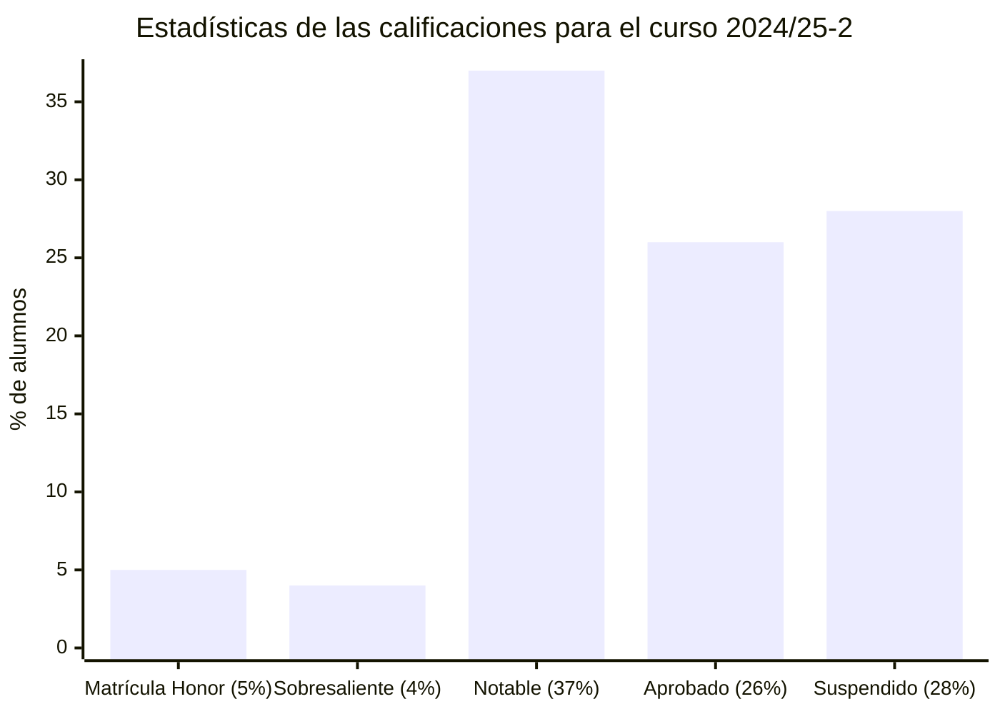

# Lógica (24/25-2)

## Información sobre la asignatura

- **Curso**: 2024/25 (2º semestre)
- **Tipo**: Básica
- **Método de evaluación**: [Evaluación continua (EC) + Prueba de síntesis (PS)] o [Evaluación continua (EC) + Examen (EX)]
- **Ponderación**: (EC 70% + PS 30%) o (EC 35% + EX 65%)
- **Créditos**: 6
- [**Plan docente**](https://apps.uoc.edu/PlaDocent/PlaDocent?Semestre=20242&SignatureCode=75.570&Context=3&Locale=es)

>

>	
Leyenda de calificaciones

>
>	- Matrícula de Honor (M): 9 a 10
>	- Sobresaliente (EX): 9 a 10
>	- Notable (NO): 7 a 8,99
>	- Aprobado (A): 5 a 6,99
>	- Suspendido (SU): 0 a 4,99
>

## Calificación final 

- [**Prueba de síntesis**](ps): - / 10,00 ()
- **Evaluación continua**: - / 10,00 ()
- **Calificación final**: - / 10,00 ()

## Pruebas de evaluación continua (PECs)

>[!NOTE]
>- En la mayoría de casos, se dispondrá de un máximo de tres intentos para realizar el ejercicio. Si no se consigue resolver el ejercicio se puede solicitar, un nuevo enunciado hasta completar el número máximo de intentos permitido.
>- Cada ejercicio de la PEC varía de un intento a otro.

| NOMBRE                                                              | CALIFICACIÓN       |
|---------------------------------------------------------------------|--------------------|
| [PEC1 - El lenguaje formal de la lógica de enunciados](pec1)            | - / 16,67 ( )  |
| [PEC2 - La deducción natural: un sistema de razonamiento formal](pec2)     | - / 16,67 ( )  |
| [PEC3 - Mecanización y verificación de razonamientos formales](pec3) | - / 16,67 ( ) |
| [PEC4 - El lenguaje formal de la lógica de predicados](pec4)                    | - / 16,67 ( ) |
| [PEC5 - La deducción natural en la lógica de predicados](pec5)                    | - / 16,67 ( ) |
| [PEC6 - El método de resolución y la semántica de la lógica de predicados](pec6)                    | - / 16,67 ( ) |
|                                                                     |                      |
| **SUMA DE CALIFICACIONES**                                          | **- / 100,02 ( )** |
| **CALIFICACIÓN PONDERADA** (70%)                                    | **- / 70,00 ( )** |

## Pruebas prácticas (PPs)

>[!NOTE]
>- La PP no tiene efectos en la nota y su objetivo se prepararse para la PEC.
>- Se puede repetir tantas veces como quiera.
>- Cada intento se puede guardar y continuar más tarde.

| NOMBRE                                                              | CALIFICACIÓN       |
|---------------------------------------------------------------------|--------------------|
| [PP1 - El lenguaje formal de la lógica de enunciados](pec1/pp1)            | - / 16,67 ( )  |
| [PP2 - La deducción natural: un sistema de razonamiento formal](pec2/pp2)     | - / 16,67 ( )  |
| [PP3 - Mecanización y verificación de razonamientos formales](pec3/pp3) | - / 16,67 ( ) |
| [PP4 - El lenguaje formal de la lógica de predicados](pec4/pp4)                    | - / 16,67 ( ) |
| [PP5 - La deducción natural en la lógica de predicados](pec5/pp5)                    | - / 16,67 ( ) |
| [PP6 - El método de resolución y la semántica de la lógica de predicados](pec6/pp6)                    | - / 16,67 ( ) |

## Recursos de aprendizaje

>[!NOTE]
>- En lugar de usar los recursos provistos por la UOC, recomiendo seguir [esta playlist de YouTube](https://www.youtube.com/playlist?list=PLX3CfQWn-1E1MpqMS_CWzbSSiY7hgOhtA) de la asignatura realizada por el canal [Aprende Sin Espinas](https://www.youtube.com/@AprendeSinEspinas).
>- No se incluyen los archivos `pdf` en el repositorio para evitar posibles problemas de copyright.

### PEC1

[Lógica de enunciados](http://cvapp.uoc.edu/autors/MostraPDFMaterialAction.do?id=265957&hash=f4eec8d6f2470281eeabfd721755d26ab5429e0b8fd1581689cea334dc3dd6a5)
- Apartado **1. La lógica de enunciados y su lenguaje**. Páginas 7 a 22. [Resumen](pec1/recursos).

### PEC2

[Lógica de enunciados](http://cvapp.uoc.edu/autors/MostraPDFMaterialAction.do?id=265957&hash=f4eec8d6f2470281eeabfd721755d26ab5429e0b8fd1581689cea334dc3dd6a5)
- Apartado **2. La deducción natural**. Páginas 23 a 52. [Resumen](pec2/recursos).

### PEC3

[Lógica de enunciados](http://cvapp.uoc.edu/autors/MostraPDFMaterialAction.do?id=265957&hash=f4eec8d6f2470281eeabfd721755d26ab5429e0b8fd1581689cea334dc3dd6a5)
- Desde el apartado **3. Verdad y falsedad: alternativa y complemento de la deducción natural** hasta el **5. Resolución**. Páginas 53 a 78. [Resumen](pec3/recursos).

### PEC4

[Lógica de predicados](http://cvapp.uoc.edu/autors/MostraPDFMaterialAction.do?id=265958&hash=baefe4fe0e1c8594e63fe3a9c98754ced25fc6b142154c8a6c4e6f31ed28dfde)
- Apartado **1. La lógica de predicados y su lenguaje**. Páginas 7 a 23. [Resumen](pec4/recursos).

### PEC5

[Lógica de predicados](http://cvapp.uoc.edu/autors/MostraPDFMaterialAction.do?id=265958&hash=baefe4fe0e1c8594e63fe3a9c98754ced25fc6b142154c8a6c4e6f31ed28dfde)
- Apartado **2. La deducción natural**. Páginas 24 a 33. [Resumen](pec5/recursos).

### PEC6

[Lógica de predicados](http://cvapp.uoc.edu/autors/MostraPDFMaterialAction.do?id=265958&hash=baefe4fe0e1c8594e63fe3a9c98754ced25fc6b142154c8a6c4e6f31ed28dfde)
- Desde el apartado **3. Verdad y falsedad en la lógica de predicados** hasta el **6. La programación lógica**. Páginas 34 a 62. [Resumen](pec6/recursos).
