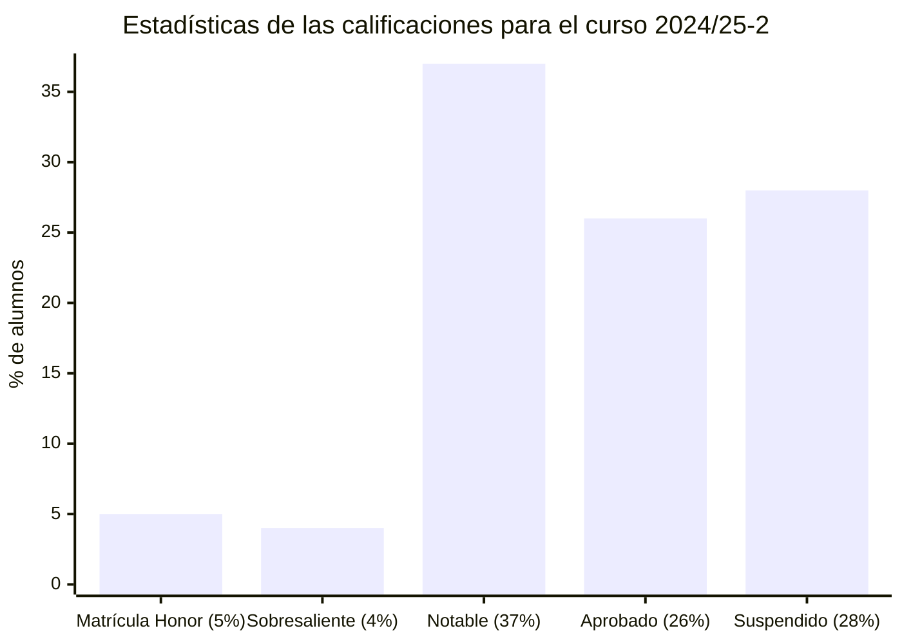

# Lógica (24/25-2)

## Información sobre la asignatura

- **Curso**: 2024/25 (2º semestre)
- **Tipo**: Básica
- **Método de evaluación**: [Evaluación continua (70%) + Prueba de síntesis (30%)] o [Evaluación continua (35%) + Examen (65%)]
- **Créditos**: 6
- [**Plan docente**](https://apps.uoc.edu/PlaDocent/PlaDocent?Semestre=20242&SignatureCode=75.570&Context=3&Locale=es)

>

>	
Leyenda de calificaciones

>
>	- **Matrícula de Honor (M)**: 9 a 10
>	- **Sobresaliente (EX)**: 9 a 10
>	- **Notable (NO)**: 7 a 8,99
>	- **Aprobado (A)**: 5 a 6,99
>	- **Suspendido (SU)**: 0 a 4,99
>

## Resumen de calificaciones

>[!NOTE]
>La calificación final es la que aparece en mi expediente. No tiene por qué ser, necesariamente, el resultado de la suma de las calificaciones ponderadas de los bloques.

<table>
	<tr>
		<th>BLOQUE</th>
		<th>ACTIVIDAD</th>
		<th>CALIFICACIÓN</th>
		<th>CALIFICACIÓN PONDERADA</th>
	</tr>
	<tr>
		<td rowspan="6">
			<strong>Evaluación continua (EC)</strong> (70%)
		</td>
		<td>
			<a href="pec1">
				PEC1 - El lenguaje formal de la lógica de enunciados
			</a>
			(16,67%)
		</td>
		<td>16,67 / 16,67 (A)</td>
		<td rowspan="6">
			

				<strong>Calificación total PECs</strong>:
				 
				91,25 / 100,00
			

			 
			

				<strong>Calificación ponderada EC</strong>:
				 
				6,39 / 7,00
			

		</td>
	</tr>
	<tr>
		<td>
			<a href="pec2">
				PEC2 - La deducción natural: un sistema de razonamiento formal
			</a>
			(16,67%)
		</td>
		<td>16,67 / 16,67 (A)</td>
	</tr>
	<tr>
		<td>
			<a href="pec3">
				PEC3 - Mecanización y verificación de razonamientos formales
			</a>
			(16,67%)
		</td>
		<td>12,17 / 16,67 (B)</td>
	</tr>
	<tr>
		<td>
			<a href="pec4">
				PEC4 - El lenguaje formal de la lógica de predicados
			</a>
			(16,67%)
		</td>
		<td>16,67 / 16,67 (A)</td>
	</tr>
	<tr>
		<td>
			<a href="pec5">
				PEC5 - La deducción natural en la lógica de predicados
			</a>
			(16,66%)
		</td>
		<td>14,66 / 16,66 (B)</td>
	</tr>
	<tr>
		<td>
			<a href="pec6">
				PEC6 - El método de resolución y la semántica de la lógica de predicados
			</a>
			(16,66%)
		</td>
		<td>14,41 / 16,66 (B)</td>
	</tr>
	<tr>
		<td>
			<a href="ps">
				<strong>Prueba de síntesis</strong>
			</a> (30%)
		</td>
		<td></td>
		<td>- / 10,00</td>
		<td>- / 3,00</td>
	</tr>
	<tr>
		<td colspan="3"></td>
		<td></td>
	</tr>
	<tr>
		<td colspan="3">
			<strong>CALIFICACIÓN FINAL</strong>
		</td>
		<td>- / 10,00 ( )</td>
	</tr>
</table>

## Pruebas prácticas (PPs)

>[!NOTE]
>- La PP no tiene efectos en la calificación de la evaluación continua. Su objetivo es ayudar al alumnado a lograr los contenidos y las habilidades necesarias para resolver la PEC.
>- Se puede repetir tantas veces como se quiera.
>- Cada intento se puede guardar y continuar más tarde.

| NOMBRE                                                              | CALIFICACIÓN       |
|---------------------------------------------------------------------|--------------------|
| [PP1 - El lenguaje formal de la lógica de enunciados](pec1/pp1)            | 10,00 / 10,00 (A)  |
| [PP2 - La deducción natural: un sistema de razonamiento formal](pec2/pp2)     | 10,00 / 10,00 (A)  |
| [PP3 - Mecanización y verificación de razonamientos formales](pec3/pp3) | 10,00 / 10,00 (A) |
| [PP4 - El lenguaje formal de la lógica de predicados](pec4/pp4)                    | 10,00 / 10,00 (A) |
| [PP5 - La deducción natural en la lógica de predicados](pec5/pp5)                    | 10,00 / 10,00 (A) |
| [PP6 - El método de resolución y la semántica de la lógica de predicados](pec6/pp6)                    | 10,00 / 10,00 (A) |

## Ejercicios de Alura

Alura es la herramienta con la que se realizan las PECs y las PPs de la asignatura. Proporciona retroalimentación inmediata sobre la corrección de los ejercicios realizados. Dentro de ella, hay **ejercicios de carácter opcional** que permiten al alumno poner en práctica los aspectos teóricos estudiados en el libro.

Los ejercicios se dividen en los dos bloques principales enseñados en la asignatura: la lógica de **enunciados** y la lógica de **predicados**.

### Lógica de enunciados

<table>
	<tr>
		<th>BLOQUE</th>
		<th>DIFICULTAD</th>
		<th>Nº DE EJERCICIOS</th>
	</tr>
	<!-- FORMALIZACIÓN -->
	<tr>
		<td rowspan="3">
			<a href="ejercicios_alura/1_logica_de_enunciados/1_formalizacion">
			Formalización
			</a>
		</td>
		<td>
			<a href="ejercicios_alura/1_logica_de_enunciados/1_formalizacion/1_facil">
				🟩 Fácil
			</a>
		</td>
		<td>4</td>
	</tr>
	<tr>
		<td>
			<a href="ejercicios_alura/1_logica_de_enunciados/1_formalizacion/2_medio">
				🟧 Media
			</a>
		</td>
		<td>4</td>
	</tr>
	<tr>
		<td>
			<a href="ejercicios_alura/1_logica_de_enunciados/1_formalizacion/3_dificil">
				🟥 Difícil
			</a>
		</td>
		<td>3</td>
	</tr>
	<!-- DEDUCCIÓN NATURAL -->
	<tr>
		<td rowspan="2">
			<a href="ejercicios_alura/1_logica_de_enunciados/2_deduccion_natural">
			Deducción natural
			</a>
		</td>
		<td>
			<a href="ejercicios_alura/1_logica_de_enunciados/2_deduccion_natural/1_medio">
				🟧 Media
			</a>
		</td>
		<td>26</td>
	</tr>
	<tr>
		<td>
			<a href="ejercicios_alura/1_logica_de_enunciados/2_deduccion_natural/2_dificil">
				🟥 Difícil
			</a>
		</td>
		<td>2</td>
	</tr>
	<!-- RESOLUCIÓN -->
	<tr>
		<td>
			<a href="ejercicios_alura/1_logica_de_enunciados/3_resolucion">
				Resolución
			</a>
		</td>
		<td>
			<a href="ejercicios_alura/1_logica_de_enunciados/3_resolucion/1_medio">
				🟧 Media
			</a>
		</td>
		<td>12</td>
	</tr>
	<!-- TABLAS DE VERDAD -->
	<tr>
		<td rowspan="3">
			<a href="ejercicios_alura/1_logica_de_enunciados/4_tablas_de_verdad">
				Tablas de verdad
			</a>
		</td>
		<td>
			<a href="ejercicios_alura/1_logica_de_enunciados/4_tablas_de_verdad/1_facil">
				🟩 Fácil
			</a>
		</td>
		<td>4</td>
	</tr>
	<tr>
		<td>
			<a href="ejercicios_alura/1_logica_de_enunciados/4_tablas_de_verdad/2_medio">
				🟧 Media
			</a>
		</td>
		<td>5</td>
	</tr>
	<tr>
		<td>
			<a href="ejercicios_alura/1_logica_de_enunciados/4_tablas_de_verdad/3_dificil">
				🟥 Difícil
			</a>
		</td>
		<td>1</td>
	</tr>
</table>

### Lógica de predicados

<table>
	<tr>
		<th>BLOQUE</th>
		<th>DIFICULTAD</th>
		<th>Nº DE EJERCICIOS</th>
	</tr>
	<!-- DEDUCCIÓN NATURAL -->
	<tr>
		<td rowspan="2">
			<a href="ejercicios_alura/2_logica_de_predicados/1_deduccion_natural">
			Deducción natural
			</a>
		</td>
		<td>
			<a href="ejercicios_alura/2_logica_de_predicados/1_deduccion_natural/1_facil">
				🟩 Fácil
			</a>
		</td>
		<td>5</td>
	</tr>
	<tr>
		<td>
			<a href="ejercicios_alura/2_logica_de_predicados/1_deduccion_natural//2_medio">
				🟧 Media
			</a>
		</td>
		<td>12</td>
	</tr>
	<!-- RESOLUCIÓN -->
	<tr>
		<td>
			<a href="ejercicios_alura/2_logica_de_predicados/2_resolucion">
				Resolución
			</a>
		</td>
		<td>
			<a href="ejercicios_alura/2_logica_de_predicados/2_resolucion/1_medio">
				🟧 Media
			</a>
		</td>
		<td>8</td>
	</tr>
	<!-- FÓRMULAS A ENUNCIADOS -->
	<tr>
		<td rowspan="2">
			<a href="ejercicios_alura/2_logica_de_predicados/3_formulas_a_enunciados">
				Fórmulas a enunciados
			</a>
		</td>
		<td>
			<a href="ejercicios_alura/2_logica_de_predicados/3_formulas_a_enunciados/1_facil">
				🟩 Fácil
			</a>
		</td>
		<td>2</td>
	</tr>
	<tr>
		<td>
			<a href="ejercicios_alura/2_logica_de_predicados/3_formulas_a_enunciados/2_medio">
				🟧 Media
			</a>
		</td>
		<td>3</td>
	</tr>
</table>

## Recursos de aprendizaje

>[!NOTE]
>- En lugar de usar los recursos provistos por la UOC, recomiendo seguir [esta playlist de YouTube](https://www.youtube.com/playlist?list=PLX3CfQWn-1E1MpqMS_CWzbSSiY7hgOhtA) de la asignatura realizada por el canal [Aprende Sin Espinas](https://www.youtube.com/@AprendeSinEspinas).
>- No se incluyen los archivos `pdf` en el repositorio para evitar posibles problemas de copyright.

### PEC1

[Lógica de enunciados](http://cvapp.uoc.edu/autors/MostraPDFMaterialAction.do?id=265957&hash=f4eec8d6f2470281eeabfd721755d26ab5429e0b8fd1581689cea334dc3dd6a5)
- Apartado **1. La lógica de enunciados y su lenguaje**. Páginas 7 a 22. [Resumen](pec1/recursos).

### PEC2

[Lógica de enunciados](http://cvapp.uoc.edu/autors/MostraPDFMaterialAction.do?id=265957&hash=f4eec8d6f2470281eeabfd721755d26ab5429e0b8fd1581689cea334dc3dd6a5)
- Apartado **2. La deducción natural**. Páginas 23 a 52. [Resumen](pec2/recursos).

### PEC3

[Lógica de enunciados](http://cvapp.uoc.edu/autors/MostraPDFMaterialAction.do?id=265957&hash=f4eec8d6f2470281eeabfd721755d26ab5429e0b8fd1581689cea334dc3dd6a5)
- Desde el apartado **3. Verdad y falsedad: alternativa y complemento de la deducción natural** hasta el **5. Resolución**. Páginas 53 a 78. [Resumen](pec3/recursos).

### PEC4

[Lógica de predicados](http://cvapp.uoc.edu/autors/MostraPDFMaterialAction.do?id=265958&hash=baefe4fe0e1c8594e63fe3a9c98754ced25fc6b142154c8a6c4e6f31ed28dfde)
- Apartado **1. La lógica de predicados y su lenguaje**. Páginas 7 a 23. [Resumen](pec4/recursos).

### PEC5

[Lógica de predicados](http://cvapp.uoc.edu/autors/MostraPDFMaterialAction.do?id=265958&hash=baefe4fe0e1c8594e63fe3a9c98754ced25fc6b142154c8a6c4e6f31ed28dfde)
- Apartado **2. La deducción natural**. Páginas 24 a 33. [Resumen](pec5/recursos).

### PEC6

>[!NOTE]
>El bloque de fórmulas a enunciados no aparece en el libro, por lo que recomiendo consultar [este resumen](pec6/recursos/formulas_a_enunciados.md) de elaboración propia.

[Lógica de predicados](http://cvapp.uoc.edu/autors/MostraPDFMaterialAction.do?id=265958&hash=baefe4fe0e1c8594e63fe3a9c98754ced25fc6b142154c8a6c4e6f31ed28dfde)
- Desde el apartado **3. Verdad y falsedad en la lógica de predicados** hasta el **5. Resolución**. Páginas 34 a 53. [Resumen](pec6/recursos).
