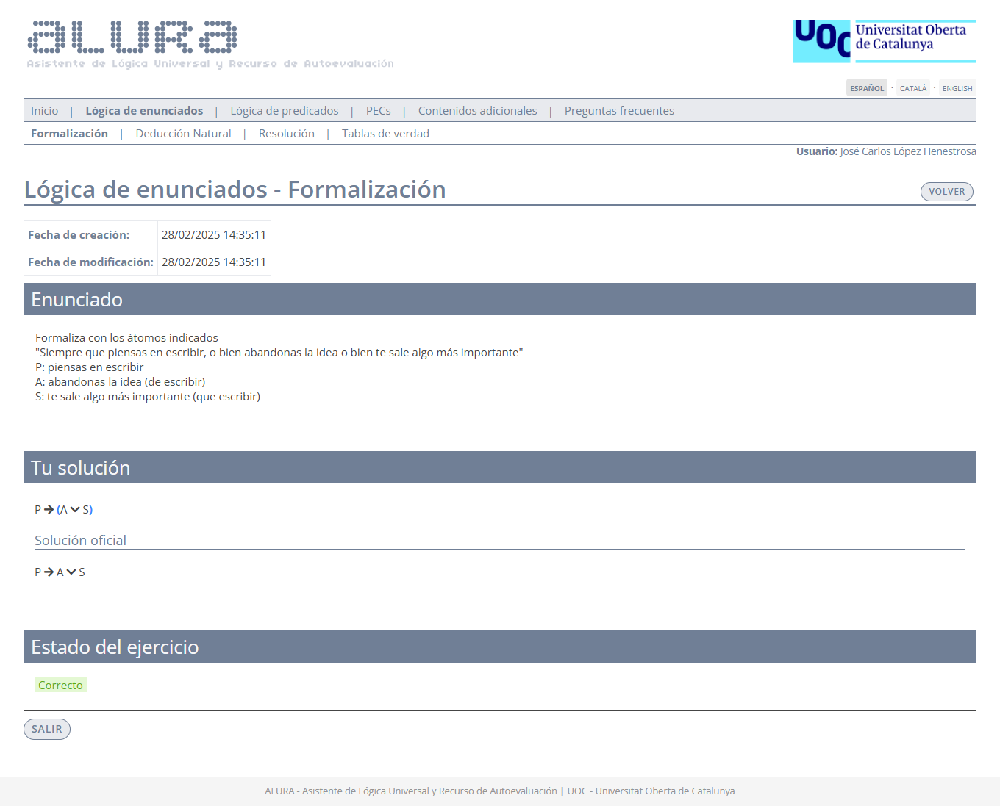
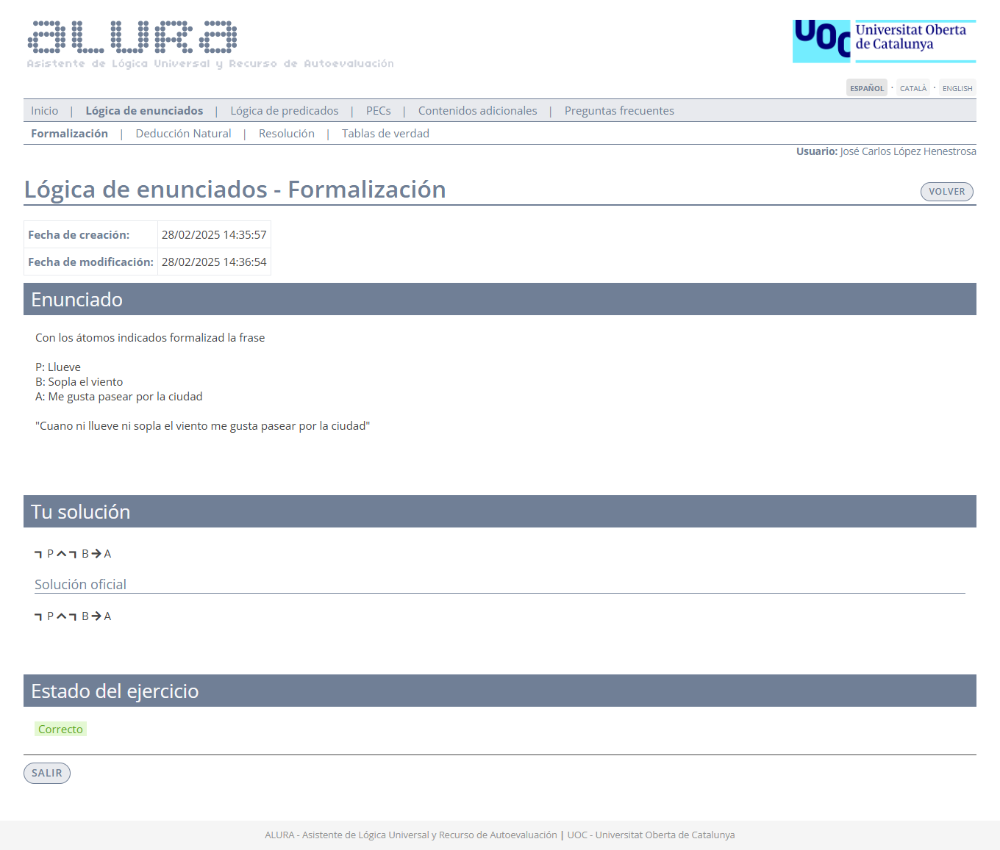
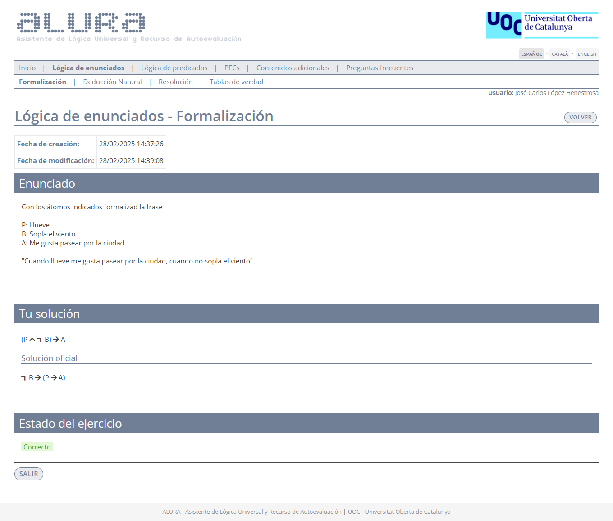
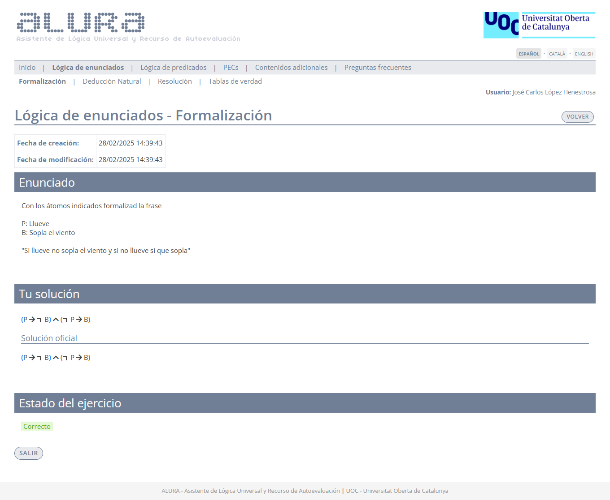
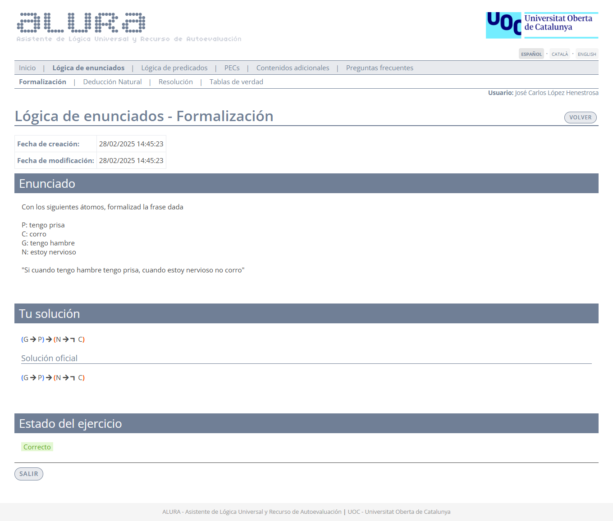
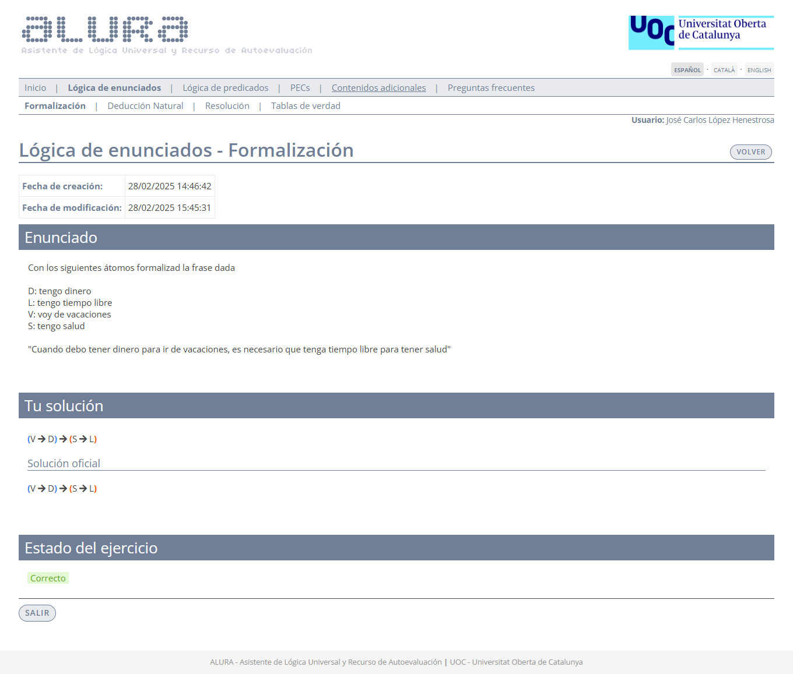

# Ejercicios de Alura - Lógica de enunciados: Formalización

El desglose de los ejercicios se realiza por dificultad:

- 🟩 Fácil
- 🟧 Media
- 🟥 Difícil

## 🟩 Fácil

>**Siempre que piensas en escribir, o bien abandonas la idea o bien te sale algo más importante**

	
Captura de pantalla

**Átomos**:
- $P$: "piensas en escribir"
- $A$: "abandonas la idea (de escribir)"
- $S$: "te sale algo más importante (que escribir)"

	
<strong>Formalización</strong>

$P \rightarrow (A \vee S)$  
$P \rightarrow A \vee S$

 
 

>**Cuando ni llueve ni soplas el viento, me gusta pasear por la ciudad**

	
Captura de pantalla

**Átomos**:
- $P$: "llueve"
- $B$: "sopla el viento"
- $A$: "me gusta pasear por la ciudad"

	
<strong>Formalización</strong>

$\neg P \wedge \neg B \rightarrow A$

 
 

>**Cuando llueve me gusta pasear por la ciudad, cuando no sopla el viento**

	
Captura de pantalla

**Átomos**:
- $P$: "llueve"
- $B$: "sopla el viento"
- $A$: "me gusta pasear por la ciudad"

	
<strong>Formalización</strong>

$(P \wedge \neg B) \rightarrow A$  
$\neg B \rightarrow (P \rightarrow A)$

 
 

>**Si llueve no sopla el viento y si no llueve sí que sopla**

	
Captura de pantalla

**Átomos**:
- $P$: "llueve"
- $B$: "sopla el viento"

	
<strong>Formalización</strong>

$(P \rightarrow \neg B) \wedge (\neg P \rightarrow B)$

## 🟧 Media

>**Cuando tengo prisa y hambre, corro siempre que no estoy nervioso**

	
Captura de pantalla

**Átomos**:
- $P$: "tengo prisa"
- $C$: "corro"
- $G$: "tengo hambre"
- $N$: "estoy nervioso"

	
<strong>Formalización</strong>

$(P \wedge G) \rightarrow (\neg N \rightarrow C)$  
$P \wedge G \rightarrow (\neg N \rightarrow C)$

 
 

>**Cuando estoy nervioso, corro cuando tengo hambre y no tengo prisa**

	
Captura de pantalla

**Átomos**:
- $P$: "tengo prisa"
- $C$: "corro"
- $G$: "tengo hambre"
- $N$: "estoy nervioso"

	
<strong>Formalización</strong>

$N \wedge G \wedge \neg P \rightarrow C$  
$N \wedge (G \wedge \neg P \rightarrow C)$

 
 

>**Si cuando tengo hambre tengo prisa, cuando estoy nervioso no corro**

	
Captura de pantalla

**Átomos**:
- $P$: "tengo prisa"
- $C$: "corro"
- $G$: "tengo hambre"
- $N$: "estoy nervioso"

	
<strong>Formalización</strong>

$(G \rightarrow P) \rightarrow (N \rightarrow \neg C)$

 
 

>**Debo estar nervioso para tener prisa y debo tener hambre para correr**

	
Captura de pantalla

**Átomos**:
- $P$: "tengo prisa"
- $C$: "corro"
- $G$: "tengo hambre"
- $N$: "estoy nervioso"

	
<strong>Formalización</strong>

$(P \rightarrow N) \wedge (C \rightarrow G)$

### 🟥 Difícil

>**Cuando debo tener dinero para ir de vacaciones, es necesario que tenga tiempo libre para tener salud**

	
Captura de pantalla

**Átomos**:
- $D$: "tengo dinero"
- $L$: "tengo tiempo libre"
- $V$: "voy de vacaciones"
- $S$: "tengo salud"

	
<strong>Formalización</strong>

$(V \rightarrow D) \rightarrow (S \rightarrow L)$

 
 

>**Cuando tengo tiempo libre, es necesario que tenga dinero y salud para ir de vacaciones**

	
Captura de pantalla

**Átomos**:
- $D$: "tengo dinero"
- $L$: "tengo tiempo libre"
- $V$: "voy de vacaciones"
- $S$: "tengo salud"

	
<strong>Formalización</strong>

$L \rightarrow (V \rightarrow (D \wedge S))$  
$L \rightarrow (V \rightarrow D \wedge S)$

 
 

>**Es necesario que tenga dinero y salud para ir de vacaciones cuando tengo tiempo libre**

	
Captura de pantalla

**Átomos**:
- $D$: "tengo dinero"
- $L$: "tengo tiempo libre"
- $V$: "voy de vacaciones"
- $S$: "tengo salud"

	
<strong>Formalización</strong>

$L \rightarrow V \rightarrow (D \wedge S)$  
$(L \rightarrow V) \rightarrow D \wedge S$

