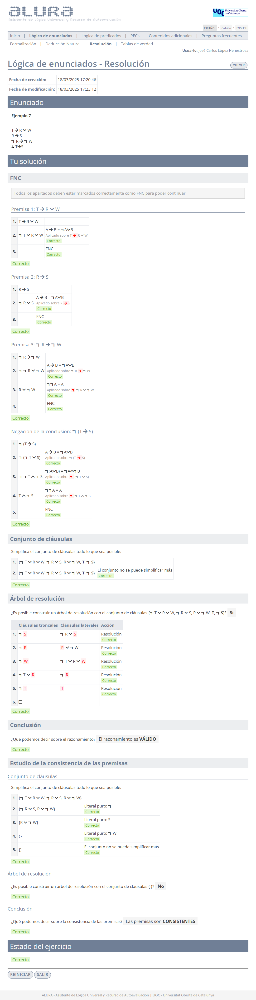

# Ejercicios de Alura - Lógica de enunciados: resolución

El desglose de los ejercicios se realiza por dificultad:

- [🟧 Media](#-media)

## 🟧 Media

### 1

>1. $A \rightarrow (B \rightarrow \neg (A \vee B))$
>2. $\therefore \neg (A \vee B)$

	
Solución

### 2

>1. $A \rightarrow (B \rightarrow (C \rightarrow D \wedge K \wedge F))$
>2. $\therefore C \wedge B \rightarrow (\neg (D \wedge K \wedge F) \rightarrow \neg A)$

	
Solución

### 3

>1. $A \vee B$
>2. $B \rightarrow C \vee D$
>3. $A \rightarrow D$
>4. $D \rightarrow K$
>5. $C \rightarrow A$
>6. $\therefore K$

	
Solución

### 4

>1. $L \wedge M \rightarrow \neg P$
>2. $I \rightarrow P$
>3. $M$
>4. $I$
>5. $\therefore \neg L$

	
Solución

### 5

>1. $A \vee B$
>2. $A \rightarrow C$
>3. $\neg D \rightarrow \neg B$
>4. $\therefore C \vee D$

	
Solución

### 6

>1. $P \rightarrow (Q \rightarrow R)$
>2. $\therefore Q \rightarrow (P \rightarrow R)$

	
Solución

### 7

>1. $G \rightarrow A \vee B$
>2. $A \rightarrow C \vee D$
>3. $B \rightarrow K \wedge F$
>4. $\neg D$
>5. $\therefore G \rightarrow C \vee K$

	
Solución

### 8

>1. $M \vee \neg N \rightarrow \neg P$
>2. $R \rightarrow P$
>3. $R \rightarrow Q$
>4. $\therefore R \rightarrow R \wedge Q$

	
Solución

### 9

>1. $P \rightarrow Q$
>2. $T \rightarrow Q \rightarrow W$
>3. $R \rightarrow T$
>4. $\neg (R \rightarrow W)$
>5. $\therefore \neg P$

	
Solución

### 10

>1. $T \rightarrow R \vee W$
>2. $R \rightarrow S$
>3. $\neg R \rightarrow \neg W$
>4. $\therefore T \rightarrow S$

	
Solución

### 11

>1. $A \vee B \rightarrow C$
>2. $A \wedge B \rightarrow C$
>3. $A \rightarrow B \wedge D$
>4. $C \vee (\neg A \rightarrow B)$
>5. $\therefore D \rightarrow C \vee A$

	
Solución

### 12

>1. $A \rightarrow B \wedge D$
>2. $B \rightarrow C$
>3. $\neg A \rightarrow B \vee C$
>4. $\neg B \rightarrow A$
>5. $\neg (C \wedge B)$
>6. $\therefore C \wedge \neg (B \wedge D)$

	
Solución

