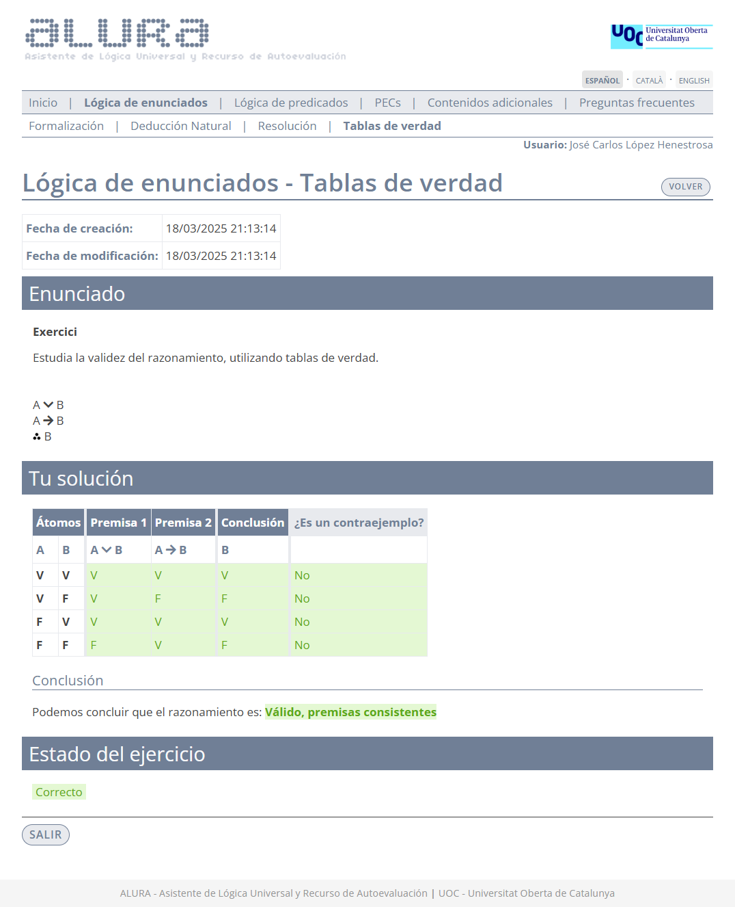
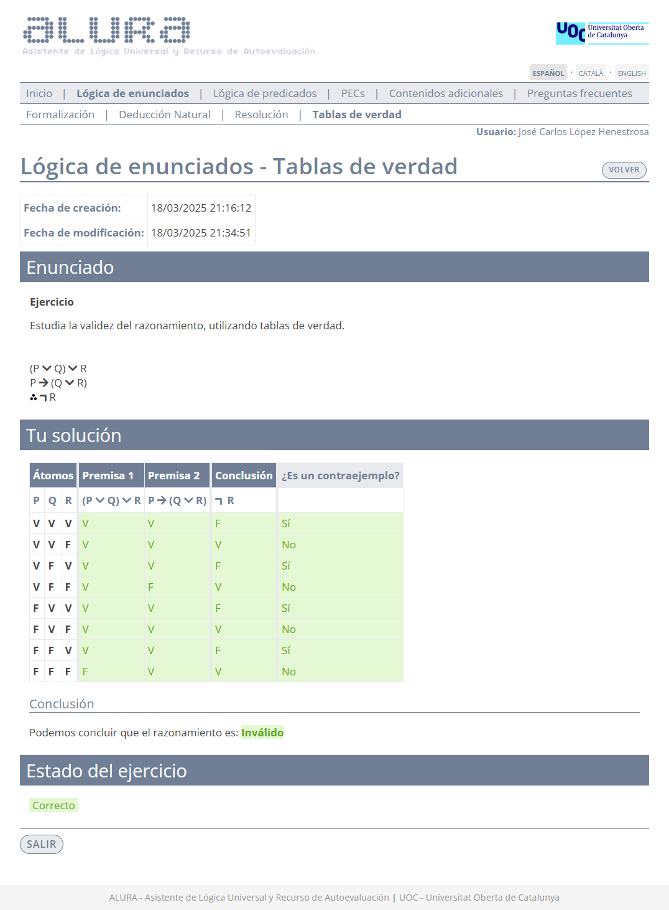
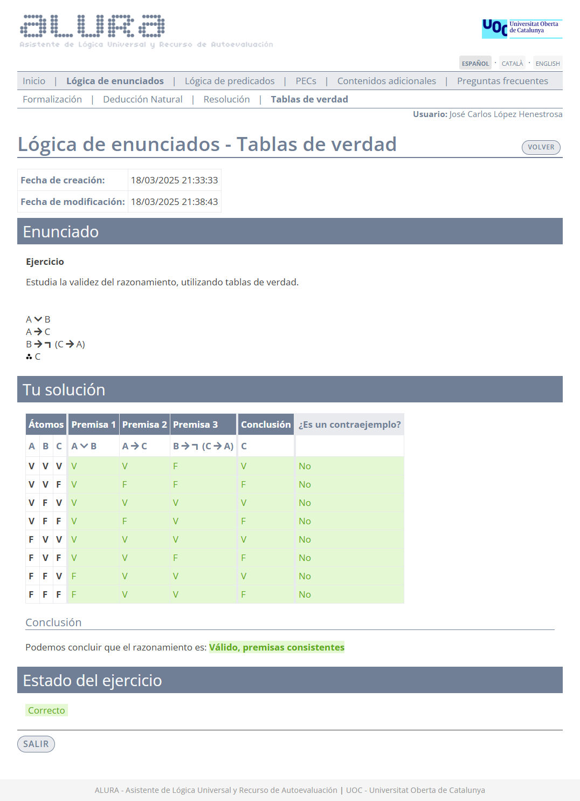
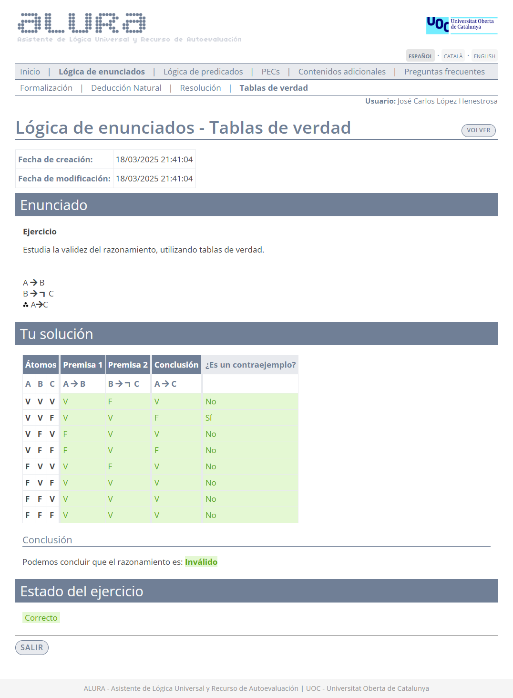
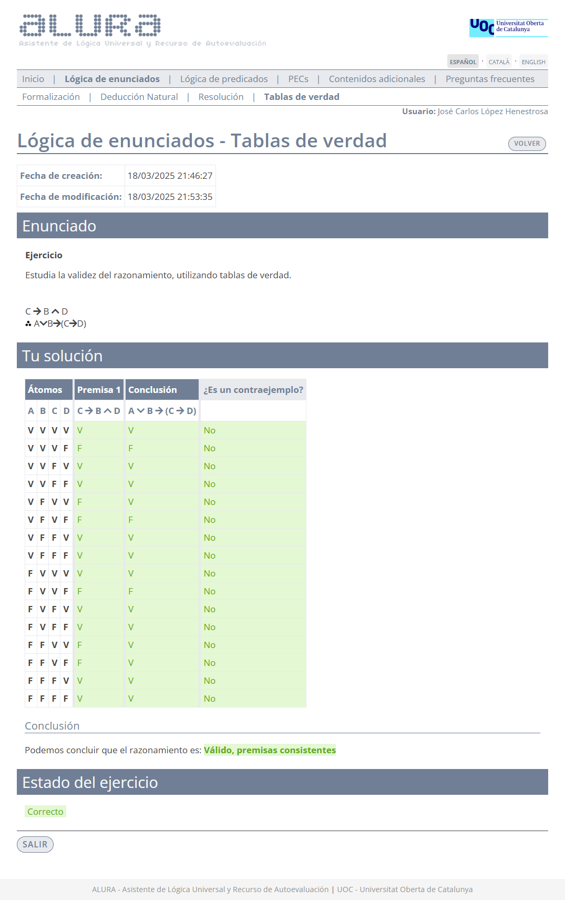

# Ejercicios de Alura - Lógica de enunciados: tablas de verdad

El desglose de los ejercicios se realiza por dificultad:

- [🟩 Fácil](#-fácil)
- [🟧 Media](#-media)
- [🟥 Difícil](#-difícil)

## 🟩 Fácil

### 1

1. $P \rightarrow Q$
2. $P$
3. $\therefore P \wedge Q$

	
Solución

### 2

1. $A \rightarrow B$
2. $\neg A$
3. $\therefore \neg B$

	
Solución

### 3

1. $A \vee B$
2. $A \rightarrow B$
3. $\therefore B$

	
Solución

### 4

1. $A \vee \neg B$
2. $A \rightarrow B$
3. $\therefore A$

	
Solución

## 🟧 Media

### 1

>1. $(P \vee Q) \vee R$
>2. $P \rightarrow (Q \vee R)$
>3. $\therefore \neg R$

	
Solución

### 2

>1. $A \rightarrow B$
>2. $B \rightarrow C$
>3. $\therefore A \rightarrow (B \rightarrow C)$

	
Solución

### 3

>1. $A \vee B$
>2. $A \rightarrow C$
>3. $B \rightarrow \neg (C \rightarrow A)$
>4. $\therefore A$

	
Solución

### 4

>1. $A \rightarrow B$
>2. $B \rightarrow \neg C$
>3. $\therefore A \rightarrow C$

	
Solución

### 5

>1. $A \rightarrow \neg B$
>2. $\neg (A \rightarrow C)$
>3. $A \rightarrow (B \rightarrow C)$
>4. $\therefore A \vee C$

	
Solución

## 🟥 Difícil

### 1

>1. $C \rightarrow B \wedge D$
>2. $\therefore A \vee B \rightarrow (C \rightarrow D)$

	
Solución

