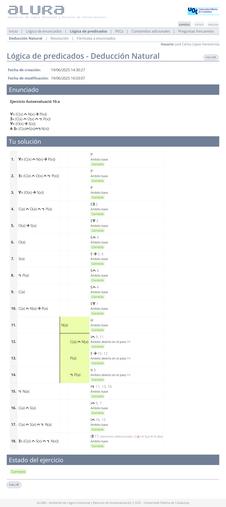

# Ejercicios de Alura - Lógica de predicados: deducción natural

El desglose de los ejercicios se realiza por dificultad:

- [🟩 Fácil](#-facil)
- [🟧 Media](#-media)

## 🟩 Fácil

### 1

>1. $\forall x (B(x) \to C(x))$
>2. $\exists x (A(x) \wedge B(x))$
>3. $\therefore \exists x (A(x) \wedge C(x))$

	
Solución

### 2

>1. $\forall x P(x)$
>2. $\exists x Q(x)$
>3. $\therefore \exists x (P(x) \wedge Q(x))$

	
Solución

### 3

>1. $\forall x (P(x) \wedge \neg Q(x))$
>2. $\therefore \exists x (P(x) \vee \neg Q(x))$

	
Solución

1. $\exists x (P(x) \vee Q(x))$
>2. $\therefore \exists x P(x) \vee \exists x Q(x)$

	
Solución

### 5

>1. $\forall x (B(x) \to C(x))$
>2. $\exists x (A(x) \wedge B(x))$
>3. $\therefore \exists x (A(x) \wedge C(x))$

	
Solución

## 🟧 Media

### 1

>1. $\forall x \forall y (M(x) \wedge G(x,y) \to P(x,y))$
>2. $\neg P(a,b)$
>3. $G(a,b)$
>4. $\therefore \neg M(a)$

	
Solución

### 2

>1. $\forall x (\forall y A(y,x) \to \exists z B(z,x))$
>2. $\exists x (C(x) \wedge O(x) \wedge \neg P(x))$
>3. $\forall x (O(x) \to S(x))$
>4. $\therefore \exists x (C(x) \wedge S(x) \wedge \neg N (x))$

	
Solución

### 3

>1. $\forall x P(x) \wedge \forall x Q(x)$
>2. $\therefore \forall x (P(x) \wedge Q(x))$

	
Solución

### 4

>1. $\exists x (P(x) \vee Q(x))$
>2. $\therefore \exists x P(x) \vee \exists x Q(x)$

	
Solución

### 5

>1. $\forall x P(x)$
>2. $\therefore \forall y P(y)$

	
Solución

### 6

>1. $\exists x P(x)$
>2. $\therefore \exists y P(y)$

	
Solución

### 7

>1. $\forall x (P(x) \to Q(x))$
>4. $\forall x P(x)$
>5. $\therefore \forall y Q(y)$

	
Solución

### 8

>1. $\forall x (P(x) \wedge Q(x))$
>2. $P(a)$
>3. $\therefore \exists Q(x)$

	
Solución

### 9

>1. $\forall x \forall y (\neg (R(x) \to \neg T(x,y)))$
>2. $\forall x \exists y (P(x) \to Q(x,y))$
>3. $\exists x \forall y (R(x) \wedge Q(x,y) \to \neg T(x,y))$
>4. $\therefore \exists x \neg P(x)$

	
solución

### 10

>1. $\forall x (P(x) \to \neg Q(x))$
>2. $\forall x (Q(x) \to \exists y (N(y) \wedge P(x)))$
>3. $\therefore \forall x \neg Q(x)$

	
solución

### 11

>1. $\forall x (P(x) \wedge Q(x))$
>2. $\therefore \forall x P(x) \wedge \forall x Q(x)$

	
solución

