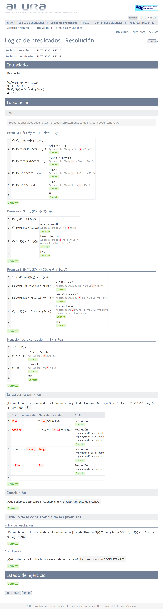

# Ejercicios de Alura - Lógica de predicados: resolución

El desglose de los ejercicios se realiza por dificultad:

- [🟧 Media](#-media)

## 🟧 Media

### 1

>1. $\forall x A(x)$
>2. $\therefore A(a)$

	
Solución

### 2

>1. $\forall x (\forall y A(y,x) \to \exists z B(z,x))$
>2. $\therefore \forall x \exists y (A(y,x) \to B(y,x))$

	
Solución

### 3

>1. $\forall x P(x) \wedge \forall x Q(x)$
>2. $\therefore \forall x (P(x) \wedge Q(x))$

	
Solución

### 4

>1. $\forall x \forall y (\neg (R(x) \to \neg T(x,y)))$
>2. $\forall x \exists y (P(x) \to Q(x,y))$
>3. $\exists x \forall y (R(x) \wedge Q(x,y) \to \neg T(x,y))$
>4. $\therefore \exists x \neg P(x)$

	
Solución

### 5

>1. $\forall x (P(x) \to \neg Q(x))$
>2. $\forall x (Q(x) \to \exists y (N(y) \wedge P(y)))$
>3. $\therefore \exists x \neg Q(x)$

	
Solución

### 6

>1. $\forall x (P(x) \to Q(x))$
>2. $P(a)$
>2. $\therefore \exists x Q(x)$

	
Solución

### 7

>1. $\forall x (\exists y (C(y) \wedge R(x,y)) \to (B(x) \to \neg A(x)))$
>4. $\forall y \forall z R(z,y)$
>5. $\therefore \exists z C(z) \to \forall x (A(x) \to \neg B(x))$

	
Solución

### 8

>1. $\forall x (P(x) \wedge Q(x))$
>2. $\therefore \forall x P(x) \wedge \forall x Q(x)$

	
Solución

