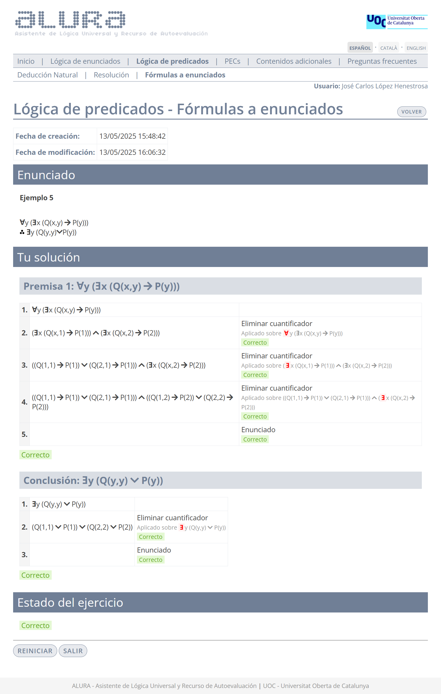
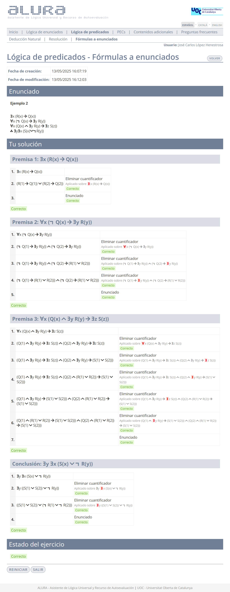
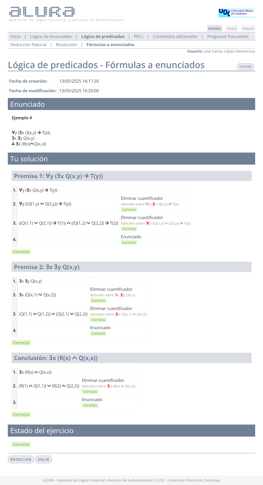

# Ejercicios de Alura - Lógica de predicados: fórmulas a enunciados

El desglose de los ejercicios se realiza por dificultad:

- [🟩 Fácil](#-fácil)
- [🟧 Media](#-media)

## 🟩 Fácil

### 1

>1. $\exists x P(x)$
>2. $\therefore \forall x P(a)$

	
Solución

### 2

>1. $\forall y (\exists x (Q(x,y) \to P(y)))$
>2. $\therefore \exists y (Q(y,y) \vee P(y))$

	
Solución

## 🟧 Media

### 1

>1. $\exists x (R(x) \to Q(x))$
>2. $\forall x (\neg Q(x) \to \exists y R(y))$
>3. $\forall x (Q(x) \wedge \exists y R(y) \to \exists z S(z))$
>4. $\therefore \exists y \exists x (S(x) \vee \neg R(y))$

	
Solución

### 2

>1. $\exists x (R(x) \to Q(x))$
>2. $\forall x (\neg Q(x) \to \exists y R(y))$
>3. $\forall x (Q(x) \wedge \exists y R(y) \to \exists z S(z))$
>4. $\therefore \exists y \exists x (S(x) \vee \neg R(y))$

	
Solución

### 3

>1. $\forall x (\exists y Q(x,y) \to P(x))$
>2. $\forall x (\forall y Q(x,y) \to P(x))$
>3. $\therefore \exists x \exists y (Q(x,y) \to P(x))$

	
Solución

### 4

>1. $\forall y (\exists x Q(x,y) \to T(y))$
>2. $\exists x \exists y Q(x,y)$
>3. $\therefore \exists x (R(x) \wedge Q(x,x))$

	
Solución

