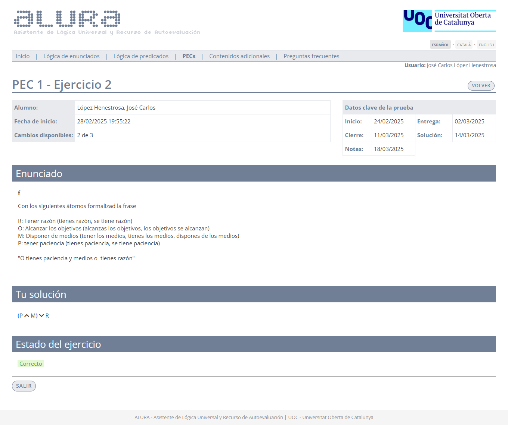
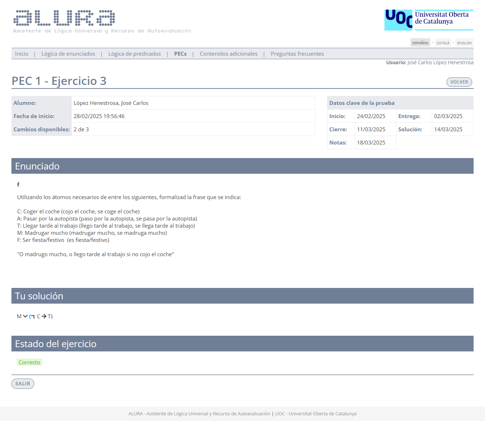
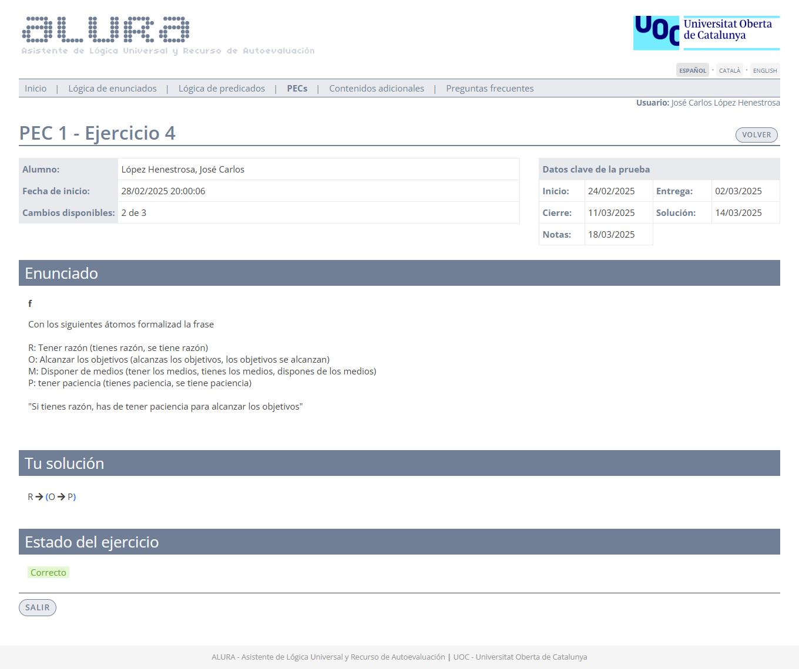
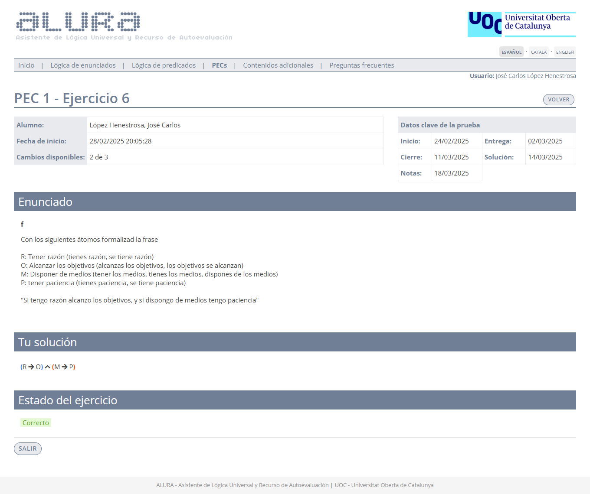
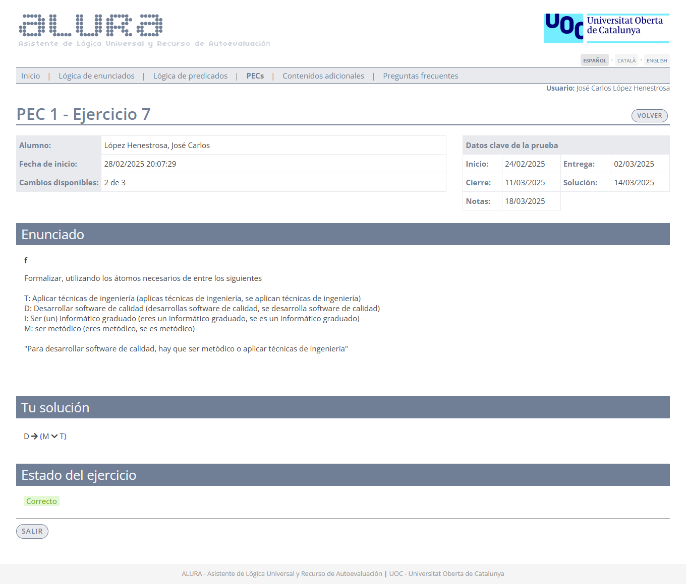
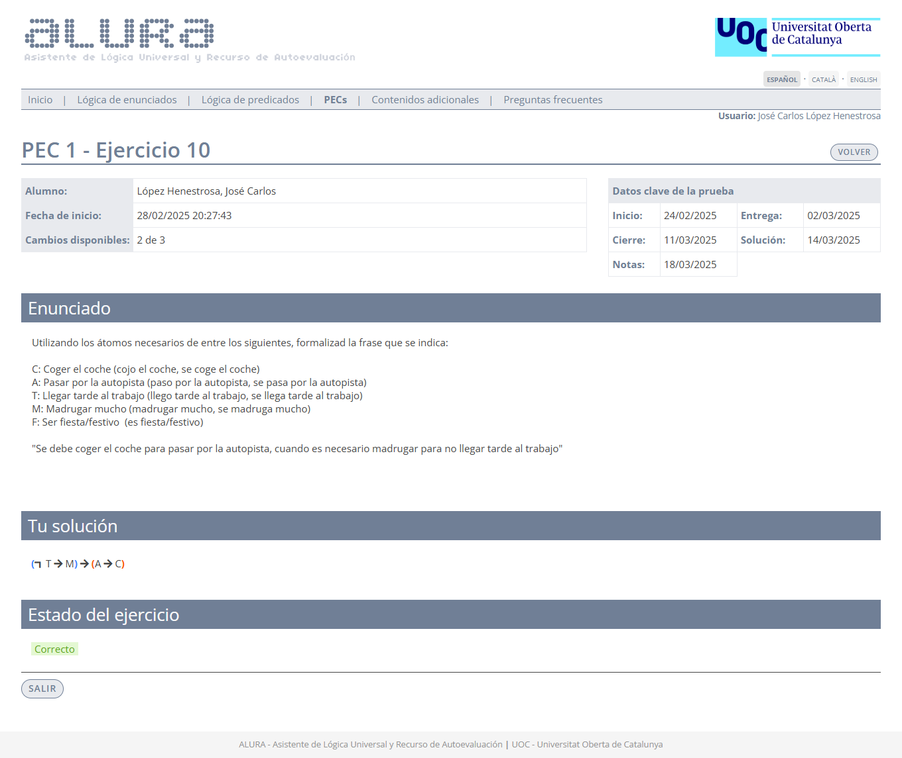
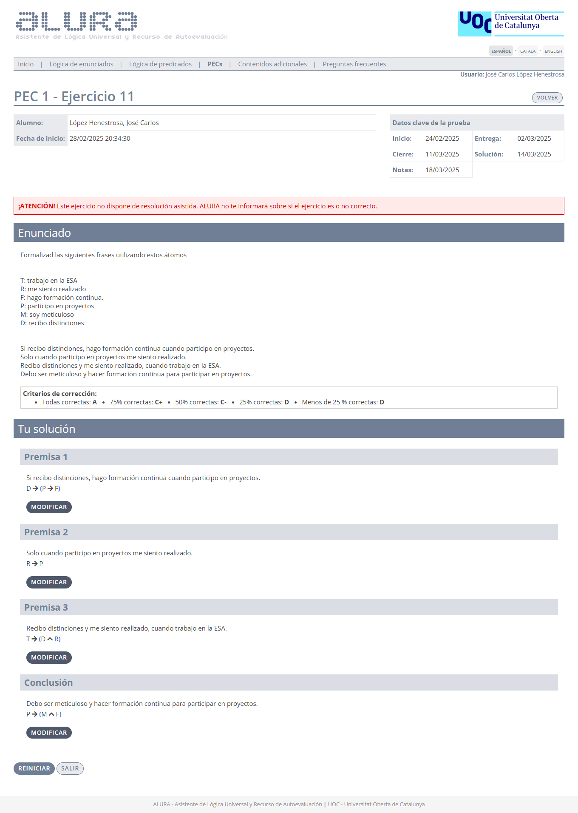

# PEC1 - El lenguaje formal de la lógica de enunciados

>[!NOTE]
>- Para realizar la PEC1, es necesario sacar un 4,00 o más en la [PP1](pp1).
>- Todos los ejercicios de esta PEC son de **formalización**.
>- Recomiendo realizar todos los ejercicios en papel, ya que la prueba final (examen o prueba de síntesis) se tiene que entregar adjuntando fotos de los ejercicios en dicho formato.
>- La suma de la calificación total de todos los ejercicios es 100,00.

## Ejercicios

### Ejercicio 1

>**O eres metódico y desarrollas software de calidad o aplicas técnicas de ingeniería**.

	
Captura de pantalla

**Átomos**:
- $T$: Aplicar técnicas de ingeniería (aplicas técnicas de ingeniería, se aplican técnicas de ingeniería).
- $D$: Desarrollar software de calidad (desarrollas software de calidad, se desarrolla software de calidad).
- $I$: Ser (un) informático graduado (eres un informático graduado, se es un informático graduado).
- $M$: Ser metódico (eres metódico, se es metódico).

	
<strong>Formalización</strong>

$(M \wedge D) \vee T$

**Calificación**: 7,00 / 7,00

 

### Ejercicio 2

>**O tienes paciencia y medios o tienes razón**.

	
Captura de pantalla

**Átomos**:
- $R$: Tener razón (tienes razón, se tiene razón).
- $O$: Alcanzar los objetivos (alcanzas los objetivos, los objetivos se alcanzan).
- $M$: Disponer de medios (tener los medios, tienes los medios, dispones de los medios).
- $P$: Tener paciencia (tienes paciencia, se tiene paciencia).

	
<strong>Formalización</strong>

$(P \wedge M) \vee R$

**Calificación**: 7,00 / 7,00

 

### Ejercicio 3

>**O madrugo mucho, o llego tarde al trabajo si no cojo el coche**.

	
Captura de pantalla

**Átomos**:
- $C$: Coger el coche (cojo el coche, se coge el coche).
- $A$: Pasar por la autopista (paso por la autopista, se pasa por la autopista).
- $T$: Llegar tarde al trabajo (llego tarde al trabajo, se llega tarde al trabajo).
- $M$: Madrugar mucho (madrugar mucho, se madruga mucho).
- $F$: Ser fiesta/festivo (es fiesta/festivo).

	
<strong>Formalización</strong>

$M \vee (\neg C \rightarrow T)$

**Calificación**: 7,00 / 7,00

 

### Ejercicio 4

>**Si tienes razón, has de tener paciencia para alcanzar los objetivos**.

	
Captura de pantalla

**Átomos**:
- $R$: Tener razón (tienes razón, se tiene razón).
- $O$: Alcanzar los objetivos (alcanzas los objetivos, los objetivos se alcanzan).
- $M$: Disponer de medios (tener los medios, tienes los medios, dispones de los medios).
- $P$: Tener paciencia (tienes paciencia, se tiene paciencia).

	
<strong>Formalización</strong>

$R \rightarrow (O \rightarrow P)$

**Calificación**: 8,00 / 8,00

 

### Ejercicio 5

>**Es necesario disponer de medios para tener paciencia o alcanzar los objetivos**.

	
Captura de pantalla

**Átomos**:
- $R$: Tener razón (tienes razón, se tiene razón).
- $O$: Alcanzar los objetivos (alcanzas los objetivos, los objetivos se alcanzan).
- $M$: Disponer de medios (tener los medios, tienes los medios, dispones de los medios).
- $P$: Tener paciencia (tienes paciencia, se tiene paciencia).

	
<strong>Formalización</strong>

$(P \vee O) \rightarrow M$

**Calificación**: 8,00 / 8,00

 

### Ejercicio 6

>**Si tengo razón alcanzo los objetivos, y si dispongo de medios tengo paciencia**.

	
Captura de pantalla

**Átomos**:
- $R$: Tener razón (tienes razón, se tiene razón).
- $O$: Alcanzar los objetivos (alcanzas los objetivos, los objetivos se alcanzan).
- $M$: Disponer de medios (tener los medios, tienes los medios, dispones de los medios).
- $P$: Tener paciencia (tienes paciencia, se tiene paciencia).

	
<strong>Formalización</strong>

$(R \rightarrow O) \wedge (M \rightarrow P)$

**Calificación**: 8,00 / 8,00

 

### Ejercicio 7

>**Para desarrollar software de calidad, hay que ser metódico o aplicar técnicas de ingeniería**.

	
Captura de pantalla

**Átomos**:
- $T$: Aplicar técnicas de ingeniería (aplicas técnicas de ingeniería, se aplican técnicas de ingeniería).
- $D$: Desarrollar software de calidad (desarrollas software de calidad, se desarrolla software de calidad).
- $I$: Ser (un) informático graduado (eres un informático graduado, se es un informático graduado).
- $M$: Ser metódico (eres metódico, se es metódico).

	
<strong>Formalización</strong>

$D \rightarrow (M \vee T)$

**Calificación**: 8,00 / 8,00

 

### Ejercicio 8

>**Has de ser un informático graduado para desarrollar software de calidad, cuando eres metódico y aplicas técnicas de ingeniería**.

	
Captura de pantalla

**Átomos**:
- $T$: Aplicar técnicas de ingeniería (aplicas técnicas de ingeniería, se aplican técnicas de ingeniería).
- $D$: Desarrollar software de calidad (desarrollas software de calidad, se desarrolla software de calidad).
- $I$: Ser (un) informático graduado (eres un informático graduado, se es un informático graduado).
- $M$: Ser metódico (eres metódico, se es metódico).

	
<strong>Formalización</strong>

$(M \wedge T) \rightarrow (D \rightarrow I)$

**Calificación**: 10,00 / 10,00

 

### Ejercicio 9

>**Si eres metódico, solamente desarrollas software de calidad cuando eres un informático graduado y aplicas técnicas de ingeniería**.

	
Captura de pantalla

**Átomos**:
- $T$: Aplicar técnicas de ingeniería (aplicas técnicas de ingeniería, se aplican técnicas de ingeniería).
- $D$: Desarrollar software de calidad (desarrollas software de calidad, se desarrolla software de calidad).
- $I$: Ser (un) informático graduado (eres un informático graduado, se es un informático graduado).
- $M$: Ser metódico (eres metódico, se es metódico).

	
<strong>Formalización</strong>

$M \rightarrow (D \rightarrow (I \wedge T))$

**Calificación**: 10,00 / 10,00

 

### Ejercicio 10

>**Se debe coger el coche para pasar por la autopista, cuando es necesario madrugar para no llegar tarde al trabajo**.

	
Captura de pantalla

**Átomos**:
- $C$: Coger el coche (cojo el coche, se coge el coche).
- $A$: Pasar por la autopista (paso por la autopista, se pasa por la autopista).
- $T$: Llegar tarde al trabajo (llego tarde al trabajo, se llega tarde al trabajo).
- $M$: Madrugar mucho (madrugar mucho, se madruga mucho).
- $F$: Ser fiesta/festivo (es fiesta/festivo).

	
<strong>Formalización</strong>

$(\neg T \rightarrow M) \rightarrow (A \rightarrow C)$

**Calificación**: 10,00 / 10,00

 

### Ejercicio 11

>[!NOTE]
>Este ejercicio se compone de cuatro frases que comparten los mismos átomos.

	
Captura de pantalla

**Átomos**:
- $T$: Trabajo en la ESA.
- $R$: Me siento realizado.
- $P$: Participo en proyectos.
- $M$: Soy meticuloso.
- $D$: Recibo distinciones.

### Premisa 1

>**Si recibo distinciones, hago formación continua cuando participo en proyectos**.

	
<strong>Formalización</strong>

$D \rightarrow (P \rightarrow F)$

### Premisa 2

>**Solo cuando participo en proyectos me siento realizado**.

	
<strong>Formalización</strong>

$R \rightarrow P$

### Premisa 3

>**Recibo distinciones y me siento realizado, cuando trabajo en la ESA**.

	
<strong>Formalización</strong>

$T \rightarrow (D \wedge R)$

### Conclusión

>**Debo ser meticuloso y hacer formación continua para participar en proyectos**.

	
<strong>Formalización</strong>

$P \rightarrow (M \wedge F)$

**Criterios de corrección para este ejercicio**:
- **A**: Todas correctas.
- **C+**: 75% correctas.
- **C-**: 50% correctas.
- **D**: 25% correctas o menos.

**Calificación**: 17,00 / 17,00

 

## Recursos docentes

- Vídeos 1 al 8 (ambos incluidos) de [esta playlist de YouTube](https://www.youtube.com/playlist?list=PLX3CfQWn-1E1MpqMS_CWzbSSiY7hgOhtA) realizada por el canal [Aprende Sin Espinas](https://www.youtube.com/@AprendeSinEspinas).
- El libro [_Lógica de enunciados_](http://cvapp.uoc.edu/autors/MostraPDFMaterialAction.do?id=265957&hash=f4eec8d6f2470281eeabfd721755d26ab5429e0b8fd1581689cea334dc3dd6a5) proporcionado por la UOC.
	- Apartado **1. La lógica de enunciados y su lenguaje**. Páginas 7 a 22. [Resumen](recursos/README.md).

---

## Resultado

### Calificación

- / 10,00 (grado -)