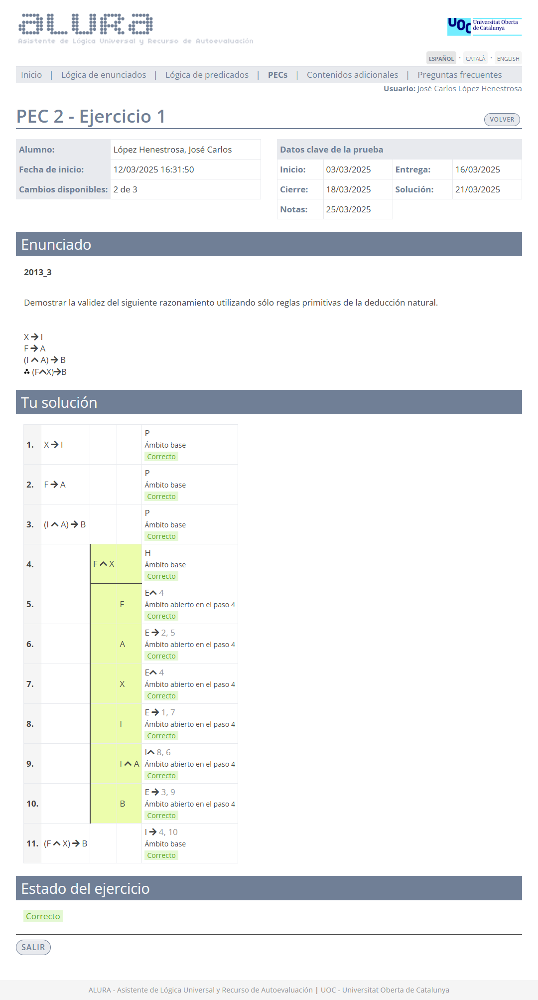
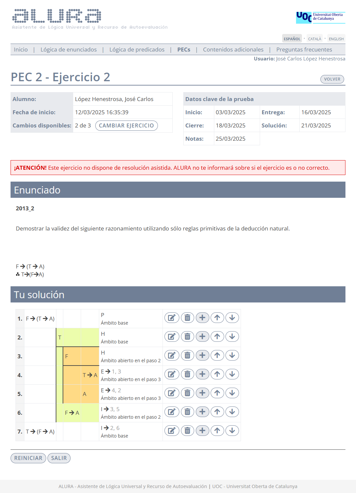
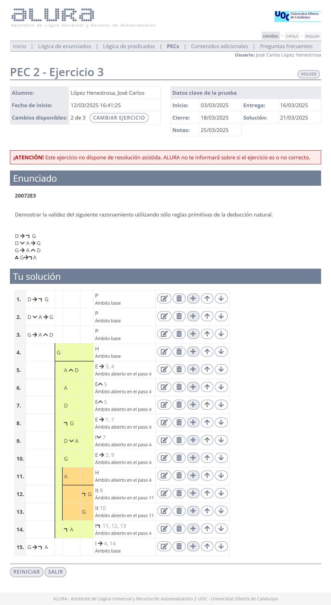
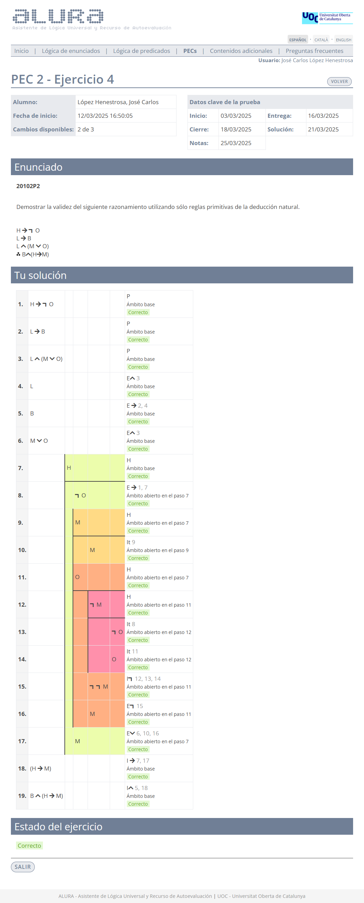
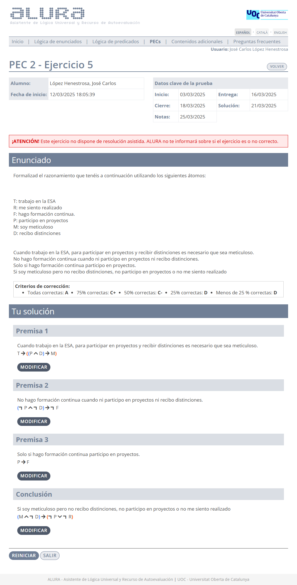

# PEC2 - El lenguaje formal de la lógica de enunciados

>[!NOTE]
>- Para realizar la PEC2, es necesario sacar un 4,00 o más en la [PP2](pp2).
>- Los 4 primeros ejercicios de esta PEC son de **deducción natural**, mientras que el último es de **formalización**.
>- Recomiendo realizar todos los ejercicios en papel, ya que la prueba final (examen o prueba de síntesis) se tiene que entregar adjuntando fotos de los ejercicios en dicho formato.
>- La suma de la calificación total de todos los ejercicios es 10,00.

## Ejercicios

### Ejercicio 1 - Deducción natural

>1. $X \rightarrow I$
>2. $F \rightarrow A$
>3. $(I \wedge A) \rightarrow B$
>4. $\therefore (F \wedge X) \rightarrow B$

	
Solución

**Calificación**: 1,80 / 1,80

 

### Ejercicio 2 - Deducción natural

>1. $F \rightarrow (T \rightarrow A)$
>2. $\therefore T \rightarrow (F \rightarrow A)$

	
Solución

**Calificación**: 1,80 / 1,80

 

### Ejercicio 3 - Deducción natural

>1. $D \rightarrow \neg G$
>2. $D \vee A \rightarrow G$
>3. $G \rightarrow A \wedge D$
>4. $\therefore G \rightarrow \neg A$

	
Solución

**Calificación**: 2,00 / 2,00

 

### Ejercicio 4 - Deducción natural

>1. $H \rightarrow \neg O$
>2. $L \rightarrow B$
>3. $L \wedge (M \vee O)$
>4. $\therefore B \wedge (H \rightarrow M)$

	
Solución

**Calificación**: 2,40 / 2,40

 

### Ejercicio 5 - Formalización

>[!NOTE]
>Este ejercicio se compone de cuatro frases que comparten los mismos átomos.

	
Captura de pantalla

**Átomos**:
- $T$: Trabajo en la ESA.
- $R$: Me siento realizado.
- $P$: Participo en proyectos.
- $M$: Soy meticuloso.
- $D$: Recibo distinciones.

### Premisa 1

>**Cuando trabajo en la ESA, para participar en proyectos y recibir distinciones es necesario que sea meticuloso**.

	
Frase equivalente para aclarar la estructura lógica del enunciado dado

Trabajar en la ESA es **SUFICIENTE** para (ser meticuloso es **NECESARIO** para (participar en proyectos **Y** recibir distinciones))

	
<strong>Formalización</strong>

$T \rightarrow ((P \wedge D) \rightarrow M)$

### Premisa 2

>**No hago formación continua cuando ni participo en proyectos ni recibo distinciones**.

	
Frase equivalente para aclarar la estructura lógica del enunciado dado

(**NO** participar en proyectos **Y NO** recibir distinciones) es **SUFICIENTE** para no hacer formación continua

	
<strong>Formalización</strong>

$(\neg P \wedge \neg D) \rightarrow \neg F$

### Premisa 3

>**Solo si hago formación continua participo en proyectos**.

	
Frase equivalente para aclarar la estructura lógica del enunciado dado

Hacer formación continua es **NECESARIO** para participar en proyectos

	
<strong>Formalización</strong>

$P \rightarrow F$

### Conclusión

>**Si soy meticuloso pero no recibo distinciones, no participo en proyectos o no me siento realizado**.

	
Frase equivalente para aclarar la estructura lógica del enunciado dado

Ser meticuloso **Y NO** recibir distinciones es **SUFICIENTE** para **NO** participar en proyectos **O NO** sentirme realizado

	
<strong>Formalización</strong>

$(M \wedge \neg D) \rightarrow (\neg P \vee \neg R)$

**Criterios de corrección**:
- **A**: Todas correctas.
- **C+**: 75% correctas.
- **C-**: 50% correctas.
- **D**: 25% correctas o menos.

**Calificación**: 2,00 / 2,00

 

## Recursos de aprendizaje

- Vídeos 9 al 15 (ambos incluidos) de [esta playlist de YouTube](https://www.youtube.com/playlist?list=PLX3CfQWn-1E1MpqMS_CWzbSSiY7hgOhtA) realizada por el canal [Aprende Sin Espinas](https://www.youtube.com/@AprendeSinEspinas).
- El libro [_Lógica de enunciados_](http://cvapp.uoc.edu/autors/MostraPDFMaterialAction.do?id=265957&hash=f4eec8d6f2470281eeabfd721755d26ab5429e0b8fd1581689cea334dc3dd6a5) proporcionado por la UOC.
	- Apartado **2. La de deducción natural**. Páginas 23 a 52. [Resumen](recursos/README.md).

---

## Resultado

### Calificación

- **Calificación original**: 16,67 / 16,67
- **Calificación sobre 10**: 10,00 / 10,00
- **Letra (escala internacional)**: A

### Detalles de la puntuación

