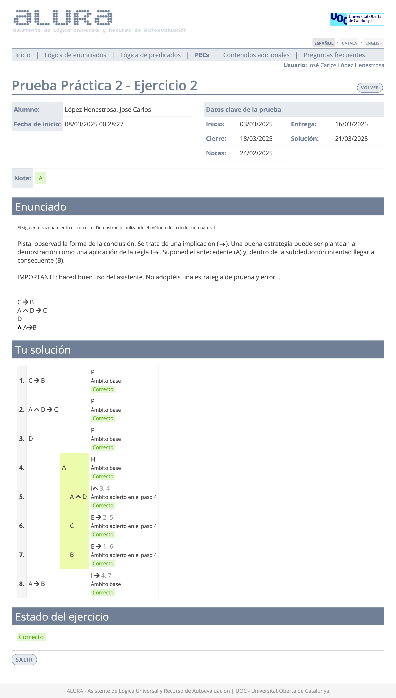

# Prueba práctica 2

>[!NOTE]
>- La suma total de la calificación de todos los ejercicios debe dar 10,00.
>- Se pueden realizar tantos intentos como se deseen antes de la fecha límite. 
>- Cuando el resultado sea del 40% o más, se podrá acceder a la PEC2.

## Ejercicio 1 - Test

	
Captura de pantalla

**Calificación**: 2,00 / 2,00

## Ejercicio 2 - Deducción natural

>1. $C \rightarrow B$
>2. $A \wedge D \rightarrow C$
>3. $D$
>4. $\therefore A \rightarrow B$

	
Captura de pantalla

**Calificación**: 2,00 / 2,00

## Ejercicio 3 - Deducción natural

>1. $B \rightarrow A$
>2. $\neg A \wedge D$
>3. $\therefore \neg B$

	
Captura de pantalla

**Calificación**: 2,00 / 2,00

## Ejercicio 4 - Deducción natural

>1. $A \vee D$
>2. $D \rightarrow B$
>3. $A \vee C \rightarrow D$
>4. $\therefore B$

	
Captura de pantalla

**Calificación**: 2,00 / 2,00

## Ejercicio 5 - Deducción natural

>1. $A \vee B$
>2. $A \rightarrow C$
>3. $C \rightarrow D$
>4. $\therefore \neg B \rightarrow D$

>[!NOTE]
>Tiene que resolverse utilizando las reglas derivadas MT y SD.

	
Captura de pantalla

**Calificación**: 1,00 / 1,00

## Ejercicio 6 - Deducción natural

>1. $A \vee B$
>2. $A \rightarrow C$
>3. $C \rightarrow D$
>4. $\therefore \neg B \rightarrow D$

	
Captura de pantalla

**Calificación**: 1,00 / 1,00

## Calificación final

10,00 / 10,00