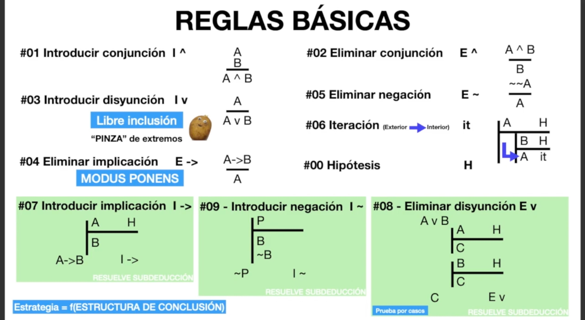
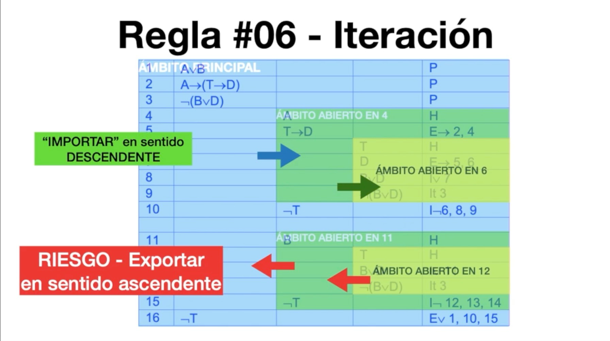
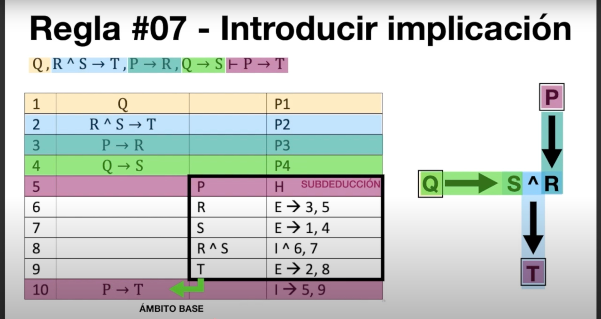
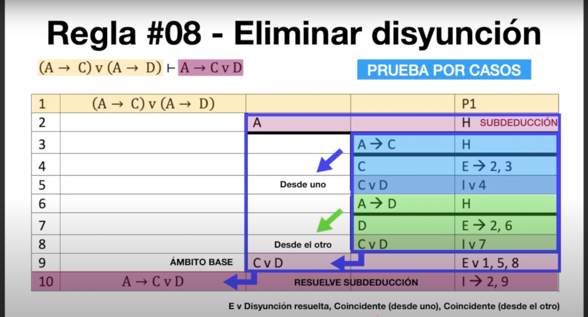
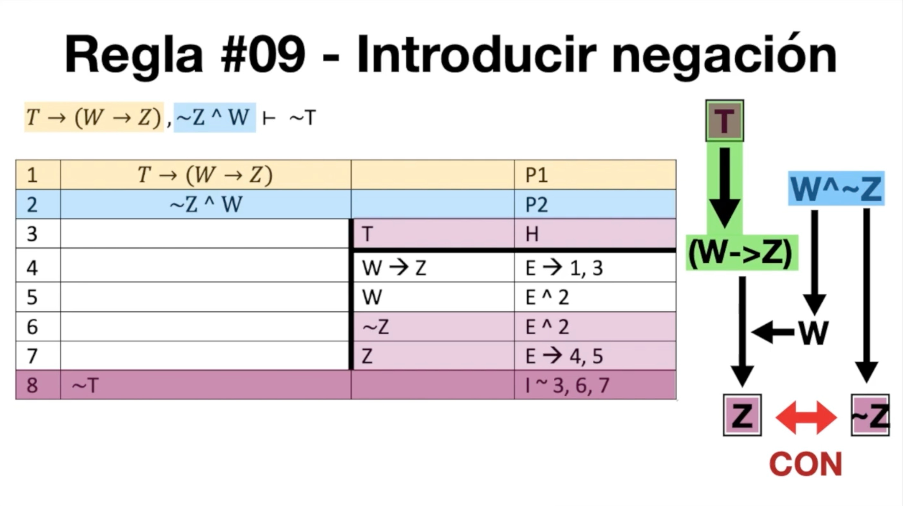
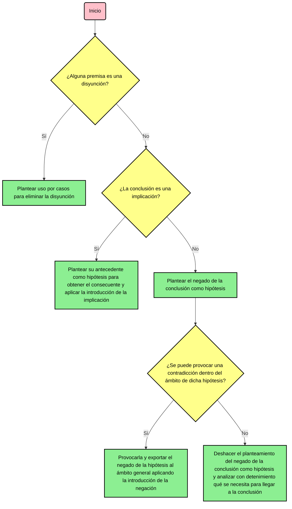

# RESUMEN Lógica de enunciados: la deducción natural

>[!CAUTION]
>Es ESENCIAL aprender y practicar la deducción natural sin ayuda de Alura, ya que tanto en el examen como en la prueba de síntesis se nos requerirá adjuntar fotos de los ejercicios realizados a mano. Además, tampoco dispondremos del acceso a dicha herramienta para comprobar nuestras deducciones.

>[!NOTE]
>Los siguientes apartados no se recogen en este resumen, puesto que solo se aplican las [reglas básicas](#22-notación-y-reglas-de-la-deducción-natural) en la resolución de los ejercicios de deducción natural planteados por la UOC.
>- **2.4. Reglas derivadas**
>- **2.5. Equivalencias deductivas**
>- **2.6. Teoremas**

>[!NOTE]
>En los [ejercicios de deducción natural de Alura](https://github.com/HenestrosaDev/uoc-ingenieria-informatica/tree/main/logica/ejercicios_alura/1_logica_de_enunciados/2_deduccion_natural) encontrarás problemas resueltos con los que podrás practicar y comprobar tus soluciones.

## Índice

- [**2.1. La validación de razonamientos**](#21-la-validación-de-razonamientos)
- [**2.2. Notación y reglas de la deducción natural**](#22-notación-y-reglas-de-la-deducción-natural)
	- [**REGLA 0: Hipótesis**](#regla-0-hipótesis-h)
	- [**REGLA 1: Introducción de la conjunción**](#regla-1-introducción-de-la-conjunción-i-wedge)
	- [**REGLA 2: Eliminación de la conjunción**](#regla-2-eliminación-de-la-conjunción-e-wedge)
	- [**REGLA 3: Introducción de la disyunción**](#regla-3-introducción-de-la-disyunción-i-vee)
	- [**REGLA 4: Eliminación de la implicación o _modus ponens_**](#regla-4-eliminación-de-la-implicación-o-modus-ponens-e-rightarrow)
	- [**REGLA 5: Eliminación de la negación**](#regla-5-eliminación-de-la-negación-e-neg)
	- [**REGLA 6: Iteración**](#regla-6-iteración-it)
	- [**REGLA 7: Introducción de la implicación**](#regla-7-introducción-de-la-implicación-i-rightarrow)
	- [**REGLA 8: Eliminación de la disyunción**](#regla-8-eliminación-de-la-disyunción-e-vee)
	- [**REGLA 9: Introducción de la negación**](#regla-9-introducción-de-la-negación-i-neg)
- [**2.3. Planteamiento estratégico de las demostraciones por deducción natural**](#23-planteamiento-estratégico-de-las-demostraciones-por-deducción-natural)

 

## 2.1. La validación de razonamientos

La **deducción natural** es un método de validación de razonamientos que permite conectar una secuencia de inferencia lógica con una conclusión.

## 2.2. Notación y reglas de la deducción natural

A partir de un conjunto de premisas marcadas como **P**, tendremos que aplicar un conjunto de reglas de inferencia para alcanzar la conclusión planteada en el razonamiento lógico. En lenguaje formal, se expresa del siguiente modo:

$A \vee B, A \rightarrow (T \rightarrow), \neg(B \vee D) \therefore \neg T$

Donde:
- El enunciado de cada premisa está separado por una coma.
- La conclusión putativa se denota con un $\therefore$, que puede interpretarse en lenguaje natural como _entonces_.

Las reglas BÁSICAS para llegar a la conclusión putativa son las siguientes: 

>[!WARNING]
>Hay que tener en cuenta que también existen reglas derivadas y equivalentes deductivos, los cuales no veremos en este bloque.

>Captura sacada de [este vídeo](https://youtu.be/zkpdfRDuaqY) del canal [Aprende Sin Espinas](https://www.youtube.com/@AprendeSinEspinas).

 
 

### REGLA 0: Hipótesis (H)

Suposición temporal que se introduce en una deducción para demostrar una conclusión. Podemos suponer CUALQUIER COSA, a pesar de no estar presente en ningún enunciado. Útil para provocar contradicciones, entre otros (ver reglas 7, 8 y 9).

**Sintaxis**: H

**Ejemplo BÁSICO** para demostrar su introducción:

<table>
	<tr>
		<th>Nº PASO</th>
		<th>ENUNCIADO</th>
		<th>REGLA APLICADA</th>
	</tr>
	<tr>
		<td>1</td>
		<td>$A$</td>
		<td>P</td>
	</tr>
	<tr>
		<td>2</td>
		<td>$B$</td>
		<td>H</td>
	</tr>
</table>

**Ejemplo AVANZADO** para demostrar un uso práctico:

<table>
	<tr>
		<th>Nº PASO</th>
		<th colspan="4">ENUNCIADO</th>
		<th>REGLA APLICADA</th>
	</tr>
	<tr>
		<td>1</td>
		<td>$P \vee Q$</td>
		<td></td>
		<td></td>
		<td></td>
		<td>P</td>
	</tr>
	<tr>
		<td>2</td>
		<td>$\neg P$</td>
		<td></td>
		<td></td>
		<td></td>
		<td>P</td>
	</tr>
	<tr>
		<td>3</td>
		<td></td>
		<td>$P$</td>
		<td></td>
		<td></td>
		<td>H</td>
	</tr>
	<tr>
		<td>4</td>
		<td></td>
		<td></td>
		<td>$\neg Q$</td>
		<td></td>
		<td>H</td>
	</tr>
	<tr>
		<td>5</td>
		<td></td>
		<td></td>
		<td></td>
		<td>$P$</td>
		<td>it 3</td>
	</tr>
	<tr>
		<td>6</td>
		<td></td>
		<td></td>
		<td></td>
		<td>$\neg P$</td>
		<td>it 2</td>
	</tr>
	<tr>
		<td>7</td>
		<td></td>
		<td></td>
		<td>$\neg \neg Q$</td>
		<td></td>
		<td>I $\neg$ 4, 5, 6</td>
	</tr>
	<tr>
		<td>8</td>
		<td></td>
		<td></td>
		<td>$Q$</td>
		<td></td>
		<td>E $\neg$ 7</td>
	</tr>
	<tr>
		<td>9</td>
		<td></td>
		<td>$Q$</td>
		<td></td>
		<td></td>
		<td>H</td>
	</tr>
	<tr>
		<td>10</td>
		<td></td>
		<td></td>
		<td>$Q$</td>
		<td></td>
		<td>it 9</td>
	</tr>
	<tr>
		<td>11</td>
		<td>$Q$</td>
		<td></td>
		<td></td>
		<td></td>
		<td>E $\vee$ 1, 8, 10</td>
	</tr>
</table>

 
 

### REGLA 1: Introducción de la conjunción (I $\wedge$)

<table>
	<tr>
		<th>Nº PASO</th>
		<th>ENUNCIADO</th>
		<th>REGLA APLICADA</th>
	</tr>
	<tr>
		<td>1</td>
		<td>$A$</td>
		<td>P</td>
	</tr>
	<tr>
		<td>2</td>
		<td>$B$</td>
		<td>P</td>
	</tr>
	<tr>
		<td>3</td>
		<td>$A \wedge B$</td>
		<td>I $\wedge$ 1, 2</td>
	</tr>
</table>

Esta regla es **conmutativa**.

<table>
	<tr>
		<th>Nº PASO</th>
		<th>ENUNCIADO</th>
		<th>REGLA APLICADA</th>
	</tr>
	<tr>
		<td>1</td>
		<td>$A$</td>
		<td>P</td>
	</tr>
	<tr>
		<td>2</td>
		<td>$B$</td>
		<td>P</td>
	</tr>
	<tr>
		<td>3</td>
		<td>$B \wedge A$</td>
		<td>I $\wedge$ 1, 2</td>
	</tr>
</table>

Lo que se introduce aquí **NO** es la conjunción de literales, sino la conjunción de enunciados; es decir, la conjunción de líneas, no de letras.

**Ejemplos**:

<table>
	<tr>
		<th>Nº PASO</th>
		<th>ENUNCIADO</th>
		<th>REGLA APLICADA</th>
	</tr>
	<tr>
		<td>1</td>
		<td>$P \rightarrow Q$</td>
		<td>P</td>
	</tr>
	<tr>
		<td>2</td>
		<td>$R$</td>
		<td>P</td>
	</tr>
	<tr>
		<td>3</td>
		<td>$(P \rightarrow Q) \wedge R$</td>
		<td>I $\vee$ 1, 2</td>
	</tr>
</table>

 
 

### REGLA 2: Eliminación de la conjunción (E $\wedge$)

<table>
	<tr>
		<th>Nº PASO</th>
		<th>ENUNCIADO</th>
		<th>REGLA APLICADA</th>
	</tr>
	<tr>
		<td>1</td>
		<td>$A \wedge B$</td>
		<td>P</td>
	</tr>
	<tr>
		<td>2</td>
		<td>$A$</td>
		<td>E $\wedge$ 1</td>
	</tr>
</table>

Esta regla es **conmutativa**.

<table>
	<tr>
		<th>Nº PASO</th>
		<th>ENUNCIADO</th>
		<th>REGLA APLICADA</th>
	</tr>
	<tr>
		<td>1</td>
		<td>$A \wedge B$</td>
		<td>P</td>
	</tr>
	<tr>
		<td>2</td>
		<td>$B$</td>
		<td>E $\wedge$ 1</td>
	</tr>
</table>

Al igual que con la introducción de la conjunción, lo que se elimina aquí **NO** es la conjunción de literales, sino la conjunción de enunciados; es decir, la conjunción de líneas, no de letras.

**Ejemplos**:

<table>
	<tr>
		<td>1</td>
		<td>$A \wedge B \rightarrow C$</td>
	</tr>
</table>

No se puede aplicar esta regla en este caso, ya que la precedencia de $rightarrow$ es menor respecto a la de $\wedge$. Por lo tanto, no se puede extraer el antecedente.

 
 

### REGLA 3: Introducción de la disyunción (I $\vee$)

<table>
	<tr>
		<th>Nº PASO</th>
		<th>ENUNCIADO</th>
		<th>REGLA APLICADA</th>
	</tr>
	<tr>
		<td>1</td>
		<td>$A$</td>
		<td>P</td>
	</tr>
	<tr>
		<td>2</td>
		<td>$A \vee B$</td>
		<td>I $\vee$ 1</td>
	</tr>
</table>

Esta regla es **conmutativa**.

<table>
	<tr>
		<th>Nº PASO</th>
		<th>ENUNCIADO</th>
		<th>REGLA APLICADA</th>
	</tr>
	<tr>
		<td>1</td>
		<td>$A$</td>
		<td>P</td>
	</tr>
	<tr>
		<td>2</td>
		<td>$B \vee A$</td>
		<td>I $\vee$ 1</td>
	</tr>
</table>

En lugar de $B$, se puede disyuntar por **CUALQUIER** enunciado que queramos introducir. A esto se le denomina el principio de **libre inclusión**.

**Ejemplos**:

<table>
	<tr>
		<th>Nº PASO</th>
		<th>ENUNCIADO</th>
		<th>REGLA APLICADA</th>
	</tr>
	<tr>
		<td>1</td>
		<td>$A$</td>
		<td>P</td>
	</tr>
	<tr>
		<td>2</td>
		<td>$A \vee (B \rightarrow C \wedge D \vee \neg Z)$</td>
		<td>I $\vee$ 1</td>
	</tr>
</table>

 
 

### REGLA 4: Eliminación de la implicación o _modus ponens_ (E $\rightarrow$)

<table>
	<tr>
		<th>Nº PASO</th>
		<th>ENUNCIADO</th>
		<th>JUSTIFICACIÓN</th>
		<th>REGLA APLICADA</th>
	</tr>
	<tr>
		<td>1</td>
		<td>$A \rightarrow B$</td>
		<td>Implicación a eliminar</td>
		<td>P</td>
	</tr>
	<tr>
		<td>2</td>
		<td>$A$</td>
		<td>Antecedente de la implicación</td>
		<td>P</td>
	</tr>
	<tr>
		<td>3</td>
		<td>$B$</td>
		<td>Consecuente</td>
		<td>E $\rightarrow$ 1, 2</td>
	</tr>
</table>

**Sintaxis**: E $\rightarrow$ [IMPLICACIÓN], [ANTECEDENTE]

**Ejemplos**:

<table>
	<tr>
		<th>Nº PASO</th>
		<th>ENUNCIADO</th>
		<th>REGLA APLICADA</th>
	</tr>
	<tr>
		<td>1</td>
		<td>$A \wedge B \rightarrow C$</td>
		<td>P</td>
	</tr>
	<tr>
		<td>2</td>
		<td>$A \wedge B$</td>
		<td>P</td>
	</tr>
	<tr>
		<td>3</td>
		<td>$C$</td>
		<td>E $\rightarrow$ 1, 2</td>
	</tr>
</table>

>[!WARNING]
>Aspectos a tener en cuenta al aplicar esta regla:
>- **NO SE PUEDE SACAR EL ANTECEDENTE A PARTIR DEL CONSECUENTE**.
>- Hay que prestar atención a la precedencia de las conectivas, ya que $\wedge \vee$ tienen mayor precedencia que a $\rightarrow$.

 
 

### REGLA 5: Eliminación de la negación (E $\neg$)

<table>
	<tr>
		<th>Nº PASO</th>
		<th>ENUNCIADO</th>
		<th>REGLA APLICADA</th>
	</tr>
	<tr>
		<td>1</td>
		<td>$\neg \neg A$</td>
		<td>P</td>
	</tr>
	<tr>
		<td>2</td>
		<td>$A$</td>
		<td>E $\neg$ 1</td>
	</tr>
</table>

Sólo se puede aplicar cuando hay una **doble negación**.

 
 

### REGLA 6: Iteración (it)

<table>
	<tr>
		<th>Nº PASO</th>
		<th>ENUNCIADO</th>
		<th>REGLA APLICADA</th>
	</tr>
	<tr>
		<td>1</td>
		<td>$A$</td>
		<td>P</td>
	</tr>
	<tr>
		<td>2</td>
		<td>$A$</td>
		<td>it 1</td>
	</tr>
</table>

Cualquier enunciado que aparece en una deducción puede volver a ser escrito al final de la lista de enunciados, siempre que la repetición se produzca en el mismo ámbito en el que aparece el enunciado o en el de una subdeducción interna a éste.

>Captura sacada de [este vídeo](https://youtu.be/0yzZRuBus1k) del canal [Aprende Sin Espinas](https://www.youtube.com/@AprendeSinEspinas).

 
 

Para cerrar una subdeducción abierta ―exportar en sentido ascendente al ámbito base―, se tiene que aplicar una de las tres reglas siguientes:

 
 

### REGLA 7: Introducción de la implicación (I $\rightarrow$)

**La estructura de la conclusión orienta la estructura de la resolución**. Por norma general, cuando encontremos una implicación en la conclusión, es MUY RECOMENDABLE plantear el antecedente como hipótesis para conseguir el consecuente dentro del ámbito abierto a partir de dicha hipótesis.

**Sintaxis**: I $\rightarrow$ [Hipótesis del antecedente], [Deducción de la hipótesis]

**Ejemplo**:

>Ejemplo sacado de [este vídeo](https://youtu.be/0yzZRuBus1k) del canal [Aprende Sin Espinas](https://www.youtube.com/@AprendeSinEspinas).

 
 

### REGLA 8: Eliminación de la disyunción (E $\vee$)

También se conoce como **prueba por casos**, ya que cualquier disyunción tiene, inherentemente, cierto grado de ambigüedad asociado. Esto se debe a que se puede dar un disyuntando, el otro, o los dos (recordemos que trabajamos con la disyunción **NO EXCLUYENTE**).

Resulta MUY ÚTIL aplicar esta regla cuando una de las premisas presenta una disyunción. Para su correcta aplicación, hay que plantear ambos disyuntandos como hipótesis, de los cuales se tiene que obtener la misma subdeducción. A partir de dicha subdeducción, podremos eliminar la disyunción aplicando esta regla, tal y como se muestra en el ejemplo.

**Sintaxis**: E $\wedge$ [Disyunción], [Deducción de la hipótesis del primer disyuntando], [Deducción de la hipótesis del segundo disyuntando]

**Ejemplo**:

>Ejemplo sacado de [este vídeo](https://youtu.be/0yzZRuBus1k) del canal [Aprende Sin Espinas](https://www.youtube.com/@AprendeSinEspinas).

 
 

### REGLA 9: Introducción de la negación (I $\neg$)

Si planteamos una hipótesis y somos capaces de formular una contradicción dentro de su ámbito, podemos deducir que, realmente, se está produciendo una contradicción. En base a esto, podemos exportar la negación de la hipótesis a su ámbito inmediatemente superior aplicando esta regla, conocida también como **reducción al absurdo**.

**Sintaxis**: I $\neg$ [Hipótesis], [Enunciado], [Negación del enunciado]

>[!IMPORTANT]
>ES EXTREMADAMENTE ÚTIL CUANDO, APARENTEMENTE, ESTAMOS ANTE UN PUNTO MUERTO EN UNA DEDUCCIÓN.

**Ejemplo**:

>Ejemplo sacado de [este vídeo](https://youtu.be/0yzZRuBus1k) del canal [Aprende Sin Espinas](https://www.youtube.com/@AprendeSinEspinas).

 
 

## 2.3. Planteamiento estratégico de las demostraciones por deducción natural

La estrategia que **personalmente** recomiendo para aplicar la deducción natural se rige por los siguientes pasos:

Los casos que nos hagan recurrir al proceso "Deshacer el planteamiento del negado de la conclusión como hipótesis y analizar con detenimiento qué se necesita para llegar a la conclusión" son de los más difíciles que nos podemos encontrar, ya que no hay un algoritmo definido para atacarlos. He aquí un ejemplo para enfrentarnos a deducciones de este tipo:

	
Captura de pantalla
	

