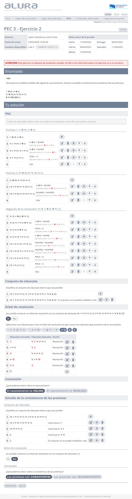
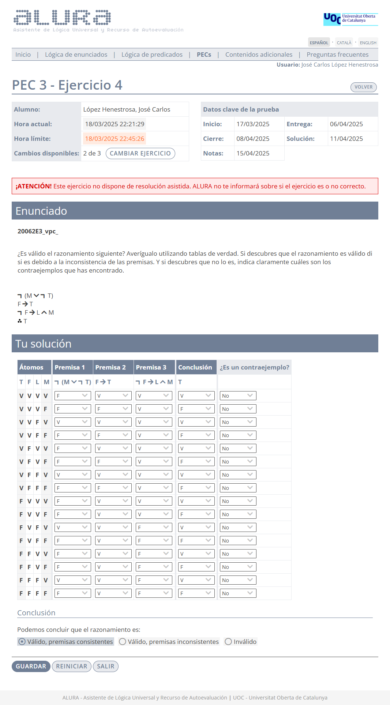

# PEC3 - Mecanización y verificación de razonamientos formales

>[!NOTE]
>- Para realizar la PEC3, es necesario sacar un 4,00 o más en la [PP3](pp3).
>- Esta PEC se compone de dos ejercicios de **resolución**, dos de **tablas de verdad**, uno de **formalización** y uno teórico tipo **test**.
>- Recomiendo realizar todos los ejercicios en papel, ya que la prueba final (examen o prueba de síntesis) se tiene que entregar adjuntando fotos de los ejercicios en dicho formato.
>- La suma de la calificación total de todos los ejercicios es 10,00.

## Ejercicios

### Ejercicio 1 - Resolución

>1. $V \rightarrow S \wedge \neg T$
>2. $\neg (V \rightarrow (\neg Y \wedge \neg Q))$
>3. $T \rightarrow \neg Q$
>4. $\therefore S \wedge (T \rightarrow Y)$

	
Soluciones

**Calificación**: 2,00 / 2,00

### Ejercicio 2 - Resolución

>1. $C \rightarrow (\neg H \rightarrow V)$
>2. $(X \rightarrow W) \wedge \neg (W \wedge H)$
>3. $\therefore \neg V \rightarrow (X \rightarrow \neg C)$

	
Soluciones

**Calificación**: 2,00 / 2,00

### Ejercicio 3 - Tabla de verdad

>1. $W \rightarrow G$
>2. $I \vee W$
>3. $M \rightarrow \neg G \wedge \neg I$
>4. $\therefore \neg M$

	
Soluciones

**Calificación**: 1,30 / 1,30

### Ejercicio 4 - Tabla de verdad

>1. $\neg (M \vee \neg T)$
>2. $F \rightarrow T$
>3. $\neg F \rightarrow L \wedge M$
>4. $\therefore T$

	
Soluciones

**Calificación**: 1,30 / 1,30

### Ejercicio 5 - Test

	
Captura de pantalla (con soluciones)

En un razonamiento las premisas son consistentes. Cuando se aplica el método de resolución con la estrategia del conjunto de soporte, siempre se llega a una situación en la que la cláusula troncal es un teorema.

S1: el razonamiento es correcto.  
S2: la exploración de la tabla de verdad mostrará la presencia de contraejemplos.

- [ ] S1 y S2 son ambas ciertas.
- [ ] S1 y S2 son ambas falsas.
- [ ] S1 es cierta y S2 es falsa.
- [ ] S1 es falsa y S2 es cierta.

	
Solución

- [x] S1 es cierta y S2 es falsa

 

Al intentar aplicar el método de resolución al conjunto de cláusulas que provienen de las premisas de un razonamiento, se descubre que la aplicación de las reglas de subsunción y del literal puro dejan el conjunto vacío.

S1: el razonamiento seguro que es correcto.  
S2: seguro que la aplicación del método de resolución sobre las cláusulas de todo el razonamiento no permite obtener la cláusula vacía.

- [ ] S1 y S2 son ambas ciertas.
- [ ] S1 y S2 son ambas falsas.
- [ ] S1 es falsa y S2 es cierta.
- [ ] S1 y S2 pueden ser ambas ciertas o ambas falsas pero a partir de la información proporcionada no se puede determinar cuál de los dos casos se da.

	
Solución

- [x] S1 y S2 pueden ser ambas ciertas o ambas falsas pero a partir de la información proporcionada no se puede determinar cuál de los dos casos se da.

 

**Calificación**: - / 1,40

### Ejercicio 6 - Formalización

>[!NOTE]
>Este ejercicio se compone de cuatro frases que comparten los mismos átomos.

	
Captura de pantalla (con soluciones)

**Átomos**:
- $T$: Trabajo en la ESA.
- $R$: Me siento realizado.
- $P$: Participo en proyectos.
- $M$: Soy meticuloso.
- $D$: Recibo distinciones.

### Premisa 1

>**Debo hacer formación continua para participar en proyectos, si no pasa que simultáneamente soy meticuloso y me siento realizado.**

	
Frase equivalente para aclarar la estructura lógica del enunciado dado

**NO** ser simultáneamente meticuloso y sentirme realizado es **SUFICIENTE** para (hacer formación continua es **NECESARIO** para participar en proyectos)

	
<strong>Formalización</strong>

$\neg (M \wedge R) \rightarrow (P \rightarrow F)$

### Premisa 2

>**Si trabajo en la ESA, sólo recibo distinciones cuando participo en proyectos**

	
Frase equivalente para aclarar la estructura lógica del enunciado dado

Trabajar en la ESA es **SUFICIENTE** para (participar en proyectos es **NECESARIO** para recibir distinciones)

	
<strong>Formalización</strong>

$T \rightarrow (D \rightarrow P)$

### Premisa 3

>**Es necesario que participe en proyectos para sentirme realizado, cuando trabajo en la ESA**

	
Frase equivalente para aclarar la estructura lógica del enunciado dado

Trabajar en la ESA es **SUFICIENTE** para (participar en proyectos es **NECESARIO** para sentirme realizado)

	
<strong>Formalización</strong>

$T \rightarrow (R \rightarrow P)$

### Conclusión

>**Hago formación continua cuando participo en proyectos, si soy meticuloso o me siento realizado**

	
Frase equivalente para aclarar la estructura lógica del enunciado dado

Ser meticuloso **O** sentirme realizado es **SUFICIENTE** para (participar en proyectos es **SUFICIENTE** para hacer formación continua)

	
<strong>Formalización</strong>

$(M \vee R) \rightarrow (P \rightarrow F)$

**Criterios de corrección**:
- **A**: Todas correctas.
- **C+**: 75% correctas.
- **C-**: 50% correctas.
- **D**: 25% correctas o menos.

**Calificación**: 2,00 / 2,00

 

## Recursos docentes

- [Este vídeo](https://www.youtube.com/watch?v=R98Fpqt1aPc) para la resolución de enunciados y [este otro](https://www.youtube.com/watch?v=MkAoAALyTRc) para las tablas de verdad, ambos realizados por el canal [Aprende Sin Espinas](https://www.youtube.com/@AprendeSinEspinas).
- El libro [_Lógica de enunciados_](http://cvapp.uoc.edu/autors/MostraPDFMaterialAction.do?id=265957&hash=f4eec8d6f2470281eeabfd721755d26ab5429e0b8fd1581689cea334dc3dd6a5) proporcionado por la UOC.
	- Apartado **3. Verdad y falsedad: alternativa y complemento de la deducción natural**. Páginas 53 a 59. [Resumen](recursos/tablas_de_verdad.md).
	- Apartados **4. El álgebra de enunciados** y **5. Resolución**. Páginas 60 a 80. [Resumen](recursos/resolucion.md).

---

## Resultado

### Calificación

- / 10,00 (grado )