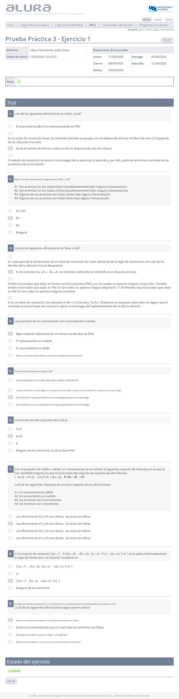
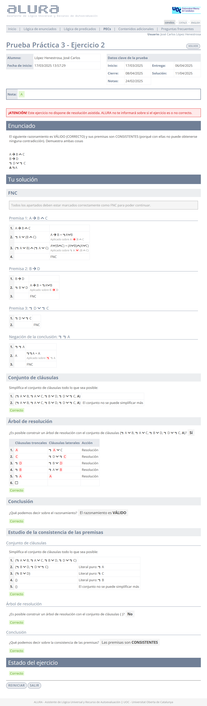
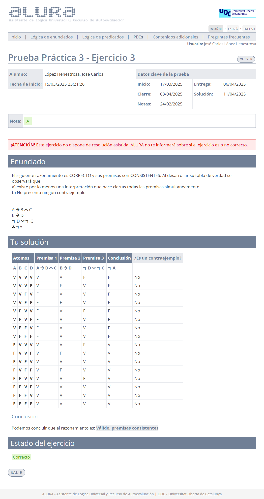
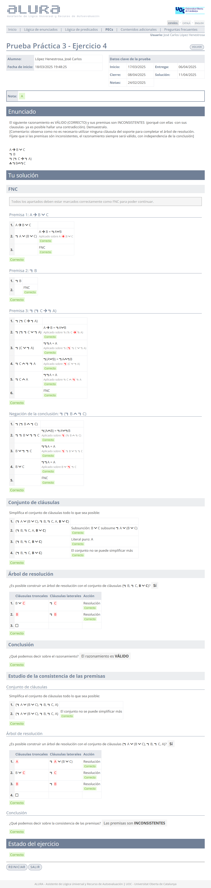
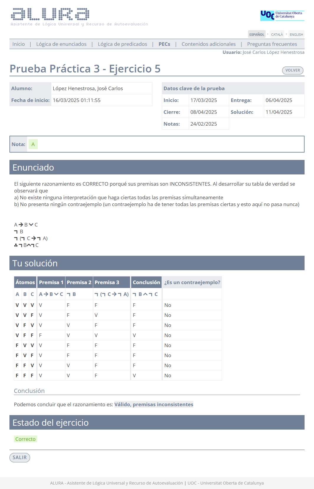
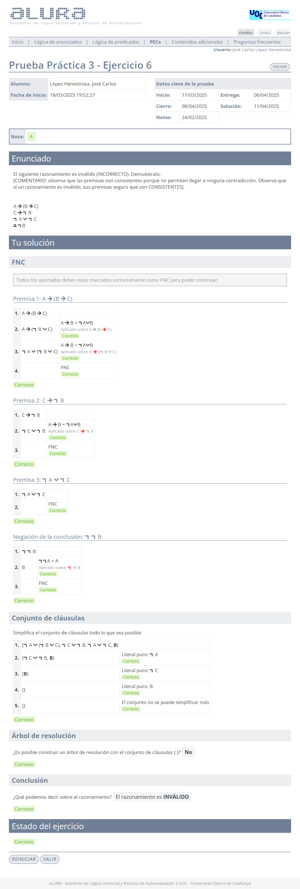
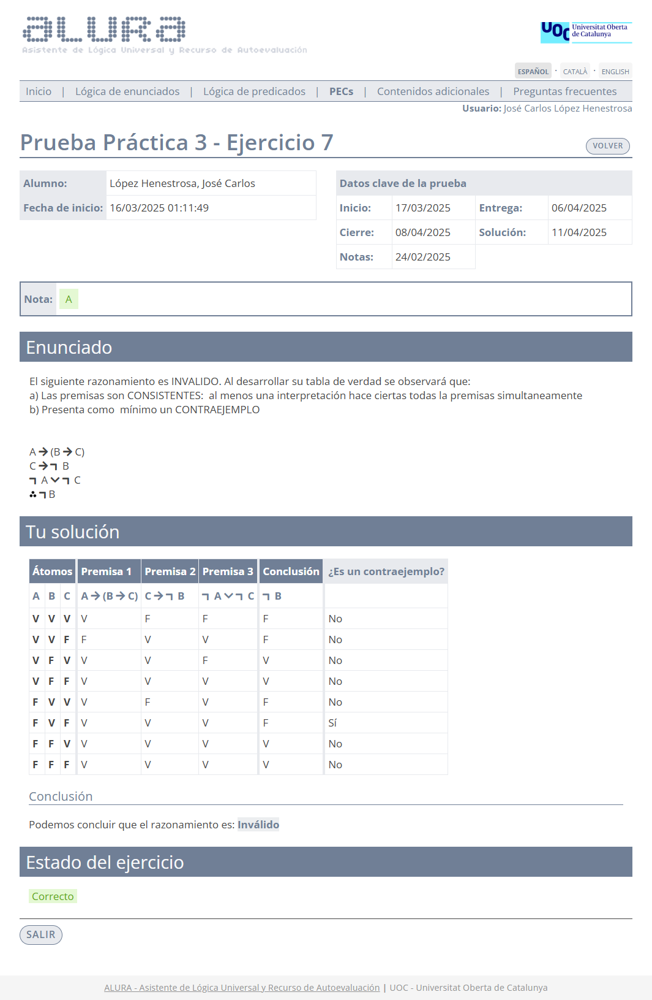

# Prueba práctica 3

>[!NOTE]
>- La suma total de la calificación de todos los ejercicios es 10,00.
>- Se pueden realizar tantos intentos como se deseen antes de la fecha límite. 
>- Cuando el resultado sea del 40% o más, se podrá acceder a la PEC2.

## Ejercicio 1 - Test

	
Solución

**Calificación**: 2,50 / 2,50

## Ejercicio 2 - Resolución

>1. $A \rightarrow B \wedge C$
>2. $B \rightarrow D$
>3. $\neg D \vee \neg C$
>4. $\therefore \neg A$

	
Solución

**Calificación**: 1,50 / 1,50

## Ejercicio 3 - Tablas de verdad

>1. $A \rightarrow B \wedge C$
>2. $B \rightarrow D$
>3. $\neg D \vee \neg C$
>4. $\therefore \neg A$

	
Solución

**Calificación**: 1,00 / 1,00

## Ejercicio 4 - Resolución

>1. $A \rightarrow B \vee C$
>2. $\neg B$
>3. $\neg (\neg C \rightarrow \neg A)$
>4. $\therefore \neg B \wedge \neg C$

	
Solución

**Calificación**: 1,50 / 1,50

## Ejercicio 5 - Tablas de verdad

>1. $A \rightarrow B \vee C$
>2. $\neg B$
>3. $\neg (\neg C \rightarrow \neg A)$
>4. $\therefore \neg B \neg C$

	
Solución

**Calificación**: 1,00 / 1,00

## Ejercicio 6 - Resolución

>1. $A \rightarrow (B \rightarrow C)$
>2. $C \rightarrow \neg B$
>3. $\neg A \vee \neg C$
>4. $\therefore \neg B$

	
Solución

**Calificación**: 1,50 / 1,50

## Ejercicio 7 - Tablas de verdad

>1. $A \rightarrow (B \rightarrow C)$
>2. $C \rightarrow \neg B$
>3. $\neg A \vee \neg C$
>4. $\therefore \neg B$

	
Solución

**Calificación**: 1,00 / 1,00

---

## Calificación final

10,00 / 10,00