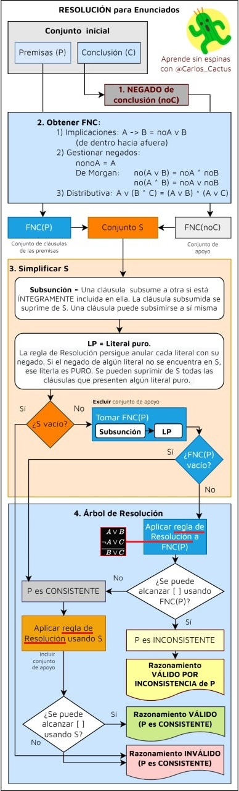

# RESUMEN Lógica de enunciados: resolución

>[!NOTE]
>Este resumen toma como referencia [este vídeo](https://www.youtube.com/watch?v=R98Fpqt1aPc) del canal [Aprende sin Espinas](https://www.youtube.com/@AprendeSinEspinas) en vez del [libro proporcionado por la UOC](http://cvapp.uoc.edu/autors/MostraPDFMaterialAction.do?id=265957&hash=f4eec8d6f2470281eeabfd721755d26ab5429e0b8fd1581689cea334dc3dd6a5).

## Índice

- [Definición](#definición)
- [Estructura](#estructura)
- [Resolución](#resolución)
	- [1. Escribir el negado de la conclusión](#1-escribir-el-negado-de-la-conclusión)
	- [2. Obtener Formas Normales Conjuntivas (FNC)](#2-obtener-formas-normales-conjuntivas-fnc)
	- [3. Simplificar el conjunto $S$](#3-simplificar-el-conjunto)
		- [3.1. Aplicar subsunción a partir del negado de la conclusión](#31-aplicar-subsunción-a-partir-del-negado-de-la-conclusión)
		- [3.2. Aplicar literal puro](#32-aplicar-literal-puro)
		- [Caso de ejemplo](#caso-de-ejemplo)
	- [4. Construir árbol de resolución](#4-construir-árbol-de-resolución)
- [Interpretación](#interpretación)

 

## Definición

La **resolución**, al igual que la deducción natural y las tablas de verdad, es un método de validación de razonamientos para demostrar si existe alguna forma de vincular una serie de premisas a una conclusión. Es un procedimiento sistemático —y no mecánico, como sí lo es la deducción natural— que fue planteado por A. Robinson en el 1965.

A diferencia de la deducción natural, la resolución sigue una única estrategia, la cual es la **reducción al absurdo**. 

## Estructura

Dadas las proposiciones del siguiente razonamiento:

1. $A \vee B \rightarrow C \wedge D$ (**P**remisa 1)
2. $C \rightarrow A \wedge D$ (P2)
3. $C \wedge B \rightarrow D$ (**C**onclusión)

Tenemos que hallar las FNC de las premisas y del negado de la conclusión, a partir de las cuales obtendremos un conjunto de cláusulas $S$ con las que resolveremos —si es posible—, un árbol de resolución para determinar si el razonamiento es consistente/inconsistente y válido/inválido.

## Resolución

>Diagrama sacado del vídeo mencionado en la introducción. Le he aplicado un par de retoques:
>1. La regla distributiva estaba mal planteada en la imagen original.
>2. He añadido la regla de resolución para que todo lo necesario para realizar el proceso se aglutine en este diagrama.

Vamos a aplicar los pasos planteados en el esquema sobre el razonamiento propuesto en el apartado [Estructura](#estructura):

### 1. Escribir el negado de la conclusión

$\neg C = \neg (C \wedge B \rightarrow D)$

### 2. Obtener Formas Normales Conjuntivas (FNC)

Por un lado, obtenemos las FNC de las premisas y, por otro, las FNC del negado de la conclusión, al que denominaremos _conjunto de apoyo_. La suma de ambas FNC conformarán nuestro _conjunto S_

<table>
	<tr>
		<th colspan="3">FNC(P1)</th>
	</tr>
	<tr>
		<th>Nº PASO</th>
		<th>DESARROLLO</th>
		<th>REGLA APLICADA</th>
	</tr>
	<tr>
		<td>1</td>
		<td>$A \vee B \rightarrow C \wedge D \qquad \qquad$</td>
		<td>P1</td>
	</tr>
	<tr>
		<td>2</td>
		<td>$(A \vee B) \rightarrow (C \wedge D) \quad \qquad$</td>
		<td>$(Z \rightarrow X == \neg Z \vee X)$</td>
	</tr>
	<tr>
		<td>3</td>
		<td>$(\neg A \wedge \neg B) \vee (C \wedge D)$</td>
		<td>DM</td>
	</tr>
	<tr>
		<td>4</td>
		<td>$[(C \wedge D) \vee \neg A] \wedge [\neg B \vee (C \wedge D)]$</td>
		<td>distr</td>
	</tr>
	<tr>
		<td>5</td>
		<td>$[(C \vee \neg A) \wedge (D \vee \neg A)] \wedge [\neg B \vee (C \wedge D)]$</td>
		<td>distr</td>
	</tr>
	<tr>
		<td>6</td>
		<td>${[(C \vee \neg A) \wedge (D \vee \neg A)] \wedge [(C \vee \neg B) \wedge (D \vee \neg B)]}$</td>
		<td>distr</td>
	</tr>
	<tr>
		<td>7</td>
		<td>FNC(P1) = $\set{C \vee \neg A, \D \vee \neg A, C \vee \neg B, D \vee \neg B}$</td>
		<td>FNC</td>
	</tr>
</table>

<table>
	<tr>
		<th colspan="3">FNC(P2)</th>
	</tr>
	<tr>
		<th>Nº PASO</th>
		<th>DESARROLLO</th>
		<th>REGLA APLICADA</th>
	</tr>
	<tr>
		<td>1</td>
		<td>$C \rightarrow A \vee D$</td>
		<td>P2</td>
	</tr>
	<tr>
		<td>2</td>
		<td>$\neg C \vee (A \vee D)$</td>
		<td>$(Z \rightarrow X == \neg Z \vee X)$</td>
	</tr>
	<tr>
		<td>3</td>
		<td>FNC(P2) = $\set{\neg C \vee A \vee D}$</td>
		<td>FNC</td>
	</tr>
</table>

<table>
	<tr>
		<th colspan="3">FNC($\neg C$)</th>
	</tr>
	<tr>
		<th>Nº PASO</th>
		<th>DESARROLLO</th>
		<th>REGLA APLICADA</th>
	</tr>
	<tr>
		<td>1</td>
		<td>$\neg (C \wedge B \rightarrow D)$</td>
		<td>($\neg C$)</td>
	</tr>
	<tr>
		<td>2</td>
		<td>$\neg (\neg(C \wedge B))$</td>
		<td>$(Z \rightarrow X == \neg Z \vee X)$</td>
	</tr>
	<tr>
		<td>3</td>
		<td>$\neg \neg (C \wedge B) \wedge \neg D$</td>
		<td>DM</td>
	</tr>
	<tr>
		<td>4</td>
		<td>$(C \wedge B) \wedge \neg D$</td>
		<td>$\neg \neg A = A$</td>
	</tr>
	<tr>
		<td>5</td>
		<td>FNC($\neg C$) = $\set{C, B, \neg D}$</td>
		<td>FNC</td>
	</tr>
</table>

El conjunto de apoyo es el FNC resultante del negado de la conclusión. En este caso, $\set{C, B, \neg D}$.

Ahora, formamos el **conjunto** $S$, el cual es la unión de los FNC de las premisas y del negado de la conclusión.

$S = \set{C \vee \neg A, D \vee \neg A, C \vee \neg B, \neg C \vee A \vee D, C, B \neg D}$

### 3. Simplificar el conjunto $S$

#### 3.1. Aplicar subsunción a partir del negado de la conclusión

Si una cláusula del conjunto $S$ integra (incluye) una cláusula del FNC($\neg C$), la eliminaremos del conjunto $S$ para simplificarlo en $S \prime$. _La pequeña come a la grande._

Ejemplos de subsunción:
- $C$ subsume a $C \vee \neg A$, ya que $C$ está ÍNTEGRAMENTE en $C \vee \neg A$.
- $A \vee B$ subsume a $R \vee Y \vee B \vee A$.
- $\neg H \vee T$ NO subsume a $R \vee T \vee H$.

Aplicada al caso del ejemplo principal:

$S = \set{C \vee \neg A, D \vee \neg A, C \vee \neg B, \neg C \vee A \vee D, C, B \neg D}$  
$S\prime = \set{D \vee \neg A, \neg C \vee A \vee D, C, B \neg D}$

#### 3.2. Aplicar literal puro

Un literal puro, en este caso, es un átomo que aparece SIEMPRE con la misma polaridad (siempre positivo o siempre negativo). En el algoritmo de Davis-Putnam para la satisfacibilidad (SAT), los literales puros **pueden eliminarse** junto con sus cláusulas, ya que asignarles el valor que los satisface no afecta a la solución.

Aplicado al caso del ejemplo principal:

<table>
	<tr>
		<td>$D$</td>
		<td>$\neg D$</td>
	</tr>
	<tr>
		<td>$A$</td>
		<td>$\neg A$</td>
	</tr>
	<tr>
		<td>$B$</td>
		<td>$\neg B$</td>
	</tr>
	<tr>
		<td>$C$</td>
		<td>$\neg C$</td>
	</tr>
</table>

Como podemos ver, no hay ningún literal puro, por lo que no eliminamos nada.

En caso de tener que aplicar la regla, eliminamos la cláusula ENTERA en la que aparezca el literal puro, tal y como se muestra en el de abajo.

#### Caso de ejemplo

He aquí un conjunto de cláusulas al que podemos aplicar las reglas de literal puro y subsunción:

<table>
	<tr>
		<th>Nº PASO</th>
		<th>CONJUNTO DE CLÁUSULAS</th>
		<th>REGLA APLICADA</th>
	</tr>
	<tr>
		<td>1</td>
		<td>$\set{\neg A \vee B, \neg A \vee D, \neg B \vee C, A \vee (B \vee C), B \vee A, B \vee A, \neg C \vee \neg B}$</td>
		<td></td>
	</tr>
	<tr>
		<td>2</td>
		<td>$\set{\neg A \vee B, \neg B \vee C, A \vee (B \vee C), B \vee A, \neg C \vee \neg B}$</td>
		<td>Literal puro: $D$</td>
	</tr>
	<tr>
		<td>3</td>
		<td>$\set{\neg A \vee B, \neg B \vee C, B \vee A, \neg C \vee \neg B}$</td>
		<td>Subsunción: $B \vee A$ subsume $A \vee (B \vee C)$</td>
	</tr>
	<tr>
		<td>4</td>
		<td>$\set{\neg A \vee B, \neg B \vee C, B \vee A, \neg C \vee \neg B}$</td>
		<td>El conjunto no se puede simplificar más</td>
	</tr>
</table>

### 4. Construir árbol de resolución

Elegimos el **conjunto de apoyo** como **cláusula troncal** (la de la izquierda) con el objetivo de **eliminar** el **literal de la derecha**. Para ello, aplicaremos la única regla de resolución que hay, la cual es la siguiente:

$$
\begin{align*}
A \vee B \\
\neg A \vee C \\
\hline
B \vee C
\end{align*}
$$

A partir del ejemplo principal, aplicamos la regla al conjunto $S \prime$:

$S\prime = \set{D \vee \neg A, \neg C \vee A \vee D, C, B \neg D}$

<table>
	<tr>
		<th>Nº PASO</th>
		<th>CLÁUSULA TRONCAL</th>
		<th>CLÁUSULA LATERAL</th>
		<th>ACCIÓN</th>
	</tr>
	<tr>
		<td>1</td>
		<td>$C$</td>
		<td>$\neg C \vee A \vee D$</td>
		<td>Resolución</td>
	</tr>
	<tr>
		<td>2</td>
		<td>$D \vee A$</td>
		<td>$D \vee \neg A$</td>
		<td>Resolución</td>
	</tr>
	<tr>
		<td>3</td>
		<td>$D \vee D$</td>
		<td>Absorción</td>
		<td>Resolución</td>
	</tr>
	<tr>
		<td>4</td>
		<td>$D$</td>
		<td>$\neg D$</td>
		<td>Resolución</td>
	</tr>
	<tr>
		<td>5</td>
		<td>[ ]</td>
		<td>
			Cláusula vacía = signo de <strong>CONTRADICCIÓN</strong> (inconsistente y, por lo tanto, válido)
		</td>
		<td></td>
	</tr>
</table>

>[!NOTE]
>- Una **contradicción** se puede representar como [ ], □, $\bot$ y $[\bot]$.
>- Un **teorema** se representa como ■.

>[!CAUTION]
>**SOLO SE PUEDE RESOLVER UN ÚNICO LITERAL POR PASO**. Por ejemplo, esto es INCORRECTO:
>
><table>
>	<tr>
>		<td>$A \vee B$</td>
>		<td>$\neg A \vee \neg B$</td>
>	</tr>
>	<tr>
>		<td>[ ]</td>
>		<td>MAL</td>
>	</tr>
></table>
>
>Esto SÍ es correcto:
>
><table>
>	<tr>
>		<td>$A \vee B$</td>
>		<td>$\neg A \vee \neg B$</td>
>	</tr>
>	<tr>
>		<td>$B \vee \neg B$</td>
>		<td>■</td>
>	</tr>
></table>

Ahora que sabemos que hay una contradicción, tenemos que identificar si se da en el conjunto de las premisas ($S$) o en el conjunto de apoyo. Es importante realizarlo en este orden porque puede ser que en el paso anterior hallemos si el cuerpo de premisas sobre el que estamos operando es consistente o no, ya que, si es inconsistente, sabremos que es **válido** por inconsistencia de premisas. A su vez, si obtenemos un conjunto vacío al simplificar $S$, sabremos que el razonamiento es **inválido**.

Como tenemos que determinar la consistencia de las premisas, en este caso de ejemplo, la evaluamos a partir del conjunto $S$. Para ello, tenemos que excluir los literales del conjunto de apoyo incluidos en $S$, tal que así:

$S = \set{C \vee \neg A, D \vee \neg A, C \vee \neg B, \neg C \vee A \vee D, C, B \neg D}$

$P = \set{C \vee \neg A, D \vee \neg A, C \vee \neg B, \neg C \vee A \vee D}$ [$D$ es LP (no hay $\neg D$)]

Simplificamos el conjunto $P$ aplicando la subsunción y el literal puro:

$P \prime = \set{C \vee \neg A, C \vee \neg B}$ [$C$ es LP (no hay $\neg C$)]

$P \prime \prime = \emptyset$ (conjunto vacío)

### Interpretación

Como obtenemos un conjunto vacío ($\emptyset$) al simplificar $P$, no podemos obtener el árbol de resolución y, por tanto, no hay cláusula vacía ([]). En consecuencia, tampoco se produce una contradicción, por lo que $P$ es **CONSISTENTE**.

Según el diagrama presentado más arriba, tendríamos que aplicar la regla de resolución usando $S$, cosa que ya hemos hecho. Sabemos que obtenemos una cláusula vacía al aplicarla, por lo que podemos concluir que el razonamiento es VÁLIDO, ya que el conjunto $P$ es **CONSISTENTE**.
