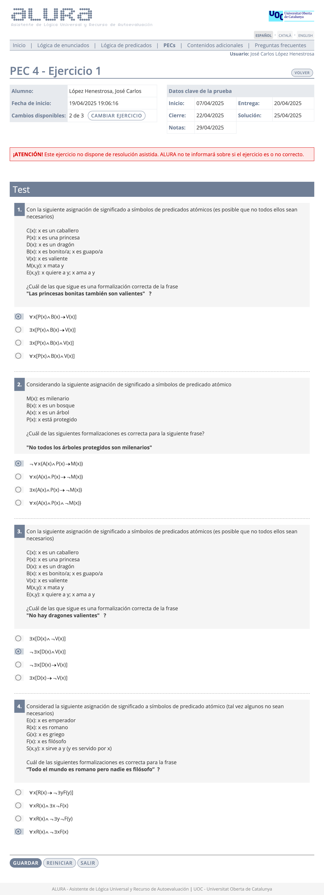
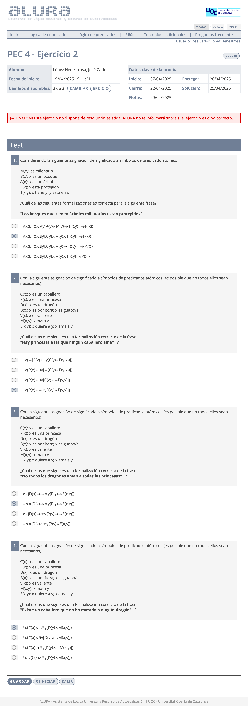
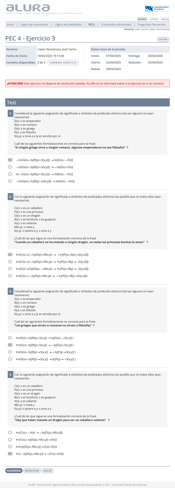
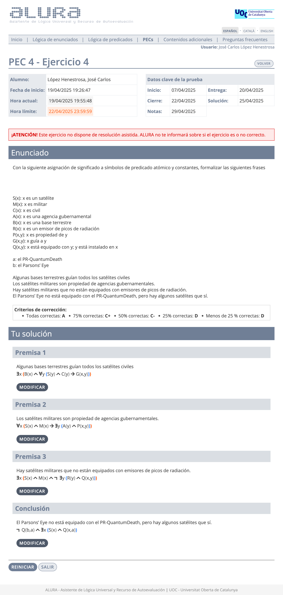

# PEC4 - El lenguaje formal de la lógica de predicados

>[!NOTE]
>- Para realizar la PEC4, es necesario sacar un 4,00 o más en la [PP4](pp4).
>- Esta PEC se compone de cuatro ejercicios de **formalización**: tres de tipo **test** y uno **práctico** de formalización.
>- Recomiendo realizar todos los ejercicios en papel, ya que la prueba final (examen o prueba de síntesis) se tiene que entregar adjuntando fotos de los ejercicios en dicho formato.
>- La suma de la calificación total de todos los ejercicios es 10,00.

## Ejercicios

### Ejercicio 1 - Test

	
Captura del ejercicio resuelto

### Pregunta 1

>Con la siguiente asignación de significado a símbolos de predicados atómicos (es posible que no todos ellos sean necesarios):
>
>- $C(x)$: "$x$ es un caballero"
>- $P(x)$: "$x$ es una princesa"
>- $D(x)$: "$x$ es un dragón"
>- $B(x)$: "$x$ es bonito/guapo"
>- $V(x)$: "$x$ es valiente"
>- $M(x,y)$: "$x$ mata a $y$"
>- $E(x,y)$: "$x$ quiere/ama a $y$"
>
>¿Cuál es la formalización de la frase **"Las princesas bonitas también son valientes"**?

- [ ] $\forall x [P(x) \wedge B(x) \to V(x)]$
- [ ] $\exists x [P(x) \wedge B(x) \to V(x)]$
- [ ] $\exists x [P(x) \wedge B(x) \wedge V(x)]$
- [ ] $\forall x [P(x) \wedge B(x) \wedge V(x)]$

	
Solución

- [x] $\forall x [P(x) \wedge B(x) \to V(x)]$

### Pregunta 2

>Con la siguiente asignación de significado a símbolos de predicados atómicos (es posible que no todos ellos sean necesarios):
>
>- $M(x)$: "$x$ es milenario"
>- $B(x)$: "$x$ es un bosque"
>- $A(x)$: "$x$ es un árbol"
>- $P(x)$: "$x$ está protegido"
>
>¿Cuál es la formalización de la frase **"No todos los árboles protegidos son milenarios"**?

- [ ] $\neg \forall x [A(x) \wedge P(x) \to M(x)]$
- [ ] $\forall x [A(x) \wedge P(x) \to \neg M(x)]$
- [ ] $\exists x [A(x) \wedge P(x) \to \neg M(x)]$
- [ ] $\forall x [A(x) \wedge P(x) \wedge \neg M(x)]$

	
Solución

- [x] $\neg \forall x [A(x) \wedge P(x) \to M(x)]$

### Pregunta 3

>Considerando la siguiente asignación de significado a símbolos de predicado atómico:
>
>- $C(x)$: "$x$ es un caballero"
>- $P(x)$: "$x$ es una princesa"
>- $D(x)$: "$x$ es un dragón"
>- $B(x)$: "$x$ es bonito/guapo"
>- $V(x)$: "$x$ es valiente"
>- $M(x,y)$: "$x$ mata a $y$"
>- $E(x,y)$: "$x$ quiere/ama a $y$"
>
>¿Cuál es la formalización de la frase **"No hay dragones valientes"**?

- [ ] $\exists x [D(x) \wedge \neg V(x)]$
- [ ] $\neg \exists x [D(x) \wedge V(x)]$
- [ ] $\neg \exists x [D(x) \to V(x)]$
- [ ] $\exists x [D(x) \to \neg V(x)]$

	
Solución

- [x] $\neg \exists x [D(x) \wedge V(x)]$

### Pregunta 4

>Considerando la siguiente asignación de significado a símbolos de predicado atómico:
>
>- $E(x)$: "$x$ es emperador"
>- $R(x)$: "$x$ es romano"
>- $G(x)$: "$x$ es griego"
>- $F(x)$: "$x$ es filósofo"
>- $S(x)$: "$x$ sirve a $y$"
>
>¿Cuál es la formalización de la frase **"Todo el mundo es romano pero nadie es filósofo"**?

- [ ] $\forall x [R(x) \to \neg \exists y F(y)]$
- [ ] $\forall x R(x) \wedge \exists x \neg F(y)$
- [ ] $\forall x R(x) \wedge \neg \exists y \neg F(y)$
- [ ] $\forall x R(x) \wedge \neg \exists x F(x)$

	
Solución

- [x] $\forall x R(x) \wedge \neg \exists x F(x)$

 

**Calificación**: 2,00 / 2,00

 

## Ejercicio 2 - Test

	
Captura del ejercicio resuelto

### Pregunta 1

>Con la siguiente asignación de significado a símbolos de predicados atómicos (es posible que no todos ellos sean necesarios):
>
>- $M(x)$: "$x$ es milenario"
>- $B(x)$: "$x$ es un bosque"
>- $A(x)$: "$x$ es un árbol"
>- $P(x)$: "$x$ está protegido"
>- $T(x,y)$: "$x$ tiene $y$"
>
>¿Cuál es la formalización de la frase **"Los bosques que tienen árboles milenarios están protegidos"**?

- [ ] $\forall x \set{B(x) \wedge \exists y [A(y) \wedge M(y) \to T(x,y)] \to P(x)}$
- [ ] $\forall x \set{B(x) \wedge \exists y [A(y) \wedge M(y) \wedge T(x,y)] \to P(x)}$
- [ ] $\forall x \set{B(x) \wedge \exists y [A(y) \wedge M(y) \to T(x,y)] \to P(x)}$
- [ ] $\forall x \set{B(x) \wedge \exists y [A(y) \wedge M(y) \wedge T(x,y)] \wedge P(x)}$

	
Solución

- [x] $\forall x \set{B(x) \wedge \exists y [A(y) \wedge M(y) \wedge T(x,y)] \to P(x)}$

### Pregunta 2

>Considerando la siguiente asignación de significado a símbolos de predicado atómico:
>
>- $C(x)$: "$x$ es un caballero"
>- $P(x)$: "$x$ es una princesa"
>- $D(x)$: "$x$ es un dragón"
>- $B(x)$: "$x$ es bonito/guapo"
>- $V(x)$: "$x$ es valiente"
>- $M(x,y)$: "$x$ mata a $y$"
>- $E(x,y)$: "$x$ quiere/ama a $y$"
>
>¿Cuál es la formalización de la frase **"Hay princesas a las que ningún caballero ama"**?

- [ ] $\exists x \set{ \neg [P(x) \wedge \exists y (C(y) \wedge E(y,x))] }$
- [ ] $\exists x \set{ P(x) \wedge \exists y [\neg (C(y) \wedge E(y,x))] }$
- [ ] $\exists x \set{ P(x) \wedge \exists y (C(y) \wedge \neg E(y,x)] }$
- [ ] $\exists x \set{ P(x) \wedge \neg \exists y [C(y) \wedge E(y,x)] }$

	
Solución

- [x] $\exists x \set{ P(x) \wedge \neg \exists y [C(y) \wedge E(y,x)] }$

### Pregunta 3

>Considerando la siguiente asignación de significado a símbolos de predicado atómico:
>
>- $C(x)$: "$x$ es un caballero"
>- $P(x)$: "$x$ es una princesa"
>- $D(x)$: "$x$ es un dragón"
>- $B(x)$: "$x$ es bonito/guapo"
>- $V(x)$: "$x$ es valiente"
>- $M(x,y)$: "$x$ mata a $y$"
>- $E(x,y)$: "$x$ quiere/ama a $y$"
>
>¿Cuál es la formalización de la frase **"No todos los dragones aman a todas las princesas"**?

- [ ] $\forall x \set{ D(x) \to \neg \forall y [P(y) \to E(x,y)] }$
- [ ] $\neg \forall x \set{ D(x) \to \forall y [P(y) \to E(x,y)] }$
- [ ] $\forall x \set{ D(x) \to \forall y [P(y) \to \neg E(x,y)] }$
- [ ] $\neg \forall x \set{ D(x) \to \forall y [P(y) \to E(x,y)] }$

	
Solución

- [x] $\neg \forall x \set{ D(x) \to \forall y [P(y) \to E(x,y)] }$

### Pregunta 4

>Considerando la siguiente asignación de significado a símbolos de predicado atómico:
>
>- $C(x)$: "$x$ es un caballero"
>- $P(x)$: "$x$ es una princesa"
>- $D(x)$: "$x$ es un dragón"
>- $B(x)$: "$x$ es bonito/guapo"
>- $V(x)$: "$x$ es valiente"
>- $M(x,y)$: "$x$ mata a $y$"
>- $E(x,y)$: "$x$ quiere/ama a $y$"
>
>¿Cuál es la formalización de la frase **"Existe un caballero que no ha matado a ningún dragón"**?

- [ ] $\exists x \set{ C(x) \wedge \neg \exists y [D(y) \wedge M(x,y)] }$
- [ ] $\exists x \set{ C(x) \wedge \exists y [D(y) \wedge \neg M(x,y)] }$
- [ ] $\exists x \set{ C(x) \to \exists y [D(y) \wedge \neg M(x,y)] }$
- [ ] $\exists x \neg \set{ C(x) \wedge \exists y [D(y) \wedge M(x,y)] }$

	
Solución

- [x] $\exists x \set{ C(x) \wedge \neg \exists y [D(y) \wedge M(x,y)] }$

 

**Calificación**: 3,00 / 3,00

 

## Ejercicio 3 - Test

	
Captura del ejercicio resuelto

### Pregunta 1

>Considerando la siguiente asignación de significado a símbolos de predicado atómico:
>
>- $E(x)$: "$x$ es emperador"
>- $R(x)$: "$x$ es romano"
>- $G(x)$: "$x$ es griego"
>- $F(x)$: "$x$ es filósofo"
>- $S(x)$: "$x$ sirve a $y$"
>
>¿Cuál es la formalización de la frase **"Si ningún griego sirve a ningún romano, algunos emperadores no son filósofos"**?

- [ ] $\neg \exists x \set{ G(x) \wedge \exists y [R(y) \wedge S(x,y)] } \to \exists x [E(x) \wedge \neg F(x)]$
- [ ] $\neg \exists x \set{ G(x) \wedge \exists y [R(y) \wedge S(x,y)] } \to \neg \exists x [E(x) \wedge F(x)]$
- [ ] $\exists x \neg \set{ G(x) \wedge \exists y [R(y) \wedge S(x,y)] } \to \exists x [E(x) \wedge \neg F(x)]$
- [ ] $\neg \exists x \set{ G(x) \wedge \exists y [R(y) \to S(x,y)] } \to \exists x [E(x) \wedge \neg F(x)]$

	
Solución

- [x] $\neg \exists x \set{ G(x) \wedge \exists y [R(y) \wedge S(x,y)] } \to \neg \exists x [E(x) \wedge F(x)]$

### Pregunta 2

>Considerando la siguiente asignación de significado a símbolos de predicado atómico:
>
>- $C(x)$: "$x$ es un caballero"
>- $P(x)$: "$x$ es una princesa"
>- $D(x)$: "$x$ es un dragón"
>- $B(x)$: "$x$ es bonito/guapo"
>- $V(x)$: "$x$ es valiente"
>- $M(x,y)$: "$x$ mata a $y$"
>- $E(x,y)$: "$x$ quiere/ama a $y$"
>
>¿Cuál es la formalización de la frase **"Existe un caballero que no ha matado a ningún dragón"**?

- [ ] $\forall x \set{ C(x) \to [\neg \exists y (D(y \wedge M(x,y)) \to \neg \forall y (P(y) \wedge B(y) \to E(y,x)))] }$
- [ ] $\forall x \set{ C(x) \to [\neg \exists y (D(y \wedge M(x,y)) \to \forall y (P(y) \wedge B(y) \to \neg E(y,x)))] }$
- [ ] $\forall x \set{ C(x) \to [\exists y (D(y \wedge \neg M(x,y)) \to \forall y (P(y) \wedge B(y) \to \neg E(y,x)))] }$
- [ ] $\forall x \set{ C(x) \wedge [\neg \exists y (D(y \wedge M(x,y)) \to \neg \forall y (P(y) \wedge B(y) \to E(y,x)))] }$

	
Solución

- [x] $\forall x \set{ C(x) \to [\neg \exists y (D(y \wedge M(x,y)) \to \neg \forall y (P(y) \wedge B(y) \to E(y,x)))] }$

### Pregunta 3

>Considerando la siguiente asignación de significado a símbolos de predicado atómico:
>
>- $E(x)$: "$x$ es emperador"
>- $R(x)$: "$x$ es romano"
>- $G(x)$: "$x$ es griego"
>- $F(x)$: "$x$ es filósofo"
>- $S(x)$: "$x$ sirve a $y$"
>
>¿Cuál es la formalización de la frase **"Los griegos que sirven a romanos no sirven a filósofos"**?

- [ ] $\forall x \set{ G(x) \wedge \exists y [R(y) \wedge S(x,y)] \to \exists y [F(y) \wedge \neg S(x,y)] }$
- [ ] $\forall x \set{ G(x) \wedge \exists y [R(y) \wedge S(x,y)] \to \neg \exists y [F(y) \wedge S(x,y)] }$
- [ ] $\forall x \set{ G(x) \wedge \exists y [R(y) \to S(x,y)] \to \neg \exists y [F(y) \to S(x,y)] }$
- [ ] $\forall x \set{ G(x) \wedge \exists y [R(y) \wedge S(x,y)] \to \exists y [F(y) \to \neg S(x,y)] }$

	
Solución

- [x] $\forall x \set{ G(x) \wedge \exists y [R(y) \wedge S(x,y)] \to \neg \exists y [F(y) \wedge S(x,y)] }$

 

**Calificación**: 2,00 / 2,00

 

## Ejercicio 4 - Formalización

>[!NOTE]
>Este ejercicio se compone de cuatro frases que comparten los mismos átomos.

	
Captura de pantalla (con soluciones)

**Átomos**:
- $S(x)$: "$x$ es un satélite"
- $M(x)$: "$x$ es militar"
- $C(x)$: "$x$ es civil"
- $A(x)$: "$x$ es una agencia gubernamental"
- $B(x)$: "$x$ es una base terrestre"
- $R(x)$: "$x$ es un emisor de picos de radiación"
- $P(x,y)$: "$x$ es propiedad de $y$"
- $G(x,y)$: "$x$ guía a $y$"
- $Q(x,y)$: "$x$ está equipado con $y$" / "$y$ está instalado en $x$"

- $a$: el PR-QuantumDeath
- $b$: el Parson's Eye

### Premisa 1

>**Algunas bases terrestres guían a todos los satélites civiles**

	
Frase equivalente para aclarar la estructura lógica del enunciado dado

**EXISTEN** bases terrestres que guían a **TODOS** los satélites civiles

	
<strong>Formalización</strong>

$\exists x \set{ B(x) \wedge \forall y [S(y) \wedge C(y) \to G(x,y)] }$

### Premisa 2

>**Los satélites militares son propiedad de agencias gubernamentales**

	
Frase equivalente para aclarar la estructura lógica del enunciado dado

**TODOS** los satélites militares son propiedad de agencias gubernamentales

	
<strong>Formalización</strong>

$\forall x \set{ S(x) \wedge M(x) \to \exists y [A(y) \wedge P(x,y)] }$

### Premisa 3

>**Hay satélites militares que no están equipados con emisores de picos de radiación**

	
Frase equivalente para aclarar la estructura lógica del enunciado dado

**EXISTEN** satélites militares que **NO** están equipados con picos de radiación

	
<strong>Formalización</strong>

$\exists x \set{ S(x) \wedge M(x) \neg \exists y [R(y) \wedge Q(x,y)] }$

### Conclusión

>**El Parson's Eye no está equipado con el PR-QuantumDeath, pero hay algunos satélites que sí**

	
Frase equivalente para aclarar la estructura lógica del enunciado dado

(El Parson's Eye **NO** está equipado con el PR-QuantumDeath), **PERO** $(\wedge)$ hay algunos satélites que sí

	
<strong>Formalización</strong>

$\neg Q(b,a) \wedge \exists x [S(x) \wedge Q(x,a)]$

**Criterios de corrección**:
- **A**: Todas correctas.
- **C+**: 75% correctas.
- **C-**: 50% correctas.
- **D**: 25% correctas o menos.

**Calificación**: 3,00 / 3,00

 

## Recursos de aprendizaje

- [Este vídeo](https://www.youtube.com/watch?v=763OVDQ0kqw) introductorio a la estructura de la lógica de predicados y [este otro](https://www.youtube.com/watch?v=WGYIJ1uckVo) para la formalización, ambos realizados por el canal [Aprende Sin Espinas](https://www.youtube.com/@AprendeSinEspinas).
- El libro [**Lógica de enunciados**](http://cvapp.uoc.edu/autors/MostraPDFMaterialAction.do?id=265957&hash=f4eec8d6f2470281eeabfd721755d26ab5429e0b8fd1581689cea334dc3dd6a5) proporcionado por la UOC.
	- Apartado **1. La lógica de predicados y su lenguaje**. Páginas 7 a 23. [Resumen](recursos/README.md).

---

## Resultado

### Calificación

- **Calificación original**: 16,67 / 16,67
- **Calificación sobre 10**: 10,00 / 10,00
- **Letra (escala internacional)**: A

### Detalles sobre la puntuación

