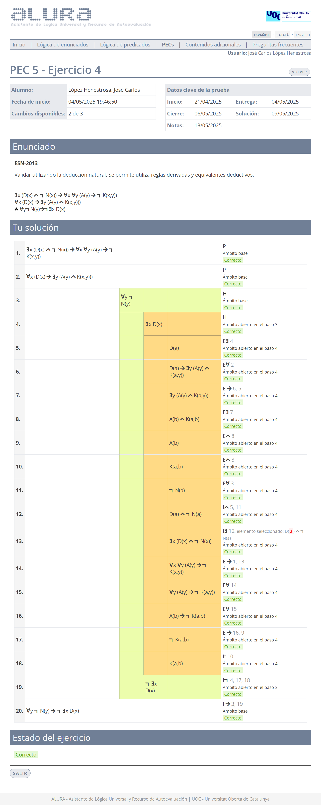

# PEC5 - La deducción natural en la lógica de predicados

>[!NOTE]
>- Para realizar la PEC5, es necesario sacar un 4,00 o más en la [PP5](pp5).
>- Esta PEC se compone de cinco ejercicios: cuatro de **deducción natural** y uno de **formalización**.
>- Recomiendo realizar todos los ejercicios en papel, ya que la prueba final (examen o prueba de síntesis) se tiene que entregar adjuntando fotos de los ejercicios en dicho formato.
>- La suma de la calificación total de todos los ejercicios es 10,00.

## Ejercicios

### Ejercicio 1 - Deducción natural

>1. $\forall x (X(x) \to Y(x,x))$
>2. $\therefore \neg \exists z (X(z) \wedge \neg \exists t Y(z,t))$

	
Solución

**Calificación**: 1,50 / 1,50

### Ejercicio 2 - Deducción natural

>1. $\forall x (K(x) \to \exists y (S(y) \wedge P(x,y)))$
>2. $\therefore \exists x K(x) \to \neg \forall y \neg S(y)$

	
Solución

**Calificación**: 1,50 / 1,50

### Ejercicio 3 - Deducción natural

>1. $\exists x \neg N(x) \to \forall x T(x)$
>2. $\forall x \neg Y(x)$
>3. $\forall x N(x) \to \exists x Y(x)$
>4. $\therefore \exists x T(x)$

	
Solución

**Calificación**: 2,50 / 2,50

### Ejercicio 4 - Deducción natural

>1. $\exists x (D(x) \wedge \neg N(x)) \to \forall x \forall y (A(y) \to \neg K(x,y))$
>2. $\forall x (D(x) \to \exists y (A(y) \wedge K(x,y)))$
>3. $\therefore \forall y \neg N(y) \to \neg \exists x D(x)$

	
Solución

**Calificación**: 2,50 / 2,50

### Ejercicio 5 - Formalización

>[!NOTE]
>Este ejercicio se compone de cuatro frases que comparten los mismos átomos.

	
Captura de pantalla (con soluciones)

**Átomos**:
- $S(x)$: "$x$ es un satélite"
- $M(x)$: "$x$ es militar"
- $C(x)$: "$x$ es civil"
- $A(x)$: "$x$ es una agencia gubernamental"
- $B(x)$: "$x$ es una base terrestre"
- $R(x)$: "$x$ es un emisor de picos de radiación"
- $P(x,y)$: "$x$ es propiedad de $y$"
- $G(x,y)$: "$x$ guía a $y$"
- $Q(x,y)$: "$x$ está equipado con $y$" / "$y$ está instalado en $x$"

- $b$: el Parson's Eye

### Premisa 1

>**El Parson's Eye es un satélite civil que no pertenece a ninguna agencia gubernamental.**

	
<strong>Formalización</strong>

$S(b) \wedge C(b) \wedge \neg \exists  y (A(y) \wedge P(b,y))$

### Premisa 2

>**Si todos los satélites militares estuvieran equipados con emisores de picos de radiación, no habría bases terrestres civiles.**

	
<strong>Formalización</strong>

$\forall x (S(x) \wedge M(x) \to \exists y (R(y) \wedge Q(x,y))) \to \neg \exists x (B(x) \wedge C(x))$

### Premisa 3

>**No hay ningún emisor de picos de radiación que no esté instalado en algún satélite militar.**

	
Frase equivalente para aclarar la estructura lógica del enunciado dado

**NO EXISTE** ningún emisor de picos de radiación que **NO** esté instalado en **ALGÚN** ($\exists$) satélite militar.

	
<strong>Formalización</strong>

$\neg \exists x (R(x) \wedge \neg \exists y (S(y) \wedge M(y) \wedge Q(y,x))$

### Conclusión

>**Solo si algunos satélites militares son guiados por bases terrestres, algunos emisores de picos de radiación serán militares.**

	
Frase equivalente para aclarar la estructura lógica del enunciado dado

(El Parson's Eye **NO** está equipado con el PR-QuantumDeath), **PERO** ($\wedge$) hay algunos satélites que sí

	
<strong>Formalización</strong>

$\exists x (R(x) \wedge M(x)) \to \exists x (S(x) \wedge C(x) \wedge \exists y (B(y) \wedge G(y,x)))$

**Criterios de corrección**:
- **A**: Todas correctas.
- **C+**: 75% correctas.
- **C-**: 50% correctas.
- **D**: 25% correctas o menos.

**Calificación**: 0,80 / 2,00*

>[!IMPORTANT]
>*: El ejercicio está arreglado en su versión actual.

 

## Recursos docentes

[Lógica de predicados](http://cvapp.uoc.edu/autors/MostraPDFMaterialAction.do?id=265958&hash=baefe4fe0e1c8594e63fe3a9c98754ced25fc6b142154c8a6c4e6f31ed28dfde)
- Apartado **2. La deducción natural**. Páginas 24 a 33. [Resumen](pec5/recursos).

---

## Resultado

### Calificación final

8,80 / 10,00 (grado B)